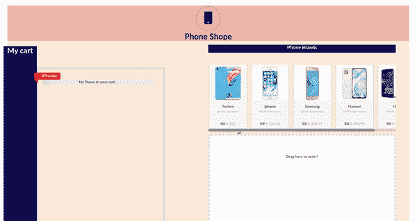

# 用 React、Redux 和 React-DnD 构建购物车—第 3 部分

> 原文：<https://itnext.io/build-a-shopping-cart-with-react-redux-and-react-dnd-part-3-f1e1e8265d14?source=collection_archive---------2----------------------->



拖放购物车

W 欢迎来到**第 3 部分**构建一个利用 [React DnD](https://react-dnd.github.io/react-dnd/about) 的简单购物车。如果你还没有看完第 2 部分，你可以在这里找到它。同样，如果你想从第 3 部分开始构建，确保从这个[分支](https://github.com/Eyongkevin/shopping-list---React-Redux-DragandDrop/tree/default-shopping-list)克隆并下载第 2 部分的代码，因为第 3 部分是一个延续。

# 入门指南

在本文中，我们将继续通过将 React DnD 集成到 React 应用程序中来构建我们的购物车。

> *本节的所有代码都可以在* [*分支这里*](https://github.com/Eyongkevin/shopping-list---React-Redux-DragandDrop/tree/React-Drag-and-Drop) 找到

> React DnD 是一套 React 工具，帮助你建立复杂的拖放界面，同时保持组件的解耦。它非常适合 Trello 和 Storify 等应用程序，在这些应用程序中，拖动可以在应用程序的不同部分之间传输数据，并且组件会改变它们的外观和应用程序状态以响应拖放事件

# 安装反应 DnD

移动到应用程序的根目录，在终端中运行命令

```
yarn add react-dnd react-dnd-html5-backend
```

你可以注意到第二个包`react-dnd-html5-backend` 允许 React DnD 使用[默认后台的 HTML5 拖放 API](https://developer.mozilla.org/en-US/docs/Web/Guide/HTML/Drag_and_drop) 。你也可以选择使用第三方后端，比如[触控后端](https://npmjs.com/package/react-dnd-touch-backend)。

# React DnD 概述

React DnD 库提供了三个高阶组件:

*   **DragSource** :返回给定组件的增强版本，增加了“可拖动”组件的行为。
*   **DropTarget** :返回给定组件的增强版本，添加了处理被拖入其中的兼容组件的行为。
*   DndProvider :它为您的应用程序提供反应 DnD 功能。它必须包装发生拖放交互的父组件，并通过`backend` prop 注入后端。但是它可能被注入了一个`window`对象

> 高阶组件是 JavaScript 函数，它接受一个组件作为参数，并返回该组件的增强版本，增加了功能。

# 我们想要建造的东西

我们希望将 React-DnD 集成到我们的 React 应用程序中，以便拖动可以在应用程序的不同部分之间传输数据。使用 React DnD 可以让我们以“React 方式”工作，同时支持单向数据流，定义源，并将目标逻辑作为纯数据删除，以及其他好处。

除了主要应用组件之外，该应用还包括三个重要组件:

*   **Phone** 组件:它将被 DragSource 增强，使其可拖动
*   ShoppingCart 组件:DropTarget 将增强这一功能，使其能够处理拖入其中的兼容组件。
*   **容器**组件:该组件包含电话和购物车组件，并由 DndProvider 增强，以提供电话和购物车之间的拖放功能。

C ontainer.js

让我们从处理容器组件开始，所有的拖放交互都将在这里发生。移至`components/Container.js`，将其代码替换为以下内容:

src/components/容器. js

我们导入了我们的后端`HTML5Backend`和高阶组件`DndProvider`,我们用它们在**行 26** 处封装我们的电话和购物车组件

# 拖放源和拖放目标

在实现剩下的两个组件之前，让我们先了解一些概念。如上所述，DragSource 和 DropTarget 是高阶组件。前者将用于增强我们的电话组件，使其可拖动，而后者将用于增强 ShoppingCart 组件，使其能够处理拖动到其中的兼容组件。

DragSource 和 DropTarget 都需要一些需要进一步解释的设置。

## **类型**

它允许您指定哪些拖动源和拖放目标是兼容的。拖放目标只接受相同类型的拖动源，因此唯一标识每个拖动源非常重要。

## **规格对象**

它描述了增强组件如何对拖放事件做出“反应”。它是一个普通的 JS 对象，具有在发生拖放交互时调用的函数，比如`beginDrag`和`endDrag`(对于 DragSource)，以及`canDrag`和`onDrop`(对于 DropTarget)。

## **采集功能**

正如 React 组件通过 props 相互传递信息一样，`dragSource`和`dropTarget`包装器也是这样将 props 注入到它们增强的组件中的。但是，反应 DnD 使用收集功能，让你控制如何和哪些道具将被注入。这给了你很大的权力，包括在道具被注入之前对其进行预处理的能力。

当发生拖放交互时，React DnD 库调用收集函数，并向其传递两个参数:

*   **连接器:**后端'【T6]'处理 DOM 事件，但是组件使用 React 来描述 DOM。连接器将这两者链接起来，以便在呈现函数中将一个预定义的角色(拖动源、拖动预览或拖放目标)分配给 DOM。它作为 collect 函数的第一个参数传递，并确定该项是否是预定义的角色之一
*   **Monitor** :拖放是有状态的，以确定拖动操作是否正在进行，或者是否有任何当前项目或类型以及其他属性与该过程相关联。React DnD 通过监视器将这些状态暴露给组件，并允许您更新组件属性以响应拖放状态的变化。例如，有一个状态`isDragging`，它的值指示一个可拖动的项目是否被拖动，还有一个状态`canDrop`，它指示一个组件是否可以处理一个被拖动的项目(如果兼容的话)。您必须定义一个收集函数，该函数将从监视器中检索相关的状态，React DnD 负责调用该函数并将其返回值合并到组件的 props 中。

> **拖动源**和**放下目标**是 React DnD 的主要抽象单位。它们确实将类型、副作用和收集功能与您的组件联系在一起。

让我们看看上面的在实践中是如何运作的。

onstants.js

我们将在这里定义我们的**类型**常量。如上所述，**类型**允许您指定哪些拖动源和拖放目标是兼容的。

创建文件`components/Constants.js`并插入代码；

```
import React from 'react';export const ItemTypes = {
    PHONE: 'phone'
}
```

上面的代码是一个 JavaScript 模块，它导出一个带有 PHONE 常量的对象。

hoppingCart.js

如上所述，我们的 ShoppingCart 组件将通过`DropTarget`得到增强，使其能够处理拖入其中的兼容组件。

> 所有代码应该在`components/ShoppingCart.js`

首先，让我们进口所有我们需要的东西

```
import React, { Component } from 'react'
import { DropTarget } from 'react-dnd'import Phone from './Phone'
import { ItemTypes } from './Constants'
```

接下来，让我们定义我们的**规范对象**，它将描述放置目标如何对放置事件做出反应(当拖动源被放置时调用)。其他事件也是可能的

*   **悬停**:当一个项目悬停在拖放目标上时调用。
*   **canDrop** :当放置目标能够接受项目时调用。

```
// DnD Spec
const ShoppingCartSpec = {
    drop(){
        return { name: 'ShoppingCart'}
    }
}
```

在这里，它的反应是返回一个字符串。我们将在稍后的电话组件(拖动源)中使用这个返回值。

接下来，我们将实现**收集函数**，这将让我们将反应 DnD 连接器和状态映射到组件的道具。我们将在组件中注入三个道具

*   **connectDropTarget** :用于将放置目标角色分配给组件 DOM 的一部分
*   **isOver** :决定一个项目是否悬停在它上面。
*   **canDrop** :确定放置目标是否能够接受该物品。

```
// DnD DropTarget - collect
let collect = ( connect, monitor )=>{
    return {
        connectDropTarget: connect.dropTarget(),
        isOver: monitor.isOver(),
        canDrop: monitor.canDrop()
    };
}
```

> 我们可以看到所有事件都来自于`monitor`

在我们定义了我们的 **spec 对象**和 **collect 函数**之后，我们现在可以定义我们的 ShoppingCart 组件了。仍然在`components/ShoppingCart.js`中，插入代码

src/components/ShoppingCart.js

让我们解释一下上面的代码中发生了什么；

*   我们的组件现在有三个由我们的 **collect 函数注入的道具，** ( **line 3** )
*   `canDrop`和`isOver`用于当用户在拖放目标上拖动元素时显示不同的文本和背景颜色。
*   我们将 div 包装在 **connectDropTarget** 中，这将把放置目标角色分配给组件的 DOM 部分(**第 15 行**)
*   我们使用`DropTarget`来增强我们的购物车组件。它采用类型、规范对象和收集函数。(**第十七行**)

P hone.js

如上所述，我们的手机组件将通过 **DragSource** 包装器得到增强，使其可拖动。

> 所有代码都应该在`*components/Phone.js*`中

首先，让我们导入我们需要的东西

```
import React, { Component } from 'react'
import { DragSource } from 'react-dnd';import { ItemTypes } from './Constants';
```

接下来，让我们实现我们的**规范对象**，它将描述**拖动源**如何对拖放事件做出“反应”

```
// phone DnD spec
const phoneSpec = {
    beginDrag(props){
        console.log("begin drag")
        return{
            name: props.brand

        }
    },
    endDrag(props, monitor, component){
        if (monitor.didDrop()){
            const dragItem = monitor.getItem(); // from beginDrag
            const dropResult = monitor.getDropResult();
            // Move action goes here
            console.log("You dropped ", dragItem.name, ' into '+ dropResult.name)
        }else{
            return;
        }
    }
}
```

从上面的代码中，我们的拖动源响应了`beginDrag`和`endDrag`事件。在前一个事件中，当拖动开始时，我们返回我们手机的品牌，而在后一个事件中，当拖放发生时，我们检查它是否被放在兼容的拖放目标空间中(相同的**类型**)。如果为真，我们从我们放下的元素(从 ShoppingCartSpec 中的`drop`中)获取返回的品牌和返回的字符串，并将两者记录到控制台。

接下来，我们将实现**收集函数**，这将允许我们将反应 DnD 连接器和状态映射到组件的道具。我们将在手机的组件中注入两个道具:`connectDragSource`，用于将拖动源角色分配给 DOM 节点。`isDragging`这是来自 React DnD 的一个状态，指示我们的电话是否被拖动。

```
// phone DragSource collect
let collect = ( connect, monitor ) =>{
    return{
        connectDragSource: connect.dragSource(),
        isDragging: monitor.isDragging()
    }
}
```

在我们定义了我们的**规范对象**和**收集函数**之后，我们现在可以定义我们的电话组件了。仍然在`components/Phone.js`中，插入代码

src/components/Phone.js

让我们解释一下上面的代码中发生了什么；

*   phone 组件包含三个道具，从容器组件传递给它的`brand`和由 collect 函数插入的`isDragging`、`connectDragSource`。
*   我们在内联样式规则中使用道具`isDragging`来改变
    元素被拖动时的不透明度。我们还用它来设置我们的类名属性
*   我们使用`connectDragSource`将拖动源角色分配给组件 DOM 的一部分。(**第 11 行**
*   我们使用`DragSource`来增强我们的电话组件。它采用类型、规范对象和收集函数。(**第 29 行**)

> 注意这里 DropTarget 和 DragSource 接受的**类型**是相同的。这是为了使它们兼容。

# 式样

前往这个[分支](https://github.com/Eyongkevin/shopping-list---React-Redux-DragandDrop/tree/React-Drag-and-Drop)并下载文件`src/index.css`并替换第 2 部分中的默认文件。

# 测试我们的应用

让我们确保一切顺利。要做到这一点，启动应用程序；

```
yarn start
```

打开 [http://localhost:3000](http://localhost:3000/) 在浏览器中查看。并尝试将一个电话项目拖动到目标空间，如上面的 GIF 图像所示。然后检查您的控制台，确保您得到类似于

```
Begin drag
You dropped Iphone into ShoppingCart
```

# 结论

旅程的第三部分是将 React DnD 集成到我们的 React 应用程序中。你可以在这里获得这部分[的完整代码。**接下来，我们将响应** `**endDrag**` **事件，使用 React reducers 和 actions** 将拖动的项目转移到拖放目标空间。正如承诺的那样，第四部现在已经上市了。](https://github.com/Eyongkevin/shopping-list---React-Redux-DragandDrop/tree/React-Drag-and-Drop)