# 🐍用 TypeScript 构建一个贪吃蛇游戏

> 原文：<https://itnext.io/build-a-snake-game-in-typescript-8bee5b9f1ec6?source=collection_archive---------1----------------------->

## 如何用 HTML5 和 TypeScript 构建一个复古的贪吃蛇游戏

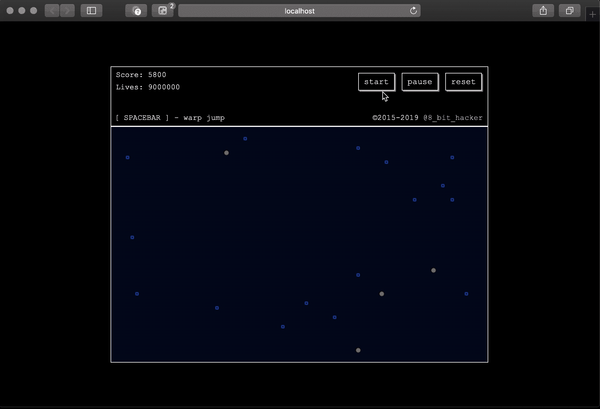

用 HTML5 Canvas 和 TypeScript 制作的复古贪吃蛇游戏的屏幕截图

## 介绍

如果说在我的成长过程中有一件事给我留下了深刻的印象，那就是 80 年代和 90 年代的酷游戏，它们非常简单，但玩起来也非常有趣。我也在这段时间学习了《T4》的基本编程，所以很自然，没过多久我就开始创作自己的简单游戏了。

早在 2015 年，我在 TypeScript 中创建了这个[老派的贪吃蛇游戏](https://bytegames.github.io/bytes)，以测试 HTML5 中 **canvas** 对象的图形功能，并感受如何使用它从头开始重新创建经典的 2D 游戏。

我选择了 [TypeScript](https://www.typescriptlang.org) ,因为那时我已经用它构建了几个 UI 和 UI 框架，其中许多都是根据我使用 C#和 WPF 的经验来模仿的。这使得它成为从零开始快速构建定制游戏引擎原型的绝佳选择，我想要完美的性能和几乎没有错误的行为(我们总是想要没有错误的软件，但在这种情况下，我使用我选择的工具从零开始构建整个游戏，所以我实际上得到了它)。

整个项目都是开源的，在这里可以找到，所以如果你喜欢，就去拿一份副本，体验一下吧，看看你能得到什么。

## 项目结构

这个项目非常简单，除了 TypeScript 编译器之外没有任何外部依赖。这使得它成为从头开发简单游戏引擎的理想环境。下面是 **package.json** 和 **tsconfig.json** :

这个项目中的 **package.json** 文件或多或少是作为参考，因为实际上不存在依赖关系或其他任何东西。在 **tsconfig.json** 中，有指令让编译器将文件输出为 ES6 模块，并将它们放在 **build** 目录中，以便在浏览器中加载。

在项目根目录下还有一个**index.html**文件，用于将游戏作为一个静态应用程序(这里已经完成了)和一个用于 CSS3 风格的 **css** 文件夹。

**src** 的内容是主入口文件 **game.ts** 以及三个文件夹**对象**、**类型**和 **ux、**对应这些关键概念:

*   **物体**:游戏中使用的物体，如**蛇**或**硬币**
*   **类型**:基本数据类型，如**位置**、**速度**、**方向**、**游戏键**
*   **ux** :处理游戏性和渲染的组件，比如 **Canvas**

每个文件夹中都有一个 **index.ts** 文件，它只是将其他文件的内容分组并导出到每个文件的一个模块中。这包括了文件夹结构和项目配置文件，所以接下来我们将看看 HTML5 和 CSS3 中定义的游戏的表现和风格。

## **HTML 和 CSS 定义**

这个游戏依赖于**画布**来完成大部分真实的屏幕工作，所以游戏的其余部分 UX 主要是在那里支持它。下面来看看**index.html**:

在这里我们可以看到这个 HTML 文件没有太多内容:一些基本的社交图元数据，一个带有几个简单的**按钮**和 **div** 读数的**头**，以及将在其中绘制游戏动作的**画布**本身。

接下来是 CSS 文件， **css/style.css:**

在上面的代码片段中， **css/style.css** 在两个选项卡中都是打开的，在第一个选项卡中显示前半部分，在右侧显示后半部分。没有太多的东西，只有一些颜色定义，居中内容的基本页面结构，以及一些按钮、链接和其他东西的样式。大部分工作都发生在**画布**中，所以这几个样式就足够设置一个基本的游戏了。结构和风格都不在话下，我们来看看游戏逻辑实现。

## 核心类型定义

文件夹**。/types** 包含几个类、枚举和接口，它们构成了游戏中使用的基本类型。这里是 **gameobjects.ts** :

这个文件定义了游戏对象和棋盘在屏幕上绘制对象所使用的接口。

接下来是

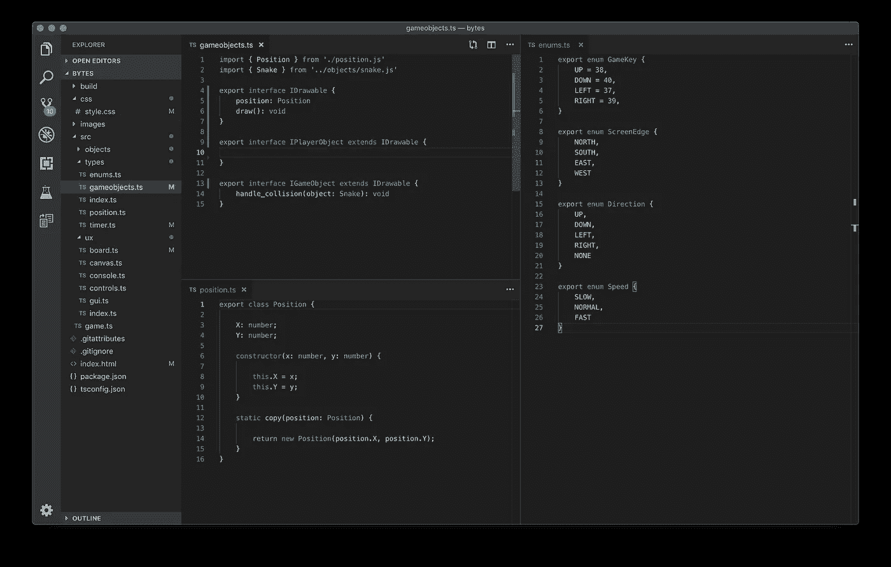

**用 **gameobjects.ts** 、 **position.ts** 和 **enums.ts** 键入**文件夹

在上面的截图中，**类型**中的四个模块文件中有三个是打开的。文件 **enums.ts** 包含四种符合这些要求的枚举类型:

*   **游戏键**:向上*、*向下*、*向左*和*向右*箭头键的键值*
*   **屏幕边缘**:用于判断蛇是否与屏幕边缘发生碰撞
*   **方向**:玩家当前移动的方向(如果有)
*   **速度:**玩家当前在游戏板上移动的速度

此外，我们还有一个用于 **Drawable** 的接口以及两个扩展它的接口，一个用于玩家，一个用于玩家可能会碰到的游戏物体。这些中的每一个都有一个**位置**，它被定义为具有一个 **X** 和 **Y** 值以及一个复制位置的方便方法。

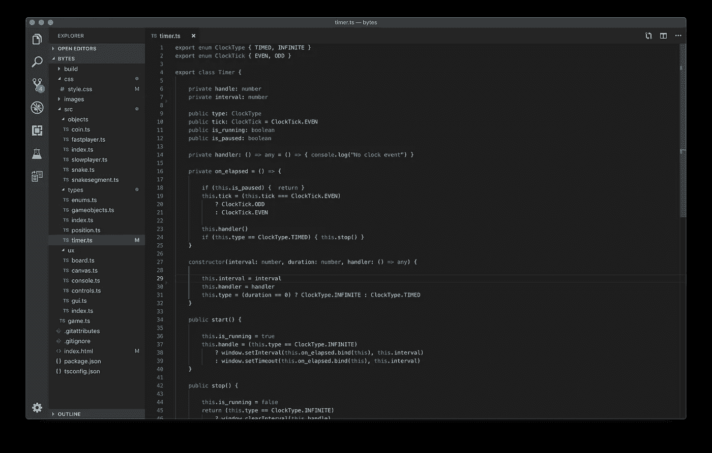

运行游戏时钟的 **src/timer.ts** 中的 **Timer** 类

**类型**下的最后一项是**定时器**类，作为游戏的主时钟。根据需要可以*启动*、*停止*、*复位*。有两个本地定义的枚举:**时钟类型**，它表示计时器是否有持续时间或永远运行，以及**时钟指针**，它提供一个主时钟“脉冲”，游戏的其他部分使用它，例如，根据需要以正常速度的一半(或两倍)移动玩家对象。

这涵盖了游戏中使用的主要类型。这些将在许多地方被引用，并根据需要用于创建其他更复杂的对象。

## 游戏对象类别

我们要检查的下一组模块是游戏**对象:**

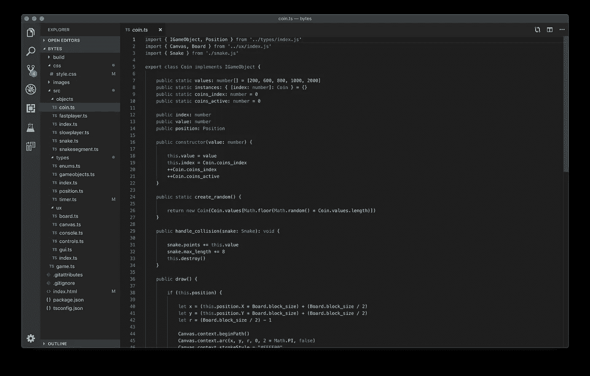

**硬币**类代表一枚硬币，可以捡起来获得点数

这组中的第一个是 **Coin** 类，它实现了 **IGameObject** 接口，这意味着它至少必须有 **handle_collision( )** 和 **draw()** 方法，否则编译器会抛出一个错误。这在构建某个东西的过程中很有用，因为您不会希望在一百个左右的游戏对象中的一个上意外地遗漏这些方法中的一个，导致它要么不响应玩家，不在屏幕上绘制，要么最终在棋盘上出现一个不可见的项目，该项目没有出现，但仍会响应玩家的碰撞。

**Coin** 类有一些静态属性，包括默认值和当前内存中存在的 Coin 的所有实例的静态引用。这种方法使得从项目本身的概念定义中操纵项目组变得非常容易:例如，制作另一个项目是很容易的，当收集到该项目时，会导致屏幕上的所有硬币消失，或导致更多的硬币落下，或任何其他效果。

当**手柄 _ 碰撞**被触发时，撞上它的蛇得到硬币的总价值并加到它的玩家分数上，然后蛇的*最大长度*增加 *8* ，这允许蛇在接下来的八个时钟周期内增长八步。然后调用 **destroy()** 方法，该方法将硬币从棋盘上移除，并清除任何剩余的痕迹。

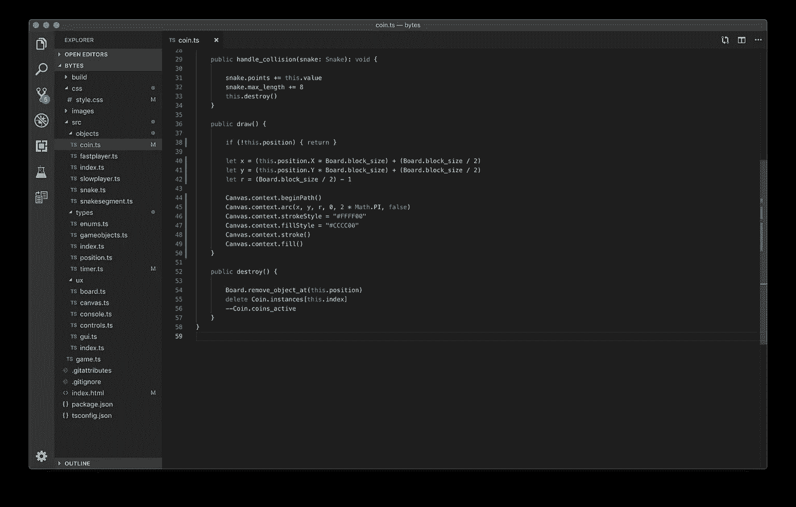

展示了 **draw()** 和 **destroy()** 方法的 **Coin** 类

每个对象都有自己的这些方法的实现，这允许有很大的灵活性，同时保持一个简单有效的体系结构，使整个游戏设计处于可控状态。例如，可以在 **handle_collision()** 或 **destroy()** 方法中加入一些特殊效果，而对系统中的其他部分几乎没有影响。这是如何利用 TypeScript 的一些强大的 [OOP](https://en.wikipedia.org/wiki/Object-oriented_programming) 特性的一个例子。

接下来是 **FastPlayer** 和 **SlowPlayer** 对象，分别加速和减速玩家。由于这实际上是同一事物的两种变体，我将展示其中的一种， **FastPlayer，**作为示例:

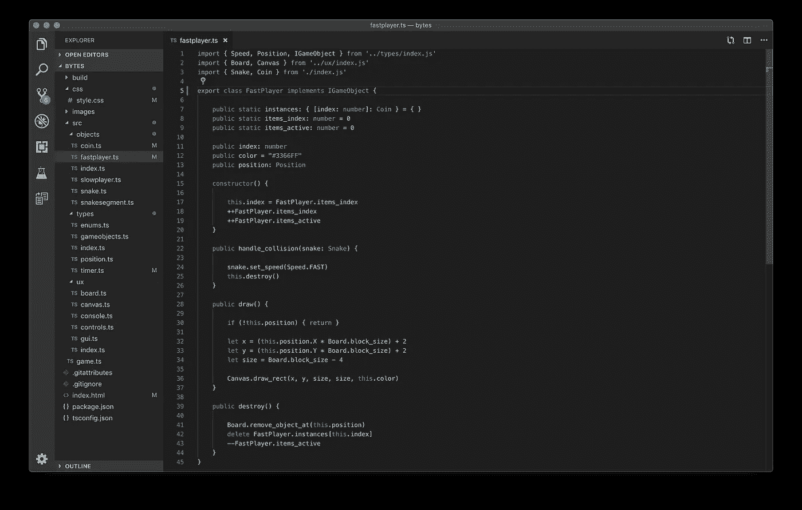

快速玩家职业，当被收集时会使玩家快速移动

**FastPlayer** 类看起来非常类似于之前的 **Coin** 示例。这里的主要区别是 **handle_collision()** 改变蛇移动的速度，而 **draw()** 产生不同的图形。接下来是组成蛇的类，**蛇段**和**蛇:**

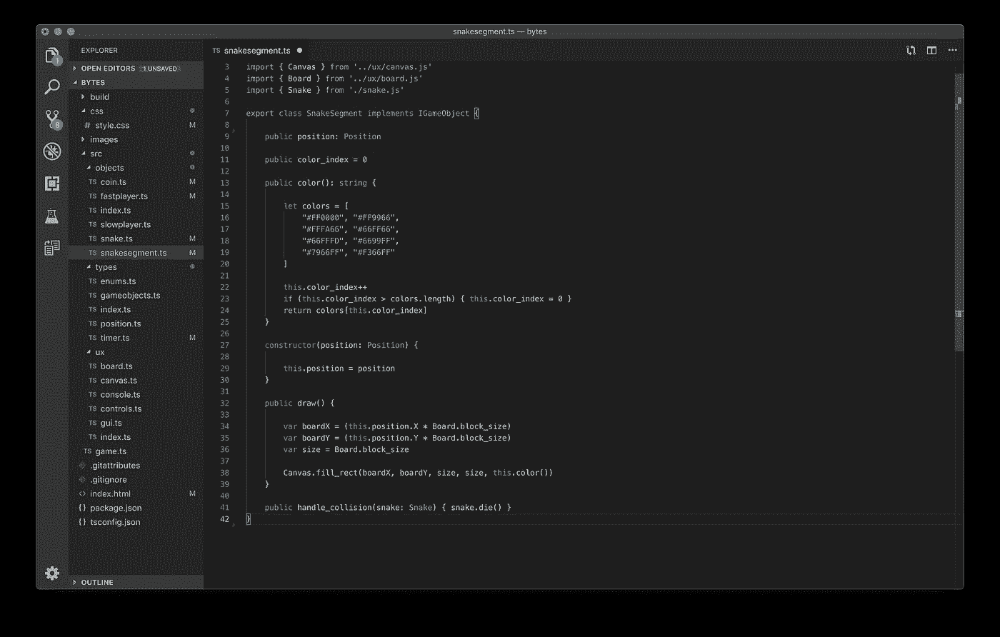

将蛇块绘制到屏幕上的**蛇段**类

**SnakeSegment** 类定义了要在屏幕上绘制的一段蛇。屏幕上的每条蛇都由一组这样的蛇组成，每条蛇都有一个*位置*用于定位并将其绘制到板上，还有一个*颜色*，它通过**颜色**变量中定义的八个值自动旋转。一天晚上，我给女儿看这个游戏，她觉得这个游戏有彩虹效果会更酷，就像一个众所周知的迷因，事实就是如此。

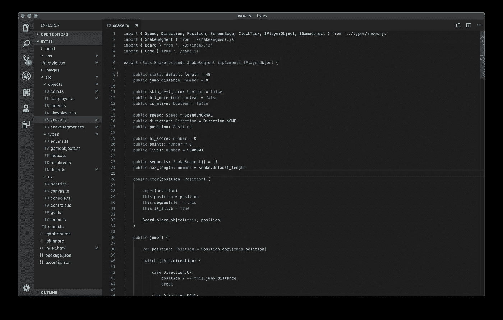

具有玩家控制器对象各种属性的 **Snake** 类

**objects** 文件夹中的最后一个模块是 **snake.ts** 中的 **Snake** 类，它控制着播放器的寿命和 Snake 对象本身的实际渲染。在上面的截图中是一个静态的 *default_length* ，它决定了在玩家没有收集到任何硬币的情况下，默认情况下蛇会得到多长时间。 *jump_distance* 属性决定了当 *jump* 键被按下时，蛇会跳多远，这使得蛇跳过那些被跳过的空间中的障碍物或物品。

还有用于 *skip_next_turn* 、 *hit_detected* 和 *is_alive* 的*布尔*属性，它们控制游戏功能并允许健全性检查，如在绘制之前确保玩家仍然活着等等。还有*速度*、*方向*和*位置*的属性，这些属性在这里不言自明。默认的速度和方向分别是*正常*和*无*，而*位置*最初是未定义的，当蛇被放置在游戏板上时被设置。

除了 *hi_score* 、 *points* 和*lifes*的标准费用属性之外，还有一个名为 *segment* 的 **SnakeSegment** 对象数组，用于保存棋盘上跟随其后的各个蛇块。还可以看到**构造函数**和 **jump()** 方法的一部分，该方法计算出玩家行进的方向，并将蛇头向前移动 *jump_distance* 的值，从而导致其余的段也跟着移动。

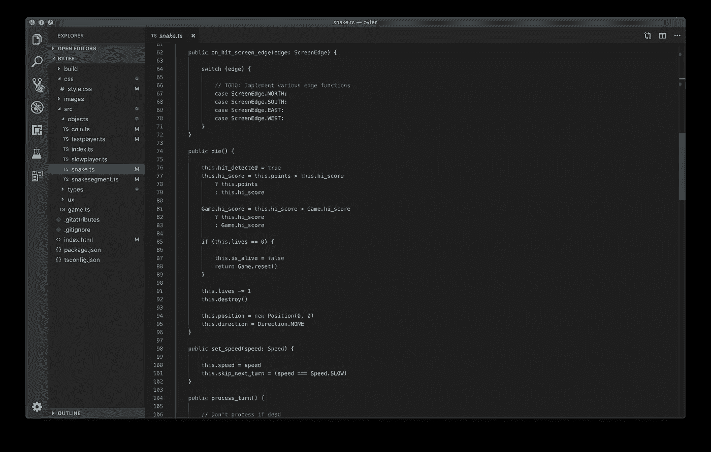

更多的**蛇**类拥有各种游戏方式

Snake 类中还有一些处理实际游戏的方法。在上面的截图中， **on_hit_screen_edge()** 没有被使用，因为它曾经被设置为当蛇与墙壁相撞时杀死玩家，但我想让蛇跳到另一边，所以我删除了这段代码，留下了一个带有 *TODO* 和空 *switch* 语句的[方法存根](https://en.wikipedia.org/wiki/Method_stub)。

我们还发现了 **die()** 方法，该方法将 *hit_detected* 设置为 *true，*设置并重置高分，在失去生命时重置游戏，并且还重置蛇的位置和方向以在下一轮重新开始。还有一个方法 **set_speed()** ，它接受一个 **Speed** 对象并从中更新蛇的速度。

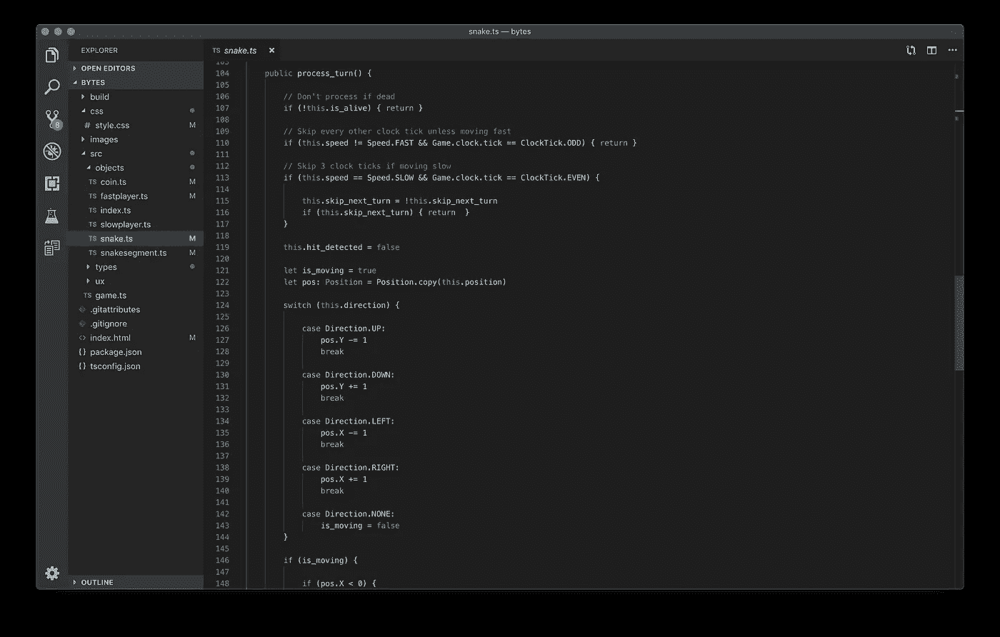

更多的**蛇**类带有 **process_turn()** 方法

Snake 类还有一个 **process_turn()** 方法，该方法根据蛇的当前速度、位置和方向以及它试图占据的空间中发生的任何事情来确定接下来将要发生的事情。首先，如果蛇已经死了，什么都不要做。如果蛇移动很快，跳过每隔一个时钟周期的处理(让它每转移动两格)，同样，如果玩家移动很慢，通过跳过每隔一个回合让它拖出来。接下来，执行一些检查和更新，以更新蛇*的位置*并确定它是否在移动，然后处理诸如屏幕环绕和与占据要进入的空间的物体碰撞的事件:

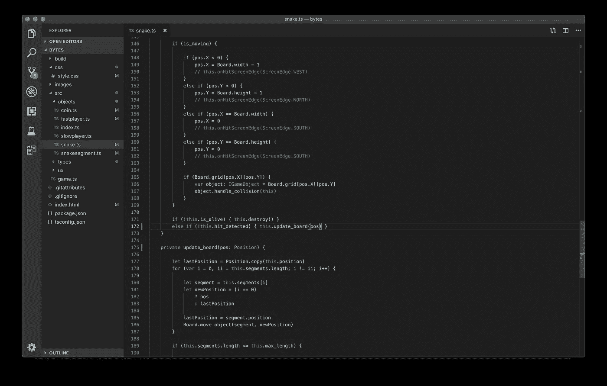

甚至更多的**蛇**类的游戏性和定位逻辑

如果玩家还活着，并且在棋盘上走来走去，就会调用 update_board()方法，该方法会将每个单独的蛇段重新绘制到棋盘上，使每个蛇段都跟随前面的蛇段，无论蛇段在哪里。

这就完成了对 **Snake** 类的处理，该类包含了处理屏幕内外的蛇的大部分游戏逻辑。这就是 [OOP](https://en.wikipedia.org/wiki/Object-oriented_programming) 的概念真正派上用场的地方，因为我们可以将所有的 snake 逻辑保存在一个名为 **snake.ts** 的文件中，而不是分散在随机的文件中。

## 控制和游戏性

在 **ux** 文件夹中是接受输入控制和渲染游戏图形输出的类。我们首先要看的是 **src/ux/board.ts** :

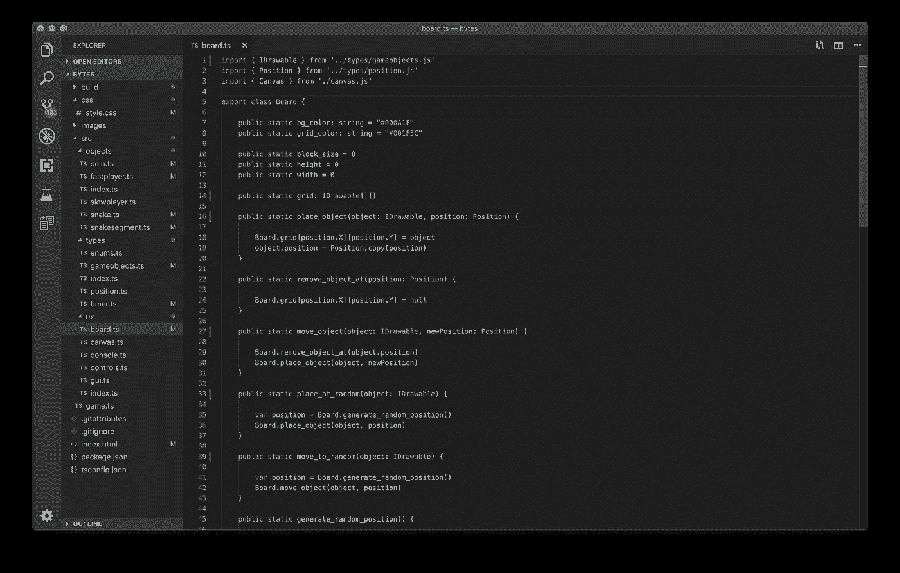

**Board** 类，有各种处理游戏中物体的方法

**棋盘**类包含处理游戏棋盘的各种静态方法和属性，这是一个网格，具有*高度*和*宽度*以及*块大小*，定义了每个游戏棋盘方块的高度和宽度(以像素为单位)。实际的棋盘本身由*网格*属性表示，这是一个 **IDrawable、**的数组，它允许控制器很容易地跟踪在任何给定时间正在玩的项目，并随着游戏的进行更新它们。

有各种方法如 **place_object()** 和 **remove_object_at()** 这些方法大多是自解释的，一次只处理一两件事情。这是有意的，因为架构非常明显，可以很容易地更新和修改，而不太可能破坏其他东西，因为就每个单独的部分而言，其他所有东西仍然按预期工作。游戏开发通常以这种方式很好地适应面向对象编程，因为程序有效地处理相互交互的虚拟对象，以及像游戏棋盘这样的东西，而游戏棋盘又是另一个游戏对象。

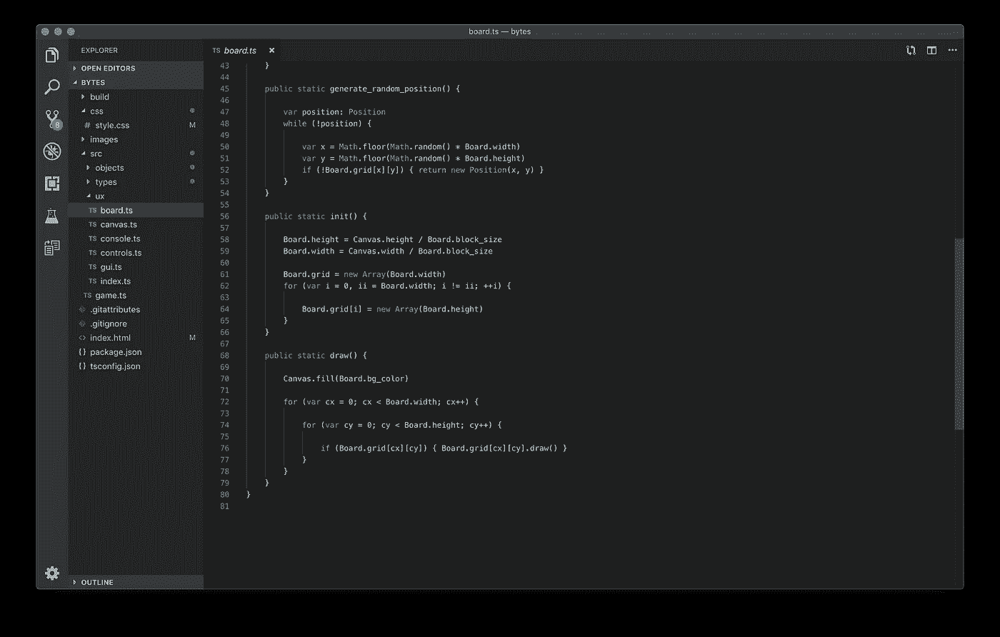

带有**generate _ random _ position()**、 **init()** 和 **draw()** 方法的**板**类

我们还在 Board 类中找到了**generate _ random _ Position()**方法，它使用一些标准的 *Math.floor* 和 *Math.random* JavaScript 函数来得出一个随机的板位置，然后将其作为 **Position** 对象返回。init()方法通过将**画布**的高度和宽度除以棋盘的 *block_size，*来计算棋盘的*高度*和*宽度*，然后用空数组初始化网格本身。 **draw()** 方法充分利用了可互换的对象接口，它遍历棋盘，并在实现 **IDrawable、**的对象的每个实例上调用 **draw()** ，而不管该对象是蛇、硬币还是其他屏幕上的项目。

接下来是 **src/ux/canvas.ts** 中的 **Canvas** 类:

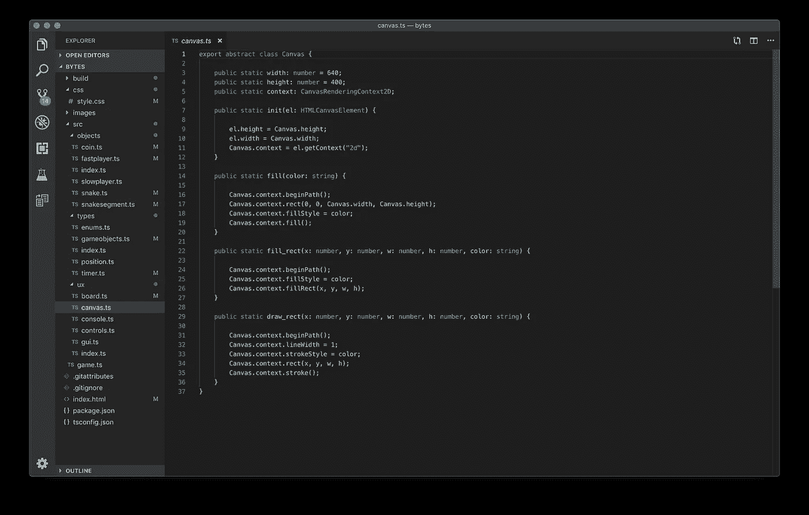

用于绘制游戏内容的精简的**画布**类

canvas 是一个非常简单的抽象类，它有一个*宽度*和*高度*，它们已经被初始化为怀旧的分辨率 *640x400* ，还有一个*上下文*属性，用于保存对 HTML5 屏幕上 Canvas 上下文的引用，该上下文用于在屏幕上实际绘制图形。有一个 **init()** 方法以及一些绘制基本形状的方便方法，差不多就是这些了。接下来我们将看看 **src/ux/console.ts** 中的控制台:

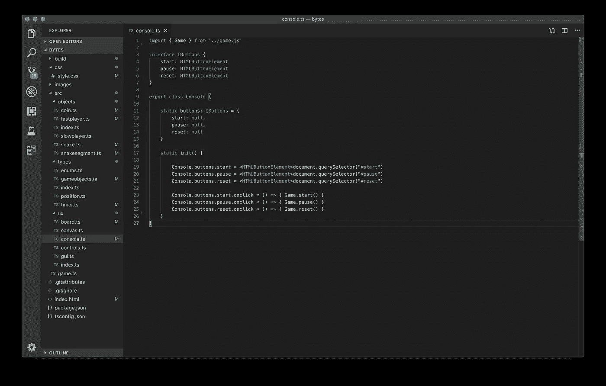

带有几个标准控制台按钮的**控制台**类

**控制台**类非常简单，引用了控制游戏状态(开始、暂停和重置)的三个按钮，并带有 *onclick* 事件的处理程序，这些事件调用**游戏**对象上的各个游戏函数。

接下来是 **src/ux/controls.ts** 中的**控件**类:

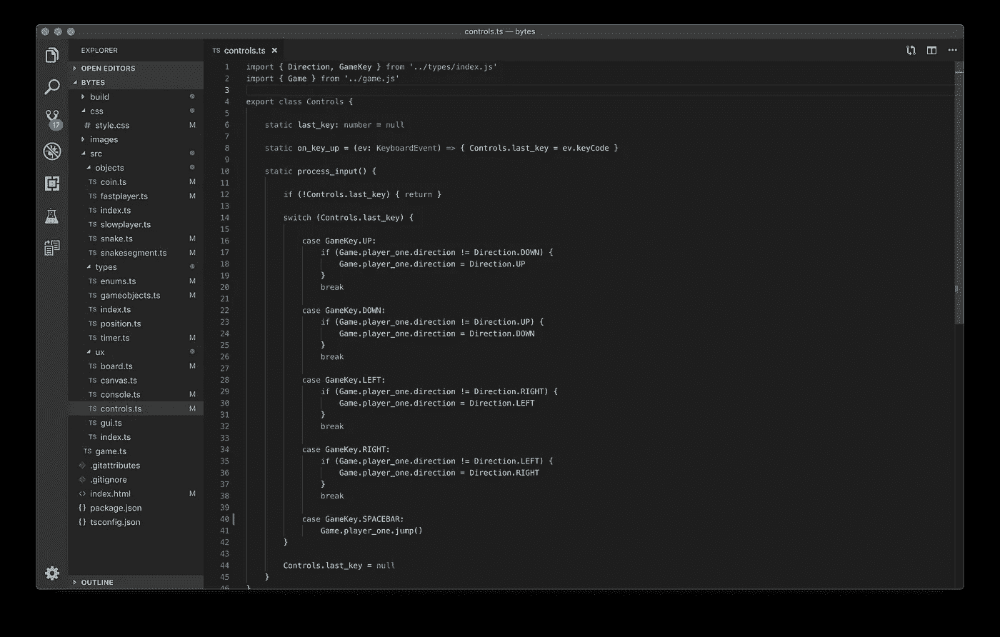

**控制**类，该类处理游戏的控制器输入

**控件**类专门用于处理用户输入。有一个用于 *on_key_up* 的处理程序(它由**游戏**类连接，我们将在后面看到),它只是获取当前事件的关键代码并将其存储在本地。这样，玩家可以在一个时钟周期内按下多个控制键，而控制器将只使用最后一个按下的键。这在游戏中非常有用，可以瞬间改变蛇的移动方向。

每次调用 **process_input()** 时，即每个游戏时钟脉冲一次，以更新每回合的游戏状态，都会执行一系列检查来确定下一步要做什么。如果没有提供任何输入，就让一切保持原样。这将导致，例如，如果我们不去管它，蛇会一直在屏幕上移动。蛇可以向除了它来的方向以外的任何方向移动，因为它不能穿过自己。如果最后按下的键是空格键，则在蛇上调用 **jump()** 方法。一旦 *last_key* 已经被 Controls 类使用，它就被丢弃并被设置回 *null* ，因为这个类与游戏逻辑的其余部分无关，它只是耐心地等待捕获(也许处理)控制器输入。

接下来是 **srx/ux/gui.ts** 中的 **GUI** 类:

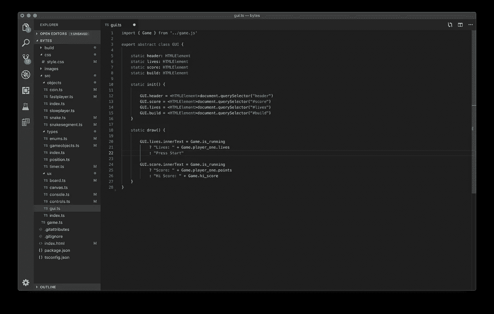

呈现游戏指标和文本的 **GUI** 类

GUI 类也非常简单，仅用于绘制分数和剩余生命数。它包含一些 DOM 元素，并根据游戏状态的各种属性更新它们的文本。

所有支持的类和类型定义都已完成，让我们来看看最后一个。本项目中 ts 文件， **game.ts** :

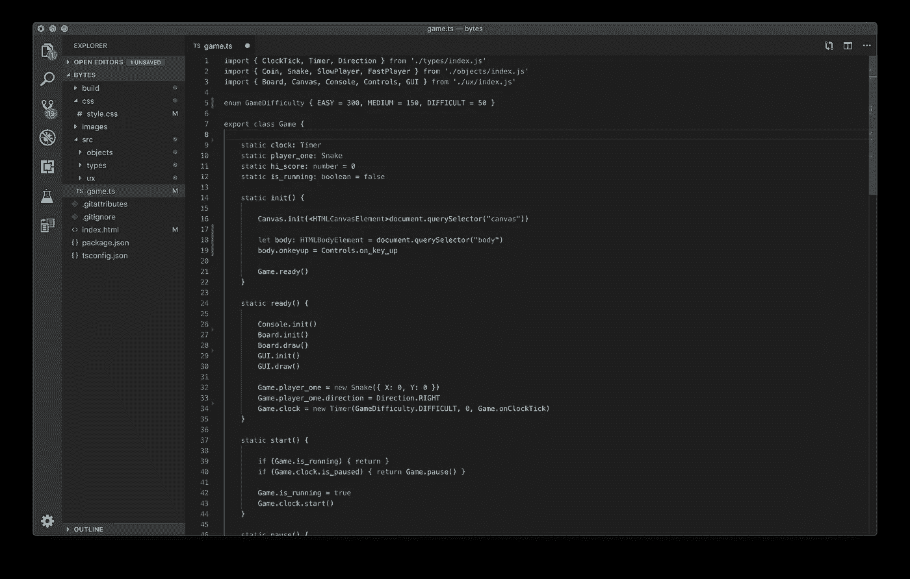

游戏的主入口，**游戏**类

游戏类作为游戏的主要入口点和控制器。驱动游戏动作核心的 *clock* 和 *player_one* 有静态属性，还有从 *0 开始的当前 *hi_score* 、*和 *is_running* 用于设置(并检查)游戏是否正在运行。

**init()** 方法只在游戏网站加载时调用一次，初始化 **canvas** 对象，并开始将 *onkeyup* 事件转发给游戏控制器进行进一步处理。当这些任务完成并且每当游戏被重置时，调用 **ready()** 方法，这又重新初始化各种其他游戏组件，包括**棋盘**、**时钟**和**蛇**。

当 **start()** 方法启动游戏时，首先进行检查以确保游戏尚未运行或处于暂停状态，此时游戏将根据时钟上 *is_paused* 的当前状态继续或暂停/取消暂停。一旦这些检查通过，就开始计时。

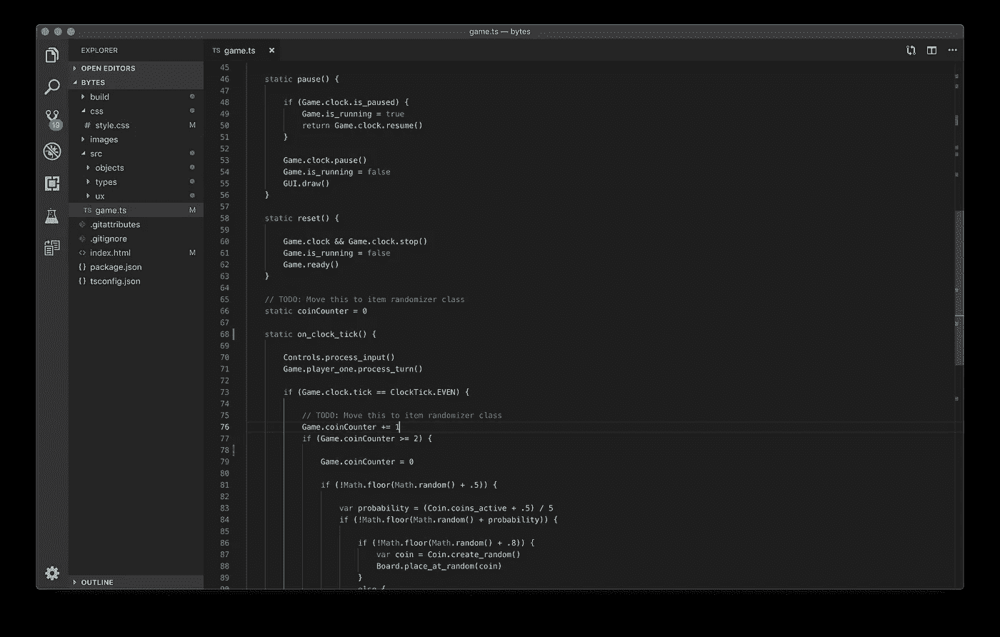

**游戏的**类有**暂停()**、**复位()**和 **on_clock_tick()** 方法

除了启动游戏，我们还需要能够暂停和重置它。 **pause()** 方法检查游戏时钟上 *is_paused* 的当前状态，然后根据需要暂停或恢复游戏。 **reset()** 方法会停止游戏时钟(如果存在)，将 *is_running* 设置为 false，然后调用 **ready()** 将游戏细节重新初始化回默认值。

目前还在开发中的 **on_clock_tick()** 的内容有些混乱，但是基本思想在这里。控制器通过 **process_input()** 接收每个时钟脉冲输入。接下来，通过在玩家的游戏棋子(蛇)上调用 **process_turn()** 来决定玩家的命运。

在偶数时钟脉冲上，通过在整个棋盘上分散一些硬币和电源，一些临时的项目随机化逻辑被执行以使游戏更有趣。这个的代码可能会在以后改变，以适应更复杂的游戏逻辑来产生和分配随机物品。

截图中没有的是 **on_clock_tick()最后的 ***Board.draw()*** 和 ***GUI.draw()*** 方法调用。这些只是调用每个对象的绘制方法，用更新的内容绘制屏幕。**

## 结论

我希望你喜欢这篇关于用 TypeScript 构建简单的经典 2D 游戏的文章。这个基本的游戏“引擎”可以以无数种方式进行修改或升级，用于从在线象棋到基于网络的 RPG 游戏或任何其他游戏，只受开发者想象力的限制。

感谢阅读！

> 肯尼斯·雷利( [8_bit_hacker](https://twitter.com/8_bit_hacker) )是 [LevelUP](https://lvl-up.tech/) 的 CTO