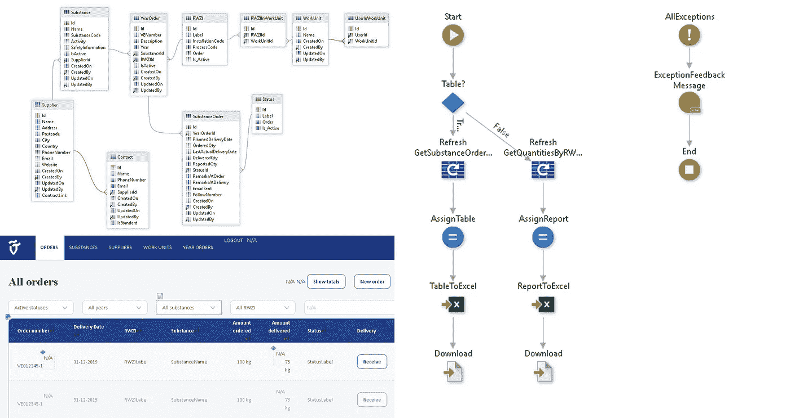
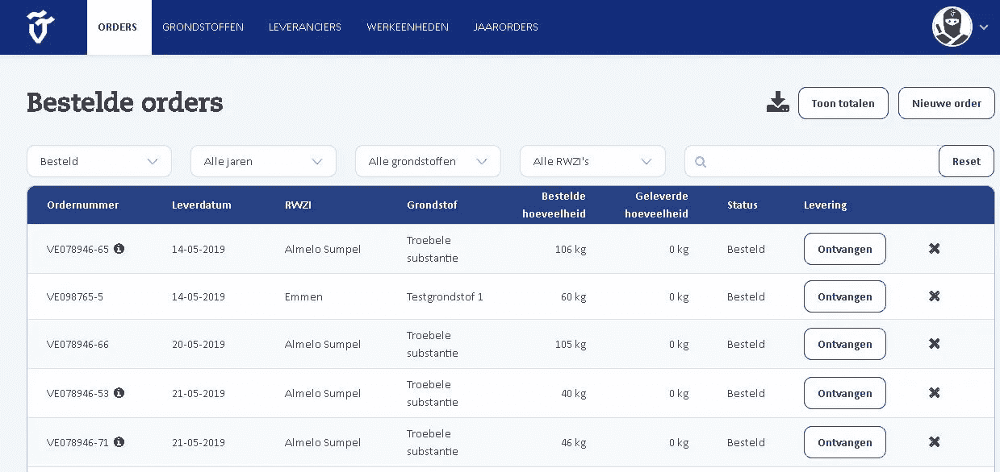

# 在 3 周内构建一个低代码应用程序

> 原文：<https://itnext.io/building-a-low-code-application-in-3-weeks-7e2ed13cbbb0?source=collection_archive---------1----------------------->

## “化学日志”项目

**问题**

Waterboard Vechtstromen 的污水处理厂多年来一直使用某种应用程序来管理原材料的物流流程。

维护应用程序花费了组织大量的时间和金钱。最大的问题是，供应商几年前就破产了，市场上没有有用的替代品。此外，由于应用程序运行的环境在不断增长，应用程序无法正常工作的风险也越来越大。

另一个问题是，在过去几年中，立法和内部报告要求都发生了变化。现有的应用程序已经无法满足这些需求。

最后，在过去的几年中，受支持的流程内部的需求和技术可能性都发生了变化。通过整合这些需求和可能性，组织可以获得巨大的效率收益。

**解决方向**

在我们开始这个案例之前，我们的信息管理部门做了一个商业案例，这个案例是在我们的节目表上评审的。比较了几种解决方案后，我们决定让 Digital Dojo 在 Outsystems*中开发一个应用程序。主要原因是:

1-定制的应用程序提供灵活性、效率和可用性

2-内部开发提供了对开发和维护成本的控制，并且是面向未来的。

3-内部开发提供了与其他应用程序连接的选项和创新的可能性。

**Outsytems 是一个低代码平台，旨在支持我们的数字化转型。与传统编程相比，它提供了平均的 x8 开发速度，并且主要是可视化的开发方式。*

**工作方式**

我们使用 Scrum 开发我们的外部系统应用程序。在我们开始开发之前，我们希望与客户讨论我们的设计。在这种情况下，他们是高级流程操作员 Joost van Dijk 和高级业务运营顾问 Mark Nijhuis。

我们和 Mark 和 Joost 一起在吉拉建立了用户故事，这是一个管理敏捷项目的工具。

然后，我们使用 MarvelApp 将用户故事转化为屏幕设计。这些设计赋予产品生命，帮助顾客产生共鸣。这最终有助于建立以用户为中心的设计。

之后，我们与我们的供应商 LINKIT 讨论了设计，他们给了我们一个开发成本和时间的估计。这得到了我们客户的认可，之后我们开始了冲刺计划。我们的期望是，我们可以在一周内的 3 次冲刺中构建应用程序。我们的目的是和 LINKIT 一起开发这个应用，并尽可能多地自己动手学习。

很快，我们似乎可以很容易地在外部系统中找到自己的路，最后我们自己开发了大部分应用程序。

每个用户故事都遵循下面的开发基础设施。这确保了我们与最终用户的密切合作，并确保我们交付的质量。这是因为所有的故事都经过了双重检查，在每个期望的平台上进行了测试，并且最终得到了用户的认可。

**结果**

我们在 3 周内构建了一个全功能、高质量且被接受的应用程序(Joost 命名为“Chemlog”)。该应用程序甚至被转移到支持部门，现已投入生产。我们自己构建了应用程序的大部分，这确保了成本远远低于估计。

开发低代码应用程序非常符合数字化转型的理念。它让我们适应。当需求改变时，应用程序可以随之改变。我们最终还可以用创新的部分来扩展应用程序，如通过原材料罐中的审查自动订购。最后，Outsystems 平台本身也随着时间的推移而发展，从而避免了我们以前遇到的另一个遗留应用程序问题。

除了产品工作，Scrum 和使用像吉拉和 MarvelApp 这样的应用对大多数团队成员来说都是新的。这有助于提高这些员工的数字技能。这些技能是我们组织关注的领域之一。

> *“使用 Scrum 开发产品对我来说是全新的。我体验过在短周期内工作，有很多接触的时刻，非常有效率。因为团队的这些时刻，我们得到了想要的结果，一个满足所有需求的用户友好的应用程序，非常快。在两个月的时间内(从任务分配到在生产中使用),一个完美的解决方案已经交付。不错的成绩！”-马克·尼吉斯*

**结论**

有/是(？)组织中有人对内部开发持怀疑态度。这适合一个主要是导演的水板吗？在外部系统中构建真的是构建吗——还是更具配置性？这是项目最终获得批准的方案会议上的讨论之一。

此时项目已经结束，成果已经在同一个节目表上分享。对这一过程和最终结果有非常积极的反应。这部分是由于组织内部非常积极的反馈，符合计划并保持在估计范围内。

> *“真正让我满意的是，我们只在用户说明期间得到了积极的反馈(……)如果你看看 project Chemlog，你会发现我们为我们的水板选择了一个有巨大可能性的方向。我的意思是，我们证明了我们可以在内部开发和维护应用程序，而且成本低，维护方便。同样积极的是以用户为中心的设计和构建流程。”Joost van Dijk*

当你问我们低代码开发是未来。尽管每个需求都需要分析和商业案例。有些情况下会提供一个合适的解决方案的货架，开发将过于昂贵。或者在其他情况下需要特定的知识，这样建筑就会有相当大的风险。人们可能会考虑选择安全可靠的解决方案作为更好的选择。在任何货架的情况下，一个是依赖于供应商，一个是错过了发展带来的灵活性。

然而在许多情况下，没有合适的货架解决方案。要使它适合，需要大量的定制工作，需要调整工作流程，或者只满足部分需求。在这种情况下，当你问我们时，低代码总是一个好的解决方案！

*荷兰文原文链接:*【https://spark.adobe.com/page/dXw8Q3tvNn0sB/ 