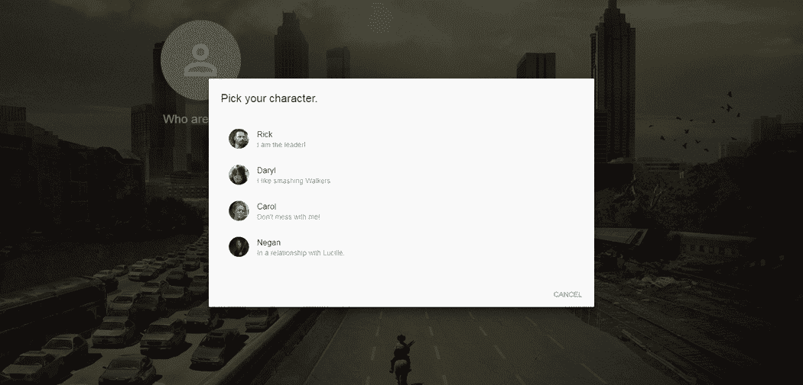

# 用 Socket.io 和 React 构建 Node.js WebSocket 聊天应用

> 原文：<https://itnext.io/building-a-node-js-websocket-chat-app-with-socket-io-and-react-473a0686d1e1?source=collection_archive---------0----------------------->

## 使用 JavaScript 的 Socket.io 教程

**行尸走肉的味道**

[*点击这里在 LinkedIn*](https://www.linkedin.com/cws/share?url=https%3A%2F%2Fitnext.io%2Fbuilding-a-node-js-websocket-chat-app-with-socket-io-and-react-473a0686d1e1) 上分享这篇文章

WebSockets 非常有利于在 web 上构建实时通信或数据流应用程序，例如聊天应用程序和传输图像或其他类型媒体的应用程序。此外，您可以利用浏览器的 JavaScript WebSocket API 轻松地建立到任何套接字端点的连接。

在本教程中，我们将使用 [**socket.io**](https://socket.io/) 和 [**React**](https://reactjs.org/) 基于 WebSockets 构建一个简单的聊天应用。和往常一样，完整的源代码可以在 [**这里**](https://github.com/justadudewhohacks/websocket-chat) 获得。

# 为什么是 WebSockets 而不是 HTTP(S)？

使用 WebSockets，您可以建立一个持久的连接，这允许客户端和服务器之间的双向通信。现在，你可以在网上找到很多基于 REST 的 API，它们都是建立在 HTTP 之上的。这些 API 的使用如下:客户端请求页面或资源，服务器响应(**请求-响应**)。因此，在 HTTP 上使用 WebSockets 具有以下优点:

## 1.实时通信

在请求-响应场景中，如果客户机不先请求某些东西，服务器就无法向客户机发送数据。客户端将不得不持续地定期请求更改(**轮询**)，这不是我们所认为的实时。想象一下一个聊天应用，你每 30 秒才能看到新消息。挺烦的…

服务器可以通过 HTTP 消息通知客户端新事件。您可以将消息推送给在客户端浏览器中运行的**服务工作者**，或者让客户端订阅**服务器发送的事件** ( **SSE** )。然而，使用 WebSockets，我们可以免费获得这一功能，并可以轻松地将收到的新消息广播给其他连接的客户端。

## 2.开销更少

HTTP 是一种无状态协议，因此 HTTP 报头的开销被添加到每一条消息中，其大小会变得相当大。这尤其会对负载相对较小的频繁消息产生影响(例如在聊天应用中)。

此外，HTTP 连接通常只在一定数量的请求中保持活动，并在空闲一段时间后关闭。因此，必须频繁地重新建立连接，这由于 TCP 三次握手(以及在 HTTPS 的情况下交换证书和密钥对)而引入了初始设置时间。

## 3.流处理

使用 WebSockets，人们可以在客户机和服务器之间传输任意大小的二进制数据。因此，它非常适合流处理任务，如图像处理应用程序，这些应用程序可能会来回传输图像或视频数据。

我想你明白了，为什么 WebSockets 可能有用…

# 最后让我们来编写应用程序吧！

为此，我们将使用 [**socket.io**](https://www.npmjs.com/package/socket.io) npm 包，它为我们的聊天服务器提供了 node.js WebSocket API，为浏览器端提供了 JavaScript 客户端。这样，我们就不必发送实际的二进制数据，因为这个包会友好地将我们的数据序列化到 JSON 中。

下面我将详细讨论整个源代码。为了向您介绍 socket.io，我将重点介绍应用程序中有趣的部分。

## 那么，我们要建造什么？

不要太疯狂。一旦客户端连接，我们希望用户能够选择其中一个字符。之后，他或她能够加入和离开聊天室，并向同一聊天室的其他用户发送消息。这里有一个快速演示来形象化我所说的内容:

我们开始吧！

## 侦听传入的套接字连接

在这个例子中，我们将把 socket.io 附加到一个简单的 HTTP 服务器上。如果你愿意，你也可以很容易地将 socket.io 与 express 结合使用。

使用***io . on(‘连接’，cb)*** 我们正在监听传入的套接字连接。一旦一个新的客户端连接上，我们就可以将多个事件监听器附加到流上。 ***错误*** 和 ***断开*** 事件是预定义的。其他事件是我为实现聊天 API 而引入的自定义事件。

服务器正在监听套接字客户机在端口 3000 上的连接，我们将在下面做这件事。

## 使用客户端连接到套接字服务器

注意，在客户端我们想要要求***socket . io-client***。如果您没有使用 bundler(我在这里使用 webpack ),您必须将 io 客户端脚本包含到您的文档中。

在我们的客户端中，我们可以分别用 ***socket.on*** 监听事件，用 ***socket.off*** 删除事件监听器。稍后我们将使用***register handler***在我们的 ***聊天室*** 组件中注册一个***on message received***回调，以便更新组件状态并显示收到的新消息。

使用 ***socket.emit*** 我们可以发出自定义事件，我们的聊天服务器会监听这些事件。作为第二个参数，我们可以传递实际数据。此外，我们甚至可以通过将回调作为第三个参数传递来实现请求-响应类型的通信，我们可以使用回调在客户机上发出事件后从聊天服务器接收响应，反之亦然。这非常简洁，我们将在后面的例子中大量使用它。

## 实现 API

在我们的聊天服务器上，我们将跟踪所有连接的客户端和他们选择的角色(***client manager***)以及每个聊天室的状态，例如，加入聊天室的用户列表和发送到该聊天室的所有消息的历史记录(***chattroom manager***)。

我们要添加的第一件事，是为客户端选择一个字符的端点:

我们将坚持使用***【error，result】***模式，并在出现错误的情况下，使用错误消息作为第一个参数来调用回调。本质上，我们在这里所做的是检查所选择的角色是否可用，并将客户端分配给该角色，否则用错误消息通知客户端。

当用户加入、离开聊天室或发送信息时，更有趣的事情发生了。这些事件的相应处理程序使用以下助手函数:

它确保所传递的聊天室是有效的，并且预先选择了一个角色，并且“ ***用户离开/加入聊天室”*** 或者用户发送的消息被添加到聊天室的聊天历史中。此外，我们向聊天室的所有用户广播该事件。

***聊天室*** 的实现相当简单:

为了简单起见， ***chatHistory*** 只是一个数组，我们保存了该聊天室中所有用户的映射，这样我们就可以向***broadcast message***中的所有客户端发出一个***message****事件。*

*因为实际的处理程序彼此功能相似，所以我在这里只展示连接处理程序:*

*处理完事件后，我们将用户添加到聊天室，并用当前的聊天历史进行响应。*

*最后，一旦客户端断开连接，我们也会确保将该用户从所有聊天室中删除，并删除客户端信息，这将为其他用户释放角色选择:*

## *在客户端实时显示消息*

*在我们的聊天室组件中，我们添加了以下内容:*

*一旦我们进入一个新的聊天室，我们在收到一个“ ***加入*** ”事件后初始化聊天服务器返回的聊天历史。如前所述，当组件挂载时，我们从客户端 API 在处理程序中注册 onMessageReceived 回调。一旦注册，客户端将接收聊天服务器广播的消息事件。这样，我们可以用新消息更新组件状态，并立即重新呈现聊天活动。*

# *最后的话*

*这已经是我们用 WebSockets 做的所有有趣的事情了。剩下的就是用**反应**和**材质构建一个 UI——UI**。所以如果你对此感兴趣，你可能想看看源代码。除此之外，我希望你在读完这篇教程后对 WebSockets 和 socket.io 有信心。编码快乐！*

**如果你喜欢这篇文章，请留下一些掌声，并在 medium 和/或*[*Twitter*](https://twitter.com/justadudewhohax)*:)上关注我。也可以随意在* [***github 资源库***](https://github.com/justadudewhohacks/websocket-chat) *上留下一颗星星。敬请关注更多教程！**