# 在 TypeScript 中构建绘画应用程序

> 原文：<https://itnext.io/building-a-paint-app-in-typescript-1ce42c5b1698?source=collection_archive---------5----------------------->

## 如何利用现代工具开发高性能 web 应用

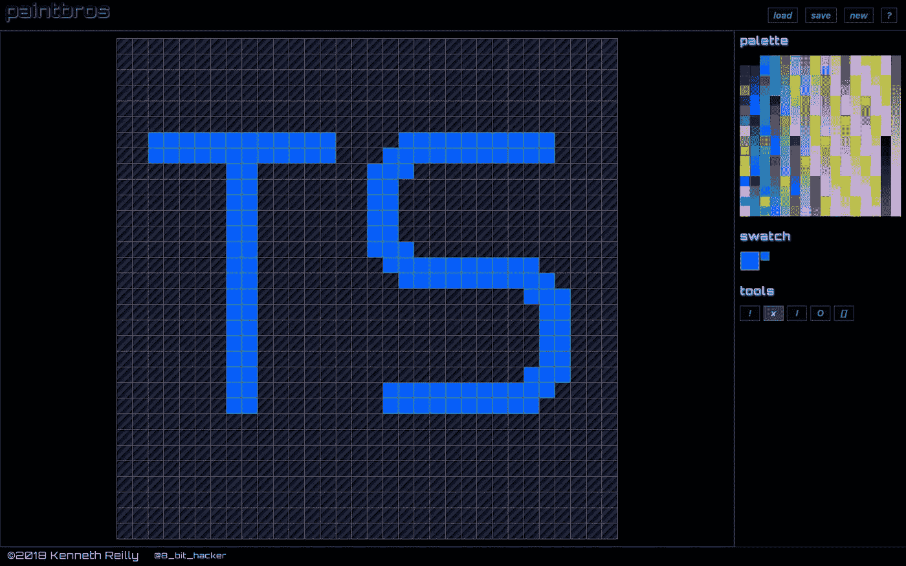

在 [HTML5](https://developer.mozilla.org/en-US/docs/Web/Guide/HTML/HTML5) 、 [CSS3](https://developer.mozilla.org/en/docs/Web/CSS/CSS3) 和 [TypeScript](https://www.typescriptlang.org) 中开发的一个[简单画图 app](https://kenreilly.github.io/paintbros/) 的截图

## 介绍

自从 2013 年初在 0.3 版本左右被介绍给 [TypeScript](https://www.typescriptlang.org) 以来，我一直在利用一切机会使用它，从重构混合桌面应用程序的前端，到构建简单的游戏、网站，甚至自动化语音通信系统等大规模生产服务，都取得了很大的成功。

去年，我构建了一个名为 [paintbros](https://kenreilly.github.io/paintbros/) 的简单绘图程序，作为一个业余爱好项目，为开发一个实验性的 2D 游戏引擎创建自定义格式的光栅图形。虽然功能还不完整，但它展示了使用 TypeScript 和 HTML5 和 CSS3 的现代功能创建高度交互的 web 体验的概念——我们将对此进行更详细的研究。

## 基本设置

由于这种应用程序的自定义性质，以及它唯一的系统要求是全屏设备上的现代浏览器，所以没有使用预先存在的框架。这个想法是利用尽可能多的现代浏览器的内置特性——唯一的开发依赖是 Node 和 TypeScript 编译器。正如 Google Lighthouse 中的这些性能和最佳实践指标所揭示的那样，从头开始做有一个非常好的理由:

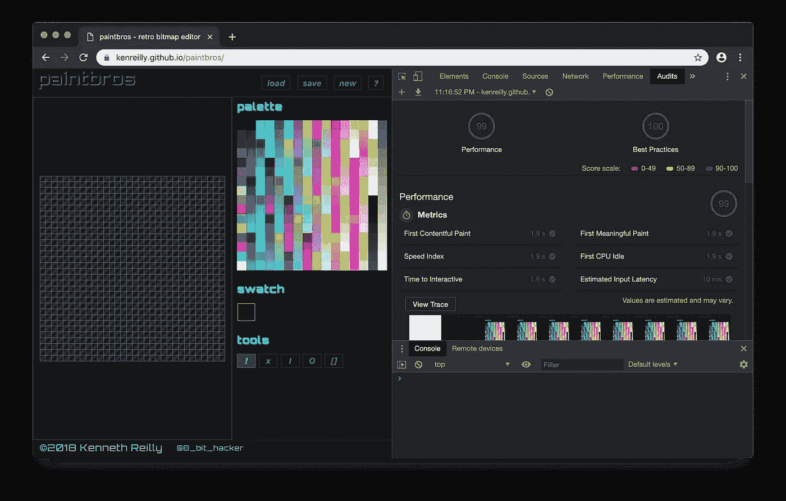

保持简单可以实现的性能示例

这是股票表现，不需要真正的优化或其他改进，这是一个很好的位置。在阿尔法 MVP 上达到 99%就像从终点线开始。这展示了选择轻量级工具和技术(如 TypeScript)以及利用 HTML5 和 CSS3 中可用的强大功能时的强大功能。

让我们看看项目布局，以及我们的两个项目配置文件。从这里，我们可以看到该应用程序具有典型的网站结构、少量的 TypeScript 文件、一些基本的资产文件夹和项目配置设置:

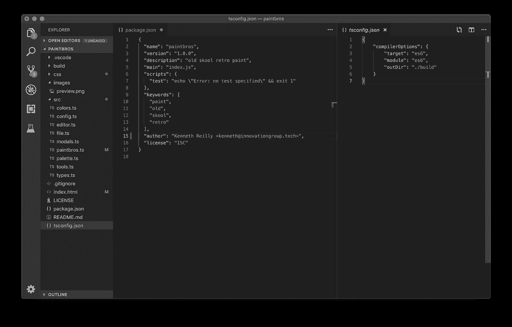

项目布局，用编译器选项生成的 **package.json、**和 **tsconfig.json**

外部运行时依赖性的缺乏使得这是一个非常干净和轻量级的应用程序，但这也意味着一切都必须从头开始定义。幸运的是，使用这种设置有许多很大的优势，特别是在[与代码](https://code.visualstudio.com)之间，后者是为了支持 TypeScript 而从头开始设计的，并且包括针对现代 web 技术的强大的内置代码完成和重构工具。

## 创建基本的 UX 结构

配置文件准备就绪后，下一步是定义应用程序的基本 HTML 结构。这里我们有一些用于[字符集](https://www.w3.org/International/questions/qa-html-encoding-declarations)、[视口](https://developer.mozilla.org/en-US/docs/Mozilla/Mobile/Viewport_meta_tag)、[打开图](http://ogp.me)和 CSS 样式表的元数据，以及主 javascript 构建输出文件**。我们用 **type="module"** 定义的/build/paintbros.js** ，用于[直接将我们编译的 ES6 模块](https://developers.google.com/web/fundamentals/primers/modules)加载到浏览器中:

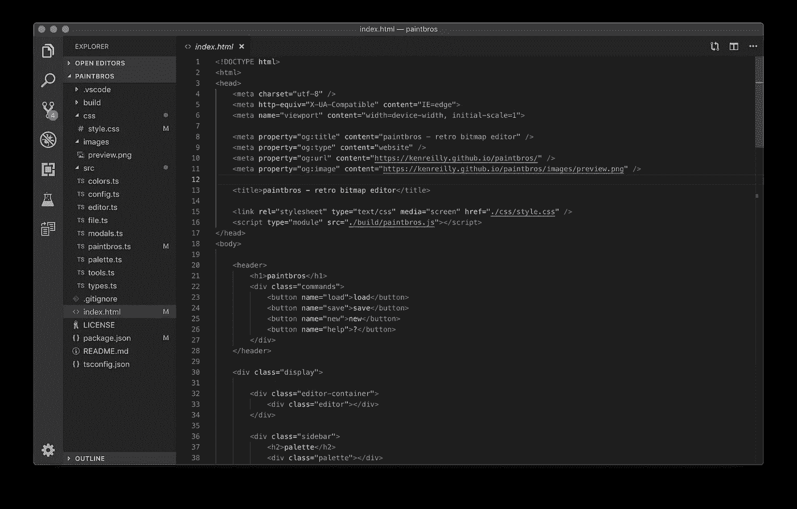

带有[视口](https://developer.mozilla.org/en-US/docs/Mozilla/Mobile/Viewport_meta_tag)、[打开图形](http://ogp.me)和 [javascript 模块](https://developers.google.com/web/fundamentals/primers/modules)的 HTML 头

让我们进一步看看**体**。包括一个带有**按钮**的**标题**，一个**编辑器**区域，以及一个**侧栏**，它带有用于**调色板**、**样本**和**工具**的容器:

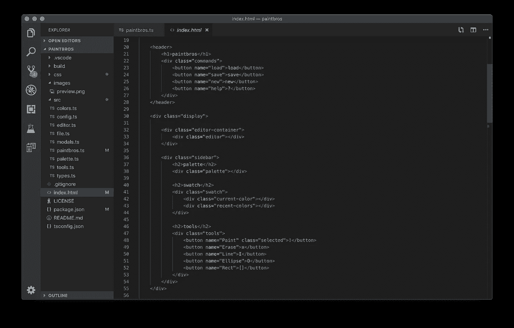

编辑器界面和一些基本工具的 HTML 定义

这些组件充当应用程序主(也是唯一的)屏幕的工作空间。它非常简单，在屏幕顶部有一个标志和标准命令，在侧面有一些选择颜色和工具的东西。不太新颖，但想法是保持简单。除此之外，我们还有一个带有版权信息的页脚和一些用于处理基本操作(如创建、加载或保存图像)的模态对话框:

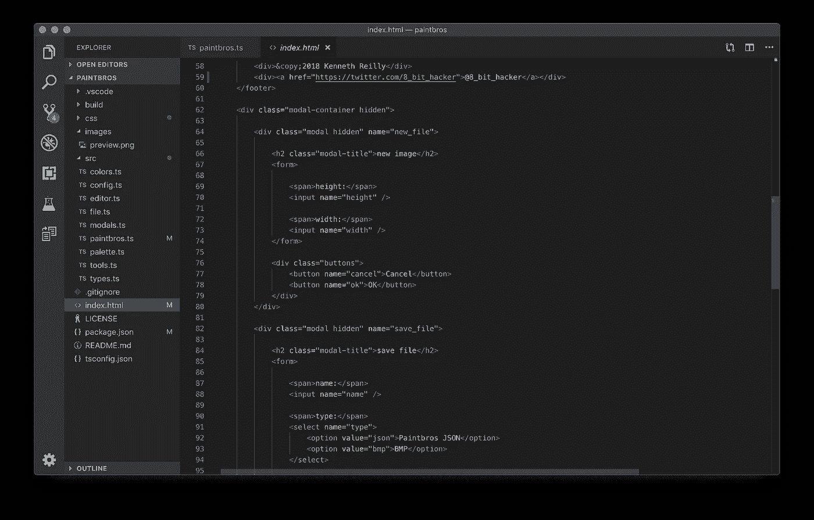

用于文件操作的静态页脚和简单对话框组件

这就是应用程序 HTML 的基本内容(除了加载文件对话框和关于对话框，加载文件对话框主要是前两个对话框的另一个副本，关于对话框只显示一些信息文本)。我可以更进一步，为对话框创建一个抽象组件，但是在应用程序中总共有三个这样的组件实在不值得。然而，再多一点，创造一些可以配置和重用的东西将是一个很好的投资。

CSS 也非常精简，没有预先存在的框架来允许从零开始 100%可定制的 UX。我们将使用 CSS3 的特性，如[变量](https://developer.mozilla.org/en-US/docs/Web/CSS/Using_CSS_custom_properties)和 [calc()](https://developer.mozilla.org/en-US/docs/Web/CSS/calc) 来定义一些通过应用程序使用的全局属性:

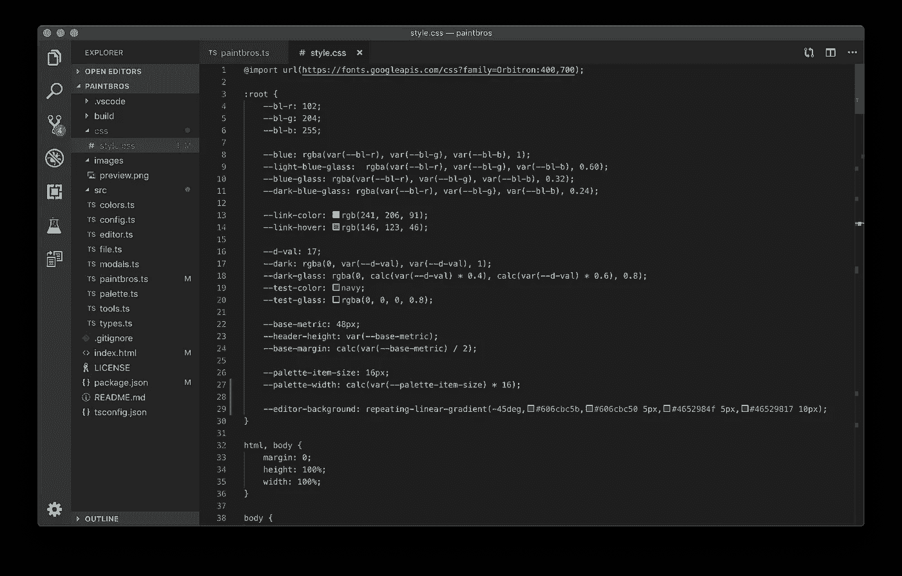

利用 CSS3 强大的功能，包括[变量](https://developer.mozilla.org/en-US/docs/Web/CSS/Using_CSS_custom_properties)和[计算](https://developer.mozilla.org/en-US/docs/Web/CSS/calc)()函数

在这里，我们定义了颜色值、边距、调色板组件大小和 45 度条纹编辑器背景，以便在任何像素被任何颜色占据时都很明显。像这样提前定义 CSS 变量对构建图形应用程序的 UX 原型有很大的帮助，在这种情况下，您可能需要多次修改布局细节才能得到正确的结果。

我们不会深入研究整个 CSS 文件(您可以在这里查看项目源代码)，但是让我们来看看构成 UX 的几个关键概念:

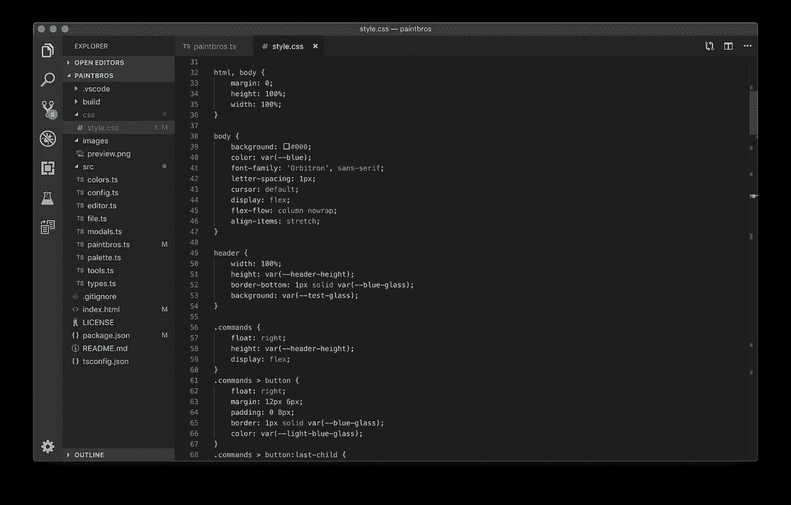

带有静态标题和命令按钮样式的全屏正文

由于这是一个全屏的 web 应用程序，不像基于内容的网站那样滚动，我们将我们的高度和宽度设置为 100%(我通常使用 **vh** 单位，但我在几天内就完成了这个项目，所以代码没有被修改)。我们可以立即从 CSS 变量中受益，而不必为 CSS 预处理器添加另一个依赖项，例如 [SASS](https://sass-lang.com) ，我通常会将它留给更大更复杂的项目。接下来，我们将了解应用程序中最重要的概念之一，编辑器表面样式:

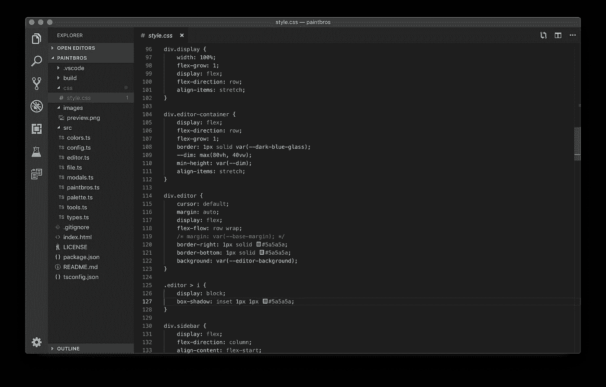

主显示和编辑器容器、编辑器本身和编辑器“像素”的样式。**编辑>本人**

[Flexbox](https://css-tricks.com/snippets/css/a-guide-to-flexbox/) 用于在元素各自的父容器中水平和垂直地定位和拉伸元素。定义了显示、编辑器容器、编辑器和侧栏组件，形成了前端布局的核心结构。编辑器像素在编辑器中水平换行，所有内容都以所需的方式拉伸以适合其父级。

这总结了我们分别使用 HTML5 和 CSS3 对表示和样式的定义，并且很容易理解为什么它呈现得很快并且达到了大致的性能指标。还有更多的东西，但不多——一些或多或少重复了我们已经讨论过的概念的项目。

现在我们已经了解了结构和图形元素，让我们深入到在 TypeScript 中构建应用程序逻辑的过程中。

## 定义调色板颜色、界面和枚举

在这个阶段，第一个任务是创建文件 **src/colors.ts，**粘贴从这个 [xterm 颜色备忘单](https://jonasjacek.github.io/colors/)复制的 256 个颜色值，并将其导出为 var。接下来是 **src/types.ts** ，在这里我们导出一些[接口](https://www.typescriptlang.org/docs/handbook/interfaces.html)和[枚举](https://www.typescriptlang.org/docs/handbook/enums.html):

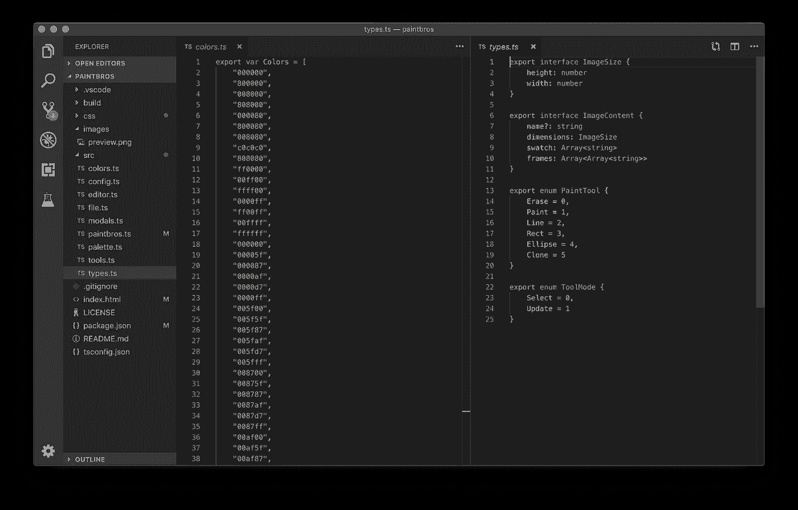

Xterm 的超级复古 256 色调色板和一些方便的定义

这里我们有一些驱动应用程序其余部分的基本概念:

*   **ImageSize** :图像的高度和宽度(假设为像素单位)
*   **图像内容**:用于加载、保存和编辑的图像的结构
*   **PaintTool** :工具列表，从中选择当前选中的工具
*   **工具模式**:未使用，用于区域操作(待实施)

## 主应用程序文件

接下来我们将看看 **build/paintbros.js** 背后的源代码，这个文件是我们如上所述作为 ES6 模块导入的，它随后会根据需要加载其他模块。该文件的源文件在 **src/paintbros.ts:** 中

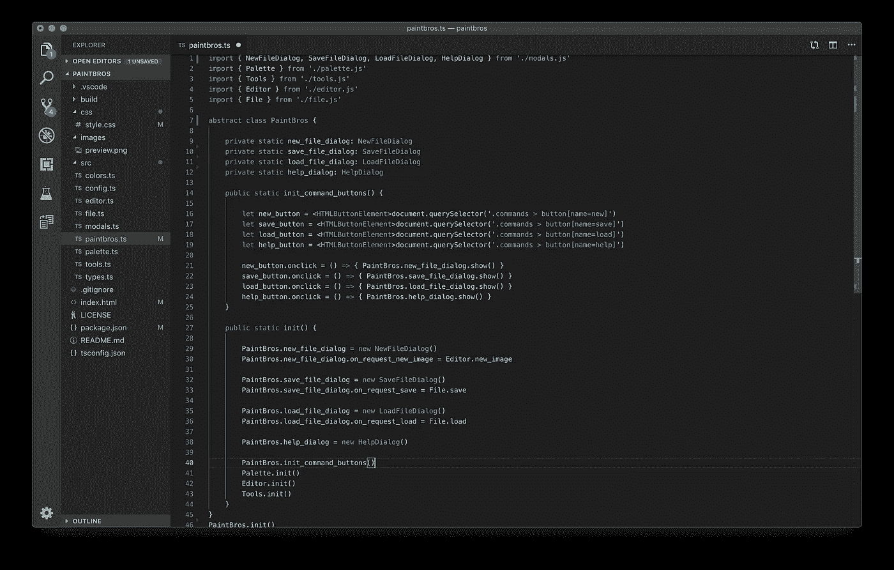

具有按钮、对话框和静态初始化的 PaintBros 类

PaintBros 抽象类包含对文件操作的按钮和对话框的静态引用，并初始化其他应用程序组件，如调色板和编辑器。这里我们开始看到 TypeScript 的一些好处。这段代码很大程度上是自文档化的，很容易判断什么去哪里，为什么去。从这里，我们将开始研究核心编辑特性。

## 调色板 UX

接下来，我们将在 **src/palette.ts** 中检查我们的第一个基本控制器:

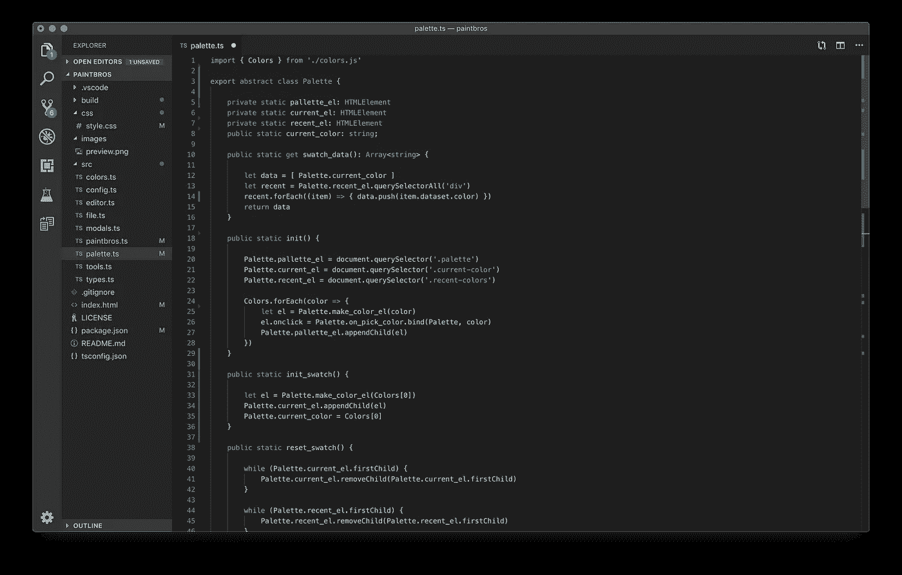

显示元素引用、数据访问器属性和 init 方法的调色板类

Palette 类是调色板和样本 UX 的控制器，具有对调色板元素本身的静态引用、显示当前和以前选择的颜色的元素以及包含当前选择的颜色的字符串(即' *#00FFA0* ')。访问器 **swatch_data()** 用于检索最近使用的颜色，以便稍后将它们与图像文件一起保存。 **init()** 方法检索我们的 DOM 元素引用，并通过创建每个元素、将其绑定到事件处理程序、然后将每个颜色元素追加到调色板来绘制调色板本身。此外，我们可以看到 **init_swatch()** 和 **reset_swatch()** 函数，它们处理这些任务。

让我们看看 Palette 类中定义的其他方法:

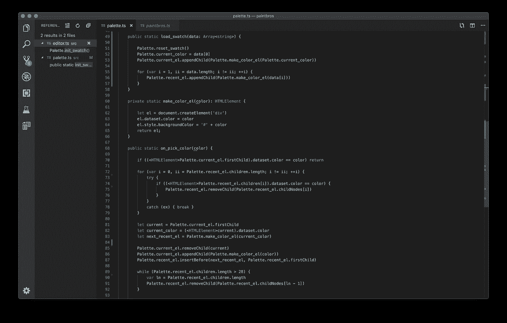

调色板类中用于处理样本和处理单击事件的方法

在这个类中，我们还找到了用于从先前保存的文件中加载颜色的 **load_swatch()** 方法(我们将在后面讨论文件操作)，以及用于生成样本项目元素的 **make_color_el()** ，以及用作单击调色板颜色的事件处理程序的 **on_click_color()** 方法。当单击一种颜色时，如果它与当前选定的颜色匹配，则该事件将被丢弃，否则色板中的最后一个项目将被删除，当前颜色将被推送到色板堆栈的前面，新选定的颜色将被设置为当前颜色。

## 工具 UX

继续我们应用程序的下一个组件，我们将看看允许用户在画笔、橡皮擦等之间进行选择的控制器:

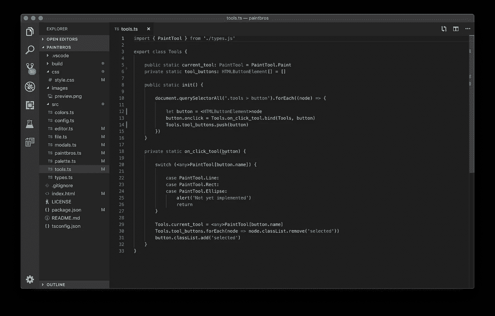

带有 **init()** 和 **on_click_tool()** 函数的工具类——对这个来说不算什么

分配给 **current_tool** 的默认工具是画笔，我们可以看到 **init()** 函数选择了工具按钮，并将每个按钮绑定到 **on_click_tool()** 处理程序，当选择了一个尚未构建的工具(毕竟这是一夜之间完成的)时，它会发出“尚未实现”的警告。当用户选择一个已存在的工具时，它就成为被选中的选项。

## 编辑

这是大部分活动发生的地方。编辑器包含实际的图像信息本身，以及显示图像的方法，并允许使用该程序的人对其进行编辑。这里是 **src/editor.ts** :

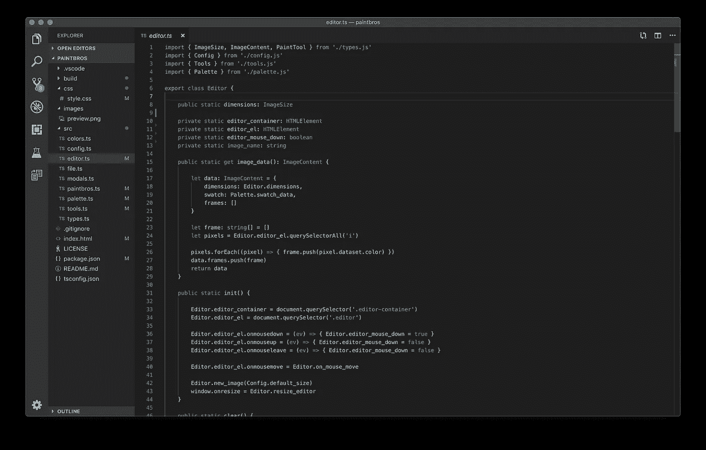

编辑器类，视图中有 **image_data()** 访问器和 **init()** 方法

编辑器具有图像尺寸的属性、对编辑器元素及其父容器的 DOM 元素引用，以及跟踪鼠标按下状态的布尔值。为了简单起见，实际的工作图像数据作为[数据集](https://developer.mozilla.org/en-US/docs/Web/API/HTMLElement/dataset)属性存储在像素元素本身中，并且仅在必要时通过 **image_data()** 访问器进行检索，该访问器的工作方式就像样本中的访问器一样，提取要在文件保存操作中使用的数据。

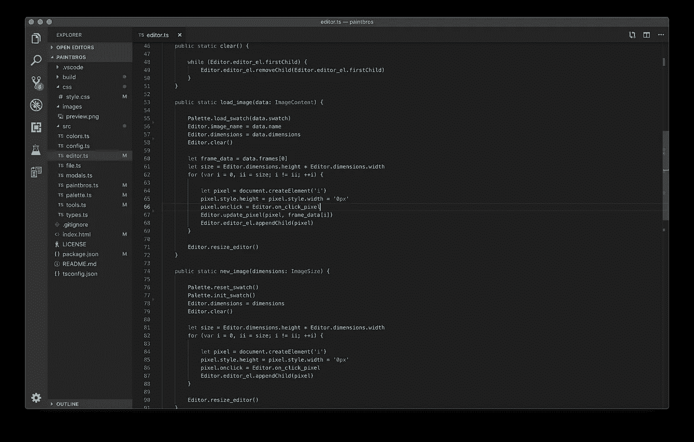

编辑器类中的 **clear()** 、 **load_image()** 和 **new_image()** 函数

这里我们有从实现 **ImageContent** 的对象加载先前保存的图像并将其绘制到编辑器**、**上的方法，以及从 **ImageSize** 创建新的空白图像的方法。组件面板和编辑器的各种组件都会更新，以反映每个场景所需的结果，同时创建单独的“像素”并附加到编辑器中。

随着我们进入应用程序更复杂的部分，TypeScript 的优势变得越来越明显。我们不必一行一行地阅读意大利面条式的代码来拼凑编辑器如何工作的不同概念，而是获得了更多的关于所有东西是如何组装的图形表示，开发人员可以在几分之一秒内推断出什么东西，而不必四处挖掘。这里的关键是上下文，因为每一行都包含足够的信息来帮助正确理解它。

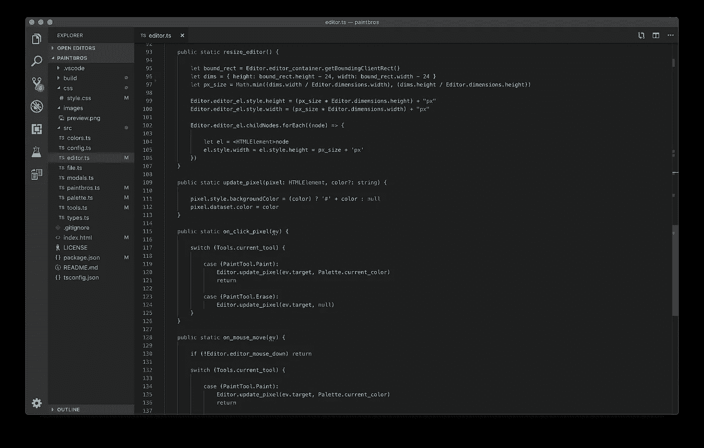

编辑器类的其余方法:调整大小和单击事件的处理程序

最后，我们的编辑器类包含在绘制屏幕或改变屏幕尺寸时调整大小的方法，在单击时更新“像素”的方法，以及处理鼠标移动事件的方法(主要是为了防止鼠标“卡”在*向下*的位置和在编辑器上随意绘制)。

## 模态对话框 UX

下一个是带 modal 的 src/modal.ts ,这是我们的对话框将扩展的一个抽象类:

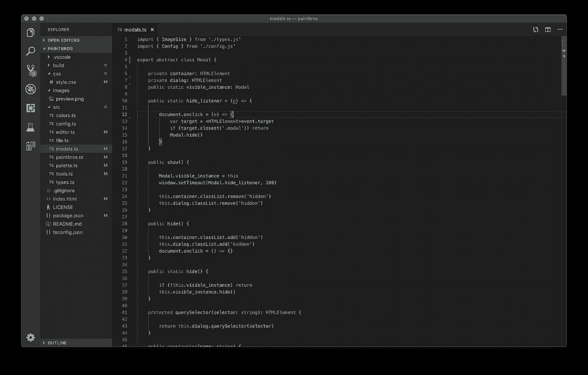

各个对话框类扩展的基本模式类

Modal 类包含模态容器和对话框的属性，以及一个对当前可见实例的静态引用，该实例用于当用户在对话框之外单击时全局隐藏任何打开的对话框，它由 **hide_listener** 静态属性**处理。**此外，我们还有我们的 **show()** 和 **hide()** 方法，一个实现全局对话框隐藏特性的静态 **hide()** 方法，以及一个内部的 **querySelector** 来方便地选择对话框的子元素:

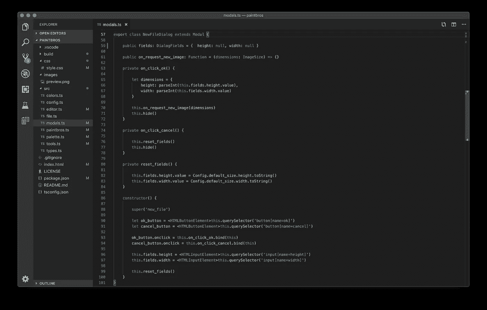

一个模态对话框的例子，**新文件对话框**类

NewFileDialog 类是我们第一个扩展抽象模态基类的实现。我们的对话框字段有一个属性，一个默认的处理程序用于 **on_request_new_image** (在对话框初始化过程中被 PaintBros 类设置的实际处理程序所替换，用于处理真实事件)，单击“确定”和“取消”的处理程序调用附加的处理程序用于 **on_request_new_image** 和/或隐藏对话框，以及一个基本的**构造函数()**，它将对话框标题传递给带有 **super()** 的基本模态类，并初始化 DOM 引用和事件处理程序

我们不会深入研究另外两个对话框，LoadFileDialog 和 SaveFileDialog，它们实际上是 NewFileDialog 的副本，只做了一些修改，并连接到处理相应功能的事件处理程序。然而，接下来我们将研究这些函数的实现。

## 文件操作

最后，我们来看最后一个但并非最不重要的特性，用于保存和加载图像的文件操作。这在 **file.ts** 中实现:

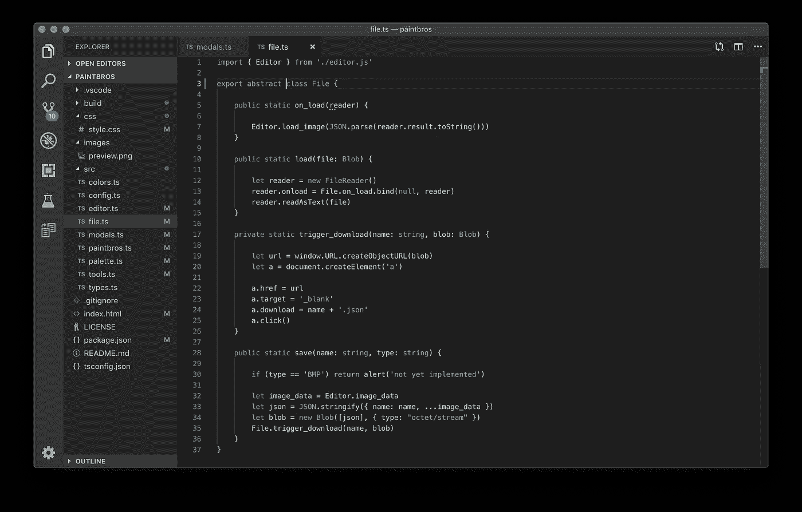

**src/file.ts** 和 file 类的全部内容，处理所有的 app 文件操作

File 类也非常精简，在 37 行自文档化的代码中处理该程序 100%的文件加载和保存操作。 **load()** 方法利用 [FileReader](https://developer.mozilla.org/en-US/docs/Web/API/FileReader) web API 从 **LoadFileDialog** 上的文件输入元素返回的 Blob 中异步加载图像 JSON 文件的内容，后者将数据传递给 **on_load** 处理程序，进而将 JSON 解析为一个对象并将其传递给 **Editor.load_image()** 。

**save()** 方法执行与预期相反的操作，序列化图像名称以及从编辑器中提取的图像数据，将其打包到一个 Blob 中，并通过触发文件下载点击事件将其保存到本地机器。

文件操作到此为止。目前唯一支持的格式是自定义的“格式”，它只是序列化为 JSON 并作为*存储在本地机器上的图像信息。json* 文件，但是我确实计划在将来的某个时候实现保存和加载 BMP 文件的选项。

## 结论

TypeScript 提供了强大而丰富的功能集，可以创建像真正的软件一样执行和行为的真正的应用程序，而不是笨重臃肿的网站，当太多的内容在浏览器的 JavaScript 引擎上争用时间时，这些网站会永远加载和堵塞。

虽然这个程序不太可能成为光栅图形编辑中的下一个大事件，但它显示了只用几个小的类型脚本文件和几行干净、定义良好的 HTML5 和 CSS3 就可以完成多少工作。

我希望你喜欢这篇文章，并祝你的下一个打字稿项目好运！

> 肯尼斯·雷利( [8_bit_hacker](https://twitter.com/8_bit_hacker) )是 [LevelUP](https://lvl-up.tech/) 的 CTO