# 用 Redux 构建基于 React 的聊天客户端

> 原文：<https://itnext.io/building-a-react-based-chat-client-with-redux-816b47cb8c74?source=collection_archive---------0----------------------->

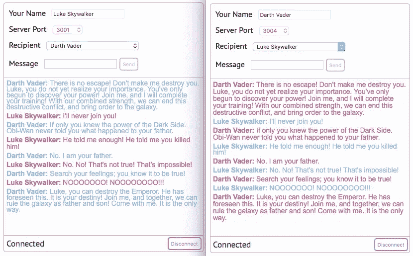

只是两个用户随便聊天。

让我们用 React 构建一个非平凡的应用程序，然后重构它以使用 Redux！

关于将 Redux 添加到 React 项目中，你得到的大多数建议是，只有当项目达到一定规模时才这样做，因为 Redux 会增加额外的复杂性。这当然是公平的。但是它会给你留下一些技术上的负担(重构将在以后完成)，如果你刚开始使用 React 和 Redux，你就不会有这些负担。

因此，我认为展示一个我们这样做的练习可能会很好:单独使用 React 和 ReactDOM 尽可能简单地构建一个应用程序(甚至不使用 JSX，因为你需要更多的依赖项和构建过程来支持它)，然后重构以使用 JSX 和 Redux。

在[之前的一篇文章](/multi-server-chat-in-node-without-a-database-51bb66e41999)中，我描述了我的基于节点的多服务器聊天项目，它内置了一个基本的 Javascript 客户端。尽管所有的系统功能都可以用该客户机的几个实例来测试，但它在许多方面都有所欠缺:

*   它只允许您连接两个预定义的用户(这个用户提供自由格式的用户名输入，所以任何数量都可以连接)。
*   它没有显示可滚动的消息历史，尽管你可以在一行上看到最近发送或接收的消息。
*   它没有向您显示连接到服务器网格的所有其他用户的列表，它只是在服务器更新客户端时将用户列表记录到控制台。
*   当您选择的收件人断开或重新连接时，它不会提醒您。
*   它不支持消息线程(该客户端在收到传入消息后会自动显示适当的线程并选择收件人)。

尽管它很小，但客户正处于复杂性的边缘，某种框架将是受欢迎的。所以在这篇文章中，我将构建一个更加[的全功能客户端](https://github.com/cliffhall/react-chat-client)来与同一个聊天服务器通信。

# 第一刀:反应和反击

在最简单的 React 项目中，您只需引入 React 和 ReactDOM，然后使用 React.createElement()来呈现您的组件(它扩展了 React。组件)。你可以在[上看到这个项目的第一个版本，它的 1.1.0 标签](https://github.com/cliffhall/react-chat-client/tree/1.0.0)。

在该版本的项目中，HTML 模板如下所示:


**react-chat-client.html**

请注意它如何使用脚本标记从 CDN urls 以及作为应用程序入口点的 main.js 文件中获取其依赖项 React、ReactDOM 和 Socket.io。这使我们能够通过一个简单的快速服务器来提供应用程序，如下所示:

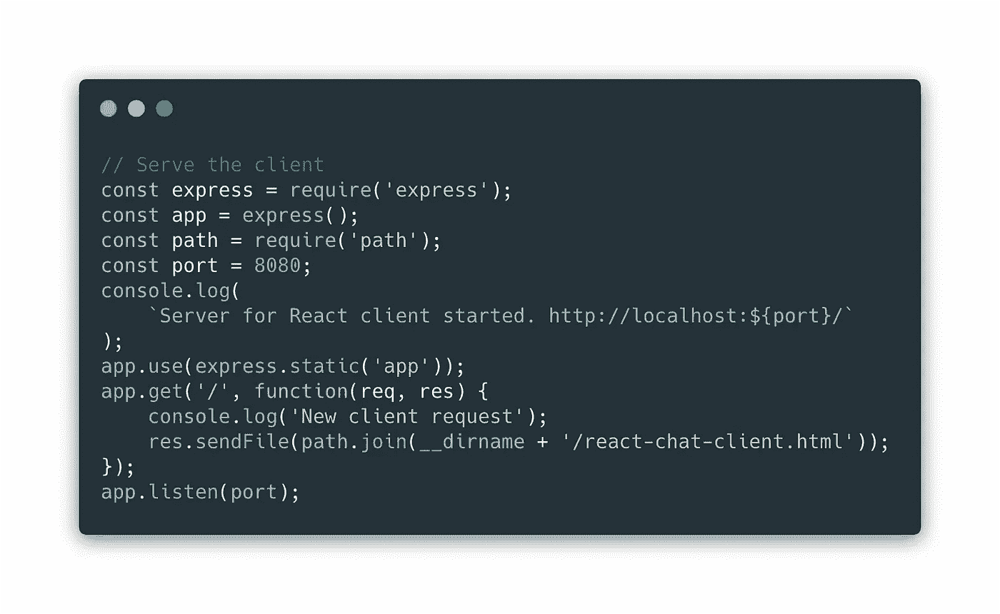

**client-server.js**

这避免了许多与 React 工具链设置相关的心理摩擦。不需要创建-反应-应用程序，巴别塔，网络包等。

# 应用程序结构

在第一个片段中，应用程序代码只包含四个文件，藏在一个文件夹中。


就这么简单，对吧？

你已经在上面的 **client-server.js** 和**react-chat-client.html**中看到了其中的两个。另外两个是:

# 主页. js

这个文件再简单不过了，只是将客户端类呈现为一个 DOM 元素，取代了 HTML 模板中的“app”元素。回想一下，它在模板主体的脚本标记中被引用。

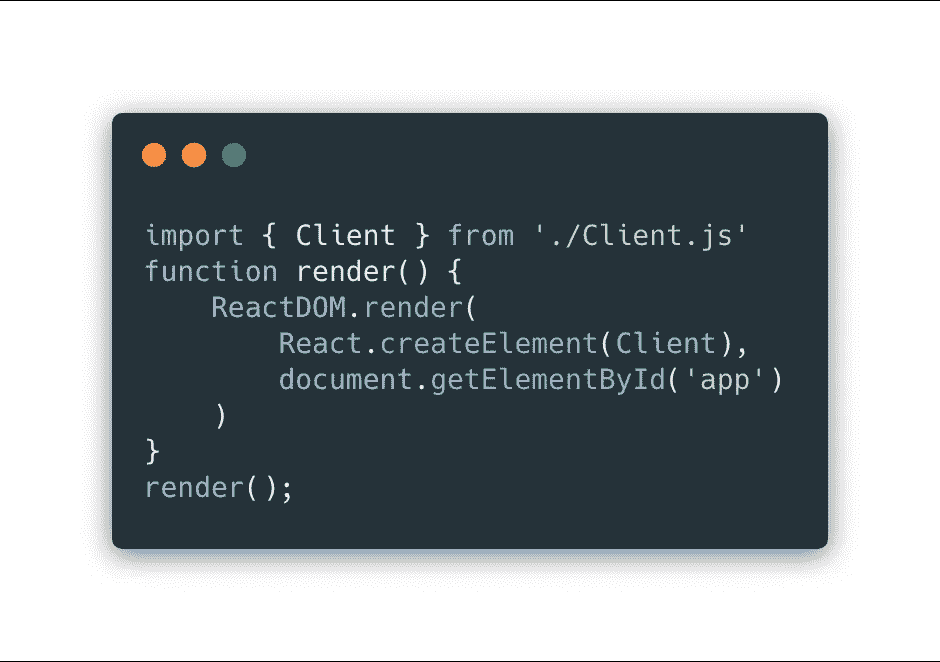

**Main.js**

# Client.js

这个是单片的，正好有六百条线。这里就不赘述了，不过值得看一下回购中的[。单一的类很难维护和推理，特别是当团队中不止一个人的时候。](https://github.com/cliffhall/react-chat-client/blob/1.0.0/app/Client.js)

该文件将所有协议、样式定义为 CSS-in-JS，并以文件中所有组件都可以看到的常量的形式进行定义。它还定义了所有的组件，在没有提升的情况下，它们必须在被引用之前被定义，所以客户端组件是最后定义的，所有其他组件在它之前，嵌套组件也是如此。这种不明显的排序要求是单片文件不好的另一个原因。

# React.createElement vs JSX

我在这里要指出的一件事是，即使没有 JSX 也能做出反应，你的渲染方法看起来是这样的:

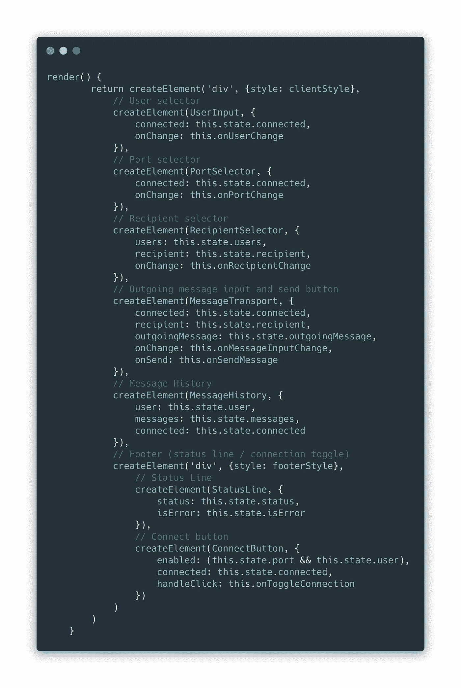

**使用 React.createElement 的 Client.js 渲染方法**

代替这一个，从[版本 1.1.0](https://github.com/cliffhall/react-chat-client/tree/1.1.0) 中增加了 JSX:

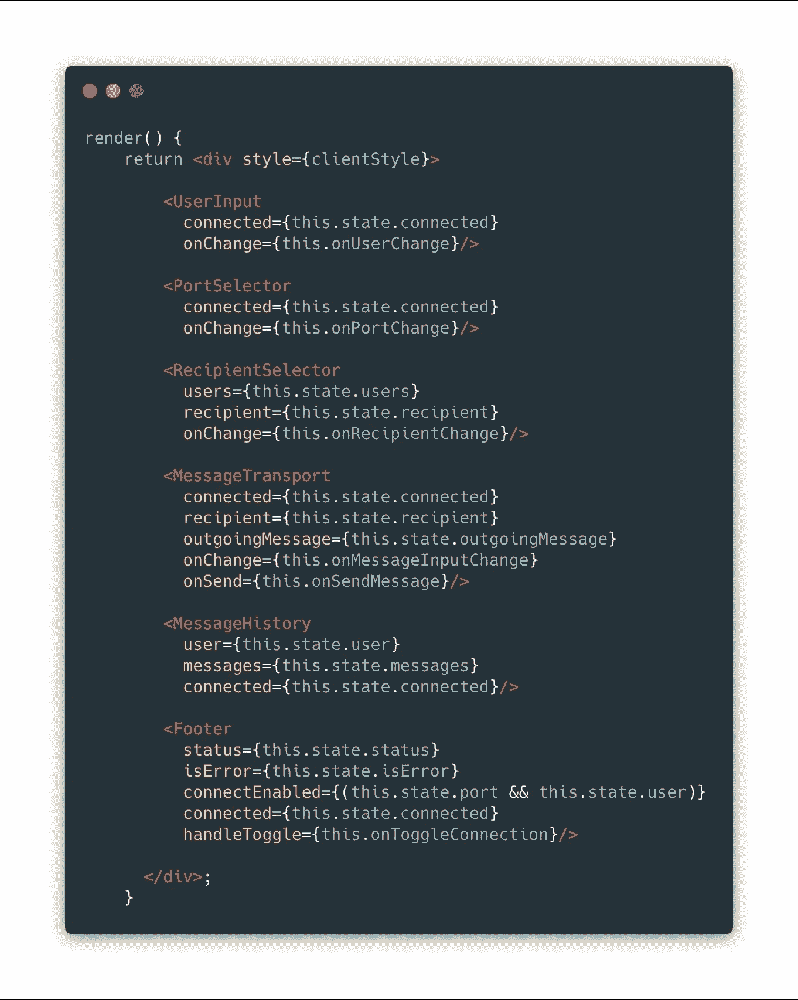

**使用 JSX 的 Client.js 渲染方法**

**注意:**这是一点改进，但是我向你保证，在本文结束时，我们将会在渲染功能上有很大改进。

# 数据流

这个无冗余版本中数据流的基本前提是顶级客户端组件初始化其构造函数中的所有状态:

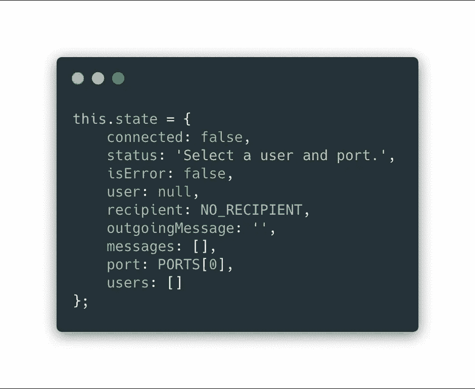

然后将状态位和修改它的回调作为道具传递给子组件，如下所示:

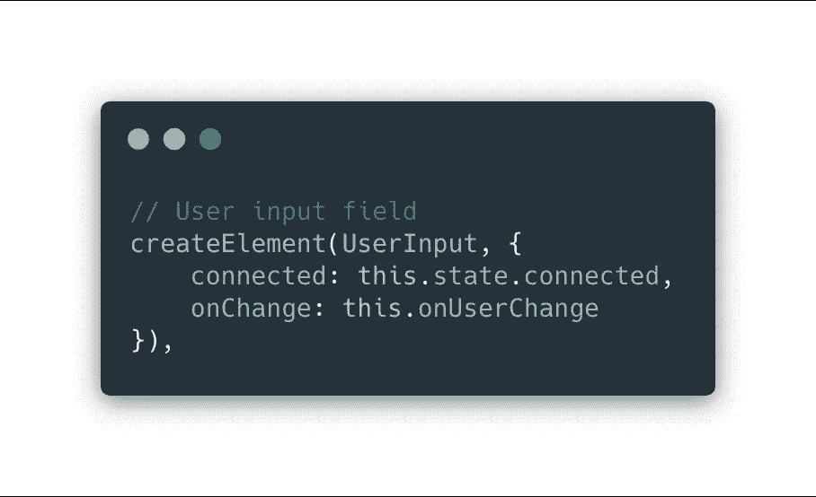

在这种情况下，传递给 ConnectButton 实例的 onUserChange 回调如下所示:

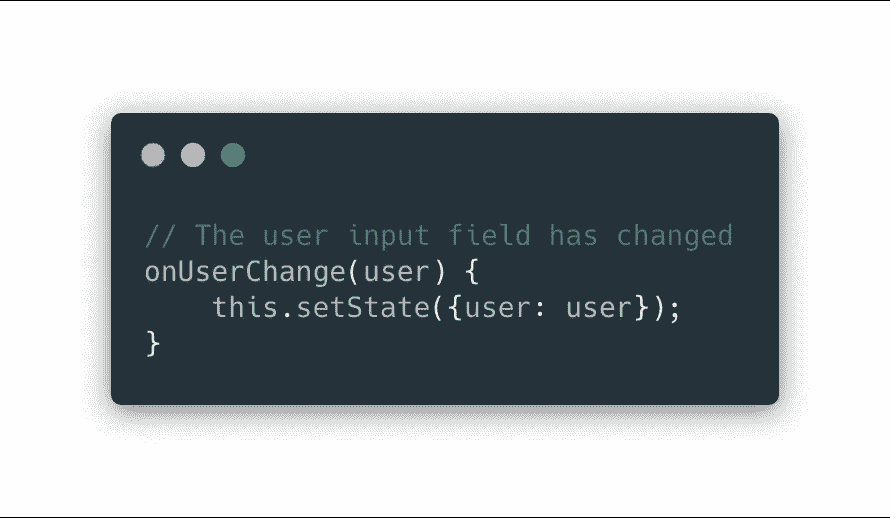

因此，当 UserInput 组件的文本输入字段改变时，触发对 onUserChange 的调用，客户端组件改变状态，导致 React 重新呈现。

这很简单，而且很好的是，当状态改变时，React 负责重新渲染。但是在现实世界中，这种方法没有伸缩性。组件需要放入它们自己的文件中，JSX 对我们来说确实更容易使用，而且大多数团队喜欢使用一些 Flux 模式的变体来管理应用程序范围内的状态，因为随着项目的增长，它更容易模块化和扩展。

# 光猪六壮士:用 Redux 和 Bindings 来反应

添加 Redux 会引入额外的复杂性，并大大增加项目中文件和文件夹的数量。它还需要一些额外的依赖项，以及在构建和服务客户端的过程中的变化。

在脚本标签中引入库并从我们的简单节点/快速服务器提供模板已经不够了。现在，我们将在 package.json 中定义我们的依赖项，并使用“npm install”将它们拉入。

# 新依赖项

我没有为此介绍 Babel、Webpack、Browserify [react-scripts](https://www.npmjs.com/package/react-scripts) 库已经足够了。它不仅让我们能够使用 JSX，而且它还将所有代码编译成 bundle.js 文件并服务于我们的客户端，甚至在代码更改时触发浏览器重新加载。

我添加的另一个库是 [react-redux](https://www.npmjs.com/package/react-redux) ，react 的官方 redux 绑定。Redux 可以单独使用，也可以与 Vue 等其他框架一起使用，但是如果您将它与 React 一起使用，这个库会使两者的集成更加简单。

以下是我们现在的依赖关系:

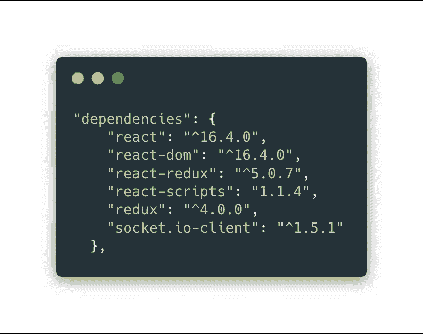

**package.json 依赖块**

# Redux 应用程序结构

还记得以前所有的代码都在一个文件夹下的四个文件中吗？现在都铺开了，原来 app 的铁板一块已经没有了。还有成长的空间。

下面是它的分解方式:


源文件夹(顶层)

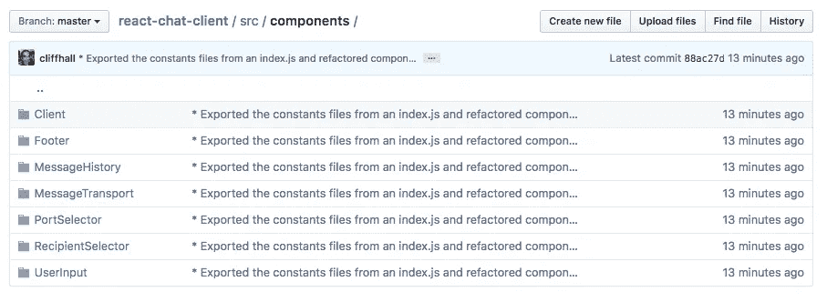

组件文件夹


常量文件夹


存储文件夹(顶层)


存储文件夹(功能区)


实用程序文件夹

当我在下面描述应用程序的主要变化时，所有这些文件夹将变得更有意义。你可以细读最新版本中完全重构的代码，但是如果你只是想继续读下去，不要担心，我会在底部再次提供两个版本的链接。

# 重新审视数据流

## 动作和动作创建者

在 Redux 中，应用程序的所有状态都保存在一个[存储器](https://redux.js.org/glossary#store)中，修改它的唯一方法是通过一个[动作](https://redux.js.org/glossary#action)。这意味着客户机组件中的所有 setState()调用现在都被禁止了。相反，我们调度动作，这些动作只是具有“类型”属性的普通对象，根据我们要完成的任务，还可以选择其他任意属性。dispatch 方法实际上存在于 store 中，但是正如我们稍后将看到的那样，react-redux 可以将该方法注入到我们的组件中，从而使工作变得更加容易。我们从来不需要直接与商店互动。

通过动作，我们将组件内部发生的状态变化委托给系统的另一部分。由于我们可能需要从应用程序中的多个地方用不同的属性值调度相同类型的动作对象，我们不想重复声明它(并可能在持续维护期间使两个地方不同步)，所以有了额外的概念[动作创建者](https://redux.js.org/glossary#action-creator)。这里有一个例子:

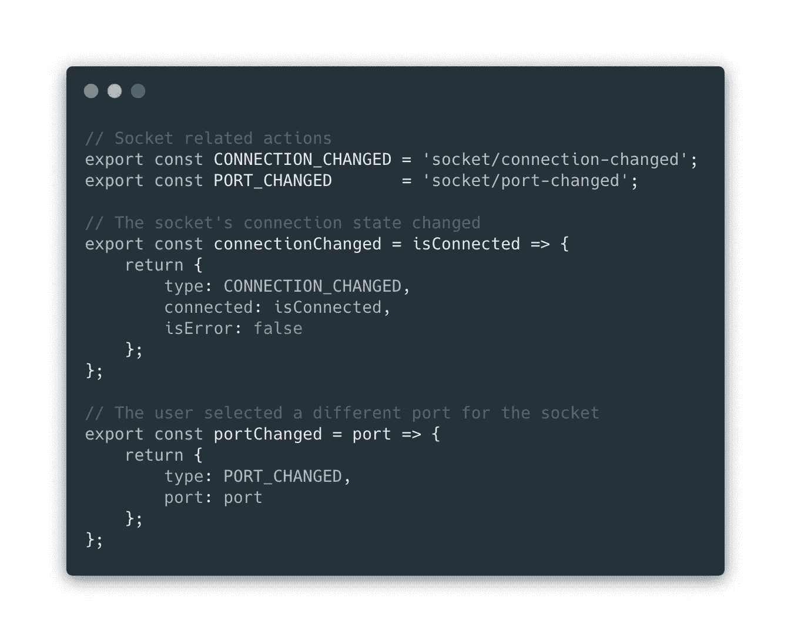

**套接字相关的动作类型和动作创建者**

## 还原剂

大多数分派的动作将由一个[缩减器](https://redux.js.org/glossary#reducer)处理，它只是一个为 state 返回新值的[纯函数](https://en.wikipedia.org/wiki/Pure_function)。reducer 被传递状态和动作，并返回一个具有所有相同*属性*的新状态对象，尽管它可能包含所有、部分或没有这些属性的替换*值*，这取决于被发送的动作的类型。它不会改变状态，但是如果没有传入状态，它可以定义初始状态。可以说*把*状态和一个动作的组合简化为一些新的对象来表示状态。下面是一个响应上述代码中创建的操作的示例:

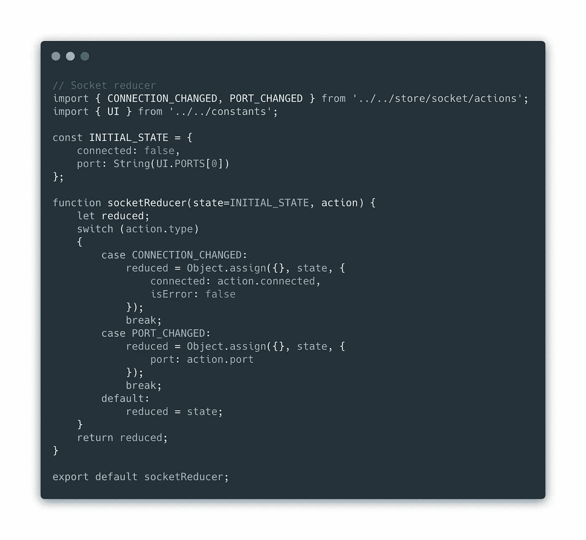

**套筒减速器**

请注意，reducer 打开了动作的类型字段，并生成了一个新的对象来替换状态。如果动作类型与它的任何情况都不匹配，它只返回传入的状态对象。

## 创建商店

我们已经看到了动作的创建者和缩减者，但是保存状态的存储呢？

在以前版本的应用程序中，状态是在客户端组件的构造函数中作为一个对象及其所有属性创建的。我们是否只是用同一个整体状态对象来创建商店？我们可以，但是更模块化的方式是让每个缩减器贡献它所工作的状态部分。

正如您在上面的 reducer 中所注意到的，INITIAL_STATE 对象有两个带有初始值的属性。它管理与套接字相关的状态部分。还有用于客户端状态和消息传递的缩减器。通过将状态分解成独立的功能区域，我们使应用程序更容易维护和扩展。

创建悬挂物总体状态的第一步是组合所有的减速器:

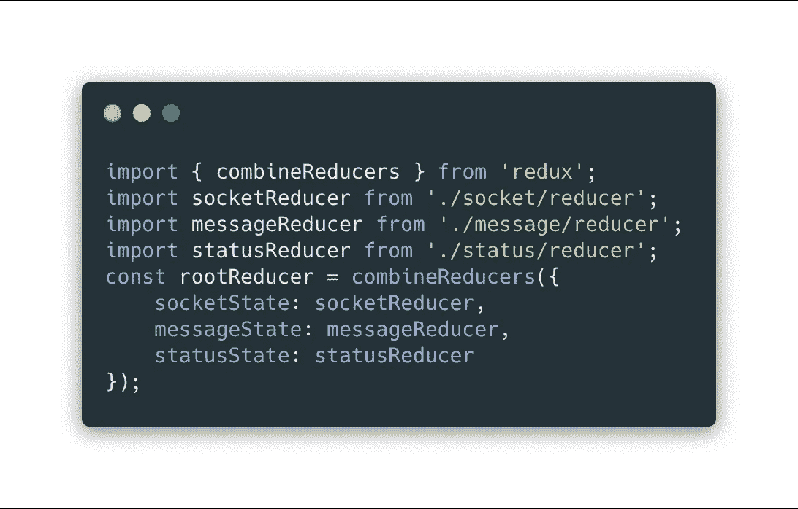

**组合减速器**

rootReducer 是将所有减速器链接在一起的单个减速器。因此，可以将一个动作传递给 rootReducer，如果它的类型与任何组合 Reducer 的 switch 语句中的大小写匹配，我们可能会看到一些转换，否则不会发生状态变化。

还要注意，我们定义并传递给 combineReducers 函数的对象具有如下属性:

```
messageState: messageReducer
```

回想一下，reducer 函数的结果是应用程序状态的一部分，所以我们将适当地命名该对象。

组装好 rootReducer 后，我们现在可以创建商店了，如下所示:

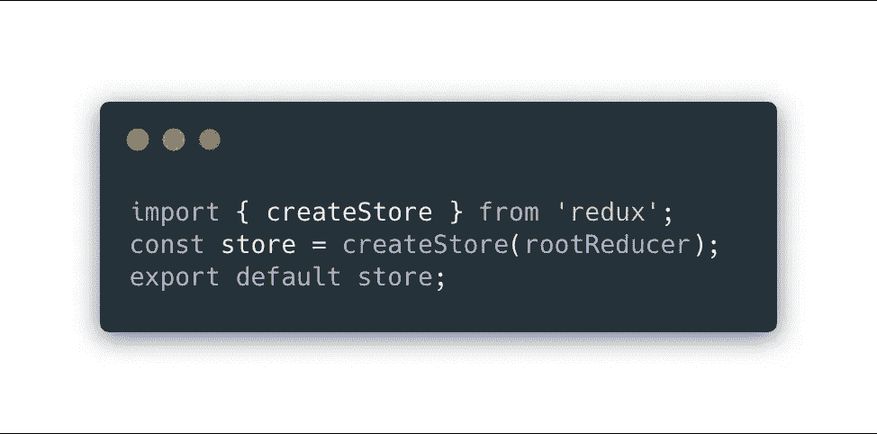

创建商店

Redux 库的 createStore 函数将调用没有状态的 rootReducer(因为它还不存在),导致所有的 Reducer 提供它们自己的 INITIAL_STATE 对象，这些对象将被组合，创建最终的状态对象，保存在存储中。

现在，我们有了一个存储，它保存了以前在客户机组件的构造函数中创建并作为道具传递给其子组件的所有应用程序状态。我们有动作创建器，它制造我们的动作对象，当被分派时，将由 reducers 处理，这反过来为应用程序产生一个新的状态。太棒了。只剩下两个问题:

1.  当状态改变时，如何通知组件？
2.  组件如何分派动作来触发状态变化？

# 注射

这就是 react-redux 库真正闪光的地方。让我们看看 MessageInput 组件，它管理用户输入聊天句柄的文本字段:

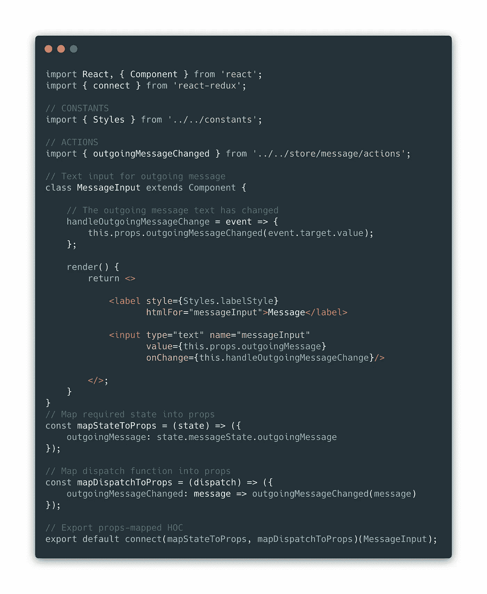

**MessageInput.js**

首先，注意 MessageInput 类本身没有 export 关键字。

接下来，请注意文件的底部，在这里您会注意到两个函数‘mapStateToProps’和‘mapDispatchToProps’。然后将这些函数传递到导入的 react-redux 函数“connect”中，该函数返回一个以 MessageInput 类作为参数的函数。*该*函数返回一个包装 MessageInput 的[高阶组件](https://reactjs.org/docs/higher-order-components.html)。最终，特设是默认的出口。

这个特设提供的神奇之处在于，当状态改变时，mapStateToProps 函数将被调用，返回一个包含该组件所关心的状态部分的对象。这些属性和值现在将显示在组件的属性中。

之前，当我们组合缩减器时，还记得我们是如何命名状态片段的吗？现在你可以看到这在哪里发挥作用了。当将状态映射到组件内部的 props 时，我们可以看到应用程序的 state 对象将每个 reducer 的输出保存在一个单独的属性中。

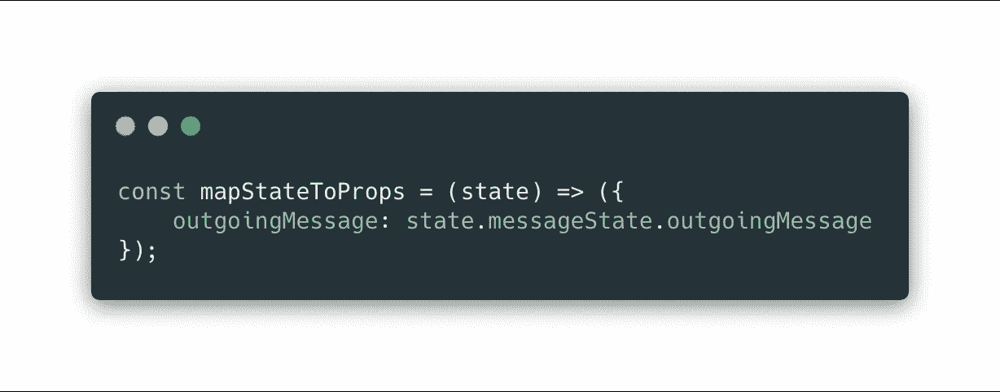

最后，调用 mapDispatchToProps 函数，这将创建一个“调度程序函数”，它显示为一个名为“outgoingMessageChanged”的组件属性。

对于组件来说，这是一种*更好的方式来接收部分应用程序状态，而不是将它传递给组件层次结构，在层次结构中，介入的组件可能不关心值，但由于它们的子组件关心值，所以仍然必须传输它们。*

还记得之前，客户端组件的渲染功能在重构为 JSX 后是什么样子的吗？它肯定比基于嵌套 React.createElement()调用的版本更容易阅读，但是它仍然必须将大量的状态传递给这些子元素。我承诺过我们会简化它，使用 react-redux，它现在看起来是这样的:

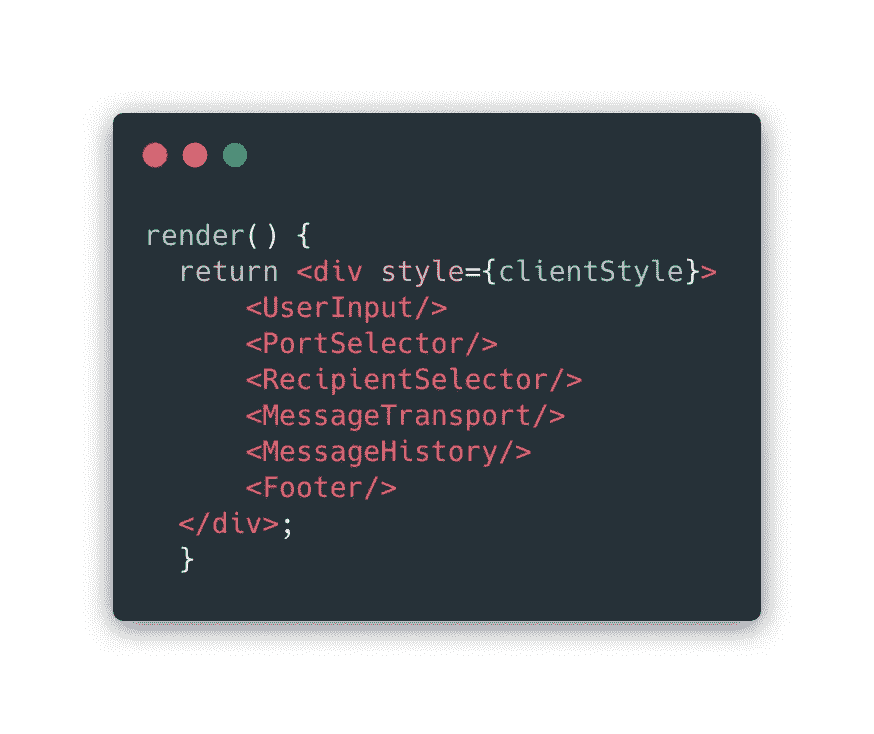

**大幅改进 Client.js 渲染方法**

所以我们已经回答了第一个问题:*当状态改变时，如何通知组件？*第二个呢:*一个组件如何调度一个动作？*

我们知道，react-redux 已经在组件中添加了一个 dispatcher 函数作为道具。该调度程序调用适当的操作创建者，并调度返回的操作。在上面的 MessageInput 组件的例子中，它调用注入的 dispatcher 函数“outgoingMessageChanged ”,以便在文本输入改变时调度 an 操作:

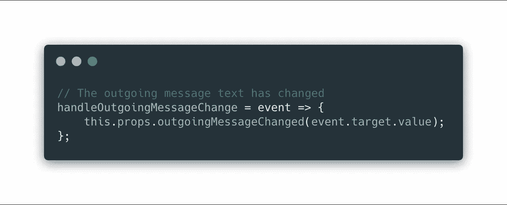

这让我们几乎兜了一圈。组件现在将应用程序状态的必要部分注入到它们的 props 中，并且能够轻松地创建和调度触发 reducers 转换状态的动作。应用程序状态已经被分解成功能区域以及相应的动作创建者和减少者。

最后一个架构问题是套接字及其管理。我们在哪里实例化它，如何与它通信？

# 中间件

它不是一个视图组件，但是几个视图组件(ConnectButton 和 SendButton)需要启动与它的通信。像 CONNECT_SOCKET 或 SEND_MESSAGE 这样的操作是触发应用程序中其他地方事件的好方法。但是响应动作的 reducers 应该是只管理状态的纯函数。那么，我们如何发送一个动作并让它触发对套接字的操作呢？

答案是中间件。还记得我们之前创建商店的时候吗？嗯，动作是商店 API 的一部分，所以需要响应动作的东西可能需要被包含在内是有意义的。

我们要做的是创建一个“[中间件函数](https://redux.js.org/advanced/middleware)，它将实例化套接字及其各种侦听器，然后返回一个函数，该函数将在每个被分派的动作上被调用。这个函数被创建 socket 实例的闭包所包装，并且存在于应用程序的生命周期中。看起来是这样的:

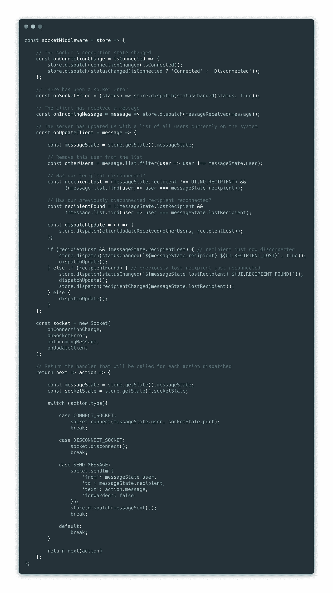

**套接字中间件**

该中间件功能能够实例化套接字并响应与套接字相关的动作(连接、断开、发送消息)，以及由套接字本身产生的调度动作(连接状态改变、套接字错误、接收到的消息、用连接的用户列表更新客户端)。

我们在创建商店时将中间件应用于商店，如下所示:

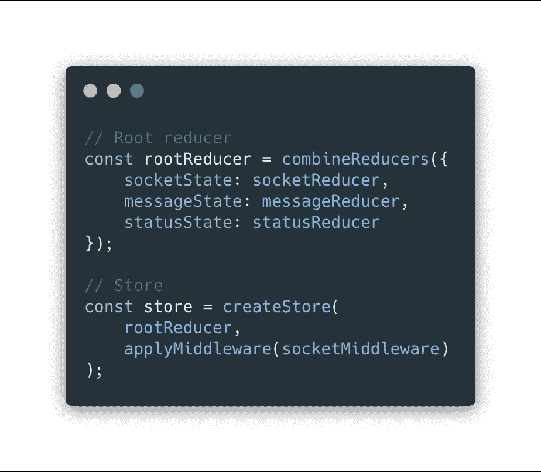

**开店**

# 结论

如果您刚刚开始使用 React，您当然不需要吸收所有的工具链疲劳，只是为了让您的脚变湿。只要做出反应，你就能让事情发生，并很快获得快乐。

然而，对于任何稍微有点野心的事情来说，升级应用程序的状态管理游戏可能会让你受益匪浅。有很多库可以帮助你，Flux，Redux，MobX，RxJS 等等。所以你可能想研究一下每种方法的优缺点。你一定要去。当你重构应用程序处理状态的方式时，你会发现复杂性明显增加，但这对于应用程序以可维护的方式增长是必要的

我希望你喜欢这个小练习，并且现在对使用 Redux 重构一个只支持 React 的应用程序有了更好的理解。这里再次提供两个版本的项目供参考:

*   React 和 ReactDOM only ( [版本 1.0.0](https://github.com/cliffhall/react-chat-client/tree/1.0.0) )
*   React，ReactDOM，Reflux，react-reflux ( [最新版本](https://github.com/cliffhall/react-chat-client))

我很乐意在下面的评论中听到你对此的想法和问题。