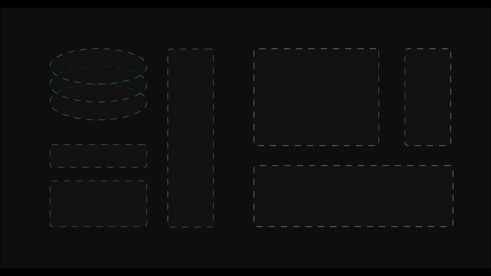

# 构建社交网络:第一部分

> 原文：<https://itnext.io/building-a-social-network-part-i-25856fc693e1?source=collection_archive---------2----------------------->

## 在 PostgreSQL 中定义概念、模型和安全性

## 介绍

社交网络已经成为当今世界许多人日常生活的一部分。在本文中，我们将探讨设计一个非常基本的社交网络的第一步:创建数据库模式。

社交网络是[自底向上设计](https://en.wikipedia.org/wiki/Top-down_and_bottom-up_design)的完美用例，因为我们可以以健壮和可扩展的方式定义安全性和所需的行为。这使得未来的升级在很大程度上不会中断，同时相对容易实现和维护。

这个社交网络将提供标准的电子邮件/密码认证、上传图片、设置个人资料照片、发布内容(可选图片)以及关注其他用户。

安全特性包括强大的密码哈希、自动生成的 [UUID](https://en.wikipedia.org/wiki/Universally_unique_identifier) 作为主键、具有创建新条目的显式函数的受限访问 API 角色/用户，以及根据需要通过用户定义的类型进行严格键入。

> 本系列文章的项目源代码可以在 GitHub 上的[处获得。](https://github.com/kenreilly/social-network-demo)
> 
> 为了测试示例数据库，需要一个 [PostgreSQL](https://www.postgresql.org/) 环境。

## 设置

设置脚本`**db/_create.sh**`运行一系列 SQL 文件:

执行的第一个 SQL 文件是`**db/init.sql:**`

这个脚本创建了用户`social_demo_admin`和`social_demo_api`，然后创建了管理员作为所有者的`social_demo`数据库。

接下来，`social_demo_api_role`被创建并被授予`CONNECT`和`USAGE`权限，以允许读取存储在该数据库中的所有信息，然后该角色被授予`social_demo_api,`，API 将使用该角色来获得有限的、明确定义的访问权限。这大大提高了安全性，并降低了开发人员出错的可能性。

## 核心功能

核心功能和所需扩展在`**db/core.sql:**`中定义

这个和后续的 SQL 文件在`social_demo`数据库的范围内执行。加载扩展`plpgsql`和`pgcrypto`以根据需要促进 [PL/pgSQL](https://en.wikipedia.org/wiki/PL/pgSQL) 和[密码](https://www.postgresql.org/docs/current/pgcrypto.html)功能。

`hash`函数使用加密模块通过 blowfish 算法和八次迭代计数生成一个散列。这导致哈希的破解时间比 MD5 长 100k 倍，并且当结合良好的设计和适当的安全措施时，通常是安全的。

`flush`功能是隐私功能的一部分，执行时将删除任何超过 24 小时的内容(个人资料照片除外)。这将在以后被 API 定期调用，以删除旧内容并为更多内容腾出空间，这更加有机，并且类似于真实世界的交互(*不是每个事件都需要永久记录*)。

## 形象

接下来让我们看看`**db/images.sql**:`中的图像模式

社交网络中的图像可以是 [JPG](https://en.wikipedia.org/wiki/JPEG) 、 [PNG](https://en.wikipedia.org/wiki/Portable_Network_Graphics) 或 [GIF](https://en.wikipedia.org/wiki/GIF) 类型。类型`new_image`用于定义要添加到`images`表中的新图像，API 只能通过用所需的数据结构调用`add_image`来完成。同样，`delete_image`是从图像表中删除图像记录的唯一方法。API 将使用为映像生成的 UUID 和文件类型作为要存储在磁盘、云或其他存储中的文件的命名约定。

## 用户

用户模式位于`db/users.sql:`

类型`authenticated_user`和`new_user`被定义为构造认证和创建用户所需的数据。`users`表存储基本的标准用户数据，如登录信息、姓名和创建时间戳。同样，创建和删除用户的函数是为显式 API 访问定义的，以防止对用户表产生不必要的副作用。

## 邮件

帖子的模式在`**db/posts.sql**:`中

帖子非常简单，有效地由带有可选图像的文本内容组成。和以前一样，数据类型和创建/删除函数是为了标准化而定义的。`posts`表为[引用完整性](https://en.wikipedia.org/wiki/Referential_integrity)引用了`users`和`images`表，这是 PostgreSQL 通常擅长的。`user_id`必须匹配`users`表中的记录，如果提供了`image_id`，它必须匹配`images`表中的记录。

## 追随者

追随者模式位于`**db/followers.sql**:`

没有某种社交互动结构，任何社交网络都是不完整的，追随者模型非常适合这种应用程序以及其中内容的时间特性。`followers`表和支持功能的设计保持简单，并遵循整个应用程序中使用的通用安全主题。

## 结论

这些 SQL 文件定义了一个简单的数据库模式，该模式具有适用于下一阶段的内置安全性和数据完整性特性:构建 API 和 UI 实现使用的通用模型，用于执行身份验证、与数据库交互以及为移动、web 和其他客户端应用程序提供功能。

请继续关注本系列的第 2 部分，在这一部分中，我们将了解在这个数据库的基础上构建一个可靠的 API 和 UI 需要做哪些准备工作，以一种安全可靠的方式轻松地部署到目标设备和服务。

感谢阅读！

***~***[***8 _ bit _ hacker***](https://twitter.com/8_bit_hacker)