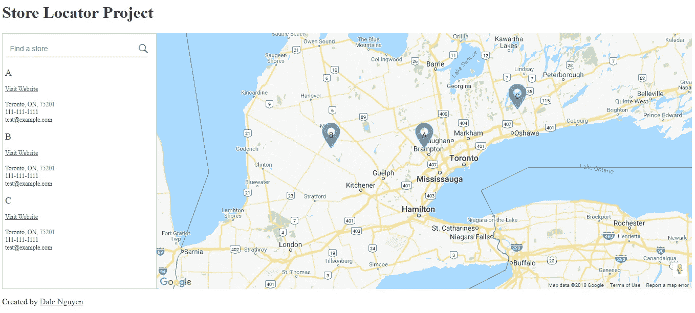

# 用 Angular 2+和谷歌地图构建一个商店定位器应用程序——第 1 部分

> 原文：<https://itnext.io/building-a-store-locator-app-with-angular-2-and-google-maps-part-1-39cc4691a4fe?source=collection_archive---------0----------------------->



我最近参与了一个项目，为一个网站构建了一个商店定位器插件。我们已经有了一个样本商店定位器项目，但它是几年前用 JavaScript 编写的——你知道我的意思，大量代码可能与项目本身有关，也可能无关，而且非常难以理解。

于是，我决定利用 Angular 2+来改进这个项目。如果你想一瞥最终项目的样子，你可以从我的 github 访问资源库:[https://github.com/dalenguyen/angular-store-locator](https://github.com/dalenguyen/angular-store-locator)。

演示:【http://angular-store-locator.surge.sh/ 

现在我将向你展示如何从头开始构建。

**第一步:创建一个分支新的 Angular 项目**

首先，你需要在你的机器上安装[节点](https://nodejs.org/en/download/)，然后全局安装[角度 CLI](https://github.com/angular/angular-cli)

```
npm install -g @angular/cli
```

之后，您可以创建一个新的角度项目

```
ng new angular-store-locator
```

现在，您可以通过运行并检查您的浏览器来启动项目: [http://localhost:4200](http://localhost:4200/)

```
cd angular-store-locator
ng serve --open
```

**第二步:实现** [**角度谷歌地图(AGM)**](https://angular-maps.com/guides/getting-started/)

```
npm install @agm/core --save
```

将 **AgmCoreModule** 添加到您的***app . module . ts***中

```
**import { AgmCoreModule } from '@agm/core';**...
imports: [
 ...
 **AgmCoreModule.forRoot({
   apiKey: 'YOUR_KEY',
   libraries: ['places']
 })**
]
```

设置 CSS 文件。 ***这种造型是必须的。没有它你看不到地图。***

```
// src/app/app.component.cssagm-map {
    height: 300px;
}
```

编辑您的 HTML 文件

```
// src/app/app.component.html<h1>{{ title }}</h1>

<agm-map [latitude]="lat" [longitude]="lng">
  <agm-marker [latitude]="lat" [longitude]="lng"></agm-marker>
</agm-map>
```

编辑您的组件

```
// src/app/app.component.tsimport { Component } from '@angular/core';

@Component({
  selector: 'app-root',
  templateUrl: './app.component.html',
  styleUrls: ['./app.component.css']
})
export class AppComponent {
  title: string = 'My first AGM project';
  lat: number = 43.678418;
  lng: number = -79.809007;
}
```

完成这一步后，您就可以在浏览器上看到地图了。我会在接下来的帖子里更新接下来的步骤——现在太累了；)