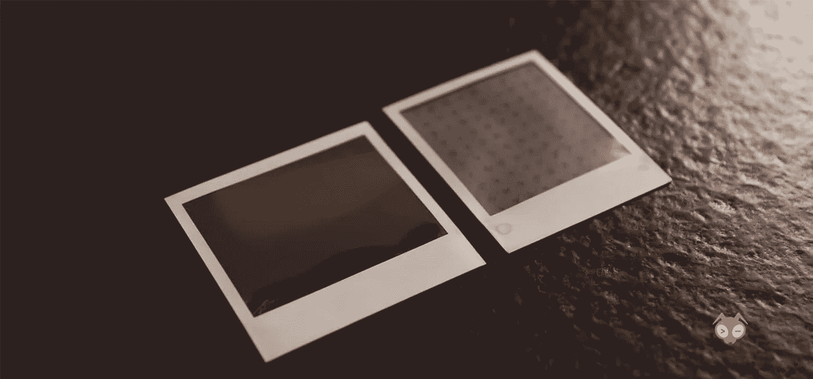
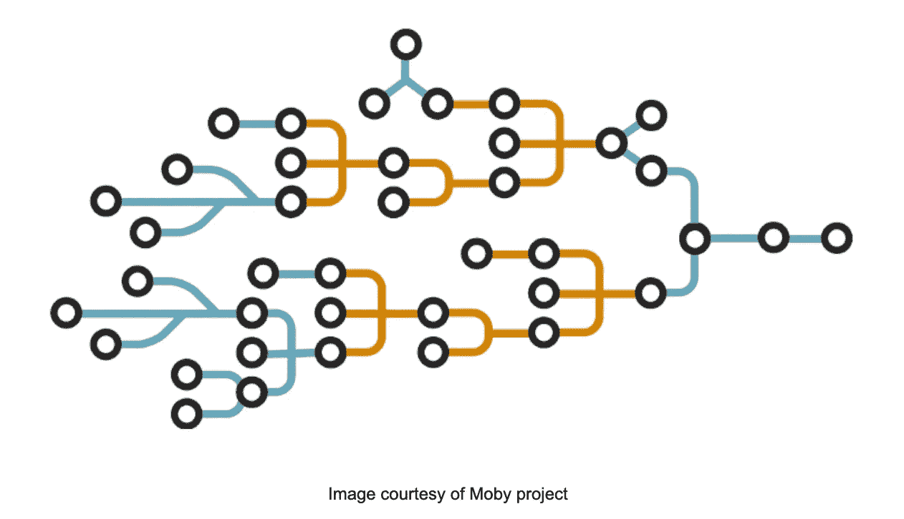

# 用 Img 构建容器图像

> 原文：<https://itnext.io/building-container-images-with-img-30e7251f9908?source=collection_archive---------6----------------------->

[Img](https://github.com/genuinetools/img) 是由这个领域最著名的软件工程师之一 [Jessie Frazelle](https://twitter.com/jessfraz?lang=en) 发起的一个开源项目，以响应对无后台和无根容器映像构建的需求——尤其是在 Kubernetes 中。她的博客文章[“在 Kubernetes 上安全地构建容器图像”](https://blog.jessfraz.com/post/building-container-images-securely-on-kubernetes/)描述了创建 Img 项目的基本原理。

本质上，Img 是另一种开源构建相关技术的包装器，称为 [BuildKit](https://github.com/moby/buildkit) ，它作为一个库嵌入在 Img 中。BuildKit 是一个极其强大的多用途构建引擎，是 Docker 制定的莫比项目的一部分。在研究 BuildKit 提供的一些构建特性之前，让我们看看 Img 是如何公开这些特性的。

# Img

Img 直接面向那些熟悉 Dockerfile 作为构建步骤来源，以及将`docker build`命令作为构建 [OCI 兼容容器映像](https://github.com/opencontainers/image-spec/blob/master/spec.md#image-format-specification)的手段的开发人员。

# Img CLI

从 UX 的角度来看，Img 提供了一组命令，这些命令模拟了与容器映像构建、分发和映像操作相关的等效 Docker CLI 命令。除了用于调用实际映像构建的`img build`, Img 还有用于与容器注册中心交互的命令；`img login`、`img pull`、`img push`等等。当谈到在本地缓存中操作图像时，就像 Docker 一样，可以列出、删除、标记和保存图像。甚至还有一些方便的内务管理命令，用于监控磁盘使用情况，并保持在构建缓存的顶部。

对于图像构建，`img build`命令复制了`docker build`提供的最重要的选项子集，为熟悉 Docker 的图像作者带来了无缝体验。用 img 建立一个形象，可以简单到用' Img '代替' docker '。

在这方面，Img 类似于 Podman ( [，我们在上一篇文章](https://blog.giantswarm.io/building-container-images-with-podman-and-buildah/)中讨论过它)，但是它局限于构建映像的任务，而 Podman 可以用于构建映像、运行容器等等。

# 构建状态

使用 Docker 守护进程构建其图像的容器图像作者不再需要负责确定在本地何处存储图像数据；它由 Docker 守护进程处理。如果没有守护进程来管理存储，就像 Img 的情况一样，责任就落在了图像作者身上。Img 将图像数据存储在名为`img`的目录中，该目录位于为用户设置的`XDG_DATA_HOME`变量的值下，如果未设置`XDG_DATA_HOME`则为`$HOME/.local/share`，如果未设置`XDG_DATA_HOME`或`HOME`变量则为`/tmp`。位置是可配置的，但是要记住的一点是，如果 Img 是以容器化的方式运行的，那么“state”目录需要作为一个卷提供给容器。通过使用卷，构建的映像和构建缓存可用于 Img 的后续调用。

# 无根建筑

作为非特权用户构建映像是 Img 的主要目标，因此需要为各种上游项目制作大量与安全相关的补丁。其中包括在容器中运行无根构建的 Docker 和在 pod 中运行无根构建的 Kubernetes。

Img 利用用户名称空间来实现无根构建特性，并且在使用 [overlayfs](https://git.kernel.org/pub/scm/linux/kernel/git/torvalds/linux.git/tree/Documentation/filesystems/overlayfs.txt) (除了在 Ubuntu 发行版中)时，受到当前缺乏对非特权用户名称空间中挂载的支持的共同限制。Overlayfs 通常是组装容器文件系统的首选 union mount 方法，如果没有它对非特权用户名称空间的支持，Img 就不得不依靠复制文件，这是非常低效和缓慢的。

尽管有这样的限制，Img 还是实现了提供无根构建的目标，同时利用了 BuildKit 提供的一些高级构建特性。

# 构建工具包

BuildKit 可能被一些人描述为容器映像的下一代构建引擎，并且可以被认为是构建过程中的“后端”组件。我们将在以后的文章中发现，它被合并到 Docker 引擎的最新版本中，但它是一个独立的项目，可以独立于 Docker 使用。Img 证明了这一事实，但它不是利用 BuildKit 的唯一技术。事实上，BuildKit 是技术不可知的，可以用于执行任何领域的构建步骤，这些步骤可以使用“前端”来表示，前端将这些步骤转换为 BuildKit 的内部表示。那么，BuildKit 有什么特别之处呢？有许多创新的特性，但这里有几个是 Img 利用的。

# 并行构建执行

莫比项目在 17.05 版本的 Docker 引擎中引入了[多阶段构建](https://docs.docker.com/develop/develop-images/multistage-build/)，允许将映像构建分离到单独的逻辑阶段中。多阶段构建对图像作者来说是一个巨大的好处，但是 Docker 守护进程中遗留构建引擎中构建步骤的执行顺序性意味着不相关的构建阶段不能从它们独立构建步骤的并行执行中获益。BuildKit 来救援了！

BuildKit 将构建步骤的内部表示组装成一个[有向无环图](https://en.wikipedia.org/wiki/Directed_acyclic_graph) (DAG)，这使得它能够确定哪些构建步骤可以并行执行。对于包含许多构建阶段的 docker 文件，这可以显著减少构建完成的时间长度。对于 Img 采用者来说，这是一个重要的优势，不需要图像作者的任何知识或配置。

# 跨平台/操作系统版本

Img 通过其用户界面公开了另一个 BuildKit 特性；跨平台和跨操作系统版本。虽然在使用该特性时有一些额外的考虑事项要考虑，但是可以在完全不同的平台上为不同的架构和操作系统组合构建映像。例如，linux/amd64 平台可用于构建适合 linux/arm64 的映像。Img 使用`--platform`标志来公开这个特性。

# Img 和 Kubernetes

在 Kubernetes 上安全地构建映像的目标为 Img 提供了最初的动力，并且一个[容器映像](https://r.j3ss.co/repo/img/tags)可用于在 Kubernetes pod 中运行构建。图像的 docker 文件也可用于审查，并可用作创建定制图像的基础，以考虑备选偏好或约束。

图像中提供的关键成分是:

*   创建运行构建的非特权用户，
*   为非特权用户定义用户命名空间映射的从属 uid/gid 文件，以及
*   用于为用户名称空间执行映射的`newuidmap`和`newgidmap`二进制文件，这些名称空间是在每次为构建步骤运行容器时创建的。

使用 Img 在 Kubernetes 上运行无根构建时，有许多不同的层在起作用。构建步骤在嵌套在 Img 容器中的 BuildKit 工作容器中执行。Img 容器很可能在 Docker 容器运行时下运行(或者可能只是 [containerd](https://containerd.io/) )，全部由 Kubernetes [容器运行时接口](https://github.com/kubernetes/community/blob/master/contributors/devel/sig-node/container-runtime-interface.md) (CRI)管理。安全地消除各层特权执行的约束是一项重要的任务，因此仍然存在一些限制也就不足为奇了。

目前， [AppArmor](https://kubernetes.io/docs/tutorials/clusters/apparmor/) 和 [Seccomp](https://kubernetes.io/docs/concepts/policy/pod-security-policy/#seccomp) 概要文件不能应用于 Img pods 来执行无根构建，尽管 worker 容器仍然可以使用这些安全措施来保护。pod 中的 Img 容器也需要“无屏蔽”地访问其`/proc`文件系统，对于从 1.12 开始的 Kubernetes 版本，这可以通过使用 pod 安全特性`securityContext.procMount`来实现。这需要设置为`Unmasked`。

在 Kubernetes 上使用 Img 构建容器映像的最后一个实际需求是，Img pods 可以访问不断发展的构建状态。这样，单独调用 Img 就可以利用本地存储中构建的图像和缓存层。例如，构建的映像可能需要作为 CI/CD 工作流的一部分推送到注册表，并且构建迭代肯定会从重用存储在缓存中的先前构建的层中受益。使用 Kubernetes(持久)卷抽象，可以使构建状态对 Img pods 可用。

# 结论

很难判断 Img 有多普遍，或者它会有多成功，因为它不像许多开源项目那样得到既得利益公司的支持。然而，它确实有一个活跃的社区，而且该项目在打破运行无根容器的障碍方面发挥了重要作用。为此，它赢得了很多荣誉。

Img 使用的构建引擎 BuildKit 有很多有趣的特性，这些特性是 Img 目前没有公开的。如果这些额外的特性及时进入 Img 的用户界面，它将成为容器映像构建的更好前景——特别是对于 Kubernetes 环境中的无根构建。

您是否希望将 Kubernetes 容器投入生产？[联系 Giant Swarm](https://www.giantswarm.io/contact) 开始您的云原生之旅

由[Puja Abbas si](https://twitter.com/puja108)——开发者倡议@ [巨型虫群](https://giantswarm.io/)撰写

 [## Puja Abbassi @ #KubeCon #KubeKhan

### Puja Abbassi 的最新推文@ #KubeCon #KubeKhan (@puja108)。开发者关系和产品@GiantSwarm…

twitter.com](https://twitter.com/puja108)