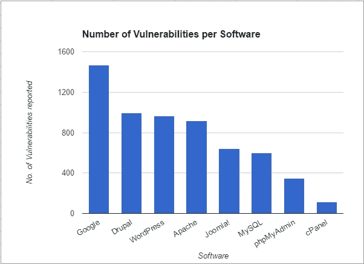
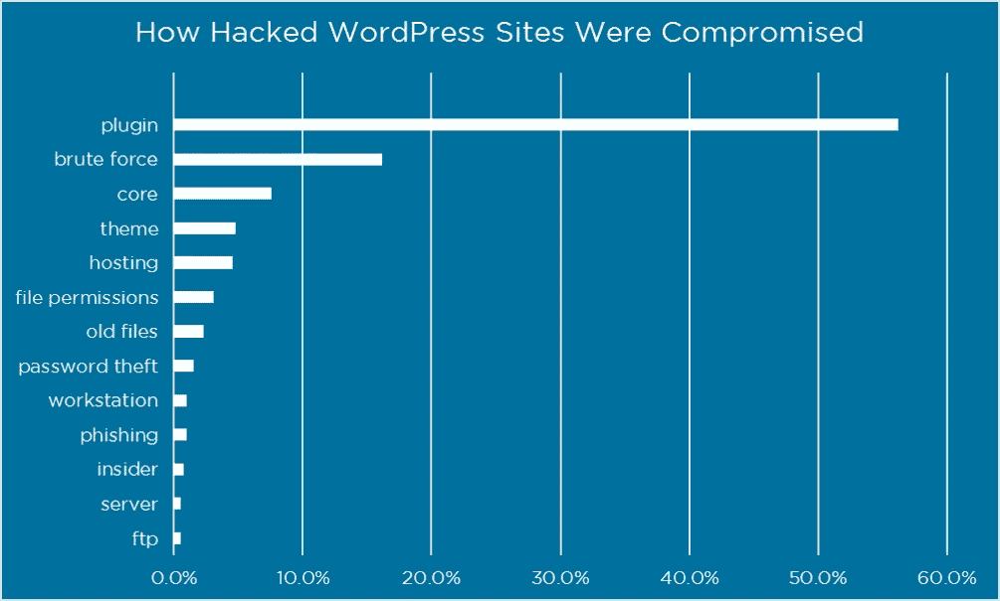
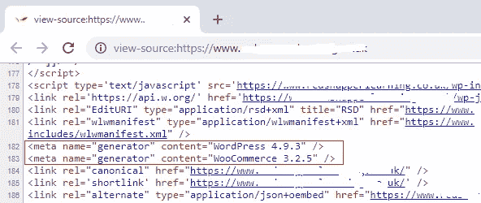
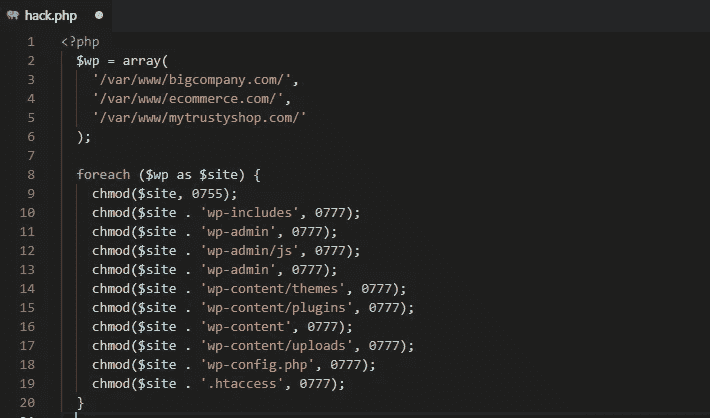
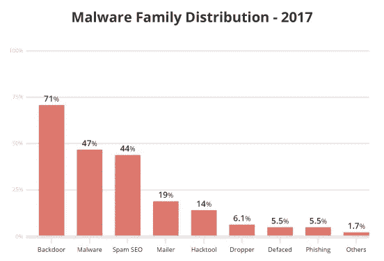
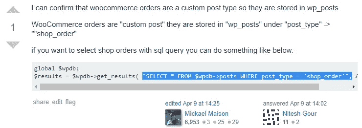
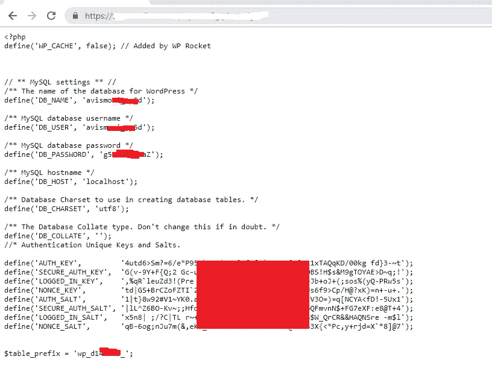

# 建造沙堡和保护 WordPress

> 原文：<https://itnext.io/building-sandcastles-and-securing-wordpress-fe59d483a22?source=collection_archive---------3----------------------->

WordPress 网站很容易建立起来，但当坏事发生时，它们也很容易被摧毁。

原图鸣谢:【https://unsplash.com/@dallasreedy 

我最近写了一篇关于我们的初创公司[失败了](https://medium.com/swlh/inside-the-failure-of-a-startup-b4a123c962bb)的文章，这引发了很多很多关于 WordPress 和我们解决方案的问题。我们的产品解决了平台的速度、安全性和扩展性问题，同时让用户继续使用它进行内容管理。根据最近的统计，我已经收到了超过 80 封关于这个主题的邮件和信息——包括来自主要托管公司的问题。

WordPress 开发了世界上最流行的创建网站的平台，所以我想更详细地解释一下关键的批评。我是 WordPress 的拥护者已经很多年了(我在 2010 年参加了旧金山的 WordPress 夏令营！)并且建立了比我记忆中更多的 WP 网站。我说的任何话都不是要贬低他们的成就，而是要提升围绕管理这个平台的重大且日益增长的安全问题的重要性。

对于非技术用户来说，WordPress 是迄今为止最简单的网站建设工具，人们很喜欢它。我们的产品关注 WordPress 的原因之一是我们希望用户继续使用它——与 WP 爱好者交谈，这显然是他们管理网络内容的首选方式。我们在这里看到了一个机会，允许人们继续使用他们喜欢的 CMS，而我们的产品分别处理安全和交付问题。

这篇文章旨在提供一些关于我们在 2018 年所处位置的观点，因为形势正在发生变化。我对 WordPress 的警告与 UI、管理、后端、主题或插件生态系统，或者成千上万开发人员的工作无关。自从 WordPress 首次开发以来，技术发生了巨大的变化，复杂的威胁也随之发展。

如果你是 WordPress 的商业用户，或者你有一个不仅仅是爱好博客的网站，你需要了解风险，因为这里有龙。

## 漏洞不是问题。这完全取决于爆炸半径。

WordPress 是一个开源产品，拥有一个充满活力的聪明开发者社区。像任何流行的软件一样，它是黑客的目标，因为它无处不在。如果你把发现的漏洞的[数量制成图表，与其他流行的自由/开源软件产品进行比较:](https://www.wpwhitesecurity.com/crunching-the-numbers-vulnerabilities-is-wordpress-a-really-insecure-web-application/)

这些问题发生在许多层面——2016 年的一项分析显示，插件是大多数网站的首选方式。准确的细分很难衡量，但有了 30，000 个插件和数千个主题，这些显然代表了系统中最危险的部分。除此之外，还有许多潜在的方法进入目标网站。

来源:WordFence

一个明显的弱点是运行旧版本的 WordPress，自从 WP 4.9.3 [打破自动更新功能](https://www.wordfence.com/blog/2018/02/broken-auto-update/)以来，这种情况今年变得更有可能，所以依赖自动更新的人可能甚至没有意识到它已经停止工作了(我们的大多数测试版网站已经在 4.9.3 停止更新)。因为 WordPress 默认在页面元数据中发布它的版本，所以很容易找到运行过时的、易受攻击的版本的站点。

从根本上来说，漏洞本身并不是衡量软件是否“坏”的标准——事实上，发现并修复缺陷是件好事。这不是问题所在。WordPress 的困难在于，当坏事发生时，无法控制爆炸半径。这就像你的钱包被偷了，然后发现你也失去了你的房子和 401k。

## WordPress 的每一个风险都是潜在的生存风险。

DevOps 的人知道所有的软件在任何时候都是易受攻击的，即使是受人尊敬的应用程序中也存在持续不断的零日漏洞和令人尴尬的漏洞。控制生产系统不仅仅是消除这些问题，这几乎是不可能的，而是管理坏事发生时的后果——也就是管理爆炸半径。

这个问题与选择 WordPress 或喜欢另一个 CMS(我不喜欢)无关——而是每个安全漏洞都会变成一场存在危机，可能导致服务器失控、所有数据被盗或恶意软件接管。这就是问题的症结所在——你使用的任何插件、主题和 WordPress 版本都可能隐藏着错误或恶意代码，给你的网站和你的业务带来生存风险。爆炸半径无法控制。

在 WordPress 中，插件和主题没有沙箱保护——当它们的代码执行时，它们可以完全访问 WordPress 主进程看到的所有内容。这包括应用程序中的每个数据库记录和每个文件。即使在多站点模式下，主题和插件也可以在整个安装过程中运行。这就是为什么你总是差一个插件就彻底失败了。即使有最好的维护和恶意软件扫描，这个爆炸半径也会产生巨大的商业风险。

任何主题或插件都可以运行这样的代码。

如果你将这与你的手机操作系统的工作方式进行比较——它也是一个核心加插件的环境——应用程序在它们可以访问的数据和可以执行的操作以及它们如何与其他应用程序交互方面都是有限的。当不良应用偶尔进入应用商店时，它们不会阻塞你的手机或泄露你所有的银行信息。如果手机应用程序使用与 WordPress 相同的安全模式，智能手机将无法使用。通过限制权限，智能手机确保当应用程序发生不好的事情时，爆炸半径通常很小。

## 今天的风险有更大的后果。

在 WordPress 的早期，如果你的网站被黑了，这可能没什么关系。这当然很烦人，尴尬又耗时，但在大多数情况下不会引起任何恐慌。你可能会很快注意到，因为最喜欢的黑客活动是破坏——前一分钟你的网站还在展示餐馆菜单，下一分钟它就在赞助泰国的民兵组织。

今天，这种情况有了很大的改变。自动化的兴起意味着所有网站都成为攻击目标，而不仅仅是那些高调的网站，因为它不是一个坐在键盘后面穿着连帽衫的黑客。仅 2017 年的一次污损黑客攻击就导致 150 万个 WordPress 网站受到影响。现在，当黑客成功时，有效载荷通常是隐藏的，秘密地[比特币挖掘](https://www.webarxsecurity.com/website-hacking-statistics-2018-february/)，发送垃圾邮件，收集个人数据或[留下后门](https://www.zdnet.com/article/thousands-of-wordpress-sites-backdoored-with-malicious-code/)供未来访问。一个安全博客声称，90%的 WordPress 网站所有者[在被黑后没有注意到](https://artdriver.com/blog/how-to-recover-a-hacked-wordpress-site)，许多人甚至在发现后也从未确定根本原因。

来源:[https://sucuri.net/reports/2017-hacked-website-report](https://sucuri.net/reports/2017-hacked-website-report)

GDPR 带来了全新水平的法律风险。即使你的网站上有基本的表单收集，一个漏洞也能让你的企业陷入个人身份信息管理不当的困境(电子邮件地址是 [PII](https://www.dol.gov/general/ppii) )。违反 GDPR 的惩罚包括全球收入的 4%的巨大的，这意味着你现在必须更加认真地对待这些漏洞。你网站的漏洞可能会让你破产。如果你认为流行的 WordPress GDPR 插件可以帮助你，[它也被黑了](https://nakedsecurity.sophos.com/2018/11/13/wordpress-gdpr-compliance-plugin-hacked/)。

如果你运行的是 WooCommerce，WordPress 的一个流行的电子商务插件，你所有的交易都在同一个数据库中，所有的插件和主题都可以访问这个数据库。只要几行恶意的 PHP 代码就可以将所有的交易和订单历史记录删除，发送给坏人，并且您的整个业务可能会被清除，因为没有爆炸半径的限制。或者，更糟糕的是，黑客只是安装代码来悄悄抓取支付数据，而你几个月都不会注意到。

## 管理 WordPress 现在是专业人士的活动。

如果你使用著名的“5 分钟安装程序”安装 WordPress，你必须完成一系列额外的任务来提供最低的安全级别。我们遇到的许多网络代理不知道如何做到这一点，他们深信安装过程足够好，并转向插件来满足其他需求。我们多次在他们的网站上发现严重的漏洞。

除非你懂一些 Linux，否则你可能会在掌握基础知识时遇到麻烦。例如，让你的 wp-config.php 处于可读状态会暴露你所有的网站秘密和管理数据库登录，然而通过一些基本的谷歌欺骗，我们发现了*数千个*有这个问题的网站:

同样，你的站点的所有秘密都被写入/var/www/html 中的一个 PHP 文件中，离公开可读只有一步之遥，而且——嘣——又出现了爆炸半径问题。

虽然有你应该使用的安全插件，但讽刺的是，许多插件都有自己的漏洞，其他插件会导致 T2 已知的性能问题。在成千上万个网站上常见的插件列表中，几乎所有插件都在 2018 年出现了重大安全问题——[Jetpack](https://wpvulndb.com/vulnerabilities/9168)、 [WooCommerce](https://wpvulndb.com/vulnerabilities/9165) 、 [WPForms](https://wpvulndb.com/vulnerabilities/9164) 、 [Smush](https://wpvulndb.com/vulnerabilities/9162) 、 [Yoast SEO](https://wpvulndb.com/vulnerabilities/9150) ，这个列表还在继续。

WordPress 的最新核心版本 5.0 本身包含了一个严重的错误，允许 Google 索引网站的用户密码。这仅仅是现在应该已经相当成熟的流程中的六个主要安全缺陷中的一个。就在一周前，有消息称一个由 20，000 个 WordPress 网站组成的[僵尸网络正在使用 XML-RPC 服务积极攻击其他网站。除非你了解如何管理和保护 WordPress 的各种高级特性，比如 REST API 或 XML-RPC 服务(你知道它们存在吗？)，你对这类问题很开放。哦，REST API 也有一个“最糟糕的 WordPress 相关漏洞](https://www.zdnet.com/article/a-botnet-of-over-20000-wordpress-sites-is-attacking-other-wordpress-sites/)”。

我们在 Amazon EC2 上为我们的公司开发了一个 WordPress 的加固版本，因为我们偶尔会为客户部署 CMS。除了保护从文件权限到 MySQL 默认安装等一切的几十个实施细节之外，我们还使用 AWS 安全组来限制访问，使用 EC2 自动化快照，将数据库推送到 Aurora 以获得更好的性能和自动化备份，并将 CloudFront 放在前面以提供企业级 WAF 和 DDoS 保护，而不会暴露实例。这些都是标准主机中通常不存在的元素。

但是，即使使用 AWS 方法，配置漂移也是一个现实问题—如果您允许自动更新，以前“安全”的配置现在可能会隐藏恶意代码，如果您手动推送更新，这将非常耗时，并且您可能会在实施紧急补丁时速度很慢。我们也不敢将多个客户机放在同一个实例上，因为存在共享数据的问题——如果没有大量的定制工作，就没有办法隔离它们的数据——所以我们最终管理了一大批 ec2。

因此，管理网站的复杂性不断提高，而几年前这种复杂性根本不存在。我们编制了一个问题列表，确定了 80 多个主要项目，从实现安全头到 OAuth、阻止暴力登录、IP 阻止和正确配置 SSL 证书。在我们交谈过的公司中，大多数都没有实施*任何东西*——甚至没有 WordFence。

我们甚至不再提供这种服务，因为我们没有资源持续花费时间进行监控和维护。我们也不想成为一家托管公司。因此，我们建议客户，如果他们想使用 WordPress，他们应该:

*   **雇佣一家托管的 WordPress 提供商**，比如 Pagely、Kinsta 或 LiquidWeb。这些公司了解 WordPress 环境的细微差别，能够可靠地保护你的网站。不要使用通用主机，廉价的共享主机或没有声誉的主机(你知道，到处都是)。
*   **让你的内部 IT 管理 WordPress** :如果你有资源，使用内部 DevOps 来管理你的 WordPress 安装，因为他们有成功锁定它所需的各种平台和安全技能。不要把它交给你的代理机构，他们可能不具备保护你网站的技能(或者把它出租给廉价的主机)。
*   **认真考虑** SquareSpace 或者 Wix。也看看 [Strattic](https://www.strattic.com/) ，一个更新的服务也使用无服务器技术来解决问题。

这听起来可能很明显，但是我们反复发现客户并不熟悉在现代 It 环境中运行 WordPress 的风险。他们对来自廉价网络主机或普通插件的声明过于自信，通常不太了解技术元素，不足以察觉何时发生了不好的事情。

## 为什么企业首先要有网站？

事情是这样的——我见过的绝大多数 WordPress 网站都是宣传册网站。它们由十几个页面组成，很少修改，可能有一个电子邮件收集表单或其他一些有限的交互性。在你的商业网站中加入博客或允许评论的流行程度已经下降，所以许多网站现在只是静态内容。

如果这是 2018 年大多数企业拥有的东西，那么从客户想要的东西逆向工作，使用 WordPress 就像谚语中的大锤砸核桃。对于只需要静态页面集合的组织来说，维护和保护整个 LAMP 堆栈是多余的。虽然 WordPress 最初创建时没有这个选项，但今天我们有 S3、Netlify、谷歌云存储和十几个其他选项来托管零维护和几乎不可破解的静态页面。

WordPress(和许多其他 CMS 系统)起源于过去十年的技术，并被固定在 LAMP 堆栈中。虽然他们令人钦佩地击退了坏人，但没有人会用现代应用程序方法来设计他们的解决方案。困难在于 WordPress 现在是如此根深蒂固，而且有如此庞大的供应商生态系统，更好的技术方法需要一段时间才能突破。

缩放是 WordPress 的另一个大问题。托管提供商可以通过一些漂亮的工程来处理它，但是开箱即用时它不能很好地扩展，主要是因为它从未被设计为水平扩展。您可能认为这不适用于您的业务，但是我们发现我们可以有效地 DDoS 大约 1000 个并发 http 请求的许多客户端站点。考虑到网页通常在一个*页面上包含 150-200 个 http 元素，这并不是很大的流量。(我们用一个 Lambda web scraper 偶然发现了这一点，这个 web scraper 的规模有点太大，破坏了我们的一些测试站点。)*

## 更好的方法来了。

我们将失败的产品作为权宜之计——它允许客户继续使用 WordPress，但我们使用无服务器交付机制来克服安全性、速度和规模问题。当你可以找到一个更好的方法来建立网站时，这当然是次优的。我们基本上是把你的马和马车放在卡车后面，而你应该只买一辆车。

但是车来了。多年来，我一直从旁观者的角度观察静态站点生成器，虽然已经有了一些令人印象深刻的发展，但它们仍然坚定地针对技术受众。最近，我开始对 [Gatsby](https://www.gatsbyjs.org/) 感到兴奋，它看起来是填补这一领域空白的真正竞争者，对于 JS/React 开发者来说，这显然是下一步。 [Vue/Nuxt](https://nuxtjs.org/) 看起来紧随其后，两者都为同样的问题提供了类似的解决方案。

两者都使用 JavaScript/API/Mobile 方法——所谓的 jam stack——解决了 WordPress 世界中大多数严重的安全问题。它还解决了许多谷歌现在与 SEO 排名联系在一起的[速度问题](https://developers.google.com/speed/pagespeed/insights/)，因为这些网站非常快(见 [Airbnb 的工程网站](https://airbnb.io/)),而且它们非常适合高性能、高需求的电子商务网站(见 [Stitch Fix](https://www.stitchfix.com/) ),因为它们以云的速度自动扩展。最终，WordPress 会让位于更好的东西。

完整、动态的电子商务网站 Stitch Fix 建立在盖茨比之上。

## WordPress 不再是大多数公司的最佳选择。

虽然内容管理用户界面使非技术用户很容易管理网站，但安全问题也使坏人很容易接管网站。作为一家企业，你必须平衡使用 WordPress 的风险回报，但是考虑到法律和财务风险，对于大多数商业网站来说，我不再相信 WordPress 是正确的选择。

需要强硬的措辞来引起对众多且不断增长的安全问题的关注，这意味着超过 70%的 WordPress 安装容易受到黑客攻击。我一点也不讨厌 WordPress，但是我袖手旁观了我最初的评论——它是一个过时的软件，有着巨大的攻击面和不断变化的漏洞列表。从安全角度来看，这是一场噩梦。作为一家企业，除非你愿意雇佣外部专家或内部 it，并认识到管理 IT 的复杂性，否则你就是在自找麻烦。

我对这个平台最大的恐惧是当不好的事情发生时爆炸半径是不可控的。对于任何来自现代 IT 世界的人来说，我们花了相当多的时间思考如何最大限度地减小爆炸半径——因为坏事总是发生——这完全令人震惊。在接下来的几年里，JAMstack 的替代品将会填补这个空间，这似乎是很自然的，但是同时如果你继续使用 WordPress，你应该期待黑客们会给你 100%的注意力。请至少寻求专业知识来保护你的网站。