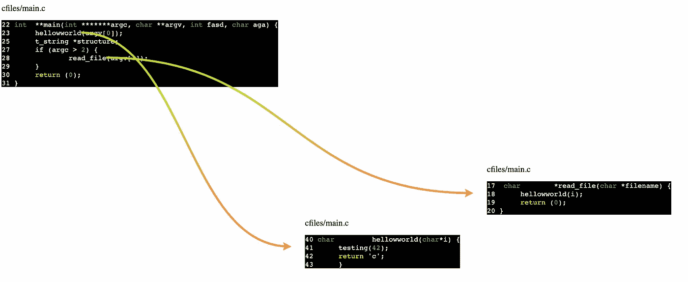
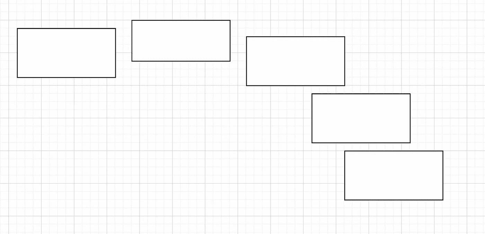
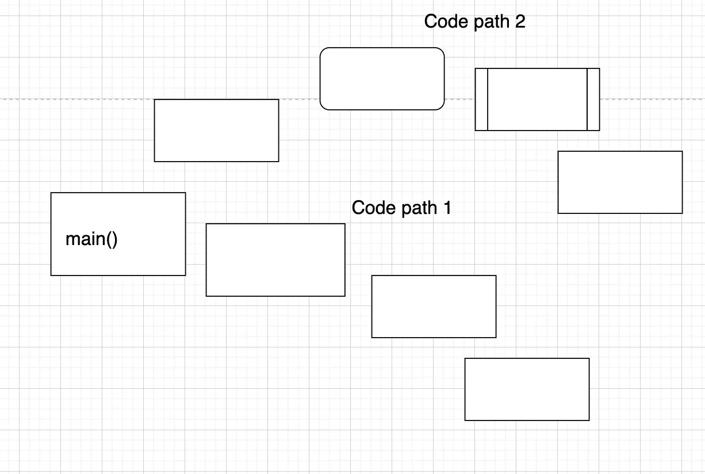

# Byfrost in Development(某种程度上)——让我们来谈谈路径

> 原文：<https://itnext.io/byfrost-in-development-2-lets-talk-about-pathing-ba3ce67686db?source=collection_archive---------1----------------------->

我讨厌路径问题。


为什么这件事不能已经完成了…

注意:这是我之前更新的后续文章: [Byfrost 开发 1 中的源代码可视化工具——索引图](/byfrost-in-development-1-an-indexing-graph-b696282c734d)。相信我，背景故事很重要。

有趣的是，我开始为编程语言建立最好的索引器，以提高工程生产率，并被誉为格蕾丝·赫柏的第二代，但却在过去几周内通过前端工程 101 课程让自己变得不那么垃圾。傲慢的确是一件可怕的事情🙈。

简短地说:我已经几个星期没做索引了，我有点生气了。😭

我的好朋友也开始注意到这一点；用一句“嘿，让我们把艾莉森提升为前端工程师吧，她做了这么多设计工作，她会很适合的”来吸引我。该死，这不是我努力工作的目的乔纳森！看啊！看我的索引！！当然，它不起作用！！我需要得到的 UI 工作完成，但看！！！LOOOOK！！！

亲爱的上帝，请不要把我移到前台…

有了这个不体面的介绍，让我们开始吧。

# 让我们来谈谈路径

路径是一类最常用于机器人的计算机科学问题，需要找到从 A 点到 B 点的有效路径。A 点和 B 点之间的路径布满了障碍，其想法是让你的…呃…自动驾驶汽车以最有效的路线从 A 点到 B 点，绕过所有可能的障碍。这就是我们今天要讨论的内容。自动驾驶汽车——我指的是高效的路径。

看，我认为特斯拉是伟大的，但我自己更是一个逗号爱女孩(请给我一份工作，🥺，我保证我很好)。

在 UI 上放置功能块是一个非常明显的路径问题，我有点希望 JS 库能够解决这个问题，但我猜我不能一直这样假设。我的意思是，我想这也是一件好事，如果我们对不幸保持乐观和积极的态度；这个工具发布后，我会添加一些功能，这可能会迫使我尽可能多地控制一切，所以让我们编写一个定位系统。

但让我们看看本周的进展是什么样的:

如此接近…却又如此遥远…😢

上面的版本在任何方面都不聪明。这只是 DIV 上一个简单的`flex-decoration:row`样式，让所有 DIV 以某种自动化和不可预测的方式对齐。唯一的问题是，绘制线库没有看到这些 div 已经改变或转移，所以不会工作，可悲的是(真的希望轻松获胜)。但是从好的一面来看，这对士气是有好处的，因为我可以切实地看到这非常有效！我的士气在我必须不断为 UI 添加的所有额外“东西”的重压下受到打击。我甚至还没有开始移植 Go yet🥲.

现在人为的进展已经过去了，让我们来解决这个问题。


我只是想解决语言问题…

## 问题是

那么到底是什么问题呢？

嗯，我们需要能够巧妙地将每个代码显示面板以一种特定的模式放置在 UI 上，使它们易于阅读，并且永远不会相互交叉。越多的显示被添加，并且在这些显示之间画出越多的线条，交叉会使事情看起来非常复杂。

所以不是这个:



其思想是展开面板的顺序反映了它们在函数中从上到下的顺序。所以 **helloworld** 会是“上面” **read_file**

随着交叉线的出现，随着块的扩展，已经生成的块不会有任何动态移动。这实际上是我从 Reddit 上得到的反馈，我也和其他一些工程师讨论过这个问题。随着更多的块被添加，先前已经生成的块不会被移动来为新的块腾出空间。有点迷失方向。

所以这也不是:

追溯到我的第一个视频公告；基本上**不是这个。随着新内容的出现，动态地移动填充内容会使人们失去他们的位置，尽管我认为这很酷。**

像样式一样，路径和块分层将由后端控制。每个代码体在被发送到前端之前，都会在内存中管理的一种假设网格中确定其坐标。在后端管理它的原因是为了严格控制显示器的定位；相关的代码块比不相关的代码块更紧密地组合在一起。这种类型的逻辑需要我直接努力来建立 div 之间的关系，不管我使用的库有多自动化。[这类似于我在扩展正确的函数调用](/byfrost-in-development-1-an-indexing-graph-b696282c734d)时遇到的 ID 问题。这尤其是因为前端中的 div 在任何前端意义上都彼此不相关(例如，div 没有子 div 等)。)而且，到目前为止，关系信息是由后端控制的(如果你阅读了之前 ByFrost development 文章中的**方法 3** 子标题，这将是有意义的，你可以在这里找到…我不是在开玩笑，如果你没有阅读过这篇技术博客更新的前一部分，你真的应该去看看。我认为这很好…好吧，没关系…我是说..并不可怕)。

一个块结构看起来像这样:

```
type DisplayCoordinates struct {
  Name   string
  XAxis  int
  YAxis  int
  Height int
  Width  int
}
```

然后，在发送到前端之前，这个结构将被附加到每个函数体。

*   添加到这个假设网格中的新块成为我们寻路算法快速前进的新“障碍”。它不应该是激烈的，因为彼此无关的区块会主动避开彼此的路径。
*   对于非常大的代码库进行索引，这可能会变得很昂贵，所以我希望这种后端网格的想法可能只是对我自己的一种调试，当我确定事情可以工作时，我可以最终停止使用。
*   这个后端网格中的块的距离将对应于前端 div 的像素位置值(因为…安全起见，每个 div 都添加了一些额外的恒定像素值)。

我将在**算法**部分进行更详细的介绍。

有了交战规则的排序，让我们进入这将如何完成。把这当成一个公开的设计文档，因为当我写这篇文章的时候，我越来越清楚我不知道我现在该怎么处理这个问题。我做的最后一个类似的网格项目是令人难以忍受的 42 岁的 Zappy 项目。该死，我真的希望我能在 C 语言中完成下一部分…

那是个玩笑！！！大概…我精神状态崩溃/发求助。

# 该算法

我怀疑我真的会做一个调试器，在新面板被发送到前端之前，我可以用它来可视化后端网格中的事情。我失去了一点信心，只是想到试图在这件事情上盲目飞行，所以这也将包括在这个简短的设计中。

我会做两件事。

*   修改每个函数的… err… *元数据(？)*以包含其高度和宽度。高度和宽度分别由函数中最大限度扩展的字符数和块中的换行符数决定。示例:

```
 width: 36
height:3 |------------------------------------|
-         char hello(world) {                 |
-            return this_is_a_long_function() |
-         }
```

在这个例子中,`this_is_a_long_function()`扩展了最深层的而不是函数定义。

*   具有独立的动态二维调试网格。该网格将单独存在，以帮助验证功能块位置的正确性，因为它们将被发送到前端。这项服务将必须有一个交互式调试器内置于其中，所以我可以看到我在做什么。在“main()使用 read_file()扩展”之后，对于我的调试来说，这个调用堆栈看起来应该是这样的(非常不切实际的宽度，但是您已经明白了)。

```
['.', '.', '.', '.', '.', '.', '.', '.', '.', '.', '.']
['.', '.', 'main', '.', '.', '.', '.', '.', '.', '.', '.']
['.', '.', 'X', 'X', 'X', 'X', 'X', 'X', '.', '.', '.']
['.', '.', 'X', 'X', 'X', 'X', 'X', 'X', '.', '.', '.']
['.', '.', 'X', 'X', 'X', 'X', 'X', 'X', '.', '.', '.']
['.', '.', '.', '.', '.', '.', '.', '.', '.', '.', '.']
['.', '.', '.', '.', '.', '.', 'read_file', '.', '.', '.', '.']
['.', '.', '.', '.', '.', '.', 'X', 'X', 'X', 'X', 'X']
['.', '.', '.', '.', '.', '.', 'X', 'X', 'X', 'X', 'X']
```

网格中块的位置将决定每个函数 DIV 在前端的位置值。例如，如果一个函数被强制在..不知道`x:728,y:450`，这个最后会不会翻译成`left:800px, top:500`什么的 DIV 位置；我还不知道这个比例如何，所以这只是一个估计。

我写的算法将偏向于从左向右扩展，匹配我们如何阅读英文。此外，我们的函数扩展得越向外，块将开始向右斜下方移动，以尽可能将事物保持在一个视图中:



一切都向下拱起，而不是完全横跨

这读起来感觉很好。让东西拱起来一点点不仅看起来有点酷，还能让我们在一个屏幕上容纳大量信息。相反，如果它只是水平向外。

当扩展多个路径时，将应用相同的规则。



**代码路径 1** 向一个方向扩展，**代码路径 2** 在不妨碍**代码路径 1’**s 流程的其他地方开始

这将需要一点混乱，以获得良好的工作，我可能会尝试和错误这个坏 boi 未来许多夜晚。

我怀疑我将不得不手动决定 UI 放置元素的许多控制。我也怀疑我的算法参数；为了使显示成拱形并确保路径线不交叉，对于一些开箱即用的库或系统来说，不需要做一些工作就能符合可能是相当严格的，但这可能没问题。

说到这里，我还想补充一点，我是在写这篇文章的中途发现的。

# D3.js:数据驱动文档

我的一个朋友提醒我注意这个图书馆。很适合做图表。我决定尝试一下，看看它是否能让我的生活变得更轻松一点。它也有一些非常酷的效果(有点想给这个东西的用户一个酷的未来感，为什么不呢😁).这是我将深入研究的下一个库，看看它是否能给我制作一个神奇美丽的 UI 所需要的东西。


它也有一个漂亮的登陆页面！点击查看

关于这种方法，我没有太多可以在这里补充的，因为我刚刚发现这一点，但是当我最终实现一些好的东西时，我会谈到它。

# 我们快到了！


过早的胜利之舞！！

这是我最后一次更新。我在编写语言工具方面比我在 UI 方面做得更好更快，正因为如此，我*喜欢*假设所有愚蠢的前端恶作剧在这次最终的大更新后都结束了。因为一旦这样做了，我需要做的就是左舷走，那就是在野兔子洞 Angular 把我推倒后在公园里散步。

这将最终最终把我带到航运的东西给你们尝试！我们快到了，但今天不是时候！

下次见！

不，还是没有联系。但是他们很快就来了！我保证！！

艾莉森