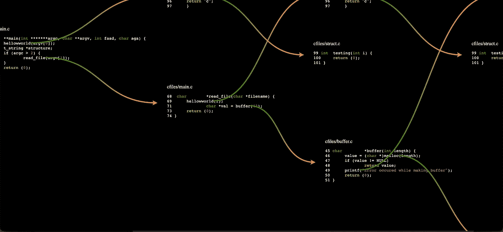
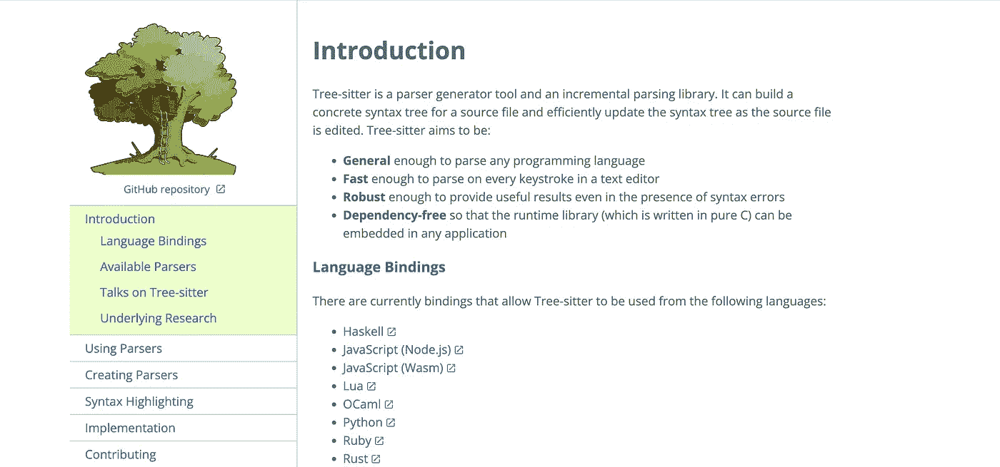
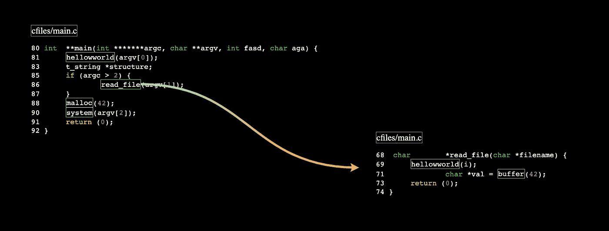
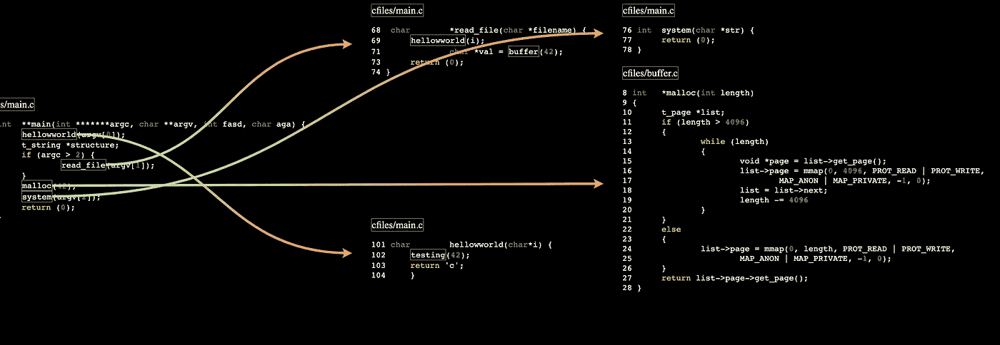
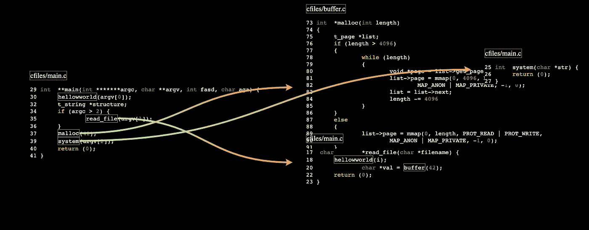

# Byfrost 在开发 4(或者 3，我忘了)——这有点像是走到了一起

> 原文：<https://itnext.io/byfrost-in-development-4-or-3-i-forget-its-kinda-sorta-coming-together-273f498f8dfb?source=collection_archive---------5----------------------->

它开始看起来像一个真实的东西！

我们还没到那一步，但开始看起来相当不错。图形逻辑需要一些调整和一些限制，尽管我认为现在不去管它是安全的，首先要收集用户如何使用它导航代码库的数据来确定这些限制。当我说限制时，我指的是从一个函数一次可以扩展多少个函数，如果`main`调用 8 个不同的函数，这些函数都应该是可扩展的吗？如果用户显然决定沿着某条路径前进，那么这些分支应该全部折叠起来吗？如果用户开始沿着一条路径前进，但却改变了主意，转而沿着另一条路径前进，那么这些分支应该被缓存以便可以扩展回它们以前的状态吗？诸如此类的事情。

创造一个伟大的代码库导航体验被证明是一个非常棘手的问题。

所以在这次更新中，我将暂时把制图放在一边，因为这是一个正在进行的内部辩论，重点是最终的大变化；实际上是移植一种语言，让它成为一个可用的 V1。

在此之前，快速盘点一下目前为止的情况。

一如既往，演示视频:

现在的制图是什么样的

# 我们进展如何？

以下是我在可能的愤怒和沮丧状态下冲动地做出的一些改变:

*   **配色** —首先是配色。就像上面的截图和演示一样，我决定把所有东西都涂成黑色，主要是因为一天深夜，我的视网膜着火了，所以我把它设为全黑模式，这样更容易处理。这将是可定制的。这并不难做到，我喜欢这种审美，因为 Vim 比 Nano 好(不过不要“@”我)。
*   **越线**——这是我将尝试解决的问题之一，但目前很难有效解决。我现在的方法根本无法扩展，所以必须解决这个问题。我想我可以减少至少有限数量的交叉线造成的噪音，但完全消除它们似乎不太可能。我敢说，这个问题对我来说太难了。

接下来，我决定做出一系列重大改变:

*   **远离 Angular** —最初我从 Angular 开始，因为我是前端和 JavaScript/TypeScript 的新手，它是我日常工作的前端工程核心的框架，我认为这是一个很好的开始方式；我将能够在工作中积累经验，并能够在遇到困难时获得帮助，但我觉得 Angular 正在成为一种负担。我希望从中获得的所有好处根本没有体现出来。我不能使用指令或绑定，我唯一使用的是 ngFor。安装版本不匹配的库太麻烦了(尽管这不清楚这是否只是一个 JavaScript 的问题)，我不得不自己想办法解决很多我希望 Angular 能帮我解决的问题；谷歌的代码美化是我永远不会忘记的背叛。我目前正在学习 VueJS，因为我听说了一些关于它的很棒的事情，但是我也不知道我不知道什么，但是如果它最终比 Angular 更容易完成这个项目，那么我完全支持它，如果不是，我为我的技能集学习了一个新的前端框架。
*   **制作一个电子桌面应用**——这主要来自于试图消除我在开发这个东西时注意到的不便，并确保我能够重播 Persona 3 Portable 的《生活方式》的合唱部分，该部分在 YouTube 上播放了几百次左右。考虑到我还需要做的所有事情，让它成为一个插件的目标感觉很遥远，在浏览器中拥有它，必须在我需要使用的标签之间旋转(如 YouTube)，然后找到这个标签并旋转回我的 IDE 感觉有点混乱，特别是因为我随时都有一百万个标签打开。目前，将它从浏览器中分离出来，放入其他不在浏览器中的东西是一个简单的方法。
*   **添加一个菜单** —我需要一个 UI 来选择从哪里开始索引的入口点，以及在开始之前在哪里设置项目的根路径，以及一种保存状态的方法，因为现在刷新浏览器会擦除你所做的一切。

我真的在想，既然我真的来了，我是否应该多花点功夫来计划这一切。在过去的几周里，我不得不做了大量的回溯和重构工作，这让我所有的乐观时间表推迟了很多。

我想知道我不能说出“很多”是什么意思有多糟糕。

但是我们来谈谈下一个大的补充。我想在这最后一件作品之后，我要做的很多事情将会是清理我所拥有的。我不认为我会放弃一个已经移植到 Vue 的 V1。

# 移植 Go——树保姆库

去 https://tree-sitter.github.io/tree-sitter/[看看吧](https://tree-sitter.github.io/tree-sitter/)

因此，对于我的第一个技巧，我将移植 Golang，并设计一个语言移植库，使其他人更容易将他们的语言移植到这个索引器。现在，这是一个相当大胆的主张，考虑到这本身有可能成为一个独立的大事业，但我很高兴一旦我跨过了那座桥，就烧掉它。

但是在更直接的事情上；我在上面广告的这个保姆到底是什么？

嗯，它是一个 C API，用于词法分析和解析各种语言，并为它们生成抽象语法树。非常适合 Byfrost，因为这正是我遇到的问题。不知何故，这将成为语言解析的新后端。虽然历史告诉我，我可能应该更仔细地考虑如何计划这样复杂的事情。

就目前情况来看，我之前用过的所有方法都不太管用。我有一个硬编码的 C lexer 和 parser，它几乎不起作用，我一直在我的演示中使用它，但是现在是时候认真起来，做一些真正的东西，我可以在一个真正的、功能性的代码库上使用。

我想这就是我接下来几周要做的事情。

# 目前…

回想起来，自从我开始写这篇文章以来，已经过了一段时间，所以加上了这一部分。

我能够完成用户测试，并从那次经历中增加额外的功能；一个是对所有“可点击”的东西进行高亮显示。Tt 似乎发现，如果没有某种“提示”，事情并不像我想象的那样直观，至少不是在所有情况下。我正在讨论这个可以通过按下一个热键比如 CTRL 或者别的什么来切换。

链接突出显示

我得出的第二个结论是，我需要在我的代码块定位中投入额外的工作。做好这件事变得异常困难。一旦你展开一个提示，确定块的去向真的很复杂，计算我周围每个块的运行环的冲突。我将在移植 Go 的同时做这件事，因为我怀疑我会在这方面花一段时间。

这种情况的一个例子是这样的:

这在一次运行中:

最佳情况定位

但是当一个更大的块已经存在时，事情就乱了套:

最坏情况定位

因此，我将继续打磨定位一段时间。

# 有兴趣试试 Byfrost 吗？

自从我宣布这个项目已经有一段时间了，似乎你们都有兴趣尝试一下，但我想让那些有兴趣尝试一下的人感受一下。如果你愿意，可以称之为“顾客调查”。我忘了你可以为这类事情制作谷歌表单。

如果你有兴趣将你的……呃……位置正式化，我已经为你做了一个简短的谷歌表格，如果你在发布日去了 Byfrost，给我你的建议。它还将帮助我决定如何考虑语言移植。我怀疑这将是一个持续的问题，当这最终准备好黄金时间。

你可以点击查看[，](https://docs.google.com/forms/d/e/1FAIpQLSc1CMPgolrYY7tmdXc2UQaXll-l2s_9z8oKKMEgjLrSe1gpCQ/viewform)

反正目前就这些了。