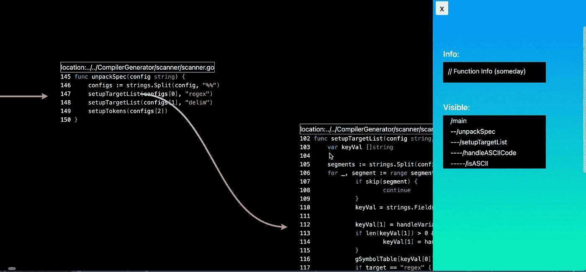

# by frost in Development——后退三步，前进一步(更新文章)

> 原文：<https://itnext.io/byfrost-in-development-three-steps-back-and-one-step-forward-update-article-3a522b70912e?source=collection_archive---------2----------------------->

进步也有挫折，但主要是挫折和一点进步。

更轻松的体验

但首先…进展更新:

动态“相机”运动。

**注意:这篇文章只是对 Byfrost 进展的更新，而不是我经常发布的架构方面的东西和变化，我很快就会发布。我只是对这一进展感到有点兴奋，情不自禁地写了下来😶。**

因此，我已经用 frost 编写了几个月的代码，这几个月之后，我不得不得出结论，哇…这有点难以置信的困难。我最初开始这个项目是为了给自己打造一个工具，让索引我遇到的任何代码库成为一个 UI 梦想，但随着我越走越远，通往 V1 的路似乎越走越长。每次我添加一个新的东西，它似乎打开了九个洞；当扩展一个功能时，添加动态相机移动引入了返回调用堆栈的需要，然后引入了对一种助手导航条的需要，该导航条将显示所有内容，以便您可以从任何地方跳转到它，现在引入了将侧面板导航绑定到 backclicks 的需要，因为在触控板上使用鼠标会很累，等等。

我想真正的问题是达到一个可以舒适地使用的程度，我可以用它真正地提高工作效率。现在，不能扩展类方法和子方法(我不知道这些方法叫什么)阻碍了这一点，因为 Go 项目充满了这些。从 C 开始可能是一个更安全的赌注，但马后炮。

我认为让这变得如此困难的事情是，我发现自己编写了一大块 Go 的编译器前端，然后不得不用一种“平面”结构来表示它，而不是 AST，同时保留它的层次结构。这个想法萦绕在我的脑海里。

无论如何，这只是一个“迄今为止的道路”来更新这个项目的进展。上一篇文章中添加的内容主要是 UI 方面的，与索引没有什么特别的联系，所以在这篇文章中我不会深入讨论。

## 好吧…让我们再试一次…

现在，在对 V1 充满信心之前，我至少有 4 件事要做。我确定这次。我知道，我知道，我以前说过，但这次我明白了！

这些是:

*   **1 度结构/方法解引用**—1 度部分真的很重要。事实证明，扩展其中一个`function.functionA().funcitonB()`真的有点难，我还没有想出一个舒适的方式，可能需要大规模的检修，所以现在，这将采取退居二线。1 度特指类似`os.File`的东西
*   **函数和结构信息—** 你可能已经注意到了`Function goes here (someday)`占位符。嗯，这就是你当前点击的结构等信息的位置。在图中展开一个结构没有意义，因为它不一定是控制流的一部分，但它是一个有趣的点。
*   (**很高兴拥有)系统方法的扩展—** 目前只有与项目根相关的包被解引用。不支持展开`fmt`、`os`和`log`。这个还不错，因为它所需要做的只是对 Go 的本地库目录做相对项目目录已经做的事情。我唯一担心的是这可能会增加噪音。至少，我从来不需要扩展系统方法和函数。
*   **映射**——啊，是的，这些讨厌的映射块，无论我怎么努力，似乎都抓不住。这显然仍然需要解决，尽管这个问题比困难更烦人，我很高兴把它推到队列中，直到上面的问题解决。

我想现在就这些了。

所有其他的东西，比如使它成为一个电子应用程序或插件，现在都太遥远了，因为词法分析器/语法分析器占用了我所有的精力和时间，给我带来了无尽的麻烦。

现在的目标是找到一些直观上有用的东西。不幸的是，这需要实现语言本身的很大一部分。我发现自己在尝试它，只是忘记了有些东西是不可点击的，这完全扼杀了我的沉浸感。

我还认为，在 Go 之后，我将处于一个更好的位置来创建一个集成新语言的任务。解析后没有生成 AST 是一个非常有趣的问题，我认为只需要解决一次，然后就可以复制。

## 如果你想试试的话

此外，我正在尝试测试我正在制作的这个应用程序，并邀请其他人注册试用。我想尝试几个协作特性；像因果分析特性这样的东西有助于实时调试。我认为这对整个工作流程非常有价值。如果你热衷于此，让一些早期用户尝试一下会很棒。第一个版本只是一个调用栈可视化工具。如果这听起来像是你认为会让你的生活变得轻松一点的事情，请随时将你的电子邮件放入这个谷歌表单中。

好吧，就这样。

直到宇宙热寂前的某个时候我的下一次更新。