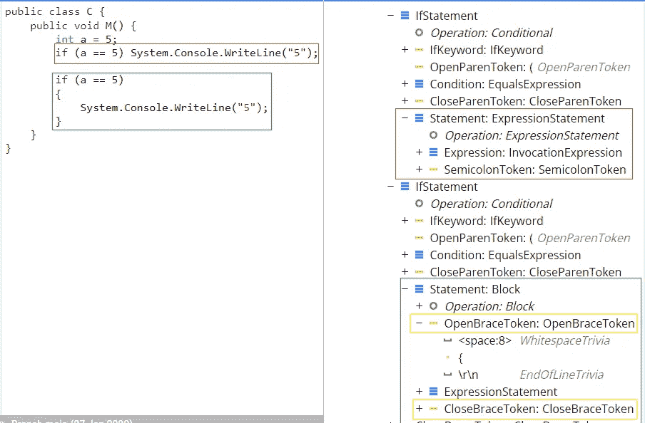
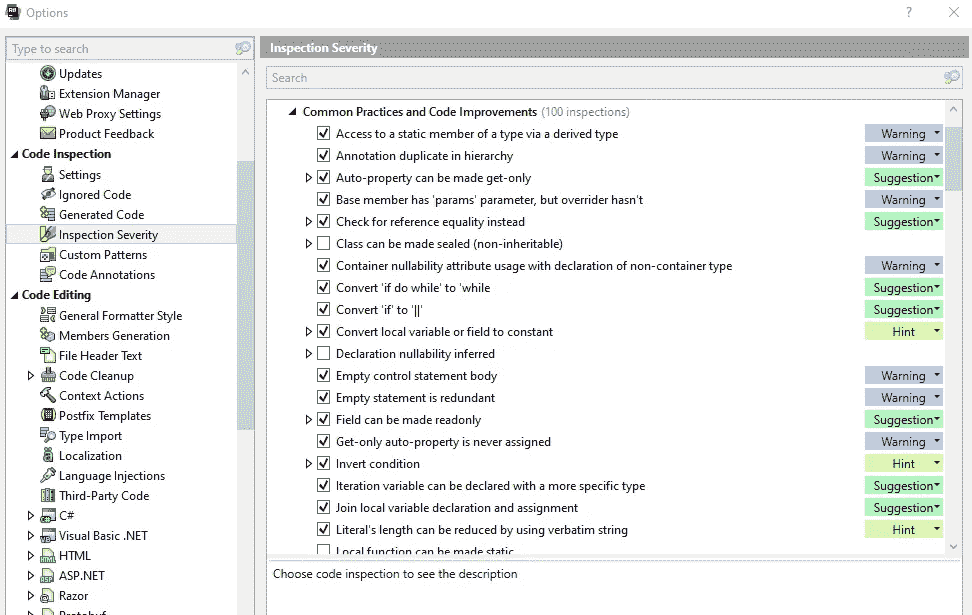
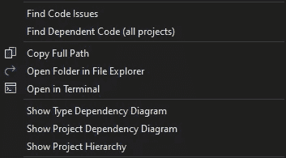
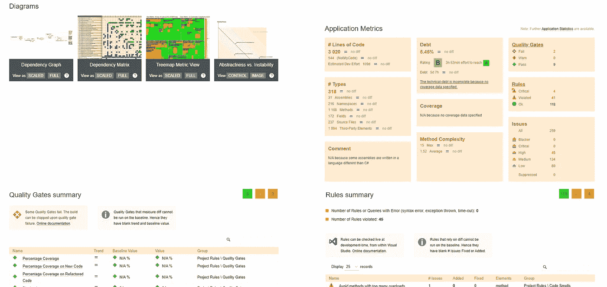
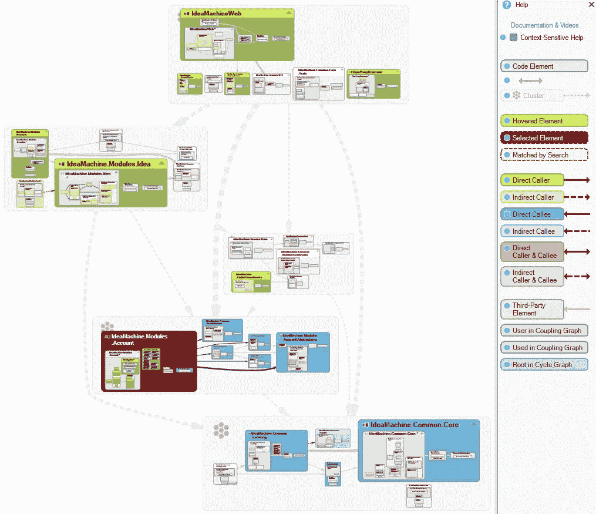
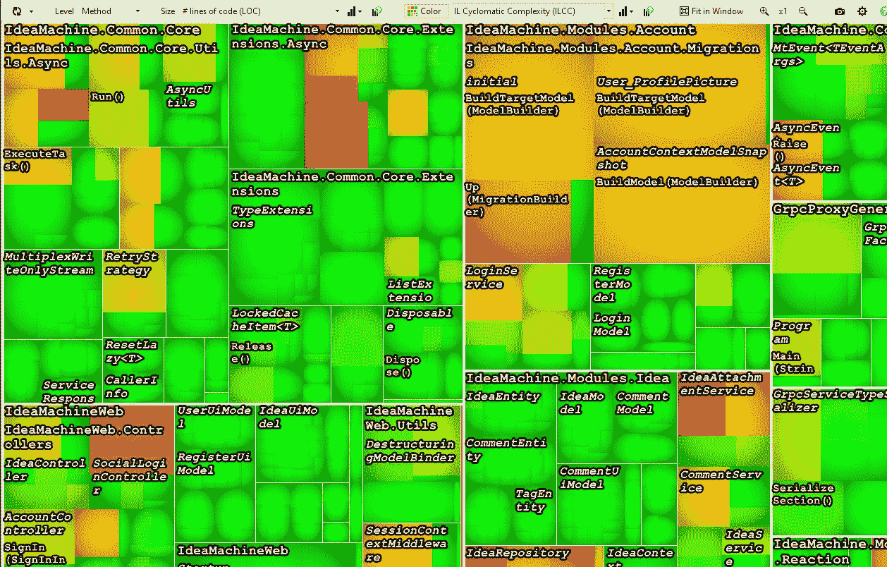
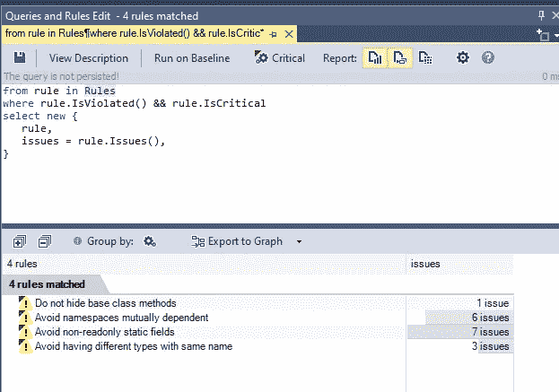

# 使用 Roslyn、Resharper 和 NDepend 的 C#代码质量工具

> 原文：<https://itnext.io/c-code-quality-tooling-with-roslyn-resharper-and-ndepend-a4fd4540724c?source=collection_archive---------3----------------------->

最近，我正在研究(自动化)代码质量工具的一些选项，包括代码度量、依赖图和自我强加的编码风格。为了有一个可维护的、可伸缩的和整洁的解决方案，这些是需要跟踪的非常重要的方面。

在本文中，我将重点介绍三种方法，从简单到复杂。

# 本地与方法

先说简单的。如果你只是想在你的代码中添加一些基本的警告，最容易接近和最简单的方法是在你的代码中，而不是在出现错误和警告时允许大量的定制。最基本的方法是在代码中添加一个 *#warning* 指令，或者滥用*【过时】*属性，这是一个编译器支持的属性，用于生成特殊的警告。

```
#warning Warn me about this
DoSomething();[Obsolete("Warning two")]
static void DoSomething(){ }
```

这段代码将像这样出现在警告和错误视图中。


正如您所看到的，这是相当笨拙和具体的，但它可能足以到达您想要的地方。请注意，您还可以对。csproj 文件，见各自属性[此处](https://docs.microsoft.com/en-us/dotnet/csharp/language-reference/compiler-options/errors-warnings)。

确保编码指南的另一个创造性和简单的想法是通过反射和单元测试。假设您希望确保程序集 X 不包含对特定其他程序集的引用。

为此，您可以编写一个简单的单元测试来加载程序集，并检查其中的引用程序集。如果您检测到无效的引用，您的测试将会失败，并且不允许代码更改。

以类似的方式，您也可以检查属性/方法/字段等的命名。通过反射，确保命名标准。

这些都是一些简单但足够好的想法，告诉你如何用最少的努力完成一些基本的检查。

# 源分析器

经过这个小小的迂回之后，现在让我们进入适当的工具。如果除了默认的可用警告和错误之外，您还想要自定义触发器的警告和错误，比方说，对于您运行的团队特定的编码标准，您可能想要编写一个自定义 roslyn 分析器来检测它。

如果你最近因为非常流行的源生成器而遇到 Roslyn——Roslyn 已经存在很长时间了，分析器正在通过与源生成器非常相似的流程运行。

您的分析器将在编译期间运行，并且能够分析语法树。参见下面的例子( [Sharplab link](https://sharplab.io/#v2:EYLgtghglgdgNAFxBAzggPgAQMwAJMBMuAwrgN4CwAULrfnpgCy4CyAFAJTnV2+6wJcEXAF5cAVgDcPPrSgAzXG2Eix4rpgCMAOi0BONgCJxhjtJqzcM2QqUq1Ha30oXLdLbs0HjpyXSe8AL5OwVSBQA) ):



如您所见，Roslyn 语法树能够确定这两个语句中哪个包含大括号，哪个不包含。这将是一个潜在的警告，您可以为您的构建工具创建该警告，以获取并拒绝合并请求。

罗斯林分析器真正的优点是，它们将与 VS 集成，甚至允许添加建议来修复各自的触发器。

你也可以在这里找到一个关于如何实现分析器[的很棒的教程。](https://devblogs.microsoft.com/dotnet/how-to-write-a-roslyn-analyzer/)

此外，有一些很棒的开源项目已经提供了大量的通用分析器，比如 [StyleCop](https://github.com/DotNetAnalyzers/StyleCopAnalyzers) ，所以你不一定要自己实现。

# 雷沙尔珀

这是我们使用第三方工具的地方。Resharper 是一个非常流行的 Visual Studio 扩展，它向各个方向添加了功能。说到用 C#开发，基本就是瑞士军刀了。

当谈到代码质量时，Resharper 添加了许多可配置的警告，旨在支持开发人员跟上行业编码标准，并通过扩展将这些警告添加为自定义警告。它**不**使用罗斯林分析器，而是通过自己的进程和观察器来分析代码。

在选项中，我们可以根据严重性和应用程序配置大量的检查，以便根据开发人员的需求进行定制。



[添加自定义分析器](https://www.jetbrains.com/help/resharper/Code_Inspection__Creating_Custom_Inspections_and_QuickFixes.html)也非常容易。

另一个需要特别注意的主题是处理项目之间的引用。如果您正在处理一个超过 50 个项目的解决方案，您知道它们之间的引用可能会很快失去控制。Visual Studio 也提供了一些简洁的工具来帮助您。

如果您右键单击一个项目，您会发现下面的菜单点稍微靠下一些



*   查找依赖代码:这将从所有其他项目中查找对这个项目的引用。
*   显示类型依赖关系图:这将显示项目中类型的依赖关系。
*   显示项目依赖关系图:这将向您显示一个惊人的图，图中有解决方案中所有项目之间的参考箭头。重构更大代码库的天赐良机。
*   显示项目层次结构:这将为您提供解决方案中程序集之间的文本表示。

如果我要涵盖 Resharper 的各个方面，我可能需要多篇文章来完成，但它是每个开发人员都应该拥有的一个神奇的工具。可以肯定地说，虽然代码分析不是 Resharper 带来的主要东西，但它仍然提供了大量有用的工具。它通过惊人的重构和代码编辑工具大放异彩，专注于开发人员的生产力。

不过，使用 Resharper 是有代价的，还需要在您的构建机器上运行 Resharper analyzer，因为它运行在一个专用的进程上，而这个进程并没有与 MSBuild 嵌入式工具集成。

# NDepend

是时候拿出大枪了。如果您希望尽可能提高代码质量，NDepend 是 C#解决方案的最佳选择。虽然 Resharper 是一把非常全面的瑞士军刀，但 NDepend 纯粹专注于为您提供最详细的代码质量分析。

NDepend 可作为独立产品和 IDE 集成产品提供。说实话，在我的评估中，我主要看了一下独立的应用程序。

我惊讶地发现，获得我所分析的应用程序的洞察力是如此容易。基本上，您所要做的就是获得 NDepend，选择一个解决方案进行分析，并让 NDepend 在短时间内完成它的工作。

分析完您的解决方案后，NDepend 将为您提供一个 html 文件摘要，其中包含您的应用程序分析:



这包含了许多有趣的度量标准的快速概述，例如，代码行、解决方案中的类型，或者仅仅是从各种度量标准中浓缩的质量的一般评估。它还会根据一些最佳实践向您显示您的解决方案中违反的规则的摘要。

这个独立的应用程序感觉像是 Visual Studio(它包括许多已知的组件，如类浏览器等)和一个大型分析平台的混合体。



除了熟悉 Resharper 依赖图之外，真正给我留下深刻印象的是 NDepend 中依赖图的详细程度。看一下上面的截图——在常规的引用连接之上，您可以一路向下钻取，从项目到类，一直到方法。它非常详细，可以让你从申请的每个方面获得尽可能多的信息。

除了这个图，您还可以获得一个基于表格的依赖矩阵。



下一个可用视图是一个类似热图的度量图，它可以让您快速了解应用程序的哪些组件在复杂性、注释覆盖率、方法数量等方面表现最好和最差。

NDepend 还让您可以快速查看每个项目的纯引用数量，包括 NuGet 包和项目引用，所有这些都可以在一个非常简洁的视图中获得(当然，它比针对所有解决方案的 VS-embedded NuGet 概述要快**很多**)。

视觉图表到此为止。NDepend 还会给你一个代码度量列表，你的代码可能会通过或者失败，并标记出相应的程序集或者类型，让你可以快速的查看哪里出了问题。一个非常漂亮的功能是 CQLinq，这是一个独立的集成的类似 Linq 的语言，用于查询技术债务、问题、规则或其他东西，允许你轻松地定制视图、过滤组件等。如果我想创建一个查询，提供所有违反和关键规则的名称和问题，您可以相应地编写(并保存和共享)如下内容:



太好了，这让 C#开发人员感觉很熟悉！

当然，NDepend 也允许添加可定制的指标，但是可以肯定地说，默认可用的指标已经非常全面了。

总而言之，我希望我至少能够让您对 NDepend 的能力有一点粗浅的了解。它包含了**所以** **多了许多**强大的功能，我几乎无法一一介绍。我只能建议你尝试一下，亲自看看你能多快掌握你以前不知道的应用洞察。

NDepend 在我看来是终极的 C#分析工具。当然，您也可以在较小的团队中使用它，虽然它也有许可成本，但是您也可以使用单个构建服务器许可证来运行，以便将 NDepend 分析集成到您的自动化构建中。我可以想象，如果您有机会让专门的架构师为您的应用程序观察和定制可靠的指标，这将是非常棒的。

与 Resharper 相比，NDepend 剥离了开发人员生产力工具，而是明显地专注于深入和有洞察力的代码分析。因此，当谈到什么值得使用时，这不是一个非此即彼的问题，而是一个“两者兼有”的问题。

这是我今天想提出的三个选择。我希望我能给你一些灵感或者对一些你可能还不知道的工具有所了解。如果你想尝试一些工具，大多数还会提供试用时间，所以你可以免费试用。如果你想去纯粹的自由选择，罗斯林是一个很好的和可靠的选择。