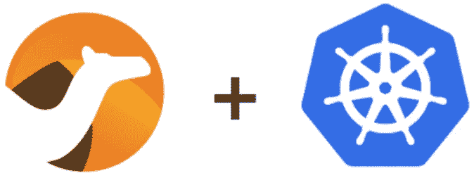

# camel K——Kubernetes 上的“无集装箱”部署

> 原文：<https://itnext.io/camel-k-containerless-deployments-349da12bfa9d?source=collection_archive---------1----------------------->



最近，我被要求为我正在从事的一个项目调查骆驼。Camel 是一个轻量级集成框架，旨在以即插即用的方式实现所有众所周知的企业集成模式。因此，举例来说，如果您想从 S3 桶中读取一个文件并打印出它的内容，您可以使用几行 Java / Groovy / Kotlin 或一系列其他特定于领域的语言( [DSL](https://camel.apache.org/manual/dsl.html) )快速配置 Camel 来做到这一点。以下是来自[阿帕奇骆驼示例报告](https://github.com/apache/camel-examples)的示例:

Camel 拥有数量惊人的[组件](https://camel.apache.org/components/3.15.x/index.html)，可以用来将几乎任何系统或服务轻松地集成到任何其他系统或服务中。如果您需要的组件不可用，可以使用 Camel 框架创建您自己的组件。

关于 Camel 已经说得够多了，让我们继续讨论 Camel K，毕竟，我肯定你想知道我说的*【无容器】*部署*是什么意思。*

# 输入骆驼 K

Camel K 是 Kubernetes 的一个扩展，它可以快速加速在 Kubernetes 上部署 Camel 应用程序的过程。Camel K 在安装后作为 Kubernetes 操作员运行，并从一个名为 *kamel 的 CLI 工具监听新的应用程序部署请求。*以[为例](https://github.com/apache/camel-k/tree/main/examples)，Camel DSL 可以用一个 Java 类编写，如下所示:

在这个例子中，Camel 将打印出字符串“Hello World！”每秒向控制台发送一次。要将这个应用程序(或者在 Camel 中称为 route)部署到 Kubernetes，在安装了 camel CLI 工具之后，可以从包含*camelBasic.java*文件的目录中运行下面的命令。

```
kamel run camelBasic.java
```

然后，Camel K 将通过操作符启动一个包含该应用程序代码的新 pod。它做到了这一点*而不需要*要求开发者在部署之前创建一个容器映像。

不考虑 Camel 提供的丰富功能，让我们花点时间来体会一下这意味着什么。定制软件项目的典型 Kubernetes 部署是这样的:

*   开发人员编写一些代码
*   开发人员将代码提交给版本控制系统
*   构建管道被触发并构建代码
*   代码工件被创建
*   工件被推送到工件储存库
*   然后，触发容器映像构建
*   构建的映像被推送到容器注册表
*   最后，触发一个发布管道，将映像部署到 Kubernetes 集群(kubectl / Helm 等)。)

对于开发人员来说，测试他或她的代码需要经历很多步骤。更重要的是，构建映像是一个 CPU 密集型的过程，因此需要时间。容器映像的大小也各不相同，从几兆字节到几百兆字节甚至更大。这些图像往往存储在远程注册表中，所以如果你碰巧在慢速网络上，你只能…等待…然后再等一会儿…然后再等一会儿。

## 那么骆驼 K 是怎么做到这一点的呢？

当请求 Camel K 安装一个应用程序 Kubernetes 时，Camel K 操作员将拦截该请求，并且在上面的 Java 示例中，启动一个部署过程，如下所示:

*   Kubernetes 内部创建了一个*集成* 对象来跟踪您的应用程序代码、它的依赖项和配置。
*   然后创建一个 *IntegrationKit* 对象，该对象定义了一个容器映像，在其中托管应用程序。IntegrationKit 不包含任何源代码。
*   运行一个构建过程，该过程执行一个 maven 目标来构建 Java 代码。
*   一旦这个完成，就会动态**构建一个容器**，对，没错，动态**。**然后图像被推送到您配置的容器注册中心，Kubernetes 将从那里获取它。Camel K 操作者将把任务移交给 Camel K 运行时，并从刚刚构建的动态构建映像中旋转出一个 pod。在内部，Camel K 通过操作器中的功能来监视应用程序的状态。

那么，如果您想在开发周期中更改代码并重新部署应用程序，该怎么办呢？为此，Camel K 提供了一个 *dev* 标志，可以将其传递给 *kamel* CLI 工具。在这种模式下，在 IDE 中所做的任何代码更改都会被自动获取，并被发送给操作员进行重新编译和重新部署。真正巧妙的是，并不是每次都创建新的容器映像，这意味着更快的部署周期，从而更快的开发周转时间。

# 利益

Apache 团队定位 Camel K 的方式有一些非常明显的好处:

*   我已经提到了等待容器被创建和部署的开发时间的减少，但是开发人员很懒——他们喜欢效率，这对开发人员来说无疑是一个福音。
*   操作团队成员可以重建应用程序容器，而不需要开发团队的帮助，因为代码工件不会改变。随着在容器操作系统中检测到越来越多的漏洞，只需修补一个基本映像，然后重新部署所有 Camel 集成就成为了一项真正高效的操作任务。

# 结论

使用 Camel K 部署 Camel 集成代码而无需预先构建容器映像非常有吸引力，尤其是在开发期间。这种部署定制应用程序代码的精益方法与构建图像的传统方式有点背道而驰，使用类似 Helm chart 的东西打包图像，然后将其部署到 Kubernetes——我喜欢这种方式！

在本系列的下一期文章中，我将介绍如何使用 Camel K 运行 Camel 应用程序之外的其他功能，以及这对替代性(实验性)部署策略意味着什么。这将更像是一个实验系列——但是尝试新事物很有趣。

如果你喜欢这篇文章，请考虑关注我，这是在媒体上建立追随者基础的唯一方法，也是确保我在这里的努力到达目标受众的唯一方法。