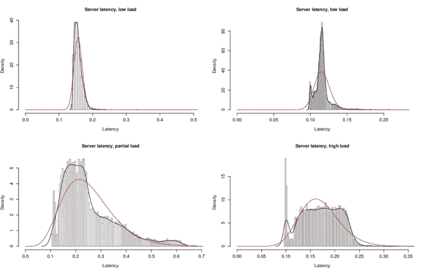

# CAP 和我们

> 原文：<https://itnext.io/cap-and-us-9e0734cbfe1e?source=collection_archive---------2----------------------->

几十年来，当讨论分布式一致性时，CAP 定理(不管是好是坏)占据了主导地位。与任何模型一样，它提供了现实世界的简化视图，在这种情况下，网络延迟和中断的后果及其对分布式计算机系统中数据一致性的影响。它的基本前提很简单；存在将输入处理成一些输出的节点，其结果必须通过(有损)计算机网络传送到一些其它节点。说这是任何计算机网络的完美近似似乎是常识，因此无论何时讨论分布式系统中的各种一致性模型，它的结论都被广泛接受为实际适用。

原始论文要详细和精确得多，但是对于我们的目的来说，他们模型的这个(更简化的)视图就足够了。

## CAP 及其在实践中的适用性

人们反对以这种方式使用 CAP 的争论主要是讨论它的严格性和现实生活中的适用性。例如，Martin Kleppmann [写了一篇详细的博文](https://martin.kleppmann.com/2015/05/11/please-stop-calling-databases-cp-or-ap.html)，要求人们在几年前停止使用 CAP 作为速记，但收效甚微。他的论点主要围绕定义(如一致性意味着线性化)和他们的模型如何不适合(在他看来)分布式计算机系统中存在的现实世界问题。

对于我们在这里要证明的东西，最有用的引用来自整个概念的原始作者 Eric Brewer。在他的文章:[CAP 12 年后:规则是如何改变的](https://www.infoq.com/articles/cap-twelve-years-later-how-the-rules-have-changed/)中，他提出了这样一个论点，即以这种方式使用理论的简化观点是无益的。他还继续谈到在讨论 CAP 时不应忽视延迟(Kleppman 也提出了这一点):

> 在经典的解释中，CAP 定理忽略了延迟，尽管在实践中，延迟和分区是密切相关的。从操作上来说，CAP 的本质发生在一个超时期间，在这个期间，程序必须做出一个基本的决定——T4 分区决定:
> 
> -取消操作，从而降低可用性，*或*
> 
> -继续操作，因此存在不一致的风险。
> 
> 例如，通过 Paxos 或两阶段提交来重试通信以实现一致性，只会延迟决策。在某些时候，程序必须做出决定；无限重试通信本质上是选择 C 而不是 a。
> 
> 因此，从实用的角度来看，划分是对通信的时间限制。未能在时间范围内实现一致性意味着一个分区，因此需要在 C 和 A 之间进行选择。这些概念抓住了延迟方面的核心设计问题:双方是否在没有通信的情况下前进？

我们使用 Brewer 的推理通过延迟来讨论 CAP 的适用性，这是计算机网络中存在的一个基本事实，每个人都可以认同。

我们将网络分区定义为属于与任何其他超时相同的组，其中超时非常大。就我们的目的而言，我们正在讨论的案例也涵盖了这种可能性，所以即使经常进行区分，我们也认为没有必要。

我们跟随 Brewer 的思路，当他说如果你解决基于延迟的超时，CAP 模型不再适用于你，因为(正如他暗示的)超时是 CAP 决定的。然而，这似乎是不可能的，只要我们需要通过易延迟的网络在不同的计算机之间移动一些信息。

## 节点和网络

最简单地说，网络就是两台计算机，A 和 B，在彼此之间发送数据包。

**A —材料→ B**

这些计算机存在于一些连接的环境中，对于这个论点，假设 A 和 B 生活在不同的数据中心。它们通过它们之间的某种技术设备序列进行通信，这里抽象为某种连接，这种连接可以通过某种概率分布来表示，即一条信息将在某个设定时间内到达。

斯坦纳特，丽贝卡&吉尔布拉德，丹尼尔。(2021).网络系统中分布式自适应故障处理的初步方法。

在上面的图表中，我们可以观察到我们如何期望大部分信息在某个合理的、可预见的时间窗口内到达，但是尾部延迟使得实际上不可能计划所有的可能性。我们不能指望在另一端及时收到所有信息。

布鲁尔甚至[在后来的论文](https://t.co/grR0VYX6RR?amp=1)中说，谷歌扳手是“实践中的上限”(意译)，因为他们可以提供足够强大的保证，延迟峰值不会发生在他们的网络上，这是由他们建造和维护的。

如果您计划运行一个 SQL 兼容的数据库(尤其是您自己的数据库),或者期望比本文中引用的“5 个 9”更好的可用性，这是没有帮助的。在 Spanner 中，新信息在 quorum 副本中投票表决，这是所有参与计算机必须接收每个信息(来自单个计算机)的另一种方式。我们在这里不分析这个模型的优点或缺点，但很明显，通过嘈杂的网络在计算机之间移动信息的初始模型是适用的。

## 远处是什么

另一种看待我们开始时的模型的方式是，对于每一段数据，可以识别单个节点(计算机)。每个节点向其他节点发送信息，并且必须在网络上选择一条路径，以便信息到达其目的地。

但是如果网络上的节点同时在多个地方呢？如果每个节点可以有多个副本生活在同一个网络上，发出相同的信息(当按顺序查看时)，将它们发送到网络上的多个节点，会怎么样？我们将丢失的消息定义为(从统计学上讲)一组 100 条消息中最差的一条。

比方说，我们有一个节点的 3 个副本，它们(现在，神奇地)有相同的输入集。它们各自向相同的 3 个节点(也是复制的)发送相同的消息，但通过不同的硬件阵列。在这种情况下，消息丢失的几率是 100⁹，所以是 1:1000 000 000 000 000 000 000。如果最初的 1:100 消息丢失事件每秒发生一次，我们现在可以预计它大约每 3.2 亿年发生一次。添加更多的副本会成倍增加这个数字。

这里忽略了这些节点如何共享相同的有序输入集。我们简单地说，3 个目标节点实际上是共识组的成员，共识组为它们的工作节点提供输入。这样，每个输入可以由单独的计算机接收，所有信息可以由多台计算机同时发送(只要它们是幂等的，就可以过滤掉这些重复)。

这种方法允许比 Spanner 的“59”更健壮、可扩展的弹性模型，并且可以在任何任意计算机网络上运行。