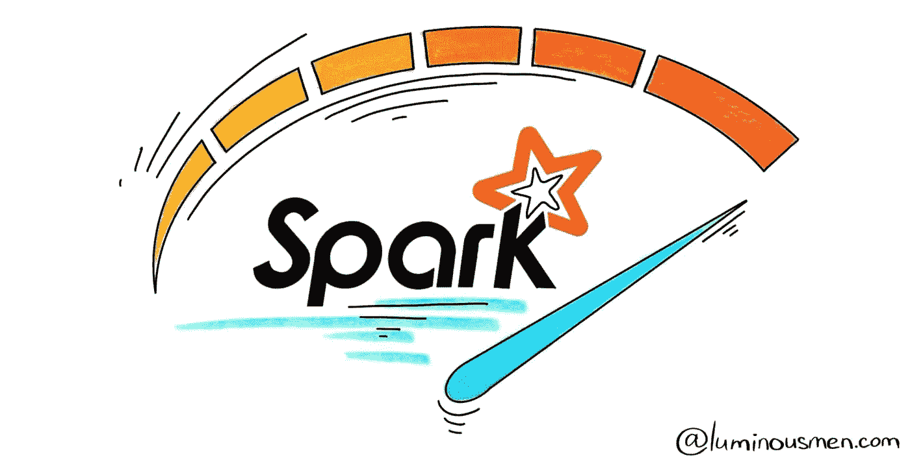

# 针对 Apache Spark 的 Cassandra 优化

> 原文：<https://itnext.io/cassandra-optimizations-with-apache-spark-3ddf7f81ce43?source=collection_archive---------2----------------------->


托拜厄斯·菲舍尔在 [Unsplash](https://unsplash.com?utm_source=medium&utm_medium=referral) 上的照片

# 介绍

在本文中，我将讨论运行 [**Cassandra**](https://cassandra.apache.org/) 与 [**Spark**](http://spark.apache.org/) **的含义。**

目标是**理解 Spark 和 Cassandra** 的内部结构，这样你就可以尽可能高效地编写代码，真正利用这两个伟大工具的力量。

我会给你一些关于用 Spark 优化 Cassandra 的提示，这样你就可以最大化性能，最小化成本，T21。我假设你已经对 Spark 和 Cassandra 有了基本的了解。

这是我上一篇 [**文章**](/spark-cassandra-all-you-need-to-know-tips-and-optimizations-d3810cc0bd4e) 的节选，看完这一篇推荐阅读。

# 火花四射的卡珊德拉

要将 Spark 与 Cassandra 集成，您需要使用 [**Spark Cassandra 连接器**](https://github.com/datastax/spark-cassandra-connector) 。使用此连接器时，您有两种选择:

*   使用**低杠杆 RDD API** 。这提供了更多的灵活性和手动优化代码的能力
*   为 Spark 使用**数据帧或数据集 API**。在这种情况下，您可以像使用 HDFS 和**一样读写数据帧，连接器将在**下进行所有优化。

首先，我推荐使用[数据帧/数据集 API](https://github.com/datastax/spark-cassandra-connector/blob/master/doc/data_source_v1.md) 。这样，您可以利用相同的 API，像编写其他系统一样编写 Cassandra。你只需要知道你的仓库是卡珊德拉，而不是 HDFS。您需要了解如何为 Cassandra 优化 Spark，并在连接器中设置正确的[设置](https://github.com/datastax/spark-cassandra-connector/blob/master/doc/reference.md)。这个我们以后再说。

要从 Cassandra 表中读取数据，只需指定不同的格式:"*org . Apache . spark . SQL . Cassandra*"

```
val df = spark
  .read
  .format("org.apache.spark.sql.cassandra")
  .options(Map( "table" -> "words", "keyspace" -> "test" ))
  .load()
```

这将创建一个新的数据帧，它与关键字空间“*测试*中的表“*单词*”相匹配。

如果你导入"*org . Apache . spark . SQL . Cassandra . _*"你可以简单地写:

```
import org.apache.spark.sql.cassandra._
val df = spark
  .read
  .cassandraFormat("words", "test")
  .load()
```

其中第一个参数是表，第二个参数是键空间。

要将数据框中的数据写入 Cassandra 表:

```
df.write
  .cassandraFormat("words_copy", "test")
  .mode("append")
  .save()
```

请注意，数据框的方案必须与表方案相匹配。

就这样，基本上从 API perceptive 开始，这就是你需要的全部，当然还有一些高级特性，我们将在后面提到。

# 火花卡珊德拉优化

与 Spark Catalyst 引擎相同的 [**Spark Cassandra 连接器**](https://github.com/datastax/spark-cassandra-connecto) ，也优化了数据集和数据帧 API。因此，提到的一些方法只用于 rdd，并且是在使用高级 API 时自动添加的。

现在让我们回顾一下有关 Cassandra 及其连接器的具体细节…

## Spark 和 Cassandra 分区

我们讨论了很多关于 Spark 分区的内容，如果您在同一个集群中运行 Spark 和 Cassandra，您需要注意一些额外的事情。

最重要的规则是这条:**将 Spark 分区匹配到 Cassandra 分区**。第二条规则是: **Cassandra 分区不同于 Spark 分区:**

*   **Cassandra 分区:**这些是 Cassandra 跨节点分割数据并确定您的数据存储在哪个 Cassandra 节点上的单元。Cassandra 分区键是在为 Cassandra 表定义模式时设置的。每个分区包含在单个节点上(每个副本*)。*
*   ***Spark 分区:**Spark 将数据(在内存中)划分给不同的工作线程。Spark 分区还决定了 Spark 在处理数据时可以应用的并行度(每个分区都可以并行处理)。分区的数量和分区键既可以由 Spark 自动确定，也可以显式设置。*

*了解这两者之间的区别并编写代码来利用分区是至关重要的。你的目标是拥有正确数量的 Spark 分区，以允许 Spark 高效地并行处理计算。*

*在许多情况下，会有比 Cassandra 分区更少的火花分区，因为 Cassandra 更细粒度；但是在可能的情况下，您希望 Cassandra 数据从 Spark 分区所在的 Cassandra 节点读取和写入。正如我们之前提到的，您还希望有足够多的 Spark 分区，每个分区都适合可用的 executor 内存，这样每个分区的每个处理步骤不会运行太长时间，但也不会太多，以至于每个步骤都很小，从而导致过多的开销。正确的数字取决于您的使用情形。在 Spark 中，特别是在 Cassandra 中，您必须运行性能和压力测试，并调整这些参数以获得正确的值。一个好的经验法则是每个执行器至少有 30 个分区。*

*好消息是，在许多情况下，Cassandra 连接器会自动为您处理这些问题。当你使用 Cassandra Spark 连接器时，它会自动创建与 Cassandra 分区键一致的 Spark 分区！。这就是为什么在 Cassandra 中设置正确的分区很重要。Cassandra spark 连接器尝试估计表格的大小，并将其除以参数`spark.cassandra.input.split.size_in_mb`(默认情况下*64MB*)。但是也要记住，有些 Spark 函数会改变分区的数量。*

*当您使用不同的分区键连接 Cassandra 表或进行多步处理时，您需要小心。请记住，像聚合这样的一些操作会改变分区的数量。因此，在这种情况下，您从一组大小合适的分区开始，但是随后极大地改变了数据的大小，导致分区数量不合适。解决这个问题的一个方法是使用连接器`**repartitionByCassandraReplica**()`方法来调整 Spark 分区的大小和/或重新分配数据。这将重新分配 Spark 在内存中的数据副本，以匹配指定的 Cassandra 表的分布，并为每个执行器分配指定数量的 Spark 分区。*

*连接器还提供了一个有趣的方法来执行连接:*

```
*JoinWithCassandraTable()*
```

*它只提取与 Cassandra 的 RDD 条目相匹配的分区键，因此它只处理速度更快的分区键。建议您在 *JoinWithCassandraTable* 之前调用`repartitionByCassandraReplica`来获得数据局部性，这样每个 spark 分区将只需要查询它们的本地节点。*

*请注意，当您使用数据集或数据帧 API 时，连接器会在幕后使用这些方法。*

## *写入设置*

*关于向 Cassandra 读取和写入数据，我非常推荐观看这个来自 [DataStax](https://www.youtube.com/channel/UCqA6zOSMpQ55vvguq4Y0jAg) 会议的视频:*

*在连接器中有许多可以设置的参数，但是一般来说，从 Spark 向 Cassandra 写入数据有两种方法:*

*   ***异步发射和锻造** t:这个想法是让许多并行的单次写入异步执行。如果因为没有单独的分区键而不能选择批处理，那么这种方法可以很好地执行。*
*   ***批处理**:在这种情况下，我们创建批处理。为了实现这一点，我们需要确保通过一个 Cassandra 键对数据进行分区，这样每一批数据都进入同一个分区，查看视频了解更多细节。*

*在写入 Cassandra 之前，您总是可以使用 spark *repartition* ()方法来实现数据局部性，但是这样做很慢，而且有些矫枉过正，因为 Spark Cassandra 连接器已经更有效地实现了这一点。**连接器自动以最佳方式为您批量处理数据**。*

*根据经验，如果您不确定某件事，不要去做，让连接器和 Spark Catalyst 为您优化代码。*

*根据数据大小和目标表分区，您可能希望对每个作业进行以下设置:*

*   *"*spark . Cassandra . output . batch . grouping . key*":Cassandra connector 将根据该值对批处理进行分组，默认为 partition，因此它将尝试重新分区，以便每个批处理都进入同一个分区，并依次进入同一个节点。您可以将其设置为 replica_set。*
*   ***"*spark . Cassandra . output . batch . grouping . buffer . size*"**:这是司机给你做批处理时的批量大小。这需要根据您的数据大小进行设置。默认值为 1000。*
*   *"*spark . Cassandra . output . batch . size . row*s】:批量大小，以行为单位，它将覆盖以前的属性，默认为 auto。*
*   ***"*spark . Cassandra . output . concurrent . writes***":并发写的次数，这个属性和前面两个成正比，批量越大你想要的并发写越少。通过根据数据大小和分区调整这两个参数，您可以获得最佳性能。*
*   *"*Cassandra . output . throughput _ MB _ per _ sec*"(默认值:无限制):每个内核的最大写吞吐量。您需要根据每个执行器的内核数量来设置。默认情况下，Spark 会尽可能快地(无限制)写给 Cassandra。对于长时间运行的作业来说，这不是很好，因为 Cassandra 节点将会不堪重负而崩溃。您应该为长时间运行的作业设置一些值。作为一般指导，我们建议从将*Cassandra . output . throughput _ MB _ per _ sec*设置为 5 开始。*

*要使用“解雇并忘记”方法，请将*spark . Cassandra . output . batch . size . row*s 设置为 1，并将*spark . Cassandra . output . concurrent . writes**设置为一个大数字。**

# **读取设置**

**当从 Cassandra 读取大量数据时，请确保使用正确的分区键对数据进行分区。您可以设置几个[属性](https://github.com/datastax/spark-cassandra-connector/blob/master/doc/reference.md#read-tuning-parameters)来提高连接器的读取性能。记住，**读数据调优主要是关于分区的**，我们已经讨论过了。**

**将*spark . Cassandra . concurrent . reads*与内核数量相匹配。当从 Cassandra 读取数据时，由于吞吐量更高，您需要比使用 HDFS 时更大的每个执行器的内核比率，**尽可能利用 Cassandra 的优势**。**

**当读取数据时，连接器将根据对 spark 数据大小的估计来确定分区的大小，如果您想将更多的数据放入 Spark，您可以增加"*Spark . Cassandra . input . split . sizeinmb*"但是注意不要保存太多的数据，否则会遇到问题。一般来说，您的执行器应该设置为持有 ***个内核*分区大小* 1.2 个*** 以避免内存不足问题或垃圾收集问题。**

**由于我们已经提到的数据偏斜问题，Cassandra 中由大分区引起的热点也会在 Spark 中引起问题。**

**还要记住，读取速度主要由 Cassandra 的分页速度决定，分页速度是使用“*spark . Cassandra . input . fetch . sizeinrows*”属性设置的，这意味着在读取当前批处理时将异步请求多少行。**

**请关注即将发布的[**这款**](https://issues.apache.org/jira/browse/CASSANDRA-9259)**Cassandra 新功能**，支持从 Cassandra 批量读取。**

# **性能测试**

**最后但同样重要的是，您将不得不花费大量时间来调整所有这些参数。确保您使用的测试数据集在数据大小和形状方面与生产环境相似。您的环境应该是稳定的，测试应该是可重复的。**

****

**火花调谐。来源:https://luminousmen.com/post/spark-tips-dataframe-api**

**可以用 Spark Cassandra[T3 压力工具](https://github.com/datastax/spark-cassandra-stress)来测试 Cassandra。还要检查连接器暴露的 [**度量**](https://github.com/datastax/spark-cassandra-connector/blob/master/doc/11_metrics.md) 。**

# **结论**

**记得**重点优化读写设置，最大化并行度**。请记住，设置正确数量的平衡分区非常重要。**

**此外，遵循 [**DataBricks**](https://databricks.com/) 进行 Spark 更新，遵循 [**Datastax**](https://www.datastax.com/) 进行 Cassandra 更新，因为他们是这些技术背后的公司。此外，检查 [**ScyllaDB**](https://www.scylladb.com/) 这是卡珊德拉的一个很好的替代。**

*****祝您大数据之旅好运！*****

**如果你喜欢这篇文章，记得鼓掌，并关注我的更多更新！**

**我希望你喜欢这篇文章。欢迎发表评论或分享这篇文章。跟随[***me***](https://twitter.com/JavierRamosRod)**进行未来岗位。****