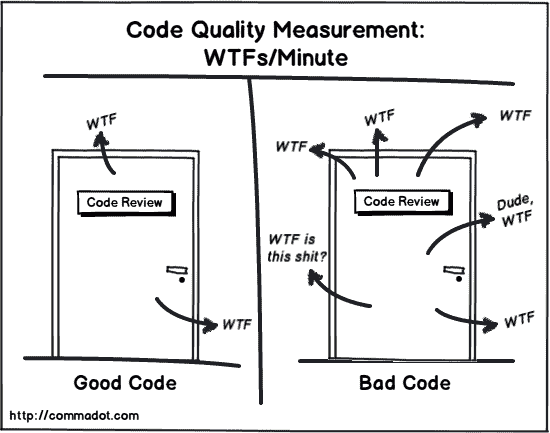
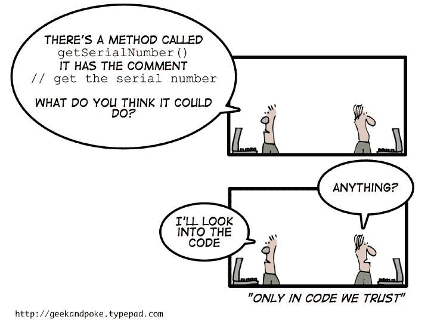
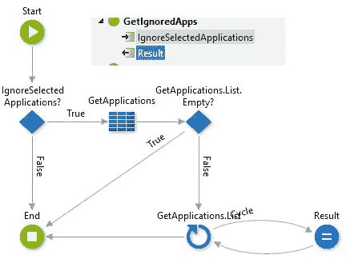
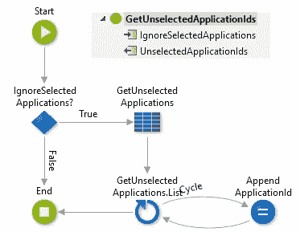
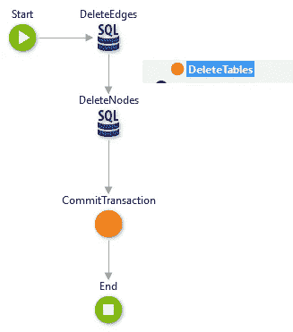
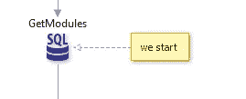
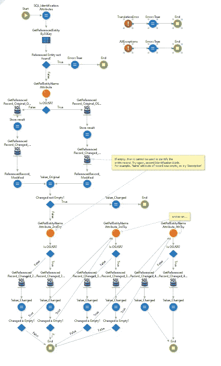
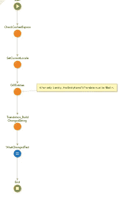

# 清除外部系统中的代码

> 原文：<https://itnext.io/clean-code-in-outsystems-570eaa78d1b2?source=collection_archive---------1----------------------->

你读这篇文章可能有两个原因。首先，你是一个外部系统开发者。第二，你想成为一个更好的系统外开发者。很好，我们需要更好的外部系统——开发者！

在这篇博客中，我将深入讨论干净的代码、有意义的名字、评论和动作。

# 1.介绍

典型的代码评审会议

不用我说，开发很有趣，但也很辛苦。用户比以往任何时候都更快地要求新功能，并且需要更复杂的逻辑。

OutSystems 是一个低代码平台。OutSystems 从我们手中拿走了许多负担，并使您致力于解决业务问题，而不是构建类。TrueChange(tm)将防止我们产生明显的错误。因此，我们不必担心干净的代码，对不对？

不对！即使是低代码，干净代码的规则仍然以这样或那样的方式适用。在 OutSystems 中，仍然很容易创建您不想要的依赖项。重复的动作，奇怪的评论，模棱两可的命名。

当系统中有糟糕的代码时，它会发展成更糟糕的代码，因为开发人员害怕改变代码。也许他们信任它，会在代码的基础上进一步构建，或者甚至构建一个重复的动作，做同样的事情，但稍有不同。

突然你注意到 bug 的数量在增加，而新功能的数量在减少。

# 2.当前工具

我们有保持一致的最佳实践，命名约定和保持模块小于 4Mb。我们甚至有工具，如 [Discovery](https://www.outsystems.com/forge/component-versions/409/discovery) 或 [Clean Architecture Tool](https://www.outsystems.com/forge/component-overview/1548/clean-architecture-tool) ，来检查全局架构。最后，我们有像 Tosca 和 Selenium 这样的工具来做最终用户测试。即将到来的是像 [Boncode](http://www.bon-code.nl/) 这样的工具，用来检查我们是否没有重复的代码和不太大的功能。

然而，作为开发人员，我们可以自己做更多的事情来产生干净的代码和可维护的代码。一切为了快乐的开发者、用户和开发者。我们不应该依赖测试人员来为我们找到 bug。我们必须确保一开始就没有错误。

如何做到这一点，嗯…

# 3.这里是干净的代码

Robert C. Martin 写了几本关于干净编码的书，这些书可以帮助你成为一个更好的干净代码的作者，并且帮助你将不好的代码转化为好的代码。这需要我们开发人员有更好的纪律，这也可能意味着我们在冲刺阶段将会有更低的速度。

尽管如此，比起引入坏代码的快速代码，编写优秀的、可维护的代码更好。

我将讨论 Martin 在他的书中描述的一些概念，并将它们投射到我认为我们应该如何在外部系统中使用和应用它们。这对我来说也是一次探索，因为我确实想提高我参与的每个项目，所以请和我一起讨论这个话题。

# 4.让露营地比你发现时更干净

这是童子军规则，你在这里也应该适用。如果有一件事是你在修复错误或开发新屏幕时应该做的，那就是让它比以前更好。这是一个简单的规则，可以使生活变得容易得多。但是这只有当你首先有一个好的测试覆盖率时才起作用，这在外部系统中是很难做到的。我建议尝试为您的代码准备一个完整的测试套件。

# 5.有意义的名字

OutSystems 确实有一些关于命名约定的最佳实践。

*   有意义的名称(如“客户”而不是“Cstr”)
*   使用 PascalCase(例如 IsCustomerValid、FetchCookies)
*   带“Id”后缀的外键(例如“CustomerId”)
*   在记录的名称中包括实体的名称(例如“客户”而不是“记录”)
*   用前缀对屏幕进行分组(如“客户编辑”、“客户展示”)
*   为计时器调用的操作添加前缀“Timer_”
*   设置 ShowRecords、EditRecords 和 TableRecords 的 Name 属性

这有助于我们创造有意义的名字吗？

## 使用透露意图的名字

版本 1

我知道它是做什么的，但是你知道吗？我假设您是通过看到名称并看到它从数据库中获取一些东西而得到这个想法的，如果可能的话，循环通过它并执行一些有结果的操作。这段代码可以通过最佳实践，但是有些地方不对。

经过一些思考，改变，改变回来，我得出这个动作的以下变化。

版本 2

正如您所看到的，我已经重命名了该操作以表示它所做的事情，它返回 UnselectedApplicationIds，这比 GetIgnoredApps 更有意义，因为它实际上只返回 id 列表。在不改变最终结果的情况下，行动本身也有一些清理。

作为开发人员，我们不应该轻率地考虑如何命名我们的动作和变量。它们应该是有意义的，并且容易看出特定动作或变量的意图是什么。

## 避免虚假信息

这个相对简单，我们应该尽量避免那些没有说明它们实际功能的名字。例如，当您返回一个应用程序而不是多个应用程序时，名称当然不应该是 ApplicationList。

在我的代码中，我还注意到了一个名为“DeleteTables”的操作

哎哟！

哎哟，意图挺明显的！遗憾的是，它只删除了 2 个表的内容(可能有一些级联，但不是我拥有的每个表)。现在，我将不得不回溯它实际被调用的时间和原因，这样我就可以将其重命名为一个更好的名称，这样它实际上揭示了这个操作的意图。

## 进行有意义的区分

根据我的经验，这是最难解决的命名问题。我们有多少次会以类似这样的行为结束

我们如何知道在什么情况下选择哪个动作，有什么区别？

此外，尽量避免使用“edgesJSON”这样的名称，因为即使我们知道其意图，如果我们决定将其改为 XML 呢？这同样适用于像“NameString”或“RecordAccount”这样的名字，因为它提供了以后可以更改的信息。一个记录可以被改变成一个结构，它仍然是一个记录吗，或者它需要被改变成“结构帐户”吗？

## 避免编码

OutSystems 是强类型的，所以使用[匈牙利符号](https://en.wikipedia.org/wiki/Hungarian_notation)(例如 iSize)是不明智的。作为开发人员，当我们想解决问题时，我们必须考虑这一点。

## 为每个概念选择一个词

为每个抽象概念选择一个单词，并坚持使用。例如，在代码中看到“get”、“fetch”和“retrieve”是非常令人困惑的。它出现在代码中的原因通常是开发人员本身的习惯。也许我们遇到区分的问题，没有更好的方法来命名行动。幸运的是，一个简单的搜索和替换可以很容易地解决这个问题。

## 结论

命名是困难的，不能掉以轻心。更难的是，OutSystems 限制了动作、结构和变量名的长度，这促进了缩短和神秘的命名。所以如果你喜欢干净的代码，请支持[延长名字](https://www.outsystems.com/ideas/5627/)的想法。

# 6.评论

评论从一开始就是一种必要的邪恶。它们很棘手，如果你不照顾它们，它们就会变得“过时”。有好的评价，也有不好的评价。好评论的危险在于，随着时间的推移，它们可能会变成坏评论。可惜，差评永远不会演变成好评论！

## 信息丰富的评论

注释有助于理解逻辑的意图(或者当赋值的命名由于外部系统的性质而不充分时)。

请注意，它不是一个动作的正确名称的替换，因为更好的方法是改变动作或重构它。

## 待办事项注释

是的，这是一个帮助开发者的很棒的功能。但是，每次都应该对它们进行审查，因为最终它们都必须被完成和删除！

## 多余的评论

嗯

不要这样做，这没有意义，只会让屏幕变得杂乱

## 咕哝等..

这有帮助吗？

## 注释掉的操作

好了，我现在得小心了。P11 之前我们没有这个，但是某个人(他的名字大家都知道！)认为这是一个伟大的想法，并建议这样做。现在我们在 P11 中有了这个功能。

对此要非常小心，无论如何我们有版本控制，所以不要拖注释掉的动作太久。最好将它们放在开发人员专用的模块中，而不是将它们放回生产代码中！

## 日志注释

在我们得到某种形式的发布评论之前，我们有点被外部系统中的这种评论所困。我强烈建议在任何情况下都不要使用它们，因为 John Doe 在 2015 年向 ActionY 添加了一个 boolean 并不能提供太多信息。

## 结论

正如一位著名的骑士曾经说过的“但是要明智地选择，因为真实的评论会给你带来信息，而虚假的评论会从你那里拿走信息。”

# 7.行动

在外部系统中，我们到处都在使用动作。你可以创建漂亮干净的动作，或者可能导致复杂、不可维护和奇怪副作用的动作。例如，当试图在一个地方解决一个问题时，会导致其他地方的东西掉下来，就像一个很好的 jenga 游戏一样。在这里，我主要谈论服务器动作和服务动作，屏幕动作可能略有不同。

## 小的

行动应该是小的，如果你有机会，让它们变得更小。当行动很小的时候，你很容易理解他们做了什么和为什么。为他们制作测试用例也更容易。拿着这个样本

对我来说，这是一个太大的动作，我认为它应该被重构以阐明它做了什么，而不必考虑流本身。

一个不同的例子显示了更简单的操作。

我通常的目标是从开始到结束最多有十个节点，不包括简单的分支和异常处理程序。然而，这也是由团队来决定他们发现什么是有用的。

## 做一件事

> 行动应该做一件事。他们应该做好这件事，他们应该只做这件事。

说得简单，做起来难。为了防止重复做事情，我们喜欢考虑同时做几件事情。然而，这可能很棘手。如果你不想再做那件事了呢？如果你“正确地”编码了它，那么问题就在于去掉那个功能。如果你没有，你需要将这个函数拆分，这样就有可能引入 bug。

## 动作输入参数

理想情况下，输入参数应该少于三个。这只是有助于功能的简单测试。我希望在您将要编写的 CRUD-wrapper 中能经常做到这一点，那么为什么要止步于此呢？

这是一个很难在外部系统中进行辩护的论点，因为我们缺乏外部系统中的类的概念，因此没有一个很好的方法来拥有一个很酷的作用域。

仍然要尽量减少参数的数量，因为参数越多，使用该函数的可能性就越大。

## 标志参数

这种做法很糟糕。将一个布尔值传递给一个动作几乎意味着该动作在为真时做一件事，在为假时做另一件事。这也意味着你将有一个通用的动作名称，而不是两个明确的动作名称。

回到我的第一个例子，基于一个布尔值，我将获取应用程序是否被忽略。但是我为什么要传递那个布尔值，不传递它更有意义，但是在调用动作上做 if。也许这将导致更多的重构，但这将意味着我将拥有可以单独测试的简单动作。

版本 2 到版本 3

## 没有副作用

实际上我希望我不需要这么说，但是动作应该做一件事情，而不是在其他地方做一些秘密的事情，例如改变某个地方的记录状态。

## 优先选择异常，而不是返回错误代码

如果你使用错误代码，你将不得不写大量的 If 语句来检查是否一切都按预期进行。这将创建更多的代码，但实际上对代码本身没有任何价值。另一方面，OutSystems 没有提供一个很好的方法来以更细粒度的方式捕捉异常。这里我们必须考虑我们想要达到的影响。通常，我们甚至不希望继续流，而是希望回滚事务，所以使用异常！

## 不要重复你自己

另一个明显的例子是在外部系统中。如果您重复代码，每当特定代码需要更改时，您将不得不维护代码两次。同样，这在系统内部并不总是容易的，因为它的哲学是如何构建代码。尽管如此，还是要尝试识别重复的代码，并思考如何在不违反其他规则的情况下将它们合并成一个代码。

## 结论

永远不要停止思考这个动作是否做了它应该做的和它暗示要做的。

# 8.下一步是什么？

这些想法应该把你带到一个更高的层次，成为一个享受乐趣和编写伟大代码的优秀开发人员。这是第一步，我希望你能在自己的代码中加入一些，这样就能有干净的代码。