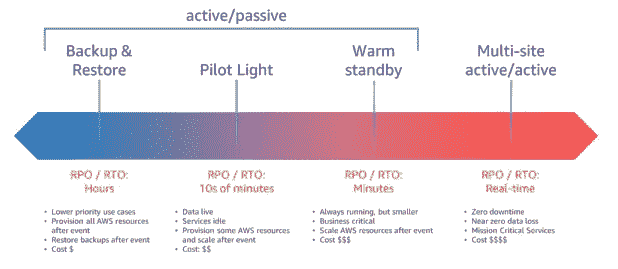
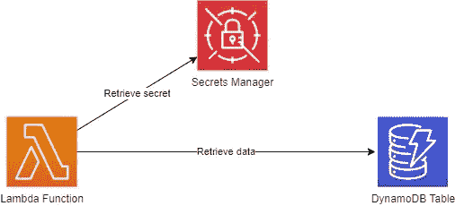
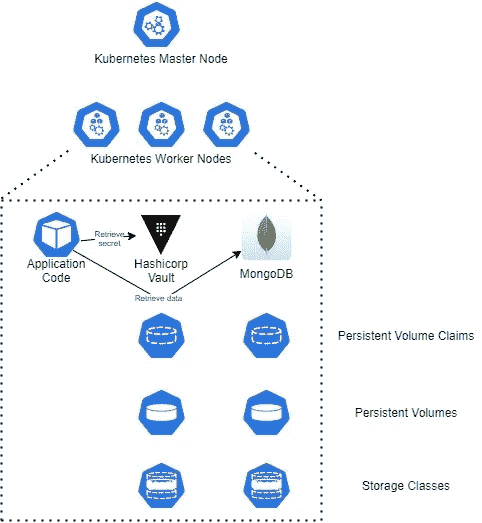

# 云原生和可移植性考虑

> 原文：<https://itnext.io/cloud-native-and-portability-considerations-5e26cca0e326?source=collection_archive---------5----------------------->

**谷歌物联网核心惊喜！**

我认为公平地说，谷歌本周宣布其物联网核心服务将于 2023 年 8 月 16 日退役，这让一些人感到惊讶。一项服务的超大规模衰落绝不是独一无二的，但这里似乎不同寻常的是，谷歌已经通过物联网核心做到了这一点，这项服务已经向客户提供了大约 5 年，是支撑许多东西(联网汽车、智能城市等)的重要领域，但没有相应的服务可供迁移。简单的信息是客户应该联系他们的客户团队，这可能是雪上加霜。

使用小型供应商利基云服务的客户在过去可能会有一些惊喜，公司进入管理阶段，需要很快退出服务，但我怀疑任何谷歌客户都没有看到这种情况的到来。凭借这一旗帜，谷歌为他们的客户制造了技术债务，毫无疑问，为他们的一些客户制造了一些大规模的迁移项目，在关闭之前有一年的时间来完成这些项目。我看到有人提出，影响可能不仅限于改变中央物联网核心平台，还可能涉及需要在受管设备上更换固件。

谷歌的物联网核心退休信息——这可不是客户本周醒来想要看到的

这让我想知道，对于谷歌的物联网客户、谷歌更广泛的客户，乃至整个行业来说，这是否可能是一个分水岭。客户是否会开始更详细地考虑他们要签署的超大规模 Ts 和 Cs，特别是那些签署多年期企业协议的客户，这些协议承诺他们将在超大规模上花费一定金额，以换取合理的标价折扣。想象一下，作为一个大型谷歌物联网核心客户，做出了多年的支出承诺，现在你意识到谷歌可以让你的主要服务退役，而你原本打算让这些服务在你做出的承诺中占很大比例。我想有人会仔细检查他们现有的合同和未来的合同，以了解他们的风险，如果主要服务消失，他们可能会要求中断条款。

AWS 作为最初的公共云服务，这些年来肯定不得不淘汰一些服务。我使用 AWS 生态系统刚刚超过 5 年，我想不出这样的例子。当然，随着年龄的增长，技术债务也随之而来，这可以通过不断改进服务来解决，也可以通过发布新的服务与旧的服务一起运行或允许旧的服务退役来解决。当最初的虚拟机服务 EC2 Classic 被 EC2 VPC(现在简称为 VPC)取代时，这两种服务并行运行。然后，EC2 classic 仅面向现有客户，最终面向所有人停止使用，客户将获得一些关于迁移选项的[指导](https://docs.aws.amazon.com/AWSEC2/latest/UserGuide/vpc-migrate.html)以及可用于进行大规模迁移的 Cloud bearing/AWS 应用程序迁移服务(MGN)等服务。着陆区解决方案是一个稍微有点棘手的体验，最初的 AWS Proserve 着陆区解决方案[被投入长期支持](https://aws.amazon.com/solutions/implementations/aws-landing-zone/)(即，你仍然可以使用它，但它没有新功能)，建议使用着陆区作为服务[控制塔](https://aws.amazon.com/controltower)解决方案，然而，在提供一些关于从一个转移到另一个的[说明性指导](https://aws.amazon.com/blogs/mt/migrate-aws-landing-zone-solution-to-aws-control-tower/)之前，过了相当长的时间。

我们能做些什么呢？

在这一点上，服务器拥抱者和数据中心半空的人可能会开始尖叫“锁定”并谈论云遣返。就我个人而言，我发现“锁定”这个词会让这个话题变得相当情绪化。它通常由拥有解决方案的人使用，以防止您被锁定在您担心的事情上，同时将您锁定在他们的解决方案上(例如，云管理平台工具提供让您调配到多种云)。事实上,“锁定”并不意味着你不能改变什么，它只是意味着需要做些工作来实现这种改变。

这就是为什么我特别喜欢“可移植性时间目标”这个术语，我认为它是由 Red Hat 的一些比我更聪明的人创造的。在我看来，这就把话题中的情绪去掉了。这真的会让你思考‘如果我必须移动这个应用程序/服务，我愿意花多长时间？’同样，恢复点目标(RPO)和恢复时间目标(RTO)使您能够从逻辑上考虑您高可用性/灾难恢复需求。这有助于避免做出昂贵的决定，即无论成本如何，一切都需要高度可用，并导致关于需求和这些需求的成本影响的富有成效的对话。

不同 RPO 和 RTO 的 AWS 灾难恢复方案

我们可以将类似的概念应用于可移植性。

一方面，您拥有来自超大规模的本机服务。这些服务消除了客户的“无差别负担”,使您能够真正快速地构建解决方案，几乎没有管理开销，并在特定 SLA 的范围内为您提供可扩展性和可用性。这些服务通常是按使用付费的，尽管有些服务可能会因提供特定容量而收取固定费用，并且通常非常经济高效。例如，以这种方式运营，使 [Cazoo 迅速进入在线汽车销售市场，并无缝扩展](https://www.aboutamazon.eu/news/press-lounge/cazoo-goes-all-in-on-aws-to-transform-car-buying-and-selling-across-the-uk-europe)，并且是今年 AWS 伦敦峰会上的一个展示。

简单的 AWS 示例

另一方面，我们有完全基于容器的服务。当我说完全时，我真正的意思是完全，容器中没有调用 DynamoDB 表或 AWS Secrets Manager 的应用程序工作负载，因为要将它移动到其他地方，您必须更新代码，用另一个提供者的等效服务替换那些服务。你需要一个秘密管理工具，部署基于容器的工具，例如 [Hashicorp Vault](https://registry.hub.docker.com/_/vault/) 。想要一个 NoSQL 数据库吗？部署一个基于容器的，例如 [MongoDB](https://hub.docker.com/_/mongo/) 。你明白了。如果您想将这一点发挥到极致，您可以让应用程序主动跨多个云分布，这样您就可以将可移植性时间降至零。当然，这种方法有利于跨超大规模的可移植性，但它的缺点是需要更长的时间来实现价值(您需要构建和管理像 Red Hat OpenShift 或 Kubernetes 这样的平台)，它有更多的管理开销，您需要管理可用性和规模，并且成本可能很快就会增加。您已经从 hyperscaler 中移除了“锁定”(即，您在该层的 PTO 现在很低/为零)，但是您已经将自己锁定在 Red Hat OpenShift 或 Kubernetes 生态系统、MongoDB 和 Hashicorp vault 中，因为您将不得不花费时间来替换 API 调用、部署机制等。如果你想在未来远离这些。

替代示例

当然，这是范围的两个极端，如果你决定它们提供的价值值得你以后花时间移植到其他东西，没有什么可以阻止你逐个服务地评估事物并构建自己的服务，同时消费一些特定的超大规模原生服务。

我创建了一个类似的范围来讨论解决方案选项以及对价值实现时间、管理开销和成本的影响。

希望以上是有用的，并有助于解释为什么没有正确的答案，以及您确实需要考虑您的优先级，就像您可能如何与 RPO / RTO 搏斗一样。我是 AWS 托管服务的超级粉丝，喜欢用它们来构建和管理东西。我担心盲目相信“避免锁定”咒语的人会花费更多的时间来管理事物，遭受性能下降或担心规模，而他们本可以增加业务价值，而且如果他们花时间了解他们的可移植性要求是什么，可能会花费大量本可以避免的费用。一个折中的办法可能是利用像 [AWS 的 EKS 平台](https://aws.amazon.com/eks/)这样的平台，这将消除所有的 Kubernetes 集群开销，但仍然需要管理其上运行的内容。

就我个人而言，如果可能的话，我会一直学习使用超大规模的本地服务。AWS 和其他公司已经投资了数十亿来开发这些服务，除非你有一些全面的监管等等。我真的认为，如果要在 PTO 接近于零的情况下实现多种服务或混合服务，您会错失这些服务提供的优势，并因围绕使用这些解决方案进行架构设计而带来大量复杂性，还会错失这些服务与 IAM 和加密等其他关键服务之间的集成。