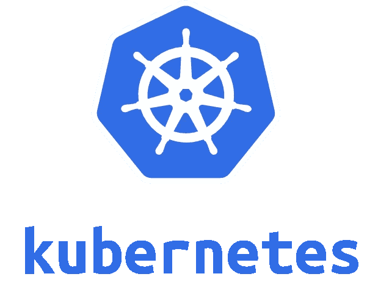

# 使用 kubebuilder 和 kind(又名 kubernetes)操作器的云本地应用程序

> 原文：<https://itnext.io/cloud-native-applications-with-kubebuilder-and-kind-aka-kubernetes-operators-2cf68dc27bea?source=collection_archive---------3----------------------->

**简介**

在本文中，我们将看到如何使用 [kubebuilder](https://github.com/kubernetes-sigs/kubebuilder) 和 [Kind](https://github.com/kubernetes-sigs/kind) 来创建一个本地测试集群和一个操作符，然后在集群中部署该操作符并对其进行测试，包含文件的存储库可以在这里找到，如果您想了解关于这个想法和项目的更多信息，请点击 [forward](https://github.com/kainlite/forward) 。

基本上，代码所做的是创建一个 alpine/socat pod，您可以指定主机、端口和协议，它会为您创建一个隧道，这样您就可以使用端口转发或服务或入口或任何其他方式来公开另一个私有子网中的内容，虽然这听起来可能不是一个好主意，但它有一些用例，所以在执行任何操作之前，请检查您的安全约束。在正常情况下，它应该是安全的。 在进行调试或测试时，它对于测试或访问数据库可能很有用，但这是另一个讨论，这里使用的工具是它如此有趣的原因，这是一个云原生应用程序，因为它是 kubernetes 的原生应用程序，这也是我们将在这里探讨的内容。

虽然 Kind 实际上不是一个需求，但我用它来测试，并且非常喜欢它，它比 minikube 更快更简单。

另外，如果你对我是如何让这个操作员检查这个 [github 问题](https://github.com/kubernetes/kubernetes/issues/72597)感兴趣的话。

**先决条件**

*   [kubebuilder](https://github.com/kubernetes-sigs/kubebuilder)
*   [kustomize](https://github.com/kubernetes-sigs/kustomize)
*   [Go 1.13](https://golang.org/dl/)
*   [种类](https://github.com/kubernetes-sigs/kind)
*   码头工人

**创建项目**

在这一步中，我们需要创建 kubebuilder 项目，因此在一个空文件夹中，我们运行:

**创建 API**

接下来让我们创建一个 API，一些我们可以控制的东西(我们的控制器)。

在此之前，我们只有一些样板文件和基本的或空的默认项目，如果您现在测试它，它将工作，但它不会做任何有趣的事情，但它覆盖了很多领域，我们应该感谢这样一个工具的存在。

将我们的代码添加到组合中

首先我们将把它添加到`api/v1beta1/map_types.go`，这将把我们的字段添加到我们的类型中。基本上我们只是编辑了`MapSpec`和`MapStatus`结构。

现在我们需要将代码添加到`controllers/map_controller.go`中的控制器中

在这个控制器中，我们添加了两个函数，一个创建了一个 pod，基本上修改了整个 Reconcile 函数(这个负责检查状态并进行转换，换句话说，使控制器像控制器一样工作)，还要注意 kubebuilder 注释，它将为我们生成 rbac 配置，非常方便！对吗？

**启动集群**

现在我们将使用[种类](https://github.com/kubernetes-sigs/kind)来创建一个本地集群，以测试它是否可以如此简单！？！？！是的，它是！

在本地运行我们的操作员

为了进行测试，您可以像这样在本地运行您的操作符:

**测试它**

首先我们旋转一个吊舱，发射`nc -l -p 8000`

然后我们编辑我们的清单并应用它，检查一切是否就绪，进行端口转发并启动另一个`nc localhost 8000`来测试一切是否顺利。首先是清单

然后是端口转发和测试

公开发布

在这里，我们只需构建 docker 映像并将其推送到 dockerhub 或我们最喜欢的公共注册表中。然后可以用`make deploy IMG=kainlite/forward:0.0.1`安装，用`make uninstall`卸载

**结束注释**

如果你想了解更多，请务必查看 [kubebuilder 的书](https://book.kubebuilder.io/)和 [kind docs](https://kind.sigs.k8s.io/docs/user/quick-start) ，我希望你喜欢它，并希望在 [twitter](https://twitter.com/kainlite) 或 [github](https://github.com/kainlite) 上看到你！

# 正误表

如果您发现任何错误或有任何建议，请给我发消息，以便解决问题。

此外，您可以在[生成的代码](https://github.com/kainlite/kainlite.github.io)和[源代码](https://github.com/kainlite/blog)中查看源代码和变更

*原载于*[*https://tech squad . rocks*](https://techsquad.rocks/blog/cloud_native_applications_with_kubebuilder_and_kind_aka_kubernetes_operators/)*。*