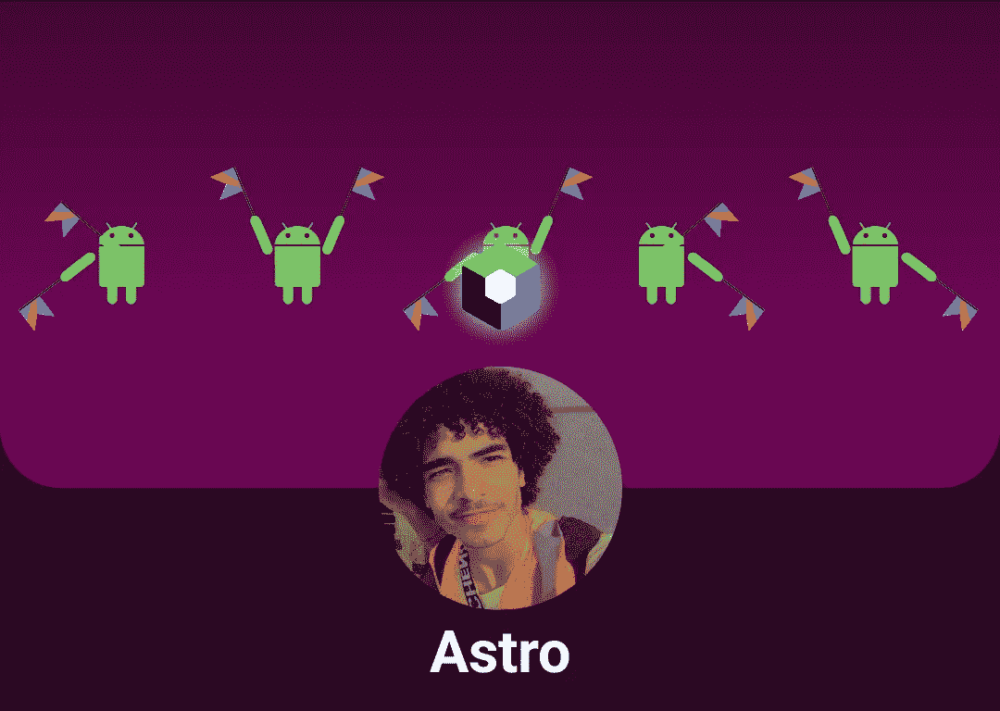

# Jetpack Compose 中带有 MotionLayout 的可折叠应用程序栏

> 原文：<https://itnext.io/collapsible-app-bar-with-motionlayout-in-jetpack-compose-1fb2502acacc?source=collection_archive---------0----------------------->

我们之前已经看到了如何使用视图系统，使用**appbar layout**&**collapsing toolbar layout**来创建折叠的应用程序栏/工具栏。现在在 Jetpack Compose 中，几乎所有东西都是完全可定制的。扩展和折叠工具栏可以在没有 **MotionLayout** 的帮助下实现，因为在 Android 中制作动画从来没有像使用 Compose animation APIs 这样简单。但是，我们希望根据动画的关键帧来制作视图或可组合的多个属性/特性的动画，或者我们可能希望有一个复杂的动画。因此， **MotionLayout** 来拯救这个过程，因为它通过定义**约束集**来告诉布局/UI 如何看待动画的开始以及它在动画结束时的样子，并且简单地 **MotionLayout** 将通过这些集来制作动画。

让我们从添加我们的依赖项开始，或者实际上是我们的单个依赖项

在视图系统中，运动布局是约束布局的子类，这就是为什么我们在这里使用约束布局依赖的原因。

现在让我们来定义约束集。与在视图系统中用 XML 定义不同，compos 中的 motion layout 使用了与 JSON 非常相似的 JSON5 语法。创建一个新的 json5 文件，将其放入 res 下的 raw 文件中。如果没有 raw 文件，请右键单击 app>New>Android Resource Directory 创建一个，然后在 resource type 下选择 raw。最后，创建一个名为 motion_scene.json5 的文件。

就像 JSON 一样，我们启动一个对象，然后定义另一个 ConstraintSets 对象，在那里放置我们的布局集。注意这里我们没有在键名之间添加引号，因为 JSON5 不要求我们这样做。

在每个集合(开始和结束)中，我们添加我们的子视图作为对象，然后我们开始给它们属性和约束，就像约束布局和运动布局一样。

在这里，我们定义了每个视图在动画开始阶段的样子。每个对象的名称代表该视图的 ID(例如，用户名。box_image 等。)我们稍后将在我们的 compose 项目中使用它。宽度和高度属性是不言自明的，它们的值被认为是 Dp。将“spread”作为值传递给 width 或 height 键相当于视图系统中的 0dp 或 match 约束。现在，为了给我们的对象或视图提供约束，我们将使用 top、bottom、start 和 end 属性。如您所见，weapon_icon 被约束为从它的开始到父对象的开始，从它的结束到父对象的结束，最后从它的底部到 user_image 的顶部，有 8dp 的边距。

所以定义约束就像定义一个列表。首先，给出列表的名称，该名称指向要约束当前视图的方向(顶部、起点、底部或终点)，然后是要约束对象的目标视图，最后是要约束的目标视图的方向。最后一个参数是可选的，它是您从目标视图向当前视图添加一些边距的地方。

我们还为 box_image 定义了一个 alpha，它是视图系统中的一个已知属性。但是什么是习俗呢？我们在 box 对象中放置了一个自定义键，这就是我们在 compose 的 motion 布局中为视图定义自定义属性的方式。它相当于旧视图世界中的 **CustomAttribute** 标签。

在视图系统中定义自定义属性

在完成我们动画的开始阶段后，是时候宣布它的最终外观了。现在，在最终集合中，让我们放置相同的视图，但是它们的属性值不同。

几乎相同的流程、相同的 id 和相同的属性。您可能会注意到我们更改了一些值，例如，box_image 的 alpha 在开始集合中是 1，现在在结束集合中是 0。类似地，在将框的宽度和高度设为 25 后，框的 roundValue 现在为 0，其他视图也是如此。

现在，运动布局将尽最大努力从开始集过渡到结束集。在添加任何自定义过渡之前，让我们看看我们的结果。

因此，在 MotionAppBar composable 中，我们从原始资源访问运动场景文件，然后定义进度变量，我们将使用该变量根据 0 和 1 之间的浮点值从开始过渡到结束。如果 lazyColumn 中列表的第一个可见项不是第一、第二、第三或第四项，我们希望动画开始。我们还为 MotionLayout composable 定义了 motionHeight，以便在动画过程中相应地更改，从而充当顶部应用程序栏。获取运动场景后，我们将它与进度一起传递给 MotionLayout composable，最后在运动布局的范围内，我们放置我们的子组件，并通过使用 **layoutId** 修改器给它们在运动场景文件中定义的 Id，它们将根据我们的约束放置。现在为了使用我们的定制属性，我们通过**motion properties**composable 函数访问它们，并传递我们想要从中检索定制属性的视图的 ID。最后，我们通过调用。值来获取值和。datatype 来确定这个自定义属性的值的类型，在本例中是 int。所以我们打电话。int 并传递属性名(roundValue)。

让我们在我们的 **MainActivity.kt** 文件中测试这个行为，我们创建一个可组合的 Scaffold 来将我们的可组合的 MotionAppBar 传递给 topBar 参数。注意，相同的惰性状态被传递到 LazyColumn composable 和我们的自定义应用程序栏，以跟踪第一个项目的可见性。同样重要的是添加 **animateContentSize()** 修改器，一旦顶部应用程序栏的高度发生变化，就可以动画显示懒惰栏的高度。

我们的结果

很棒吧？现在，让我们添加我们的自定义过渡，使应用程序栏结束状态更优雅。在父对象中，就在我们的 motion_scene.json5 文件中的 **ConstraintSets** 键下面，我们定义了我们的**过渡** JSON 对象。

这里在**过渡下，**我们为动画定义默认行为。首先，在默认对象中，我们通过添加它应该从哪里开始和到哪里，以及我们的动画应该采取的弧形路径来构造我们的动画。当动画开始时，属性**pathmotionarcar**被设置为通过垂直弧过渡。此外，我们描述了我们的视图应该如何在定义的帧中动画化它们的属性。例如，在**关键帧**对象下，我们有一个**关键帧属性**对象的列表，在那里我们为每个关键帧指定属性值。

先讨论第一个，把事情说清楚。首先，第一个对象以 user_image 视图为目标，在那里我们设置了两个帧 0(动画的开始)和 100(动画的结束)，然后遵循 rotationZ 属性，在那里我们传递了 0 和 360 度。就是这样，你不必再做什么工作，运动布局将负责动画在 z 轴从 0 到 360 旋转。对于其余的对象，事情是相同的，只是要确保您为您设置的每个帧传递一个对应的属性值。

这是我们的最终结果，这是完整的 [**源代码**](https://github.com/Astroa7m/collapsible-app-bar) 。我希望你喜欢它，如果你喜欢，不要忘记给👏。