# 可配置的 Kong API 网关与科特林的 Micronaut 服务——一场非常奇怪的丝兰致敬音乐会

> 原文：<https://itnext.io/configurable-kong-api-gateway-with-micronaut-services-in-kotlin-a-very-odd-yucca-tribute-concert-e0a978618eab?source=collection_archive---------1----------------------->


电影《金刚》于 1933 年 4 月 28 日****上映。快进和大金刚，1994 年 6 月 14 日发布的电子游戏。孔似乎和大猩猩有着很好的关系。**街头霸王乐队**，虚拟乐队，成立于 **1998** 。他们与本文无关，但我爱他们的音乐。最后，**孔框架**很晚才发布。他们的第一张专辑于 2017 年 10 月发行。****

****孔的故事开始于 **2007** 由 [**现任**CEO【2022】**奥古斯图·马利蒂**](https://konghq.com/blog/author/augusto) 在米兰的一个车库里。在那里，他创立了 MemboxX，成为欧洲最早的数据存储服务提供商之一。两年后， **Marietti** 共同创立了 [**Mashape**](https://konghq.com/blog/mashape-has-a-new-homepage) ，其核心是与应用服务器一起提供的功能的“混搭”。该公司迅速转移到美国旧金山。2015 年，该公司推出了一个名为 Kong 的开源项目，并于 2017 年将该公司更名为 Kong Inc .如今(2021)，**孔**是以 API 网关功能最为人熟知的品牌。然而，**孔**也是其他产品的品牌，如 [**孔网**](https://konghq.com/kong-mesh)[**Imsonia**](https://konghq.com/user-calls/intro-to-insomnia)[**Konnect**](https://konghq.com/kong-konnect)。****

**我第一次听说孔是在几年前(今天是 **2021** )，那时候我在网上搜索 IT 内容时会看到与**孔**相关的代码。我看到了他们的**广告**，也读到了一些关于他们的东西，但是我从来没有真正用过它，或者我从来不知道它到底是干什么用的。有了一点动力，今年我能够花一些时间来弄清楚我能用它做什么。然后我发现**孔**被实现为一个系统的**网关**。在这种情况下，系统可以是任何东西。在我们的例子中，我们将把它作为一个网关，连接到由 **docker-compose** 创建的网络。Kong 作为一种代理，我们可以改变一些属性来检测在这样的网络中对我们的应用程序的访问模式。**

****

****孔标志****

**[在本文中，我们将了解如何实现](https://github.com/jesperancinha/buy-odd-yucca-concert) **API-Gateway，**它能为我们做什么，以及我们如何通过**限速**插件在现实生活中使用它。**

# **情况**

**我为了做到这一点而创建的工作概念，围绕着一个为预订音乐会门票而创建的应用程序。在这种情况下，我们将实施一个我称之为**丝兰演唱会**的概念。其思想是传递数据，以便尽快释放资源，从而接收更多的数据。这个想法是让一个系统尽可能具有反应能力，允许创建音乐会的门票。在这个**丝兰**概念中，我们有某种队列来接收数据，然后让我们的系统在后台处理它。通过这样做，我们释放了应用程序，以便可以将更多的请求放入队列中，然后以异步方式进行处理。通过允许系统具有反应性，我们还需要确保它能够检测到滥用。滥用系统可以有多种形式，如果你熟悉**道德黑客** g 或**软件安全**概念，你就会知道对反应式系统(实际上是任何系统，但可能对反应式系统更是如此)的最大威胁之一是 **DDoS** 攻击。 **DDoS** 攻击是指**分布式**拒绝**服务**的攻击。防止这种情况的方法是使用像 **Kong** 这样的软件网关服务，或者依赖于您的提供商的共享服务，这可以限制您的工作灵活性，并且不允许您安装某些类型的软件。**

**但是，在进一步离题之前，让我们先谈谈我们想要达到的目标。在这种情况下，预订票的目的是为了看演出。在这个 **Yucca** 概念中，门票与一个或多个强制性音乐会日、可选的一杯或多杯饮料、可选的一餐或多餐以及可选的停车相关联。客户立即获得一个预订参考，然后注册完成。由于**丝兰**提供的大部分音乐会都是在线的，而且预计出席人数会非常多，所以不可能完成注册，因为顾客可以实时在线或在售票处注册门票。因此，我们知道，我们将对不同的票段有不同的最高价格。我们还知道，超过一定的比率，成为 **DDoS** 攻击的几率也会增加。根据同样的原则，我们也知道有些人会预订机票，但实际上不会完成请求，也可能会有取消。无论我们计算的门票需求的最大比率是多少，人们也可能会预订一顿饭和一杯饮料。这意味着我们得到的价格是票价的两倍。一场音乐会通常持续 3 天左右，因此在这种情况下，我们可以考虑门票请求的大致三倍价格值。最后，由于停车位非常有限，费率限制应该低得多。**

**那么如果部署后，速率被超越，我们该怎么办？Kong 允许我们在一段时间内阻止进一步的请求，并且根据我们可以根据我们的期望定义的标准。我们可以通过这种方式避免 **DDoS** 攻击。**

# **体系结构**

**对于实现，我想到的第一个问题是:“我想用什么语言实现这个应用程序？”。考虑到目前 JVM 领域的新来者, **Kotlin** 的大肆宣传，我决定进一步尝试。自从去年( **2021** )以来，它变得非常强大，这让我有理由去检查它，以及如何将我在**科特林**和**微机器人**的研究结合起来。对于这个具体的例子，我也想尝试一些新的东西，只是想看看它是如何工作的，以及我能从使用一个新的框架中得到什么。因此，一旦确定我想使用 **Kotlin** 和 **Micronaut** ，我仍然缺少某种流管理系统、队列或其他东西。我只是想要一些我可以注入一些请求，回复客户端并释放资源的东西。实际上，我想让每一个端点都尽可能地具有反应性。所以我添加了 **Redis** 并实现了一个**发布者-订阅者**系统，通常用于**反应式** **工程**。“为什么不是**卡夫卡**”。我在这个问题上已经取得了进展，因为卡夫卡是 IT 世界中的一个巨型框架，似乎这就是我们目前所知道的全部。那和 **Akka** 溪流。所以为了做一些对我来说完全新的事情，我选择了 Redis。但是我仍然不满意，因为我仍然必须选择，从哪个反应式编程模型中选择。正如我之前所探索的， **Spring** 有 webflux，但是在这里我使用的是 **Micronaut。**如今，IT 界的另一件大事是**协程。**这就是有人所说的公然抄袭**项目织机**。不管怎样，因为我以前从来没有用过这个，所以我决定实际使用它。至于其他，我使用非常传统的 **Docker/Docker-compose** 方式在本地启动容器，没有什么特别的，只是因为如果我添加更高级的启动容器的方式，那将超出本文的范围。**

**在解决我们的架构时，我决定每一个不同的请求类型都将在它自己的服务上运行。在这里，我试图遵循一些非常非常基本的**微服务**架构，其中每个服务都有自己的职责。在下面的序列图中，我们可以看到在代码方面我们要看什么:**

**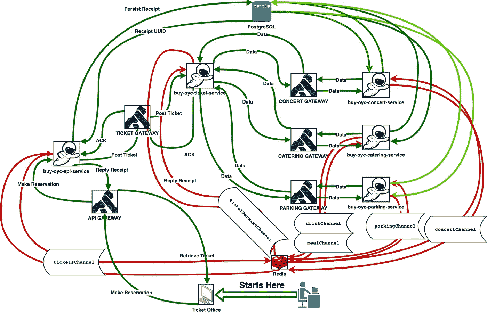**

****非常粗略的建筑草图****

**所以在这张图中我们可以有几个玩家，但是唯一对公众开放的玩家是 **yucca-api** 。这个应用程序负责生成一个收据 id(一个 **UUID** )，并立即返回给客户端。在客户或买家不知情的情况下，机票实际上还没有被处理，甚至还不在数据库中。让我问你一个问题。你有没有收到过类似**“你的请求正在处理中”的邮件。一小时内你会收到你的票。如果您需要致电我们的帮助台，请保留此参考号码。”？**。这正是正在发生的事情。你只是得到一个购买确认，但除此之外，你什么也得不到。与此同时, **yucca-api** 已经获得了您的请求，并为您的机票请求分配了一个刚刚保存到数据库中的收据参考号。然后它会把它运到 **Redis** 。**后端**中的监听器现在将取回这个请求，并通过 **REST** 将其发送给 **yucca-ticket** 。这使得以完全异步的方式处理票据的其余部分成为可能。 **yucca-ticket** 以完全相同的方式运行，除了现在，当它被听众拿起时，它将把票分成三部分:**音乐会数据**、**停车数据**和**餐饮数据**。准确地说，它实际上将请求分成四个部分。**餐饮**数据，如果你没注意到，分为**酒水**和**餐食**。一旦完成，将对**三个**不同的 **API 的**执行**四个** rest 调用。这些是**丝兰餐饮，丝兰音乐会**和**丝兰停车场**。这些服务提供了 4 个端点。所有这些都没有提供 REST 调用，因为它们是每张票据执行的最后一个请求。然而，它们也以一种被动的方式处理这些最后的请求，在收到不同的有效载荷后立即响应，并且只花时间将它们设置到由 **Redis** 提供的发布-订阅系统。此时，我们已经完成了票证请求，用户只会收到一封电子邮件。这最后一点已经超出了本文的范围。我们可以在下面的序列图中看到整个过程的运行:**

****

****丝兰项目顺序图****

**请查看项目主页，以便更好地查看此[序列图。](https://github.com/jesperancinha/buy-odd-yucca-concert)**

**为了理解这一切在数据库中是如何进行的，仔细看看 er 模型也很重要:**

**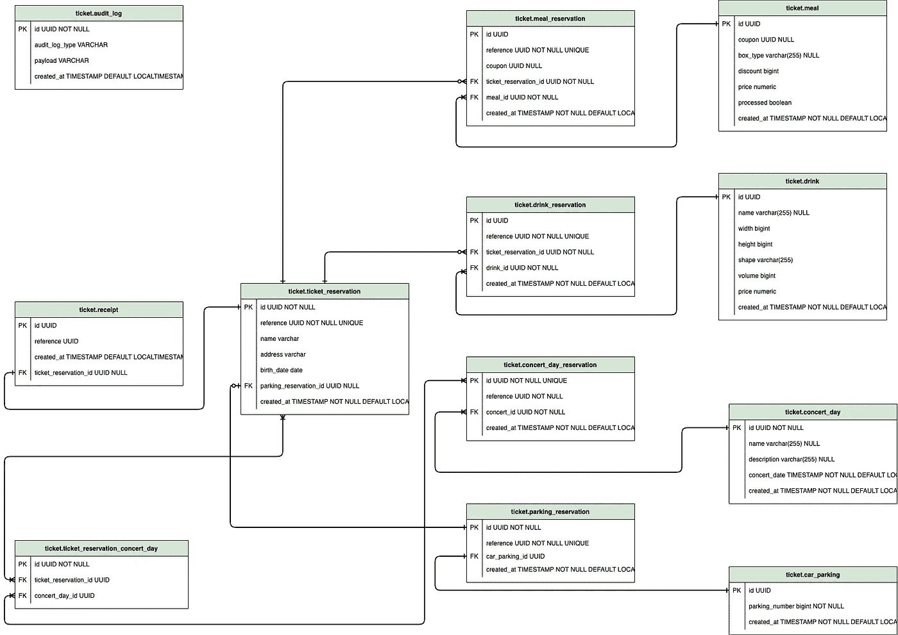**

****实体关系模型****

**这将允许我们收集在初始有效载荷中发送的所有数据。**

# **履行**

**实现这个系统确实需要大量的研究，但我还是做了一些事情。一个是**编解码器**，它为我们的 REST 请求和进出 **Redis** 发布-订阅系统的数据流提供有效负载。因为我想让它尽可能通用，所以我用**具体化的**类型创建了它。这只是为了方便起见，也是为了探索 Kotlin 编程语言。我们稍后会看到为什么这可能是一个可怕的想法:**

**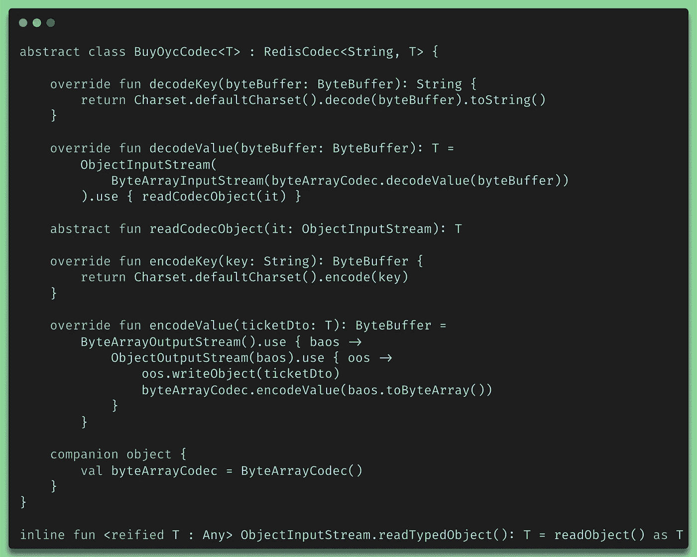**

****readTypedObject 具体化和代码实现****

**正如我们所看到的，有两个重要的接口是我们的 **DTO** 类型需要遵循的。它们需要是 ***可序列化的*** 并且它们还需要是 ***类型的*** 。这只是为了让我们能够将它们序列化为 Redis。仅**其余**控制器通常不需要**可串行化**接口。对于不知道**用**是什么的人来说，这是 ***的一个 ***极度含糖版*** 用 **Java** 里的资源*** 试试。如果你在 Kotlin 中使用它，你可能甚至不知道这是在做什么，所以如果你还不知道，要小心。**

**因为我们也在看数据模型是如何在 **Micronaut** 中创建的，所以看一些创建的实体也很重要。在这种情况下，我们将从 TicketReservation 实体开始，看看一些关系是如何实现的:**

**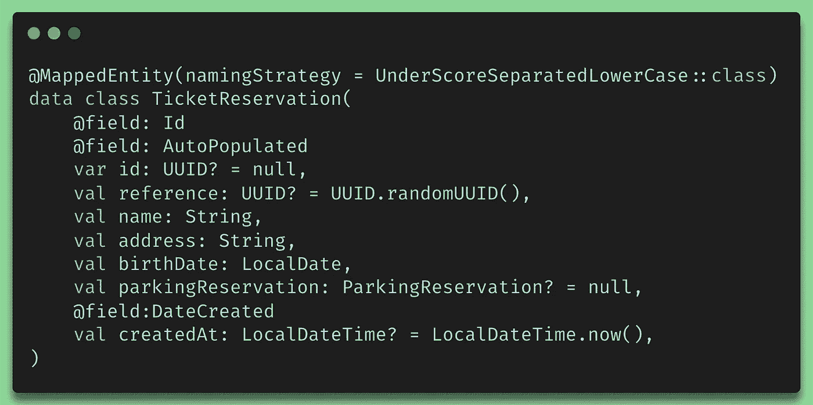**

*****票券预留*****

**MappedEntity 注释允许我们创建实体。简而言之，实体代表了我们通过代码处理表格的方式。Micronaut 有这样的规定，如果你知道 **Hibernate** 你可能已经熟悉了实体。在本文中，它们是完全相同的。假设我们看到的是一个反应式模型，实际的数据库关系，特别是复杂的关系，比如**多对多**、**多对一**、**一对一**和**一对多**几乎没有意义。然而，我们可以使用 Join 注释做一些其他的事情，这看起来工作得很好。一个票证保留区是个人的，因此我们只能将一个停车保留区与其关联。这在任何意义上都是一对一的关系。一旦预定了停车位，只有一个顾客可以使用，并且一个顾客只能使用一个停车位。这是一个逻辑要求，因为这样我们可以向与会者承诺公平的停车位使用。让我们看一下 ParkingReservation 的实现:**

****

****停车保护****

**在这种情况下，ParkingReservation 只是一个中间件表，它指向定义停车号的实际停车场表。这就是我们如何分配停车位。表之间的实际关系由连接注释维护:**

****

****停止 ReservationRepository****

**如果你注意到，机票预订实体本身并没有提及**酒水**、**餐饮**或**演唱会**的预订天数。这将是许多音乐会的许多门票预订、许多饮料的许多门票预订和许多餐饮的许多门票预订的情况。这些关系中的许多关键字与反应式体系结构不匹配。在一个模块化的体系结构中，我们会定义一个餐饮列表、一个饮料列表和一个音乐会日期列表，从而定义多对多的关系，用一个连接表将它们无缝地绑定在一起。饮料和饭菜实际上是菜单中的固定项目，我们真正需要的是它们的预订对应项目。虽然门票预订和饮料之间的关系是多对多关系，但是门票预订和饮料预订之间的关系是一对多关系。换句话说，对于我们拥有的每个机票预订，我们可以进行许多饮料预订，但是所有这些预订只能与一个机票预订相关联，因此是一对多。我们可以将同样的推理应用于餐饮预订和音乐会预订。**

**在这个项目中，我们使用使用外键的脚本来创建数据库，尽管在我们的代码中，我们实际上并没有使用和执行**连接**，而是以一种**热切**的方式。以下是这方面的一个例子:**

**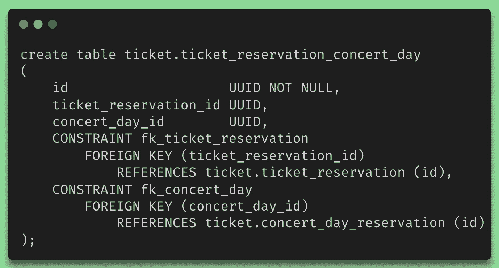**

****ticker _ reservation _ concert _ day 关系****

**在 **Micronaut 的**术语中，正如在 **spring** 中一样，一个**表**也被称为一个**关系**。如果您已经注意到，所有重要的**表**都包含一个**引用**字段。该参考字段将给予客户的号码保存在门票中，当音乐会开始时，他们可以在入口处检索凭证和门票。这个项目中没有实现，但是提到它的意图是很重要的。因此，在第一个实例中不使用过去的表。这只是一个展示所使用的表格样式的例子。**

# **设置孔**

**在学习了一点应用程序是如何设置的之后，我们终于可以开始看看**孔**是如何设置的了。我已经了解了如何在第一个实例中使用 PostgreSQL 数据库持久化、Kong 迁移映像和 Kong 服务来启动 **Kong** 。让我们来看看位于项目根目录下的实际 docker-compose.yaml 文件中的代码片段:**

**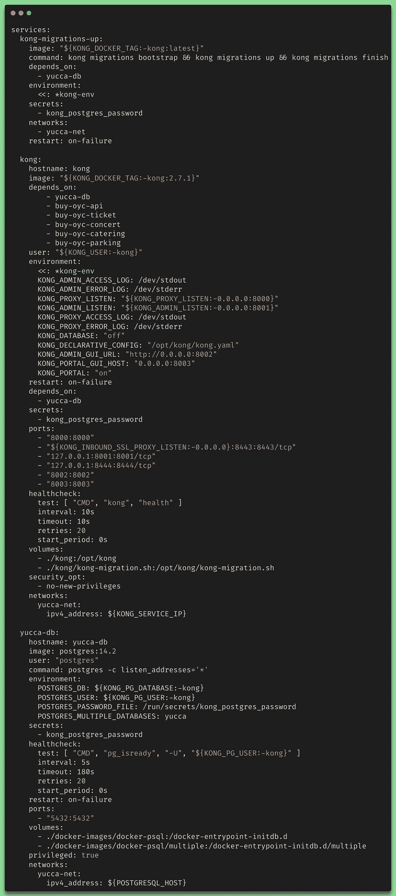**

****Docker 撰写启动 YAML****

**当 Kong 启动时，我们需要让它运行我们喜欢的模式。因为我想在 docker-compose 启动时加载设置，所以我别无选择，只能说我不想使用 Kong 的持久性模型。上面的摘录来自我专门用于集成测试的 **docker-compose-it.yaml** 。因此，从上到下，我们首先看到 docker-migrations-up 服务的声明。这实际上是另一个 Kong 映像，我们使用它作为 runnable 来执行到数据库的迁移。如前所述，对于集成测试来说，这在技术上是不必要的。第二个服务是另一个**孔**容器，我们用它来实际运行**孔**。在这个设置中确实有很多要谈的，但是对于本文，我们只关注端口 **8000** 。这个端口就是我们将要用来访问所有应用程序 **API 的端口。Kong** 使用这个端口(或者我们想要配置的任何端口)作为网关接入点，将所有流量重定向到目的地 **API** 。如果您在前面的图中注意到，在任何情况下都没有对任何**API**的直接访问。我们很快会谈到香港的其他港口。但是首先，我们研究一下 **env** 变量。特定的孔变量允许多种配置。允许自动安装加载的有:**

*   ****孔 _ 数据库** = "关"**
*   ****孔 _ 声明性 _ 配置** ="/opt/kong/kong.yaml**

**对于**KONG _ DECLARATIVE _ CONFIG**，我正在使用 volume **获取那里的配置。/kong:/opt/kong。****

**最后，我们找到了数据库。在这种情况下，创建的卷允许使用以下启动脚本初始化数据库:**

**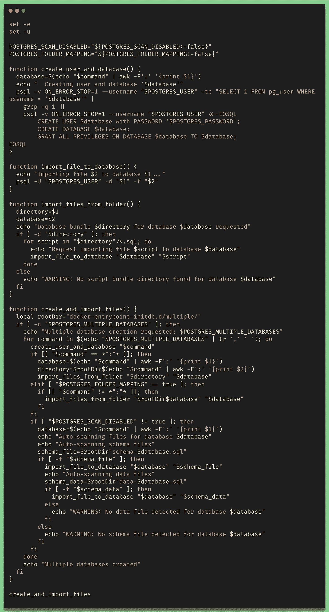**

**创建自[https://github . com/mrts/docker-PostgreSQL-multiple-databases/blob/master/create-multiple-PostgreSQL-databases . sh](https://github.com/mrts/docker-postgresql-multiple-databases/blob/master/create-multiple-postgresql-databases.sh)**

**这个脚本基本上允许基于不同的名称和文件夹名称创建不同的数据库，并使用不同的 data.sql 和 schema.sql 脚本。这使得代码更简洁，更易于使用。我正在使用的文件是由这个文件发展而来的。**

**最后，我们可以看看 kong 文件，它设置了端口、URL 和映射:**

**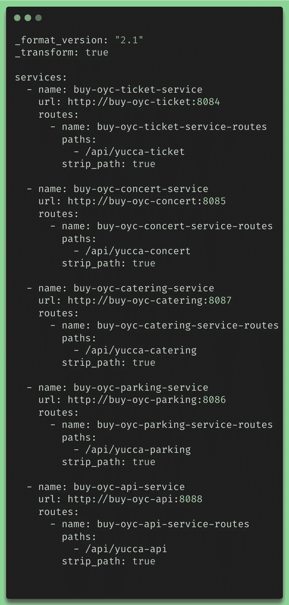**

**这个映射直接与集成测试一起加载。如果我们只是在本地运行我们的设置，那么我们使用不同的方法。**

**首先我们使用 **docker-compose up** 。这将启动所有的东西和容器，直到它稳定下来。一旦启动完成，我们需要将这个配置文件手动注入到**孔**中。为此， **Kong** 提供了一个名为 [**deck**](https://docs.konghq.com/deck/) **的小工具。**请查看他们的[网站](https://docs.konghq.com/deck/)了解更多关于如何安装的信息。在我创建的 **Makefile，**中，有一条我们可以用来自动完成这项工作的指令，这里我使用一个小的 **bash** 轮询技巧来检查 **Kong** 是否已经启动。轮询本身位于 **kong_wait.sh** 文件中:**

**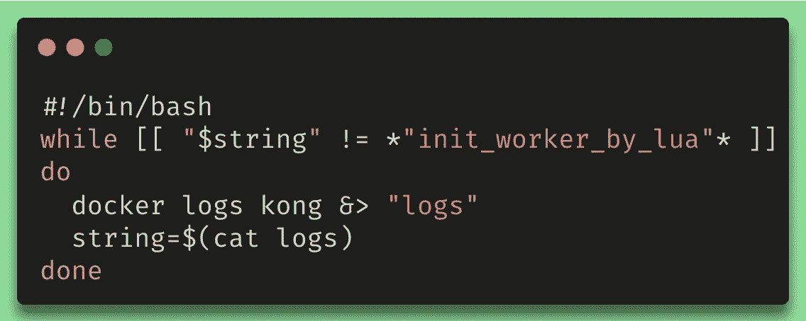**

**最后，在 **Makefile** 中，我们可以看到这段代码，它调用了:**

**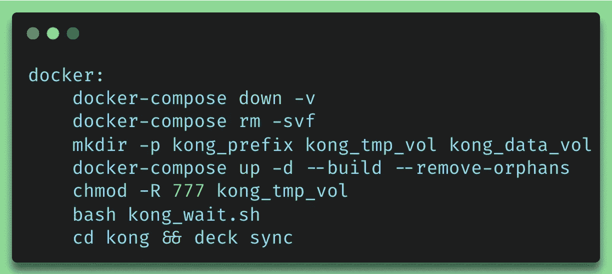**

**需要知道的是 **kong.yaml** 文件是**端点**的**配置**文件。在速率限制方面，我们可以使用 **REST** 调用。**

# **奔跑的孔**

**正如我之前提到的，端口 **8000** 是至关重要的，以便访问不同的 API，并允许 Kong 对请求执行网关过滤。在这个项目中，我们正在研究限速。速率限制可以分别应用于路径和不同的 **API 的**。我们可以看到这些 **API** 的每个定义都单独使用另一个**孔 API。**在端口 **8001** 上，该 API 被打开，并遵循我们自己的配置。在本节中，我们将运行我们的应用程序，因此现在请在根目录下运行以下命令:**

**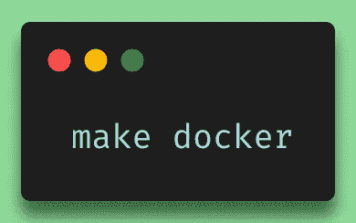**

**这将运行我们之前看到的 **docker** 命令。如果一切运行顺利，您应该让所有容器运行。完成后，请在 [**上打开浏览器 http://localhost:8001。**](http://localhost:8001.) 在这里你会发现**孔**里面的各种配置列表。这只是热身的样子。现在请看这个网址:[http://localhost:8001/plugins](http://localhost:8001/plugins)。您应该会看到一个插件列表。其中一个可能与此类似:**

**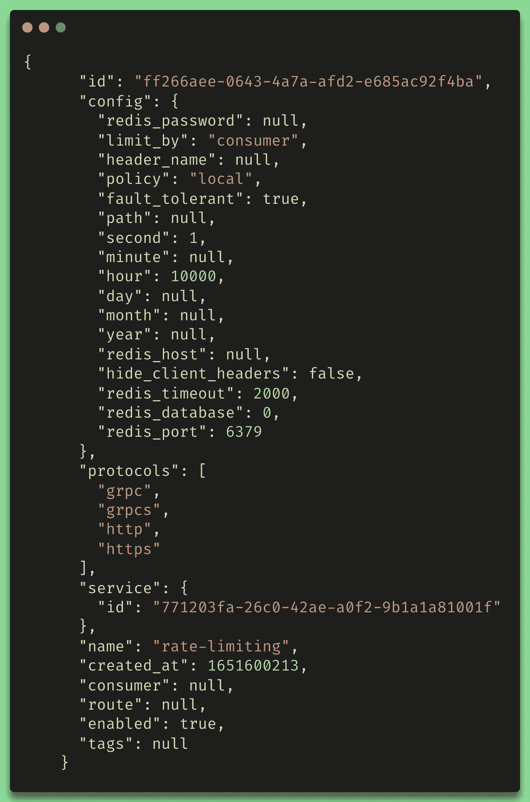**

**这意味着**速率限制**处于活动状态，在这种情况下，我们限制每秒 **1** 个请求，每小时 **10000** 个请求。在这一点上知道**孔**不允许您进行重叠配置也很重要。例如，如果您只允许每小时发出 **1** 个请求，这意味着您每秒只能发出 **60 * 60** = **3600** 个请求。如果您配置的时间超过了**秒**，那么**孔**将会正确地让您知道**秒**限制与**小时**限制相冲突，它将会返回这样一条消息:**

****

**但是现在，我们还没有插件配置，所以让我们开始吧。请在命令行中运行以下命令:**

****

**这仅仅意味着 **API** 现在有了一个插件，在实践中，每秒钟只允许通过网关推送多达 **1** 个请求。本质上，我们限制我们的音乐会以每秒 1 次的速度创作。所有其他人都将得到一个错误。在这种情况下，我们希望我们的分析以及我们如何着手评估请求尽可能透明。这就是为什么我们将 **local、true** 和 **false** 的默认值分别设置为 **config.policy、config.fault_tolerant** 和**config . hide _ client _ headers****。****

**现在我们准备开始轨迹。在另一个命令行上，请运行以下命令:**

**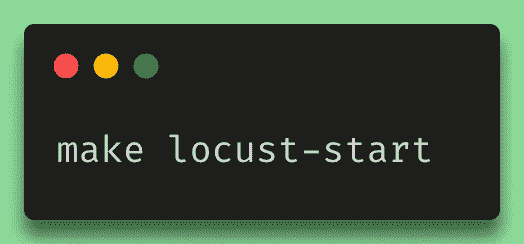**

**这会引发蝗虫。如果你不知道蝗虫，这基本上是一个基准工具。了解如何将其直接安装在[源](https://locust.io/)处。我们对性能测试不感兴趣。相反，我们希望在实践中看到**限速**是如何工作的。也许现在看一下我们的测试用例是个好主意。我们先来看看位于 **/locust/welcome:** 的 python 中的任务脚本**

**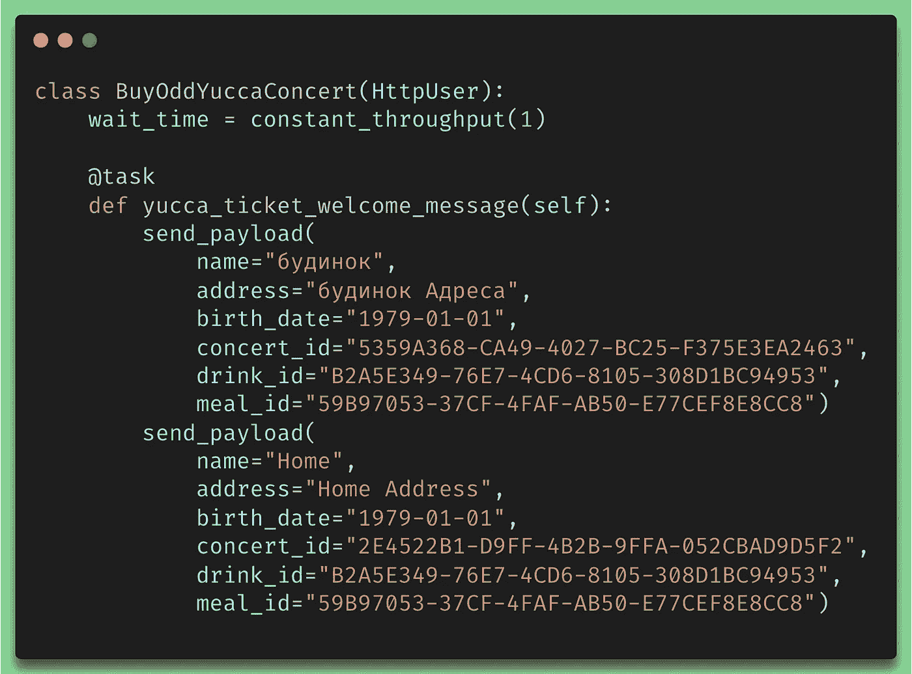**

**这些 Id 是对我们数据库中数据的引用。我正在修正每秒执行一次最低限度**的请求**。在蝗虫术语中，这意味着**每只蝗虫每秒执行一次这个任务**。由于该任务执行两个 post 请求，这意味着我们每秒至少发出 **2 个请求**。请求是固定的。被调用的函数调用 **API** :**

**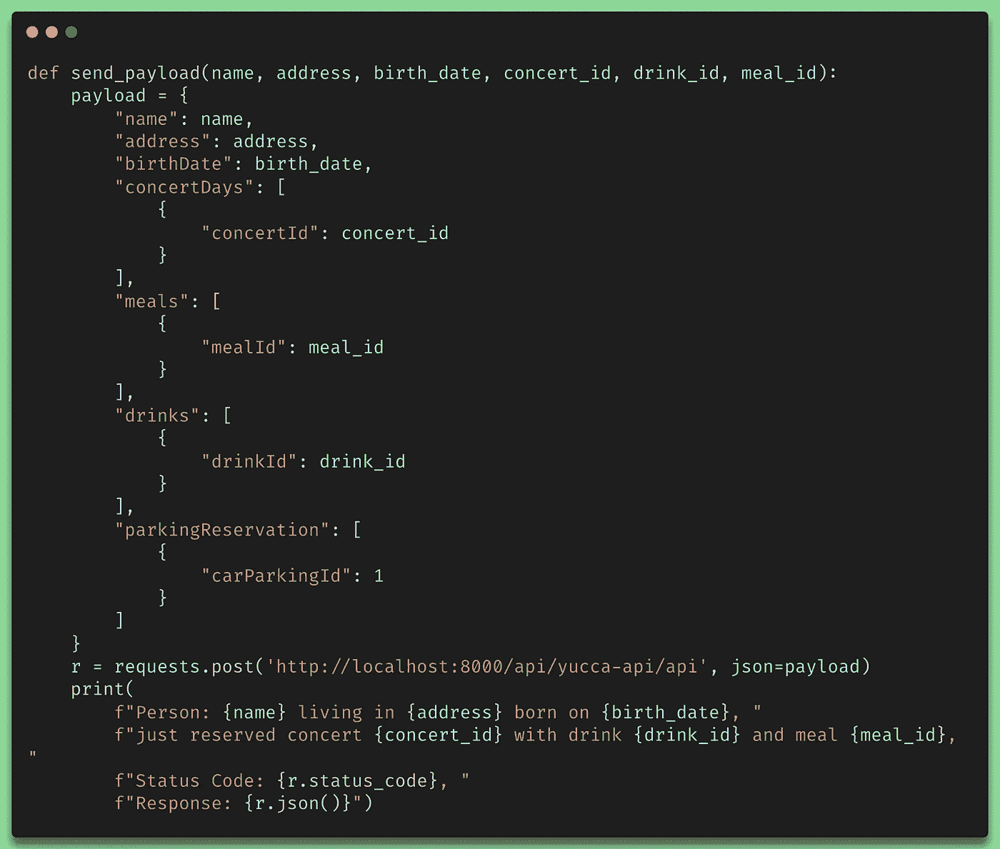**

****有效载荷**只是一个人预订一杯饮料、一顿饭、一个停车位和一场音乐会的一般格式的表示。我们将使用这些数据来确保我们能够执行测试:**

**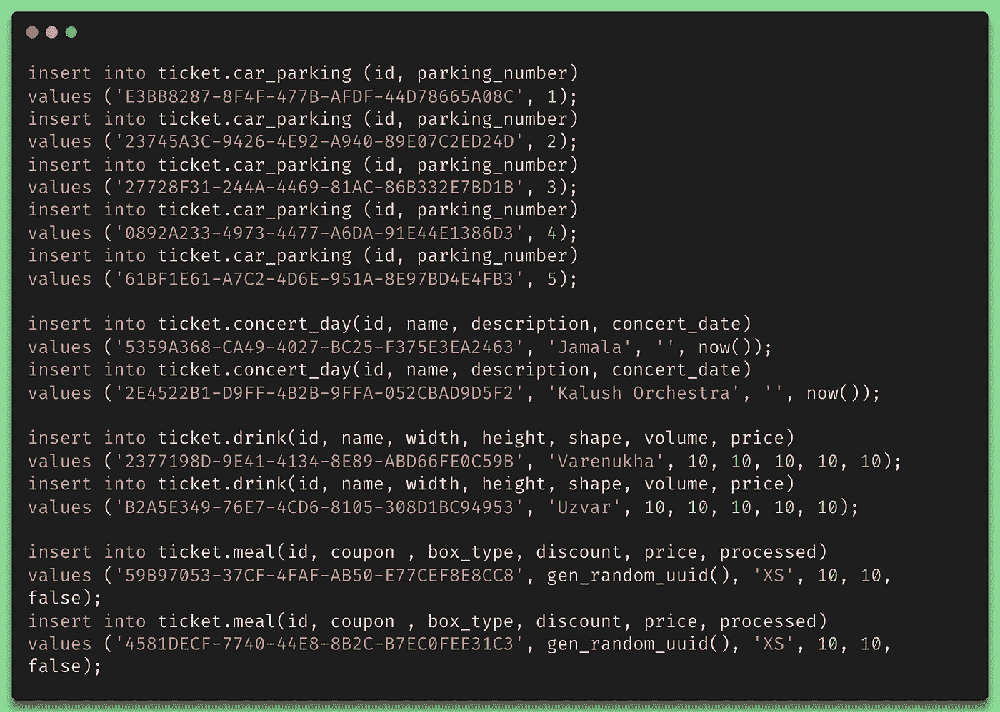**

**现在我们准备开始我们的**蝗虫**测试。如果您注意到命令行日志中有这样的内容:**

****

**如果你运行的是一个好的终端，你应该可以点击链接直接进入[**http://localhost:8089**](http://localhost:8089)**:****

****

**就顺其自然吧。它将**启动一个用户**，并以每秒 **1 的速度**产生更多用户。这意味着，由于我们将**孔**配置为在 **yucca-api** 网关上以每秒 **1 个请求**的速率**最大**发出请求，我们几乎没有向**网关**发送请求。我们会出错。我们的日志将如下所示:**

****

**所以**孔**，现在配置为每秒只接受一个请求，将不能每秒接受 **2 个请求**，如果你以前注意过，这正是我们的蝗虫任务所做的。让蝗虫继续跑吧。**

**在我们的命令行中，当您运行第一个请求时，应该会得到类似这样的结果:**

**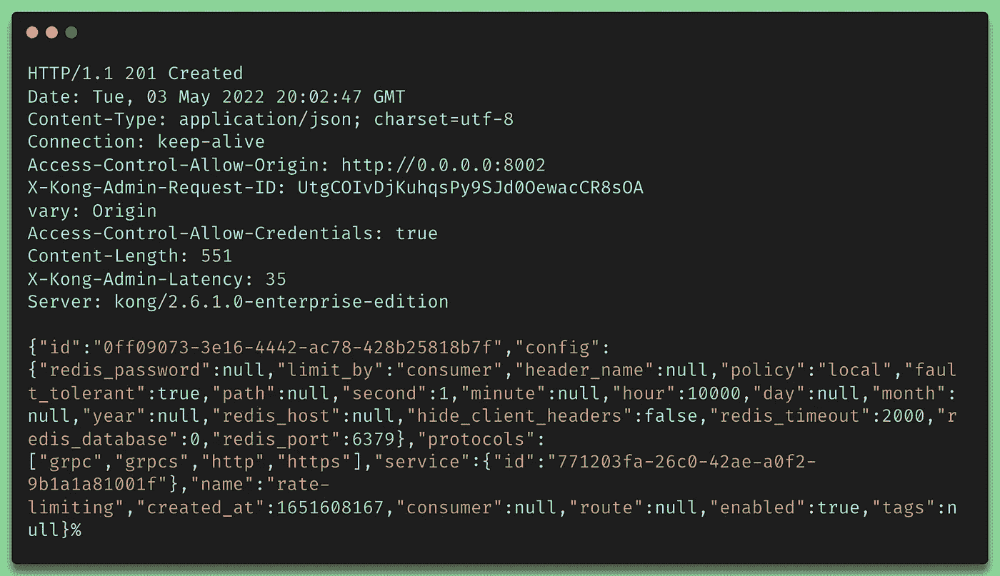**

**这意味着我们已经激活了一个插件，并将其命名为**限速**。这也是我们可以为**孔激活的插件地图的关键。**我们现在想改变费率，所以我们需要移除这个插件并创建一个新的。在这种情况下，我们需要指出我们想要删除的插件的 id。在我们的例子中，它是:**0ff 09073–3e 16–4442-ac78–428 b 25818 b7f:****

****

**现在，我将向您展示我们如何在运行中改变这个现场**。只要确保蝗虫**还在运行。**立即运行该命令:****

********

****您现在应该不会收到任何错误:****

********

****从这一点开始，你应该了解如何改变其他**请求**的速率。请随意尝试，在所有子请求上尝试不同的组合。****

# ******问答******

```
****"How do we know when the ticket is complete in the back end?"****
```

****因为我们异步处理票据，所以实际上没有办法以异步的方式知道这一点。我们最不希望的就是加入所有这些过程，然后等待它们在某个地方结束。这也是不可能的，因为不同的服务应该被允许在不同的机器、领域、区域和域上工作，使得多线程控制不可能。可以做的是使用某种轮询系统来检查所有的数据库元素何时被接收并被正确地保存到数据库中。它应该在一个单独的服务，将通过数据库爬行和验证这些信息。****

# ****结论****

****感谢你和我一起关注这个项目，并乐于看到一切是如何运作的。希望已经给你很好的介绍了**孔**中**限速**的基础知识。利用**孔**，我们可以做的不仅仅是**限速。孔有无限的选择和可能。******

****关于 **Micronaut** ，我真的相信它是 Spring 的一个很好的竞争对手，我特别喜欢这个想法，它让我把注意力集中到工程问题上，而不是当前围绕代码美的**炒作**。这是我用 **Spring** 没有真正经历过的事情。对于 **Micronaut** ，仅仅作为一个例子，我不得不考虑**注释处理器**，并选择其中哪一个对我的开发很重要。这是我在其他企业框架中没有见过的。Micronaut 迫使我们在很低的层次上思考我们做了什么，而其他框架似乎为我们做了很多事情，这可能是一个苦乐参半的礼物。****

****关于 **Kotlin，**这个项目让我进一步加深了对这种**新语言**和似乎是让所有人神魂颠倒的技术**的怀疑。在这里，我必须诚实地说，如果我比较 Java 的发展方式和 Kotlin 闯入 IT 领域的方式，我认为我的灵魂仍然是分裂的。尽管这种新语言有很多优点，但它开始看起来更像是 JVM 世界的美丽，而不是面向工程的语言。我可以说，使用的东西，比如**的**，**具体化了**，并且不用考虑我是**实现了**还是**扩展了**也删除了相当多的语言词汇，我们在思考过程中需要词汇和**语义**。由 **Kotlin** 带来的关于**【不必】**的整个哲学也扩展到了**实用程序** **函数**的使用，我们现在把它作为**扩展**函数。有时你会在**接口**、**类**、**伴随对象**或**中看到它们，无论它们在哪里，**你都会发现它们非常符合**墨菲定律**。现在**这个有问题**吗？**不是直接**，但是我已经在 **Kotlin** 世界见证了太多我在 **Java** 世界不习惯看到的**风格讨论**。例如使用 **findById()？**就是“**那么丑，你怎么能这样？**”，因为“ **findByIdOrNull 更像**Kotlin”。有研究表明**快捷方式**和**分割**语言(不仅仅是编程)可能会潜在地损害我们的思维方式，因为它**限制了我们的表达选择**。但是，嘿，我只是不允许自己跳进这样的想法，即 **Java** 比 **Kotlin** 差。在这个项目中，我做了很多让我的生活更轻松的事情。但是我注意到，例如，我甚至不需要考虑原语。** No **int，no long，no float，not double** 。这只是一种动力，因为我一直在 Kotlin 为我的项目工作，我甚至没有想过。**但我知道它们是什么**。正因为如此，我一直有这个疑问。如果我没有 **Java** 的背景，我会明白我现在做的关于 **Kotlin 的事情吗？我越来越觉得我不会。然而**给**留下深刻印象的是**协程**的想法，但是随着项目[](https://openjdk.java.net/projects/loom/)**持续多年，现在才出现，对于这两个彼此非常相似的想法，我应该得出什么结论呢？********

****最后，我必须说，我非常高兴为这篇文章研究了 **Micronaut** 和 **Kong** 。不过，我不确定该怎么看待**科特林**。我想我的下一个项目将会是最新的 **Java** 版本，也许之后我会将 **Java** 与 **Kotlin** 进行对比。使用 **Redis** 作为我的项目的一种快速解决方案的救生艇，一个**队列**系统就像一个**魔咒**一样工作，我对此非常满意。****

****我已经将这个应用程序的所有源代码放在了 [GitLab](https://github.com/jesperancinha/buy-odd-yucca-concert) 中****

****我希望你能像我喜欢写这篇文章一样喜欢它。****

****我很想听听你的想法，所以请在下面留下你的评论。****

****感谢您的阅读！****

 ****[## 使用 Micronaut 数据、JDBC、R2DBC、TestContainers 和具有多个模式的 Flyway

### 支持 exdividend.app 的核心开源项目之一是 Micronaut。Micronaut 是基于全栈 JVM 的…

www.zsiegel.com](https://www.zsiegel.com/2022/01/25/Micronaut-JDBC-R2DBC-Flyway-multiple-schemas)**** ****[](https://blog.pallav.dev/realtime-testing-micronaut-postgres-and-testcontainer) [## 实时测试:Micronaut、Postgres 和 Testcontainer

### 直到现在，我们才能够使用 H2 数据库，使用 JDBC 在 Micronaut 中创建应用程序。我们甚至能够…

blog.pallav.dev](https://blog.pallav.dev/realtime-testing-micronaut-postgres-and-testcontainer) [](https://dev.to/mkbaldwin/micronaut-a-five-minute-introduction-c27) [## Micronaut:五分钟的介绍。

### Micronaut 是一个新的开源 Java/JVM 框架，用于创建微服务应用程序。发展由…引领

开发到](https://dev.to/mkbaldwin/micronaut-a-five-minute-introduction-c27) [](https://docs.konghq.com/gateway/2.6.x/plan-and-deploy/licenses/deploy-license/) [## 部署企业许可证- v2.8.x | Kong 文档

### 将企业许可证部署到 Kong Gateway 安装中，以访问特定于企业的功能。

docs.konghq.com](https://docs.konghq.com/gateway/2.6.x/plan-and-deploy/licenses/deploy-license/) [](https://docs.konghq.com/gateway/) [## Kong Gateway - v2.8.x | Kong 文档

### Kong Gateway 是一个轻量级、快速、灵活的云原生 API 网关。API 网关是一个反向代理，它允许…

docs.konghq.com](https://docs.konghq.com/gateway/)****