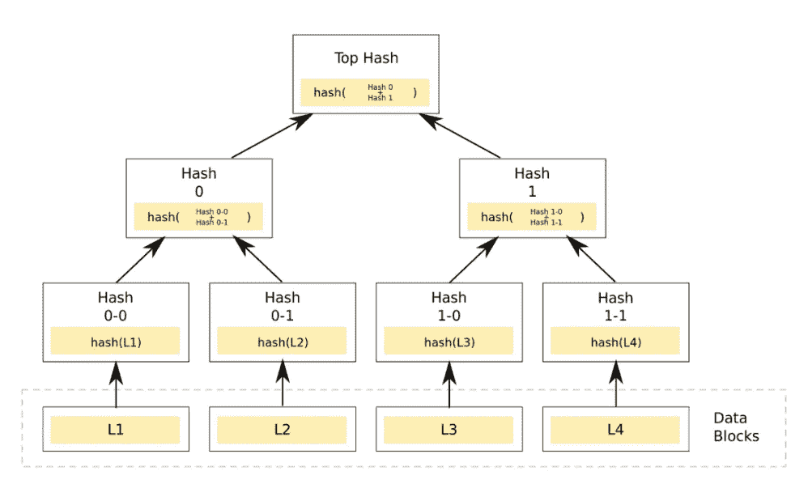

# 无共识边缘/物联网计算

> 原文：<https://itnext.io/consensus-less-edge-iot-computing-d6256d5727f7?source=collection_archive---------1----------------------->

具有类似区块链体系结构的分散式数据结构。

分布式存储集群的传统折衷是在事务一致性和最终一致性之间。最终的一致性通常被认为是一个更便宜的解决方案，无论是在合意性还是系统成本方面。事务一致性的关键成本是需要就订购更新达成共识。

最终的一致性通常被描述为对不一致的容忍，其假设是，只要暂时的矛盾最终消失，它们是可以接受的。

分散式数据结构核心、开源的 EdgeFS 项目采用了一种不同的、类似区块链的方法。所有存储的块，无论是元数据还是有效负载，都是唯一的、不可变的和自我验证的。对这些块的引用不包括它们存储的位置，但是仍然能够有效地检索这些块。

这种策略允许 EdgeFS 提供超出“最终”保持一致的保证:

*   任何客户端都不会检索比客户端自己放置的最新版本旧的版本。任何版本中的更改都不会被自动删除。
*   一个版本将仅根据策略并在它的后继版本发布之后被删除。
*   任何网络分区都不会阻止客户端放置新的对象版本。事实上，没有一个客户端会阻止另一个客户端放置新的对象版本。

永远不要因为另一个客户机的动作而阻塞一个新的对象版本，这是一个特性，而不是一个缺陷或限制。事务性系统只有在达成共识后才能保证编辑不重叠。共识可能是关于哪个更新者现在具有更新对象的独占权利(分布式锁定)，或者关于多个冲突更新中的哪个可以被提交(MVCC 或多版本共识控制)。实际上，集群必须在更新启动或完成之前进行序列化。当试图进行的编辑经常发生冲突时，分布式锁定更有效，MVCC 适用于冲突很少发生的更为常见的情况。

因此，最终的一致性实际上是最终用户对版本化文档存档的期望。不接受，甚至拖延，记录新版本的能力是不好的。他们更希望可靠地知道其他版本是何时创建的，并最大限度地减少希望进一步编辑同一文档的人看不到新更新的时间。

分散的分段 EdgeFS 安装提供的是最终的一致性，具有不变性的好处，并且知道可能存在哪些可能的对象版本，但哪些还没有被传播。

> 这种能力背后的原因很简单，EdgeFS 已经定义了它的元数据，因此不需要共识算法。其他存储解决方案可能有聪明的一致算法(RAFT 等)，但你不可能比没有一致算法更聪明。

不用说，许多边缘/物联网计算应用需要持续数小时或数天的网络分区能力，在这些应用中，无法保证与核心或云的连接，亚毫秒级延迟至关重要。

# 共识是昂贵的

根本的问题是不可能在同一时间在多个位置更新相同的信息。这在很多方面都有表述，包括 CAP 定理。

分布式存储系统提供事务一致性，要求在创建新对象版本的 put 事务完成之前达成集群范围的一致。这可以基于*先验*锁或乐观锁，其检测冲突的编辑并在重新应用尝试的编辑之前立即应用冲突的编辑。

任一种策略都需要至少覆盖相关法定数量的节点成员的端到端通信。当然，基于法定人数的共识取决于关于需要多少票数的协议，这就是共识算法总是变得复杂的原因。如果不能在锁或特定编辑上达成仲裁一致，则所请求的操作不能继续或完成。不允许上传新版本是支持版本化文档的存储集群应该做的最后一件*事情。*

# 独特的组块不需要共识

EdgeFS 在称为版本清单的元数据块中定义对象版本，具有唯一的版本清单内容哈希标识符(VMCHID)“顶级哈希”。这些块包括完全限定的对象名和唯一的版本标识符。

使用组块的加密散列标识符来定位组块。对于版本清单，这是名称哈希标识符(NHID)。给定对象的所有版本清单都存储在目标服务器中，跨地理上分散的段，由从 NHID 导出的 FlexHash 组号寻址。有效负载“哈希(L1-L4)”和非版本清单区块(哈希 0–1，哈希 0–0..相比之下，是基于内容散列标识符(CHID)来定位的。

此外，因为版本清单包括它们的唯一标识符，所以它们的内容散列标识符(CHIDs)也是唯一的。根据选择的选项，加密哈希可能是 256 或 512 位。

# EdgeFS 总是接受新版本

所有 EdgeFS 块都是唯一的。它们或者具有由 256 或 512 位加密散列标识的唯一有效负载，或者它们具有包括版本的唯一标识符的版本清单。

两个节点都可以无害地放置相同的有效载荷块。因为唯一版本标识符包括始发节点的 IP 地址，所以任何新版本只有一个来源。这确实带来了一个繁重的限制，即没有一个源可以在一个系统时钟周期内放置同一对象的两个版本，目前是 1/10，000 秒。这不是一个很大的限制，因为协商和确认放置新块的往返时间会比这个时间长。

因为相同版本的清单具有唯一标识符(VMCHID ),所以创建它的源在创建它之前不需要咨询任何其他节点。唯一有资格对它是否在给定时间戳创建了给定对象的新版本发表意见的实体是它自己。瞬间达成共识。

# 命名空间清单和快照

因为版本清单是唯一的，所以总是可以创建它们。EdgeFS 收集并处理记录每个新版本清单的事务日志条目，以创建所有版本清单的永久注册表，我们称之为名称空间清单。命名空间清单可以支持复杂的元数据查询，并且可以拍摄的真正时间点快照，而不需要任何一致性派生阻塞。

# **总结**

EdgeFS 是根据 Apache License v2 条款开源的，我们的社区欢迎用户、Edge/IoT 爱好者加入并试用它。在 [EdgeFS Github 页面](https://github.com/Nexenta/edgefs)了解更多信息。

感谢 Caitlin Bestler 原创撰写本文。