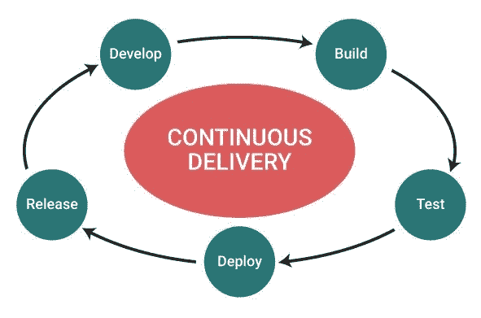
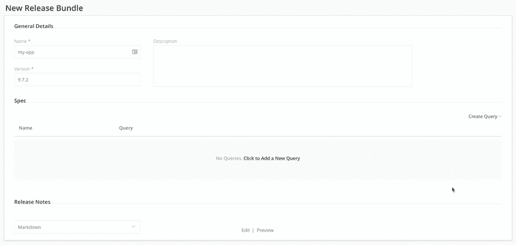
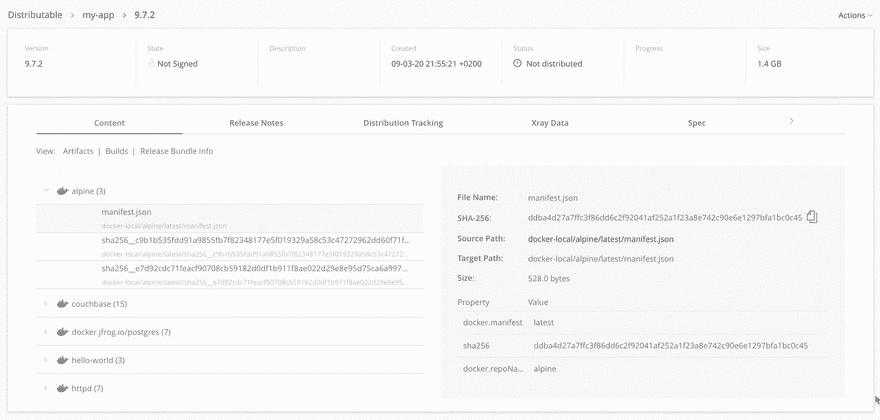
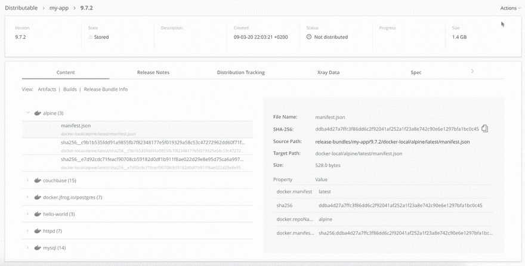

# 大规模持续交付和软件分发

> 原文：<https://itnext.io/continuous-delivery-and-software-distribution-at-scale-a0cdc4f20815?source=collection_archive---------4----------------------->

来源演职员表: [Pixabay](https://pixabay.com/photos/distribution-water-fire-hose-5007113/)

随着时间的推移，软件开发过程和方法已经从敏捷发展到今天的开发运维。持续集成和持续交付在一点一点地生产软件、集成和确保代码随时准备好被放心地部署中扮演着至关重要的角色。不仅仅是 CI/CD，现在的组织都在做很多关于软件分发和扩展的实验。不管你是否同意，在公司形成文化和制定 DevOps 规范之后，拥有这样的工具来确保与你的 DevOps 战略保持一致是非常重要的。今天，我们将看到什么是连续交付是必要的，以及软件分发流程。

# **什么是连续交货？**

连续交付(CD)是软件工程中的一种方法，它涉及在短周期内生产软件。通过在短周期内开发软件，团队可以在任何给定的时间毫无阻碍地可靠和自信地发布他们的软件。有了 CD，开发团队获得了更快、更频繁地构建、测试和发布软件的巨大优势。

持续交付的最初想法是由 ThoughtWorks 的首席科学家 Martin Fowler 提出并分享的。他将 CD 实践描述为:“*每个开发人员经常与其他人的工作集成在一起。[……]而且，如果有什么事情失败了，没有人比修复后台更重要的工作了。*

在过去的十年中，连续交付是 DevOps 中讨论最多和最流行的开发实践之一。使增量软件更新快速可用，提高从开发人员到部署的交付速度。随着 [12 因素应用](https://12factor.net/)和[多层架构](https://en.wikipedia.org/wiki/Multitier_architecture)等方法的出现，推动了这一趋势，并提供了可遵循的指南和原则。这已经成为许多软件组织的惯例，虽然这一度听起来像是魔术，不可能，但是自动化工程的突破现在已经使得频繁的更新成为可能。

## **连续交付是如何工作的？**

为了支持关键的和战略性的业务需求和可交付成果，软件驱动的组织正在发展过程、程序和技术框架。现代公司已经理解了 DevOps 的重要性，并热衷于实验，早失败，早学习，并相应地发展。

从刚刚开始持续集成，他们已经升级到实现 CD，改变了软件交付的方式。

在连续交付中，每次您的开发人员对代码进行任何更改、集成和构建代码时，*还会在与生产非常相似的环境中通过 CI 自动测试这些代码。在软件部署管道中，我们通常会有一个开发环境、一个测试环境和一个试运行环境。然而，这些阶段可能会因团队、产品和组织结构而异。*

在每个独立的环境中，开发人员编写的代码都经过不同的测试，这给了开发人员更多的信心。基本上，如果代码通过了前一个环境的测试，它将被提升到部署管道*中的下一个环境。通过这个过程，开发人员从每个环境中的测试中获得新的反馈，如果有任何错误，他们将更容易知道问题可能在哪里，这就是他们如何在问题到达生产环境或最终用户之前快速修复它。通过这种方式，持续交付使得开发人员的代码在任何给定的时刻都是现成的和可部署的。*

**采用连续交付的主要好处，**

*   *增强开发人员的信心和效率*
*   *更快发布*
*   *降低部署风险*
*   *能够跟踪软件开发进度*
*   *加快上市时间*
*   *早期用户反馈*
*   *持续学习*
*   *支持更快的应用迭代*

## 持续交付管道的各个阶段

*   测试自动化和 CI:这是准备新特性和原型的地方，代码与基础集成在一起。
*   **构建自动化:**这是开发人员将工件推送到注册中心的地方。
*   Alpha 部署:开发人员在这里签入所做的变更。此外，这是开发人员可以查看他们是否破坏了主分支中的任何内容以及代码中是否有任何异常的阶段。
*   **Beta 部署:**这是手动完成严格测试的地方，因为除了 CI 工具之外，手动测试还需要看到完美。它更能保证应用程序处于良好状态，并且在部署时能够正常工作。
*   **生产部署:**这是应用程序为最终用户投入使用的阶段。

## 大规模软件分发

多年来，软件开发已经从瀑布模型发展到敏捷、精益、CI/CD 和持续运营。虽然软件开发起着至关重要的作用，但同时，软件的分发也被认为是必不可少的。在工作场所安全地交付和管理软件相关的功能和工具至关重要。在任何组织中，软件分发都是快速软件管理的必要条件，而连续交付在软件分发的扩展中起着至关重要的作用。软件分发意味着将应用程序送到最终用户手中以供最终使用。这个过程可能包括几个步骤，从包装、交付、安装到维护。

软件分发是一个非常重要的方面，它需要一个完美的平台来安全地管理软件版本的分发。该平台应该能够将不可变的发布包安全地分发到生产环境中。平台应该能够将来自多个存储库类型的工件打包到一个发布包中。有了像 [JFrog distribution](https://jfrog.com/distribution/) 这样的工具，您将能够轻松地分发和扩展您的应用程序。

当谈到连续软件交付时，公司在将生产就绪软件分发到边缘时面临一些严峻的挑战，这造成了软件发布的混乱以及团队之间缺乏连续性。这就是像 JFrog distribution 这样的工具通过提供一个结构化和安全的平台将发布的二进制文件分发到多个远程位置来帮助公司的地方。这使得组织不必担心软件分发，因为发布包被源目的地正确地验证，以确保它们被正确地签名，并且可以被组织内任意数量的团队安全地使用。

[Distribution](https://www.jfrog.com/confluence/display/DIST1X/Welcome+to+JFrog+Distribution) 是一个内部部署的云集中式平台，让企业能够轻松高效地提供软件发布版本。它管理发布包及其相关的分发过程，包括发布内容、权限级别和目标目的地。

该发行版提供了一种更安全、更结构化的方式来将发布二进制文件分发到全球任何地方的多个远程位置，并在创建新的发布版本时更新它们。作为发布流程的一部分，发布包由目标目的地进行彻底的验证，以确保它们被正确签名并且可以安全使用。

JFrog 发行版的创建是为了支持在开发管道/发行版中将软件工件从一个地方安全地移动到另一个地方的不同需求。编写代码，开发您的软件，将其打包到一个发布包中，并通过分发将它们分发到远程位置。拥有遍布全球的多个分支机构的公司可以享受到分布式的好处，如安全性、原子性和并发性等。

这可以通过在实际设备或相关站点上具有边缘节点来实现，考虑到分布的地理分布，以允许实际设备下载包的较低等待时间。

## 边缘节点

Artifactory Edge 节点是 JFrog Artifactory 的一种特殊安装，它是不可变的，用于提供软件。边缘节点为客户端工具/设备提供了公共的用户访问点。在我们的例子中，一个边缘节点只能包含 JFrog 发行版提供给它的工件。除了 JFrog 发行版之外，Edge 节点不允许您在其上部署任何构件。对于构建/发布生命周期中的环境(不同于开发环境),边缘节点作为“只读”Artifactory。这样，您就获得了您的软件包与驻留在 dev Artifactory 上的其他工件的不变性和隔离的优势。

让我们实际地看看，发行版如何让您使用不可变的发布包向许多目标提供软件发布。

**分三步分配**

1.使用 [REST](https://www.jfrog.com/confluence/display/JFROG/Distribution+REST+API#DistributionRESTAPI-RELEASEBUNDLES) API 或[查询构建器](https://www.jfrog.com/confluence/display/JFROG/Distributing+Release+Bundles#DistributingReleaseBundles-AddingaQuery)创建一个发布包。

2.通过使用 GPG 密钥签名来保护您的发布包，确保其内容不可编辑。这也将确保目标实例之间分布的一致性。
***注意*** :在接受发行包之前，Artifactory Edge 使用相同的 GPG 密钥来验证发行包。

3.分发您的发布包。分发负责触发从源工厂到边缘节点的复制过程。首先，它将发行包信息复制到每个边缘节点，然后在源 Artifactory 中启动复制过程。

在官方[网站](https://jfrog.com/distribution/)和[文档](https://www.jfrog.com/confluence/display/JFROG/JFrog+Distribution)上查看更多信息。

## **结论**

持续交付的明显优势是拥有一个稳定、可靠和高质量的代码库，随时准备充满信心地投入使用。因此，您不应该担心任何缺陷或错误会被最终用户发现，如果您担心，您可以快速修复它们并快速学习。虽然软件交付是 DevOps 和自动化不可或缺的一部分，但更关键的是扩展这一过程及其分发方面，这给公司带来了一些严峻的挑战。因此，选择一个合适的策略和一个能够更有效地完成这一部分的平台被认为是更有效的。