# 通过 GitOps 在 Kubernetes 上持续交付

> 原文：<https://itnext.io/continuous-delivery-with-gitops-591ff031e8f9?source=collection_archive---------2----------------------->

从典型的 CI/CD 管道到 GitOps

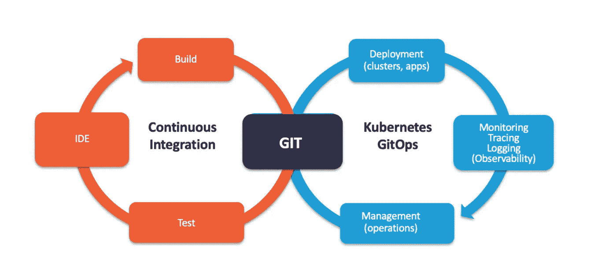

[GitOps 到底是什么？](https://www.weave.works/blog/what-is-gitops-really)(来源:Weaveworks)

# TL；速度三角形定位法(dead reckoning)

GitOps 是由 [Weaveworks](https://weave.works) 推出的一种连续交付方式。它通过使用 Git 作为声明性基础设施和应用程序的单一事实来源来工作。

在一个简单的项目中，我们将看到如何设置一个典型的 CI/CD 管道，然后如何修改它，将 GitOps 添加到图片中。

在本帖中，我们将演示几周前在 CNCF 的沙盒中接受的 GitOps 核心组件 [Flux](https://fluxcd.io) 。

# 我们将做什么

下面是我们将遵循的步骤列表:

*   GitOps 简介
*   设置一个简单的项目并在 GitLab 中管理它
*   集成 Kubernetes 集群
*   设置典型的 CI/CD 管道
*   用 GitOps 处理 CD 部分

# GitOps 简介

> GitOps 是一种持续交付的方式。它通过使用 Git 作为声明性基础设施和应用程序的事实来源来工作。当对 Git 进行更改时，自动化交付管道会向您的基础设施推出更改。
> 
> —编织作品

## 将更改部署到集群:推还是拉

在典型的 CI/CD 管道中，CI 工具负责运行测试、构建映像、检查 CVE 以及将新映像重新部署到集群中，如下面的模式所示。


典型的 CI/CD 管道(来源:Weaveworks)

GitOps 方法有所不同，因为部署部分不是由 CI 工具完成的，而是由操作员完成的，操作员是在集群内的 Pod 中运行的流程(这里是 Flux)。


包括 GitOps 在内的 CI/CD 管道(来源:Weaveworks)

## 涉及的组件

下面的模式显示了在 Kubernetes 集群的上下文中使用 GitOps 时所涉及的组件。

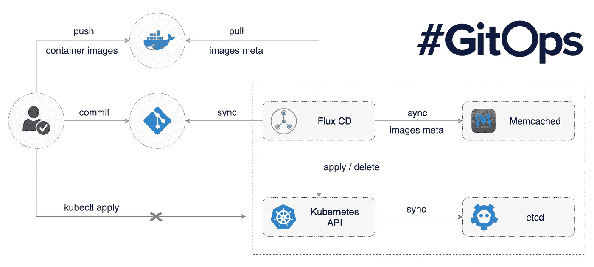

Kubernetes 集群中的 GitOps 组件(来源:Weaveworks)

为了简单起见，Flux 守护进程会持续运行并检查新的 Docker 映像。当检测到新的映像时，它调用 API 服务器来更新正在运行的部署。

在这篇文章的最后一部分，我们将设置 Flux 并使用它来部署一个简单的应用程序。

# 该项目

我们将考虑一个简单(非常简单)的烧瓶应用程序。项目的复杂性在这里并不重要，最重要的是对整个 CI/CD 流程的理解。

## 源代码

让我们只考虑以下文件:

*   *app.py* 公开一个 HTTP 端点并返回一个字符串

```
from flask import Flask
app = Flask(__name__)

@app.route("/")
def hello():
    return "Hello World!"

if __name__ == "__main__":
    app.run(host='0.0.0.0', port=8000)
```

*   *requirements.txt* 定义了 *Flask* 库 *app.py* 所需的依赖关系

```
Flask==1.0.2
```

*   *Dockerfile* 用于从源代码中构建一个映像

```
FROM python:3-alpine
COPY . /app
WORKDIR /app
RUN pip install -r requirements.txt
CMD python /app/app.py
```

## 确保它正常工作

我们首先为我们的应用程序创建第一个 Docker 图像

```
$ docker image build -t hello:1.0 .
```

一旦构建了映像，我们就可以使用它运行容器。

```
$ docker container run -p 8000:8000 hello:1.0
 * Serving Flask app “app” (lazy loading)
 * Environment: production
 WARNING: Do not use the development server in a production environment.
 Use a production WSGI server instead.
 * Debug mode: off
 * Running on [http://0.0.0.0:8000/](http://0.0.0.0:8000/) (Press CTRL+C to quit)
```

我们的服务器正在监听端口 8000，如下图所示。

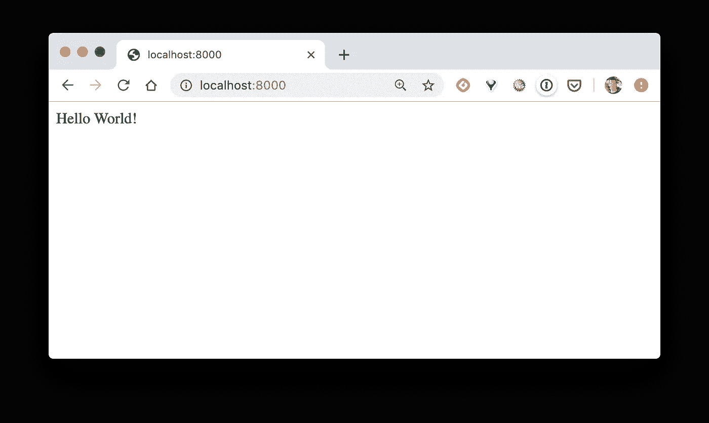

## GitLab 项目

我们将使用 GitLab 来管理这个应用程序，所以让我们创建一个名为 *hello* 的新项目:

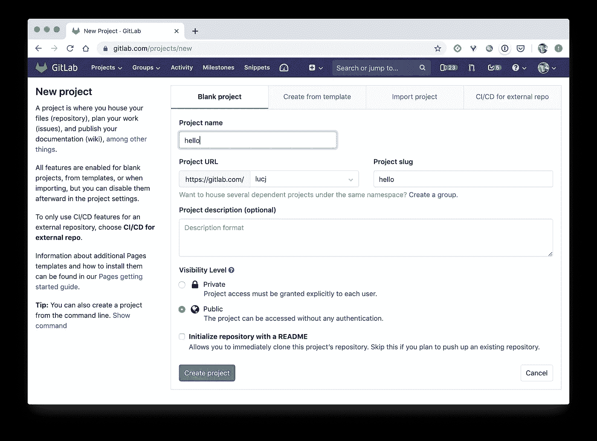

在 GitLab 中创建新项目

然后，我们可以为应用程序文件夹初始化 git，并将所有内容推送到 GitLab 项目中:

```
$ git init
$ git remote add origin git@gitlab.com:lucj/hello.git
$ git add .
$ git commit -m "Initial commit"
$ git push -u origin master
```

几秒钟后，我们可以通过 GitLab web 界面看到项目中的 3 个文件。

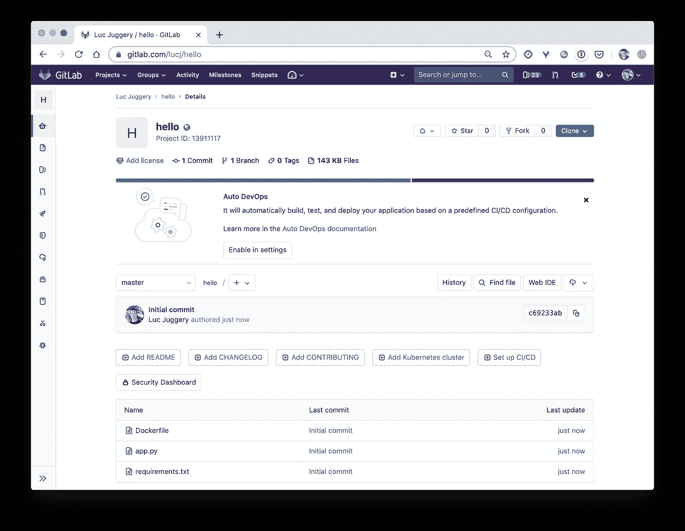

代码的首次提交

# 进入 Kubernetes

因为我们想在 Kubernetes 集群上部署我们的应用程序，所以我们将使用 GitLab 的 Kubernetes 集成功能来导入项目中外部集群的配置。

## 创建受管集群

DOKS([digital ocean](https://digitalocean.com)managed Kubernetes cluster)是我最喜欢的解决方案，易于设置和使用。它可以从 DigitalOcean web 界面或使用专用的 [doctl](https://github.com/digitalocean/doctl) 命令行界面创建。在本例中，我们将建立一个 3 个工作节点的集群，管理节点由 DigitalOcean 为我们管理。

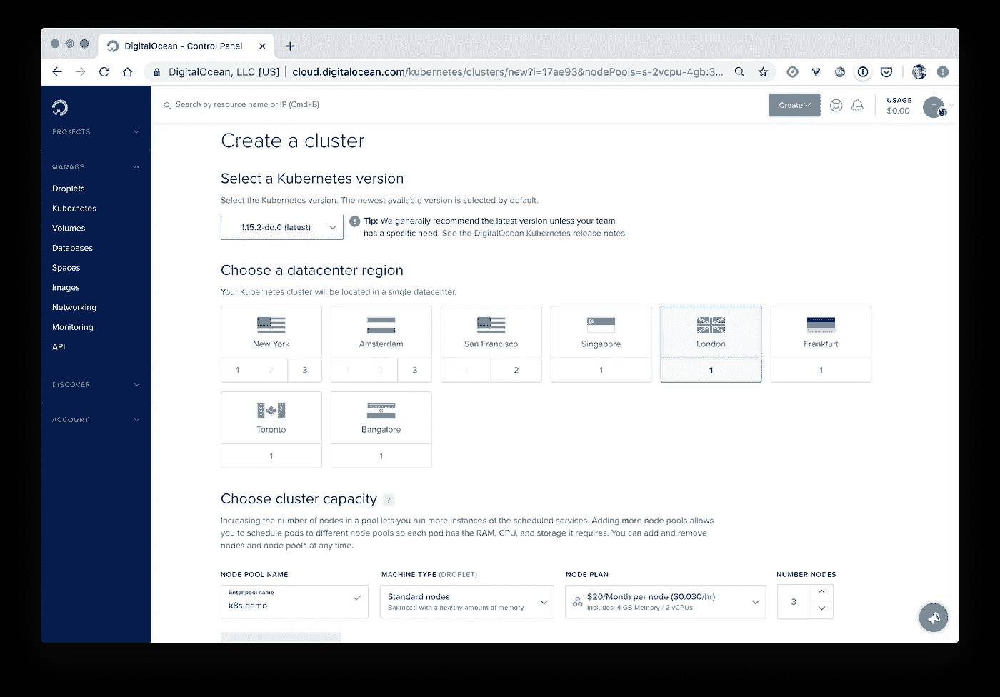

从数字海洋网络界面创建受管理的 Kubernetes 集群

调配基础架构和创建群集需要几分钟时间。一旦完成，我们需要检索 kubeconfig 文件，这样我们的 we [kubectl](https://kubernetes.io/fr/docs/tasks/tools/install-kubectl/) 客户机就可以与集群的 API 服务器通信。我们将使用 doctl 命令行并将此配置保存在 *k8s-demo.cfg* 文件中:

```
$ doctl k8s cluster cfg show k8s-demo > k8s-demo.cfg
```

然后我们配置 *kubectl* 与我们的集群通信，设置 KUBECONFIG 环境变量:

```
$ export KUBECONFIG=$PWD/k8s-demo.cfg
```

一切就绪。让我们检查一下集群的状态:

```
**$ kubectl get nodes** NAME            STATUS   ROLES    AGE     VERSION
k8s-demo-rlf5   Ready    <none>   2m10s   v1.15.2
k8s-demo-rlfh   Ready    <none>   2m40s   v1.15.2
k8s-demo-rlfk   Ready    <none>   2m33s   v1.15.2
```

## 与 GitLab 项目集成

在 GitLab 的 web 界面上，将外部 Kubernetes 集群集成到项目中非常容易。我们只需要进入*操作> Kubernetes* 然后点击*添加 Kubernetes 集群*:

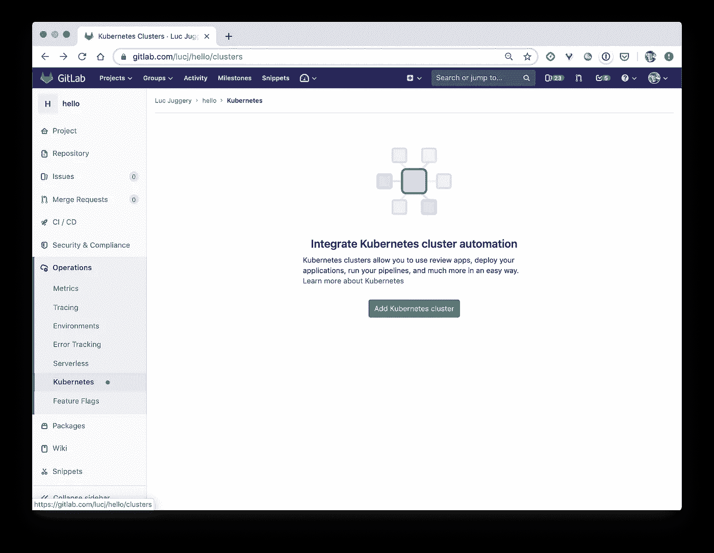

Kubernetes 集群的集成

然后我们需要选择*添加现有集群*选项卡。在那里，我们需要填写几个字段。它们中的第一个可以很容易地从配置文件中检索到:

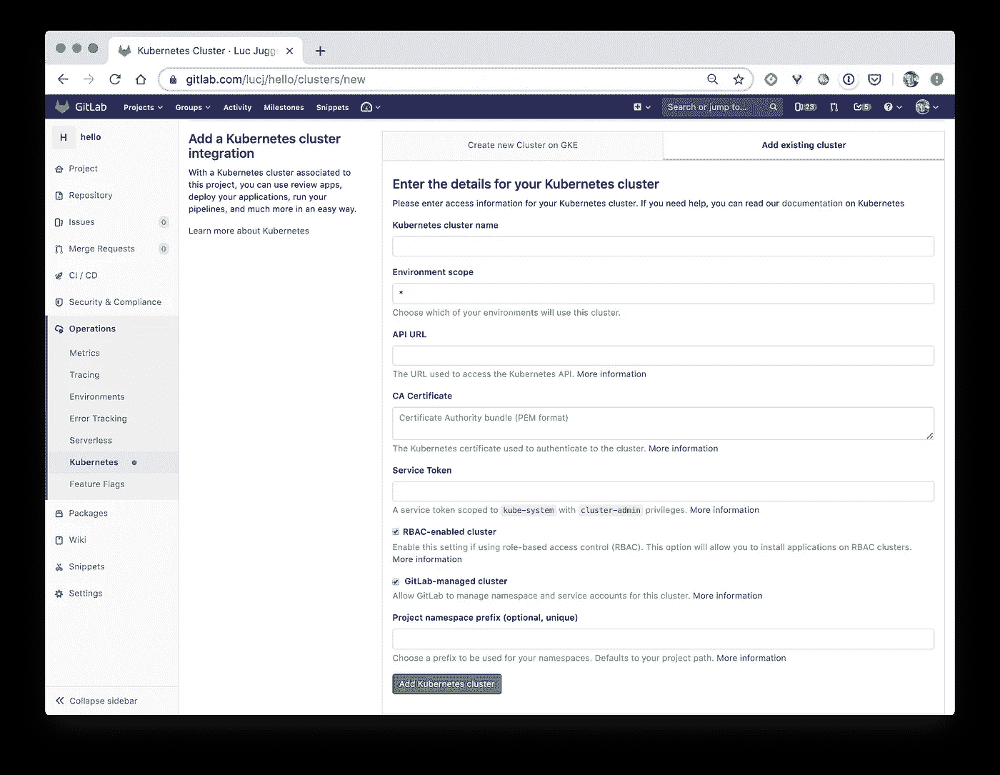

Kubernetes 集群集成期间要填写的字段

*   集群名称
*   API 服务器的 URL
*   群集的 CA 证书

为了向 GitLab 提供集群 CA 证书，我们需要对配置中指定的证书进行解码(因为它是以 base64 编码的)。

```
$ kubectl config view --raw \
-o=jsonpath='{.clusters[0].cluster.certificate-authority-data}' \
| base64 --decode
```

*   服务令牌

获取标识令牌的过程包括几个步骤。我们首先需要创建一个`ServiceAccount`并为其提供`cluster-admin`角色。这可以通过以下命令完成:

```
**$ cat <<EOF | kubectl apply -f -**
apiVersion: v1
kind: ServiceAccount
metadata:
  name: gitlab-admin
  namespace: kube-system
---
apiVersion: rbac.authorization.k8s.io/v1beta1
kind: ClusterRoleBinding
metadata:
  name: gitlab-admin
roleRef:
  apiGroup: rbac.authorization.k8s.io
  kind: ClusterRole
  name: cluster-admin
subjects:
- kind: ServiceAccount
  name: gitlab-admin
  namespace: kube-system
**EOF**
```

一旦创建了 ServiceAccount，我们就检索相关的*机密*:

```
$ SECRET=$(kubectl -n kube-system get secret | grep gitlab-admin | awk '{print $1}')
```

添加提取它的 JWT 令牌，我们需要在 GitLab 界面的*服务令牌*字段中输入的令牌:

```
$ TOKEN=$(kubectl -n kube-system get secret $SECRET -o jsonpath='{.data.token}' | base64 --decode) && echo $TOKEN
```

在验证集群集成之前，我们取消选中 *GitLab-managed-cluster* 复选框，因为我们将管理自己的名称空间。

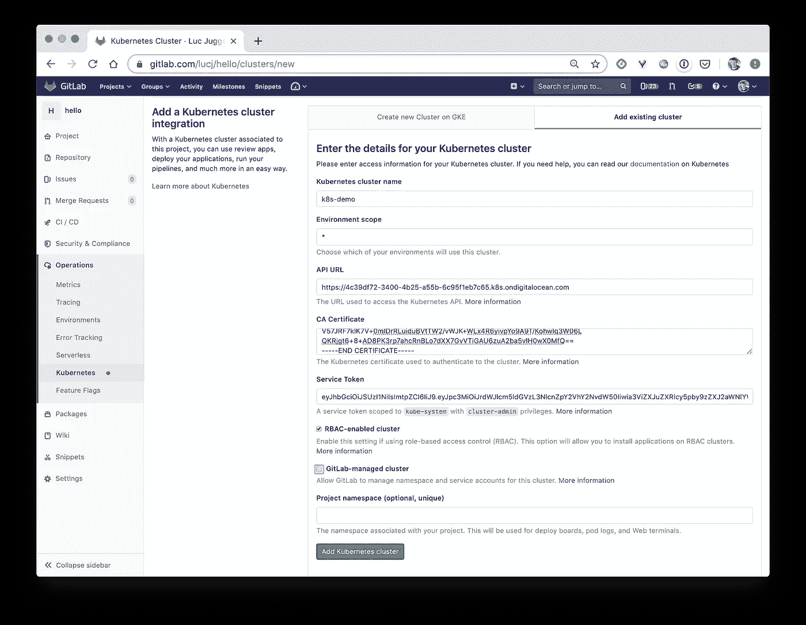

一旦集群被集成，GitLab 允许通过 Helm charts 一键安装几个应用程序。虽然我们不会在这篇文章中使用它。

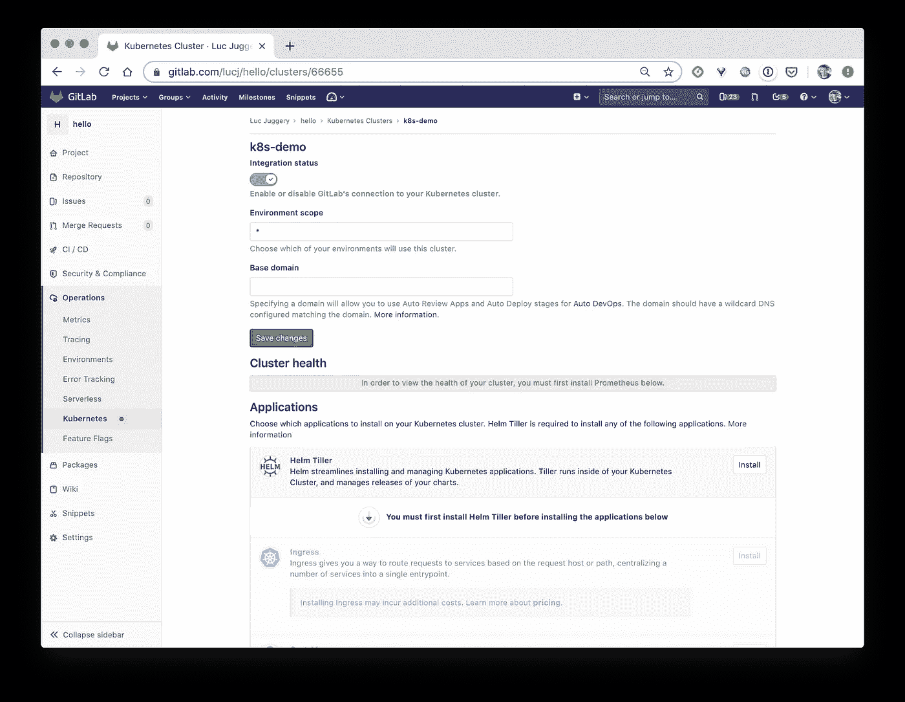

Kubernetes 集群与我们的 GitLab 项目相集成

# 设置典型的 CI/CD 管道

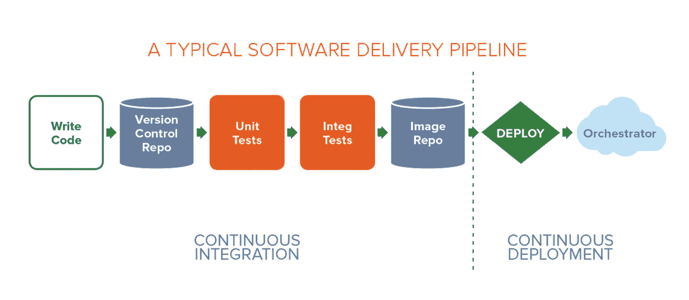

我们从添加一个*开始。gitlab-ci.yml* 文件在我们项目的根目录下。它用于定义每次新代码提交到存储库时触发的操作。

在该文件的顶部，我们定义了管道的不同阶段:

```
stages:
  - package
  - test
  - push
  - deploy
```

然后，对于每个阶段，我们定义要执行的操作:

*   *package* stage 从源代码中创建一个 Docker 映像，并使用一个临时标签将它推送到项目的 GitLab 映像库(稍后将详细介绍)

```
build:
  image: docker:stable
  stage: package
  services:
    - docker:dind
  script:
   - docker build -t $CI_REGISTRY_IMAGE:tmp .
   - docker login -u gitlab-ci-token -p $CI_BUILD_TOKEN $CI_REGISTRY
   - docker push $CI_REGISTRY_IMAGE:tmp
  only:
  - master
```

*   *测试*阶段从新创建的映像运行一个容器，并确保返回的消息以“Hello”开头

```
test:
  image: docker:stable
  stage: test
  services:
    - docker:dind
  script:
    - docker run -d --name hello $CI_REGISTRY_IMAGE:tmp
    - sleep 10s
    - TEST=$(docker run --link hello lucj/curl -s http://hello:8000)
    - $([ "${TEST:0:5}" = "Hello" ])
  only:
  - master
```

*   *push* 阶段向图像添加新的标签，第一个标签基于 git commit 的散列，第二个标签是当前分支的名称(这里是 master，因为我们只在 master 分支上触发那些动作)。然后，它将这些新标签推送到 GitLab 注册表中。

```
push:
  image: docker:stable
  stage: push
  services:
    - docker:dind
  script:
   - docker image pull $CI_REGISTRY_IMAGE:tmp
   - docker image tag $CI_REGISTRY_IMAGE:tmp $CI_REGISTRY_IMAGE:$CI_BUILD_REF
   - docker image tag $CI_REGISTRY_IMAGE:tmp $CI_REGISTRY_IMAGE:$CI_COMMIT_REF_NAME
   - docker login -u gitlab-ci-token -p $CI_BUILD_TOKEN $CI_REGISTRY
   - docker push $CI_REGISTRY_IMAGE:$CI_BUILD_REF
   - docker push $CI_REGISTRY_IMAGE:$CI_COMMIT_REF_NAME
  only:
  - master
```

*   *部署*阶段的目的是在我们的 Kubernetes 集群中创建/更新应用程序。我们将在一个 *k8s* 文件夹中定义两个清单文件:一个部署用于管理我们的 web 服务器的 Pod，一个服务用于向外部公开它

我们首先定义下面的 *k8s/deploy.tpl* 模板。它将在*部署*步骤中使用，以生成指定部署资源的 *k8s/deploy.yml* 文件。该模板定义了基于*registry.gitlab.com/lucj/hello*映像管理 Pod 的单个副本的部署。

在这个模板中，我们使用了一个名为 *GIT_COMMIT* 的占位符，它被替换为提交的实际散列，稍后我们将会看到。

```
apiVersion: apps/v1
kind: Deployment
metadata:
  name: hello
  labels:
    app: hello
spec:
  selector:
    matchLabels:
      app: hello
  template:
    metadata:
      labels:
        app: hello
    spec:
      containers:
      - name: hello
        image: registry.gitlab.com/lucj/hello:**GIT_COMMIT**
```

我们还在 *k8s/service.yml，*中定义了一个服务资源来公开应用程序。此服务属于负载平衡器类型。

```
apiVersion: v1
kind: Service
metadata:
  name: hello
spec:
  type: LoadBalancer
  ports:
    - name: hello
      port: 80
      targetPort: 8000
      protocol: TCP
  selector:
    app: hello
```

在*部署*步骤中执行的动作如下:

```
deploy:
  stage: deploy
  image: lucj/kubectl:1.15.2
  environment: test
  script:
    - kubectl config set-cluster my-cluster --server=${KUBE_URL} --certificate-authority="${KUBE_CA_PEM_FILE}"
    - kubectl config set-credentials admin --token=${KUBE_TOKEN}
    - kubectl config set-context my-context --cluster=my-cluster --user=admin --namespace default
    - kubectl config use-context my-context
    - cat k8s/deploy.tpl | sed 's/GIT_COMMIT/'"$CI_BUILD_REF/" > k8s/deploy.yml
    - kubectl apply -f k8s
  only:
  - master
```

这里需要注意几件事:

*   这个步骤在包含 *kubectl* 客户端的映像的上下文中运行
*   从 GitLab 自动设置的环境变量中检索集群信息。它们用于设置 Kubernetes 上下文
*   部署资源是在模板文件之外创建的，GIT_COMMIT 占位符被替换为$CI_BUILD_REF 环境变量中可用的实际提交
*   分别位于 *k8s/service.yml* 和 *k8s/deploy.yml* 中的服务和部署资源是用常用的“*ku bectl apply”*命令创建/更新的

注意:这个管道非常简单，不是最佳的，但是它可以很好地说明不同的流程

## 测试事物

让我们将这些更改推送到 GitLab 的项目中，并检查触发的 CI/CD 管道

```
$ git add k8s
$ git commit -m ‘Add K8s resources’$ git add .gitlab-ci.yml
$ git commit -m ‘Add GitLab pipeline’$ git push origin master
```

这触发了 GitLab 管道，正如我们在 web 界面上看到的

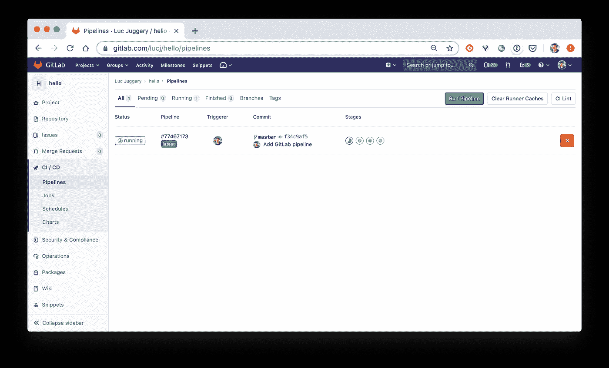

在管道的*部署*阶段(最后一个)，部署和服务都被创建，因为它们以前并不存在。由于服务属于类型 *LoadBalancer，*在 DigitalOcean 基础设施上创建了一个负载平衡器资源，如下所示。

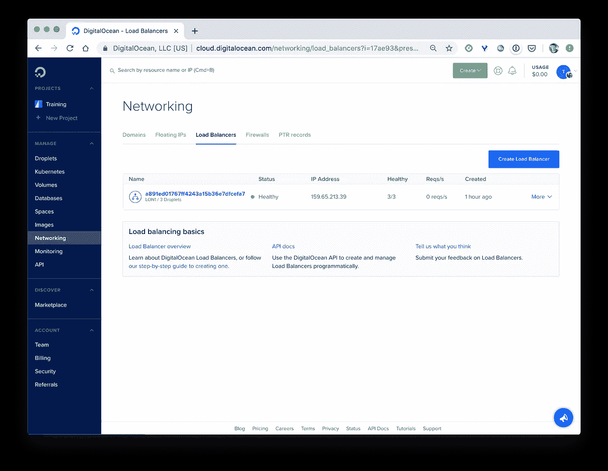

使用与负载平衡器关联的外部 IP 地址，我们可以在端口 80 上访问应用程序，目标是运行我们的应用程序的底层 Pod。

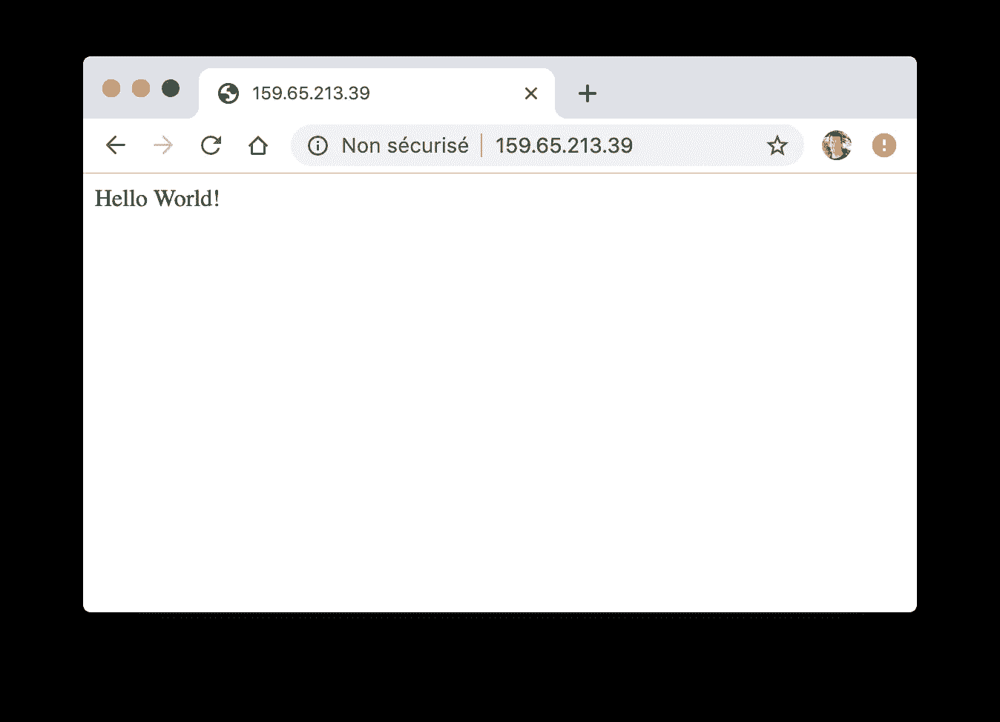

这表明服务和部署都已正确创建。

让我们稍微修改一下 *app.py* ，让它返回“来自 Kube 的 Hello”而不是“Hello World！”。

```
from flask import Flask
app = Flask(__name__)[@app](http://twitter.com/app).route("/")
def hello():
    return "Hello from Kube"if __name__ == "__main__":
    app.run(host='0.0.0.0', port=8000)
```

我们承诺并推动变革

```
$ git add app.py
$ git commit -m 'change message to Hello from Kube'
$ git push origin master
```

触发了新的 CI/CD 管道，如果刷新浏览器，我们可以看到新消息

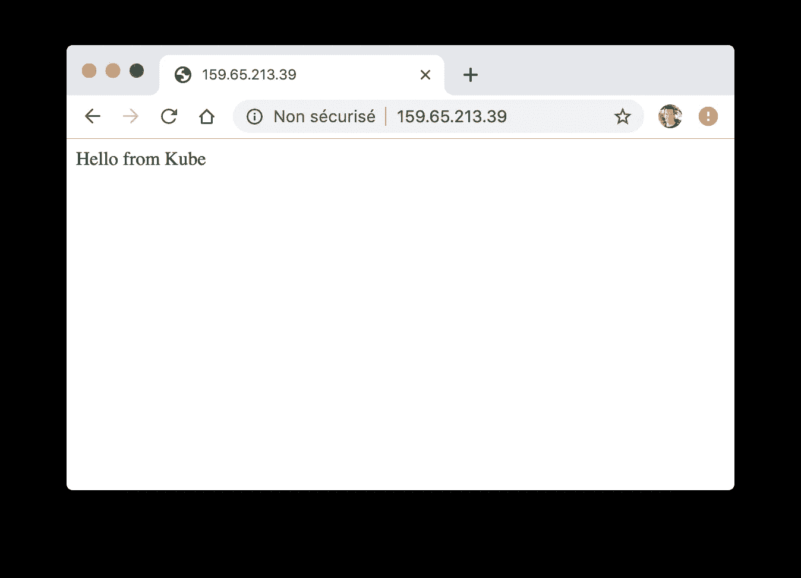

我们已经设置了一个简单的管道，当然，如果用于真实世界的应用程序，还需要一些改进。例如，我们可以添加更多的步骤，如:

*   附加测试
*   图像扫描，以确保图像不包含任何 cv(或者至少不包含关键 cv)

如果你想进一步了解图像扫描部分，你可能会发现这篇文章很有用[https://medium . com/better-programming/adding-CVE-scanning-to-a-ci-CD-pipeline-d0f 5695 a 555 a](https://medium.com/@lucjuggery/adding-cve-scanning-to-a-ci-cd-pipeline-d0f5695a555a)

# 将 GitOps 添加到图片中

我们现在将稍微修改一下 CI/CD 管道，以便用 GitOps 方法处理 CD 部分。以下架构显示了 GitOps 部署工作流中涉及的组件。

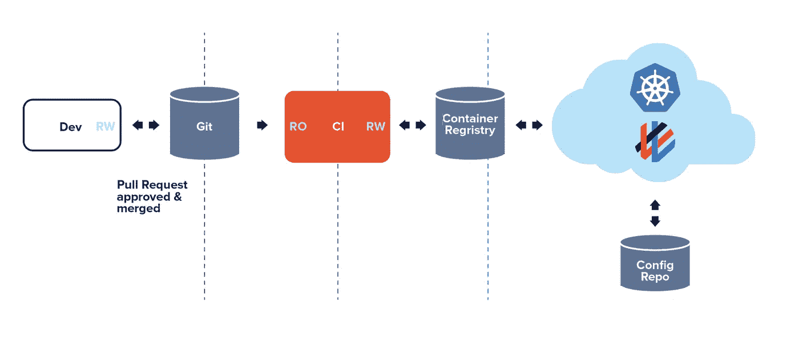

GitOps 部署工作流(来源:Weaveworks)

基本上，在 Pod 内的集群中运行的 [Flux](https://fluxcd.io) 操作符负责在图像注册表中检测到新的图像标记时重新部署应用程序。

## 焊剂安装

Flux 可以从部署手动安装，也可以用[舵](https://helm.sh/)安装。在本文中，我们将使用手动方法。第一步是克隆 [fluxcd](https://github.com/fluxcd/flux) 库:

```
$ git clone [https://github.com/fluxcd/flux](https://github.com/fluxcd/flux) && cd flux
```

然后，在部署规范(*deploy/flux-Deployment . YAML*)内，我们将更改以下参数:

*   -git-URL = Git @ Git lab . com:lucj/hello，这告诉 Flux 要观察哪个 Git 存储库
*   - git-path=k8s，在存储库中，只考虑 *k8s* 文件夹(我们的 Kubernetes 清单文件位于该文件夹中)
*   - git-ci-skip，该选项允许在 Flux(标记和部署资源)更新 GitLab 的项目存储库时跳过 ci 管道

我们现在可以将 Flux 部署到集群:

```
**$ kubectl apply -f deploy**
serviceaccount/flux created
clusterrole.rbac.authorization.k8s.io/flux created
clusterrolebinding.rbac.authorization.k8s.io/flux created
deployment.apps/flux created
secret/flux-git-deploy created
deployment.apps/memcached created
service/memcached created
```

创建了几个资源:

*   ServiceAccount、ClusterRole 和 ClusterRoleBoinding 用于向 Flux Pod 提供操作所需的身份验证/授权
*   通量算子
*   一个 memcached 的服务和部署，Flux 使用它来缓存图像元数据

```
**$ kubectl get pods** NAMESPACE NAME                       READY  STATUS   RESTARTS  AGE
default   flux-dcb965db7-pn97k       1/1    Running  0         56s
default   memcached-554f994578-t2tss 1/1    Running  0         56s
...
```

如果我们查看 Flux pod 的日志，我们会看到一条错误消息，因为 Flux 无法读取项目的 Git 存储库。

> 权限被拒绝(publickey)。致命错误:无法从远程存储库中读取。请确保您拥有正确的访问权限，并且该存储库存在。

为了解决这个问题，我们可以使用 [fluxctl](https://docs.fluxcd.io/en/latest/references/fluxctl.html) 实用程序来检索安装过程中生成的公共 ssh 密钥。

```
**$ fluxctl identity** ssh-rsa AAAAB3NzaC1yc2EAAAADAQABAAABAQCx4fk4YjcM7cP1FL/AKWtHpN+cg9/Qz1p5dzAlsFLMKilUUy0uCQQmaptXDZQGaZrbvNSyezgT5/yH6qau6W6ICoLYAzBku47PoWlqbUfcbPhMxHSfivjv7s4lSeUE+u3kR2opROxdyHHL+VQMI6n9Xc7qnTq6YC+VJ+RkoUUd0bgBC+Rg/aMURLD9mkAVzmWw6+Y8QAJMVNMzNDgId+8iSHKtOYsHqoxg4GqexdB1R5goE0ChBU9DPsiqLfk8jzuD2I3xuZeGW6or+/JHxa/6vO8lX+of1ZGZGZKr5i3E4OIehSwFUP2A/ypeqXEEI5gmO1s2YrM49jpS+jW4oUMP
```

然后将这个密钥添加到我们的 GitLab 存储库中，当它需要创建/更新标签时，给它一个 R/W 访问权限。

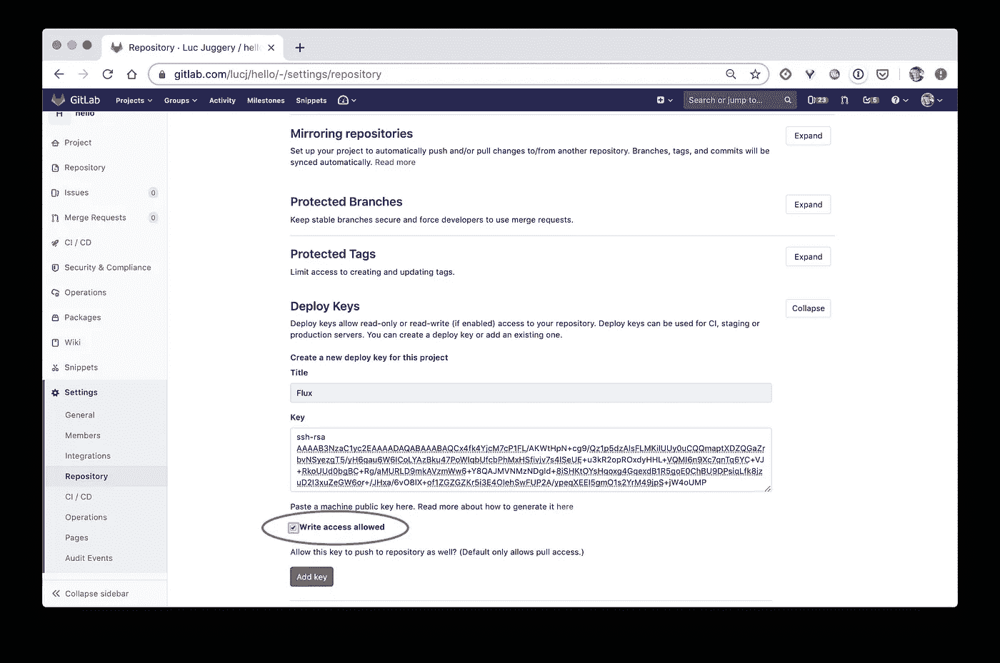

## 修改以前的管道

由于 Flux 负责部署对项目所做的变更(我们将在 bit 中测试)，我们需要删除*的部署阶段。我们之前创建的 gitlab-ci.yml* 文件，其他的都可以保持不变。*。gitlab-ci.yml* 现在看起来如下，没有更多的 *kubectl* 与集群的 API 服务器交互。

```
stages:
  - package
  - test
  - pushbuild:
  image: docker:stable
  stage: package
  services:
    - docker:dind
  script:
   - docker build -t $CI_REGISTRY_IMAGE:tmp .
   - docker login -u gitlab-ci-token -p $CI_BUILD_TOKEN $CI_REGISTRY
   - docker push $CI_REGISTRY_IMAGE:tmp
  only:
  - mastertest:
  image: docker:stable
  stage: test
  services:
    - docker:dind
  script:
    - docker run -d --name hello $CI_REGISTRY_IMAGE:tmp
    - sleep 10s
    - TEST=$(docker run --link hello lucj/curl -s [http://hello:8000](http://hello:8000))
    - $([ "${TEST:0:5}" = "Hello" ])
  only:
  - masterpush:
  image: docker:stable
  stage: push
  services:
    - docker:dind
  script:
   - docker image pull $CI_REGISTRY_IMAGE:tmp
   - docker image tag $CI_REGISTRY_IMAGE:tmp $CI_REGISTRY_IMAGE:$CI_BUILD_REF
   - docker image tag $CI_REGISTRY_IMAGE:tmp $CI_REGISTRY_IMAGE:$CI_COMMIT_REF_NAME
   - docker login -u gitlab-ci-token -p $CI_BUILD_TOKEN $CI_REGISTRY
   - docker push $CI_REGISTRY_IMAGE:$CI_BUILD_REF
   - docker push $CI_REGISTRY_IMAGE:$CI_COMMIT_REF_NAME
  only:
  - master
```

此外，我们可以删除模板文件 *k8s/deploy.tpl* ，因为这个文件将不再用于更新部署的清单。相反，我们将使用下面的部署，在 *k8s/deploy.yml* 中，Flux 将在每次检测到新的图像标签时更新。

```
apiVersion: apps/v1
kind: Deployment
metadata:
  name: hello
  annotations:
    flux.weave.works/automated: "true"
    flux.weave.works/tag.hello: regexp:^((?!tmp).)*$
  labels:
    app: hello
spec:
  selector:
    matchLabels:
      app: hello
  template:
    metadata:
      labels:
        app: hello
    spec:
      containers:
      - name: hello
        image: registry.gitlab.com/lucj/hello:master
```

该部署的通量配置在*注释*键内完成:

*   flux.weave.works/automated:“真”，激活此资源的自动重新部署
*   flux.weave.works/tag.hello:·regexp:^((？！tmp)。)*$，确保不考虑带有 *tmp* 标签的临时图像

## 测试事物

让我们更改 *app.py* 中的代码，使其现在返回“Hello from Flux”。

```
from flask import Flask
app = Flask(__name__)[@app](http://twitter.com/app).route("/")
def hello():
    return "Hello from Flux"if __name__ == "__main__":
    app.run(host='0.0.0.0', port=8000)
```

并将此修改推送到 GitLab。

```
$ git rm k8s/deploy.tpl
$ git add k8s/deploy.yml .gitlab-ci.yml app.py
$ git commit -m 'CD with Flux'
$ git push origin master
```

检查 GitLab 接口，我们可以看到管道已经被触发了几次。

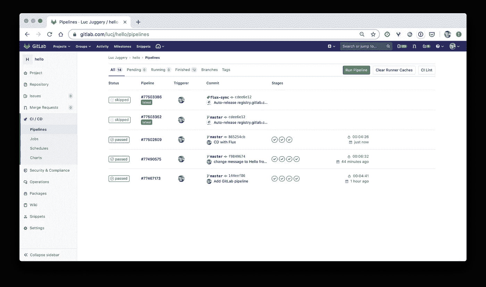

创建了几个管道(其中一些被跳过)

一个管道由我们所做的更改触发，另一个由 Flux 在更新*主*分支上的部署清单( *k8s/deploy.yml)* 和 *flux-sync* 分支上的标签时触发。由于我们在 Flux 配置中使用了 *- git-ci-skip* 选项(如果我们没有这样做，管道将在一个循环中运行)，由这两个动作触发的管道被跳过(相关的动作没有被执行)。

通过再次刷新浏览器，我们可以看到新版本的应用程序已经可用。

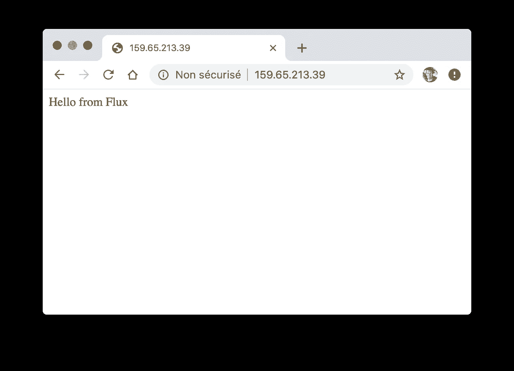

在幕后，当 Flux 操作符定期检查新的图像标记时，它检测到了在 CI 管道中由于代码更改而创建的图像标记。然后它会自动更新部署。

# 摘要

在这篇文章中，我想对 GitOps 做一个概述，并展示一个简单的例子，说明如何在 GitLab CI 管道旁边设置它。有些东西还可以改进，比如管道中定义的步骤，使用 semver 命名图像的标签，…但我希望这篇文章能让你对这种方法有一个全局的了解。

GitOps 是相当一段时间以来的热门话题。。请不要犹豫，深入阅读[官方文档](https://docs.fluxcd.io/en/latest/)了解更多信息。

您已经在使用 GitOps 方法了吗？我很想听听你对此的看法。