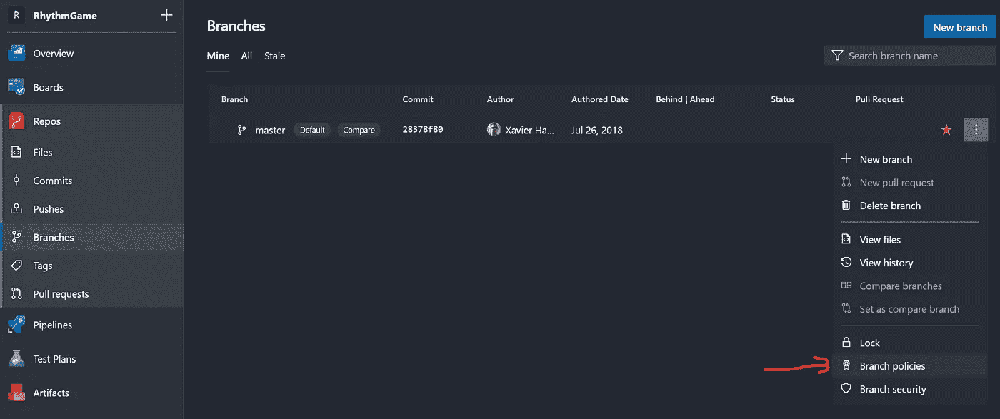
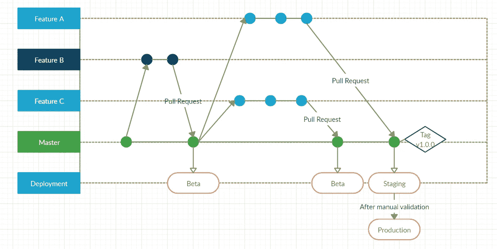
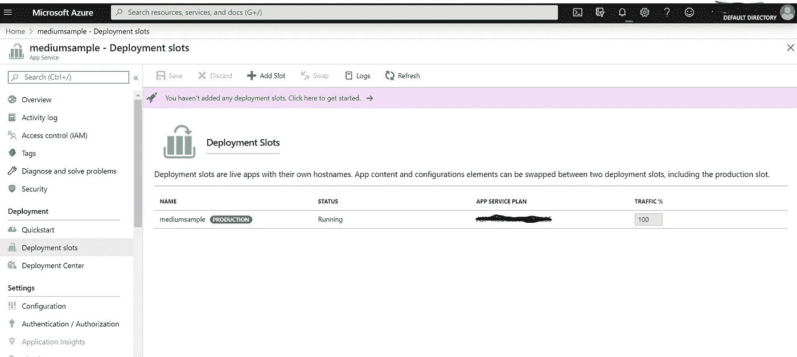
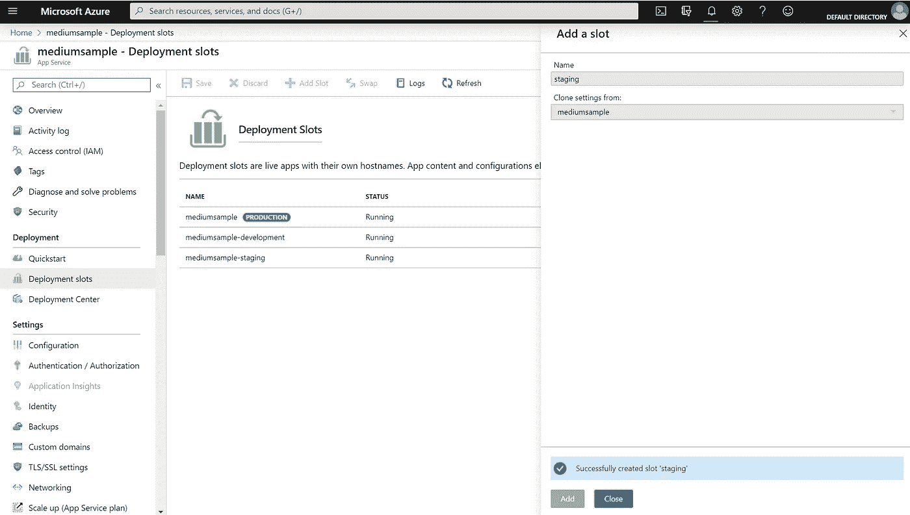
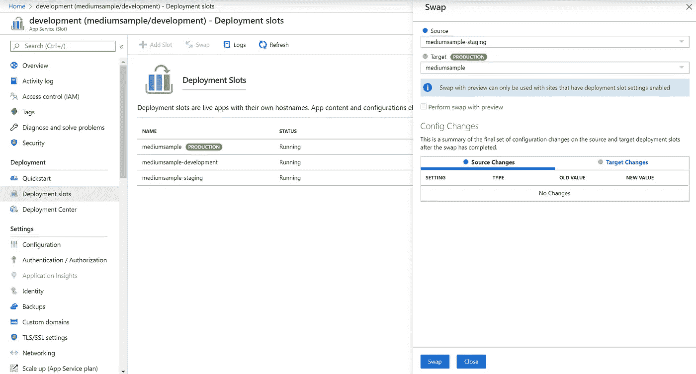
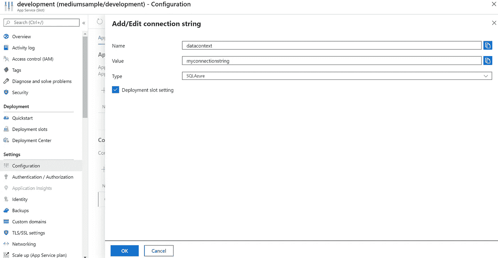

# ASP 的持续部署。使用 Azure DevOps 管道将. Net Core 应用程序迁移到 Azure

> 原文：<https://itnext.io/continuous-deployment-of-asp-net-core-app-to-azure-with-azure-devops-pipelines-d561198f4e61?source=collection_archive---------1----------------------->

第 1 部分:定义策略| Azure Pipelines YAML 菜谱

[送货服务车](https://www.flickr.com/photos/htakashi/16277420261)——[星岛孝](https://www.flickr.com/photos/htakashi/)

在我的[上一篇文章](/azure-devops-yaml-pipeline-recipes-578b5eda3e76)中，我们看到了如何使用 Azure Pipelines 持续构建 Nuget 包并将其部署到 Azure DevOps 工件。在下一部分中，我们将看到如何持续地部署 ASP。使用 Azure 管道将. Net 核心 web 应用程序转换为 Azure 应用程序服务。在第一部分中，我将讨论 CI/CD 和部署策略，下一篇文章将解释如何实现该策略。

# 持续集成、交付、部署？

在我们深入技术部分之前，我想澄清这三个术语。持续集成、持续交付和持续部署的区别是什么？

*持续集成*是当代码被合并到一个主线分支时，系统地运行自动化构建脚本的实践(例如“主”)。这个构建脚本将尝试构建解决方案，并对构建结果运行自动化测试(单元测试，可能是集成测试)。

*持续交付*基本上更进一步，它使用持续集成结果来创建打包的应用程序，准备交付给客户。在桌面应用程序的情况下，它可以创建安装包(例如 msi)。对于一个 ASP。它通常调用`dotnet publish`命令并创建一个准备部署的包。部署本身不是自动化的，需要手动完成。

*持续部署*又向前迈进了一步，自动将包部署到您的最终用户，以便您可以进行“按钮式”交付。在我在本文中演示的解决方案中，我使用 Azure Pipelines 验证特性来“阻止”部署，直到有人审查了交付，但是只需要在界面中单击一下就可以部署到生产中。

如果你想更深入地了解这个主题，你应该读一读[马丁·福勒关于这个主题的小文章](https://martinfowler.com/bliki/ContinuousDelivery.html)和这篇非常完整有趣的 [Circle CI 博文](https://circleci.com/blog/a-brief-history-of-devops-part-iv-continuous-delivery-and-continuous-deployment/?gclid=CjwKCAiAnfjyBRBxEiwA-EECLO6MyEgcKIfOpkcf8cqvv1yE8HUzA9rwtnQHRvjwew-3bDER_zHg5hoCT7MQAvD_BwE)。

# 定义您的部署策略

创建构建和发布脚本而没有定义这些脚本将如何以及何时被触发，以及定义它们将被部署的环境是非常无用的。因此，首先为我们的持续部署定义一个好的策略是非常重要的。

这个策略将定义何时触发构建和交付，我们将有多少个部署环境，以及交付将在哪个环境中基于触发它的原因被推动。

我将描述一个我和我的团队已经成功测试过的策略。可以把它看作一个样本，可以根据你的口味和需要进行修改。我也很想听听您对这一战略的想法和评论。

## GitHub 式流程

一个好的持续集成/持续交付(CI/CD)策略从定义一个好的分支策略来管理您的源代码控制开始。有一些分支策略， [Git Flow](https://nvie.com/posts/a-successful-git-branching-model/) 可能是最广为人知的策略之一。如果你好奇的话，可以查一下关于这个主题的[几篇](https://www.creativebloq.com/web-design/choose-right-git-branching-strategy-121518344) [文章](https://docs.microsoft.com/en-us/azure/devops/repos/git/git-branching-guidance?view=azure-devops)。

我将使用一个更简单的策略， [GitHub 流](https://guides.github.com/introduction/flow/)。在其核心，它非常接近 Git 流，除了它移除了*开发*分支，一旦它被合并到*主*中，或者甚至在 Pull 请求期间，系统地部署生产中的变更。

在这个策略中，*主*被锁定，没有人可以在上面合并工作。要进行更改，您必须创建一个*特征*分支，该分支将通过*拉动请求*合并到主特征。这允许代码在合并(并因此部署)之前被审查和讨论，强制执行代码审查，这提高了代码质量以及整个团队对源代码的了解。

我将我的策略称为类似 GitHub 的流，因为在教科书 GitHub 流中，生产中的部署是在 Pull 请求期间进行的，这不是我要设置的。我更喜欢在拉请求完成后部署到开发环境中，并且特性分支合并到主特性中。

## Azure DevOps 中的 GitHub 流

Azure DevOps 允许您创建分支策略来实现 GitHub 流，并强制使用 Pull 请求来将更改合并到主分支中。

为此，转到存储库的*分支*菜单，打开带有三个点的上下文菜单，并选择*分支策略*。

这将带您进入一个菜单，允许您通过设置一些规则来保护您的分支，这些规则必须为真，开放拉取请求才能通过。我通常会制定以下规则:

*   要求至少有 2 名评审员。所有其他选项保持未选中状态。如果有新的变化，重置投票在某些情况下可能是有用的，但对我们来说有点太苛刻了。
*   检查关联的工作项目，需要*。我们使用 Azure DevOps 进行项目管理，每个变更都必须链接到一个工作项(通常是一个任务)。这使我们能够半自动地创建发送给客户的变更日志。*
*   *检查注释解析，需要*。代码审查是我们日常工作的重要部分，我们的目标是获得尽可能高的代码质量。我们要求写在拉请求中的注释在完成之前得到解决。通常应该由评论者来解决评论，但是如果被评论者完全按照评论者的要求去做，我们也接受被评论者来解决。**
*   *添加构建策略，*要求*。使用将在持续集成阶段使用的构建管道系统地构建拉请求。单元测试在构建期间运行。这样，我们可以确保拉请求通过构建和单元测试。*
*   *对于我们有专家的代码的某些部分，我们有时会添加自动审查者，以便在投入生产之前由那些开发人员进行更彻底的检查。*

*一旦您的策略被设置在您的分支上，您将不能直接推送到它，如果您尝试的话，您将从 Git 得到一个错误消息。转到“拉”请求并启动一个新请求，以将更改合并回主请求。*

## *定义部署环境*

*持续部署(至少我是这样理解的)并不意味着必须将您发布到主分支的所有代码直接部署到您的**客户**那里。这样做将需要一个接受工作流，对于我们的业务需求来说太复杂了。*

*相反，我们决定定义三种环境:*

*   *一个“开发”环境，或“测试版”。这是合并到 master 中的代码被直接部署的地方。这个环境链接到它自己的数据库，没有生产数据。它用于支持新功能的内部演示，并支持同意为我们进行测试的选定客户，例如特定功能的测试。*
*   *一个“暂存”环境，在此环境中，我们在将正式版本发送给客户之前准备好它。发布到这个环境是通过在 master 上推送一个带有版本号的标签来触发的。
    在部署到此环境之前，我们将生产数据库(根据数据库的大小和复杂程度，可以是整个数据库，也可以只是数据库的结构和子集)复制到连接此环境的临时数据库。
    这使我们能够确保我们的数据库迁移脚本不会在生产中中断，并进行最终验收测试(手动和一些自动测试)。*
*   *我们的客户使用的“生产”环境。*

**

## *Azure 应用服务中的环境*

*Azure App Services 有一个很好的特性，可以管理同一个应用程序的不同环境。它被称为*部署插槽*，允许创建实时运行的应用程序，运行不同的代码，可以“热”交换。这意味着一个环境将“变成”另一个环境，直接重定向您的用户，而无需重启应用程序。*

*请注意，开发/测试应用服务计划(F1 和 B1)不支持部署插槽，您需要在生产计划中添加一个，最小 S1。*

**

*创建一个部署插槽非常简单，点击*添加插槽*，为你的新插槽选择一个名称，然后点击*添加*。几秒钟后，你会看到你的新插槽。*

**

*每个插槽都有自己的应用服务，运行在同一个计划上。您将为每个插槽获得一个发布配置文件，这意味着您可以在每个插槽上发布不同代码。*

*在我们的例子中，我们将只在开发和登台槽上部署代码，代码将通过交换登台和生产环境而投入生产。这将允许在灾难性故障的情况下，通过再次交换回到先前部署的版本。*

*交换可以通过点击 *Swap* 按钮直接在 Azure 门户中完成，但是我们将看到如何通过 Azure 管道脚本自动完成。*

**

*通常部署插槽会有不同的设置。例如，您可能有不同的数据库，这意味着不同的连接字符串。*

*这可以很容易地通过将*部署插槽设置*复选框设置为 true 来解决，我们不希望**被交换**。该复选框定义该设置是该插槽的*特定设置，不应被交换。没有此复选框的设置将被复制到交换到的环境中。**

**

*你可以在官方文档中找到更多关于部署槽的信息。*

# *结论*

*本文的第一部分到此结束。我们已经看到了如何定义一个持续部署的策略，以及如何定义 Azure 应用服务环境来实现我们的策略。*

*在下一篇文章中，我将描述用于实现持续集成和部署的 Azure 管道。*