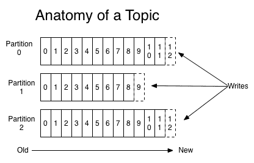
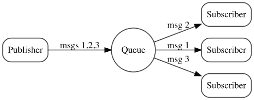
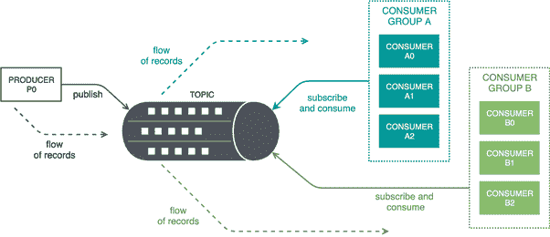

# NATS 与阿帕奇·卡夫卡的对比

> 原文：<https://itnext.io/contrasting-nats-with-apache-kafka-1d3bdb9aa767?source=collection_archive---------1----------------------->

**TL；卡夫卡博士是一个*事件流平台*，而 NATS 更接近于传统的*消息队列*。Kafka 围绕新兴的*事件驱动架构*的独特需求进行了优化，这些架构用强大的排序和持久语义丰富了传统的发布-订阅模型。相反，NATS 围绕发布-订阅拓扑进行了高度优化，并且是解耦系统的优秀平台，在这些系统中，消息顺序和可靠的交付不是问题。**

我将在这篇文章的开头指出，还有另一个产品——**NATS 流媒体**——这是一个不同的野兽，更接近卡夫卡。如果你在寻找一个替代的活动流媒体平台，你可能会想绕道去 NATS 流媒体；否则，请继续阅读。

# **订阅**

其核心是， **NATS 是关于发布和监听信息的**。这些在很大程度上依赖于**主题**，它们将消息划分为流或主题。消费者或者逐字订阅主题(精确匹配主题名)，或者使用通配符。下图是 NATS 出版商、受试者和消费者之间的关系。

信用:[https://nats.io/](https://nats.io/)

从表面上看，这与卡夫卡并不截然相反，卡夫卡也通过**主题**的方式将生产者和消费者分离。然而，它们的语义不同。卡夫卡将其主题组织成**分区**——无界的、完全有序的**记录流**(卡夫卡对信息的替代术语)。一个主题包含一个或多个分区，并呈现出**偏序**。(换句话说，虽然记录在其各自的分区内是完全有序的，但是它们在分区间的顺序是任意的。)这种灵活的安排使得 **Kafka 非常适合于秩序很重要的应用**；例如，状态机复制、事件源、日志传送、日志聚合、SEDA(分阶段事件驱动架构)和 CEP(复杂事件处理)。

说到主题，等价的 NATS 主题是一个轻量级的构造，它是基于需求(订阅)自动创建的，当需求停止时会自动删除。创建 NATS 主题的成本很低，这使得它们非常适合分层组织的数据，允许细粒度的订阅模型。任何使用过 MQTT 风格的代理(比如 HiveMQ)的人都应该对 NATS 有宾至如归的感觉。相比之下，卡夫卡的主题是重量级的实体，需要时间来旋转，缺乏 NATS 的技巧。因此，Kafka 消费者必须在本地执行大量必要的数据过滤——从所有分配的分区中消费记录，并悄悄地丢弃那些被认为不相关的记录。

卡夫卡式的分割在生物学意义上就像一条动脉——从源头抽离出来，供给下游器官——*消费者*。一条记录有一个**偏移量**，也可能有一个**键**和一个**值**；两者都是字节数组，都是可选的。记录的键会影响它的排序——共享一个公共键的记录肯定会占用同一个分区，从而保持它们的内在顺序。分区、记录和偏移量的概念如下所示。

信用:[https://kafka.apache.org/documentation](https://kafka.apache.org/documentation)

# **负载均衡**

为了进一步明确这两个平台之间的差异，让我们考虑一下 NATS 和卡夫卡是如何处理负载平衡的——这是任何面向消息的中间件的一个基本特征。

NATS 可以选择在一组订户之间平衡消息传递，这可用于提供应用程序容错和扩展工作负载处理。为了创建队列订阅，订阅者注册一个**队列名**。具有相同队列名称的所有用户形成相应的**队列组**。当关于注册主题的消息被发布时，*组中的一个成员被随机选择来接收消息*。尽管队列组可能有多个订阅者，但每个消息只由一个订阅者使用。下图说明了这一点。

信用:[https://nats.io/](https://nats.io/)

虽然 NATS 提供了低至消息级别的细粒度消费者可伸缩性，但这是以牺牲消息排序为代价的。消息可能会在两个或更多不同的订阅者处被无序地并发处理，这使得它不适合于对顺序敏感的应用程序。(注:NATS 流媒体解决了这一问题，但如前所述，它本身是一种不同的产品。)

卡夫卡的消费者订阅一个主题，作为一个包罗万象的消费者群体的一部分。当组中的第一个消费者加入主题时，它将接收该主题中的所有分区。当第二个消费者随后加入时，它将获得大约一半的分区，从而减轻第一个消费者先前一半的负载。当消费者离开(通过断开连接或超时)时，该过程反向运行，剩余的消费者将吸收更多的分区。所以一个消费者组平衡分区负载；添加的消费者越多，每个消费者收到的分区就越少。添加比分区更多的消费者会使一些消费者处于空闲状态； **Kafka 永远不会将一个分区分配给同一个组的多个消费者**。所以，虽然卡夫卡的负载平衡方案比 NATS 的更粗粒度；它设法在消费者节点保持记录的顺序。下图说明了生产者、主题、分区、消费者和消费者群体之间的关系。请注意，从记录流和负载平衡的角度来看，使用者组在逻辑上是隔离的。

# **交货保证**

另一个重要的区别是*持久性*。 **Kafka 是一个持久的数据存储库，提供至少一次交付语义**。使用者读取记录的行为并不会删除该记录，它只是将一个内部指针指向分区中的下一条记录。这被称为**提交**偏移。如果消费者在成功处理记录之前崩溃，Kafka 将重新交付最后一组记录(尚未提交补偿)。因为记录会保留一段时间(根据可配置的保留策略)，所以消费者可以随意处理在其保留期之前很久发布的记录。

相比之下，NATS 实施的是通常所说的**最多一次交付**。NATS 努力保持并提供一个“拨号音”。然而，如果订户退出，它将不会接收到消息，因为基本的 NATS 平台是简单的发布-订阅传输系统，仅提供 TCP 级的可靠性。(这使得 NATS 与更传统的 MQ 代理略有不同，传统的 MQ 代理倾向于为了那些在发布点之前注册了兴趣的订阅者的利益而持久保存消息，在消息被传递到所有端点之后删除消息。)简而言之，NATS 并不是被设计成一个长期的活动商店；它最适合用作面向订阅、以消息为中心的传输层，而不是数据存储。

# **运营问题**

从操作角度来看，差异也很明显。卡夫卡是一个庞然大物。它的部署拓扑由混合的**代理**和**动物园管理员**节点组成，有数百个(如果不是数千个的话)可调的“旋钮”，控制着它行为的各个方面。(还有一些是相当危险的，在没文化的手里。)

在这方面，NATS 集群要简单得多，参数也少得多——这并不奇怪，因为它缺乏持久性。

# **总结**

所以你有它。这两者之间的差异现在应该很明显了。以上观点并不意味着一个比另一个更好；这不是 A *对* B 的讨论。虽然可以客观地说，Kafka 通过迎合更广泛的消息传递和事件场景提供了更大的整体灵活性，但它的配置和维护也相应地更加复杂，并且在某些场景中可能是多余的。NATS 是一个更简单的解决方案，它更容易上手和操作。我们不要忘记，后者非常重要。使用最简单的平台，满足您当前和预期的需求，并与您组织中当前流行的技能组合保持良好的一致性。

这篇文章对你有用吗？我很想听听你的反馈，所以不要退缩。如果你对 Kafka，Kubernetes，微服务，或者事件流感兴趣，或者只是有什么疑问， [*在 Twitter 上关注我*](https://twitter.com/i/user/562466177) *。我也是*[*Kafdrop*](https://github.com/obsidiandynamics/kafdrop)*的维护者和* [*有效卡夫卡*](https://www.apachekafkabook.com/) *的作者。*