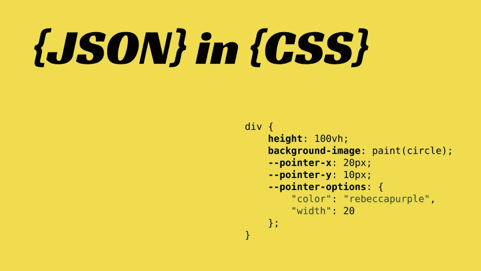

# 在 CSS 中用 JSON 控制画图小工具

> 原文：<https://itnext.io/controlling-paint-worklet-with-json-in-css-298a7b10e41c?source=collection_archive---------5----------------------->

这篇文章是基于我的关于同一主题的波兰博客文章。

如果您关注 JavaScript 社区，您可能知道 JS 中的 CSS。这是一种将 CSS 放到 JavaScript 文件中的方式，而不是单独的 CSS 文件。我在本文中展示的解决方案是相反的，它是一个放入 CSS 文件中的 JSON 对象，用 JavaScript 进行解析(您可能会将 JS 放入 CSS 中，但我没有测试它)。我们这样做的原因是为了控制基于 JavaScript 的 CSS，它是 Houdini 的一部分。



# 乌丹尼

Houdini 是为一个目的而创建的新 API 的集合。因此开发人员可以控制 CSS 引擎的行为。连接到它的内部，让它按照他们想要的那样工作。有些 API 已经实现，有些计划实现，有些仍在设计过程中，因此可能会有变化。你可以在 ishoudinireadyyet.com[的遗址](https://ishoudinireadyyet.com/)上看到胡迪尼的地位。

# 绘画小工具

这个 worklet 类似于普通的 worker(在浏览器中运行的独立线程),但是它允许注册“paint”类，该类可以访问类似 canvas 的 API，可以在 CSS 中使用该 API 来呈现事物(例如，使用背景图像)

要注册 paint worklet，您需要执行以下代码:

```
CSS.paintWorklet.addModule('plik.js');
```

在该文件中，您可以创建如下所示特殊类:

```
class Circle {static get inputProperties() {
        return ['--pointer-x', '--pointer-y', '--pointer-options'];
    }paint(context, geom, properties) {
        var x = properties.get('--pointer-x').value || 0;
        var y = properties.get('--pointer-y').value || 0;
        const prop = properties.get('--pointer-options');
        // destructure object props with defaults
        const {
            background,
            color,
            width
        } = Object.assign({
            color: 'white',
            background: 'black',
            width: 10
        }, JSON.parse(prop.toString()));
        // draw circle at point
        context.fillStyle = color;
        console.log({x,y, color, background, width})
        context.beginPath();
        const r = Math.floor(width / 2);
        context.arc(x, y, r, 0, 2 * Math.PI, false);
        context.closePath();
        context.fill();
    }
}
```

然后你可以注册这个类为**画图**:

```
registerPaint('circle', Circle);
```

# CSS 中的 JSON

如果你看一下这个类的前面的代码，你会看到:

```
const prop **=** properties.get('--pointer-options');
JSON.parse(prop.toString());
```

所以我们从 CSS 中获取原始数据，并将其解析为 JSON。在 CSS 中，它看起来像这样:

```
div {
    height: 100vh;
    background-image: paint(circle);
    --pointer-x: 20px;
    --pointer-y: 10px;
    --pointer-options: {
        "color"**:** "rebeccapurple",
        "width"**:** 20
    }**;**
}
```

每次你改变自定义属性(前面有两个破折号的那个，也叫 CSS 变量)，它会重新渲染背景。

**注意:**上次我测试这段代码时，CSS 变量中间需要有破折号，否则它们就不能使用画图工具。

当您向 CSS 添加自定义属性时，您还需要注册它们，因此它们具有类型:

```
CSS.registerProperty({
    name: '--pointer-x',
    syntax: '<length>',
    inherits: false,
    initialValue: '10px'
});
CSS.registerProperty({
    name: '--pointer-y',
    syntax: '<length>',
    inherits: false,
    initialValue: '10px'
});
CSS.registerProperty({
    name: '--pointer-options',
    inherits: false,
    initialValue: '{}'
});
```

您可以做的最后一件事是在鼠标移动时更改 CSS 属性:

```
document.querySelector('div').addEventListener('mousemove', (e) => {
    const style = e.target.style;
    style.setProperty('--pointer-x', event.clientX + 'px');
    style.setProperty('--pointer-y', event.clientY + 'px');
});
```

你可以在这个 [CodePen demo](https://codepen.io/jcubic/pen/JwVXKe) 里查看全部代码。

如果你喜欢这篇文章，你可以在 Twitter 上关注我。