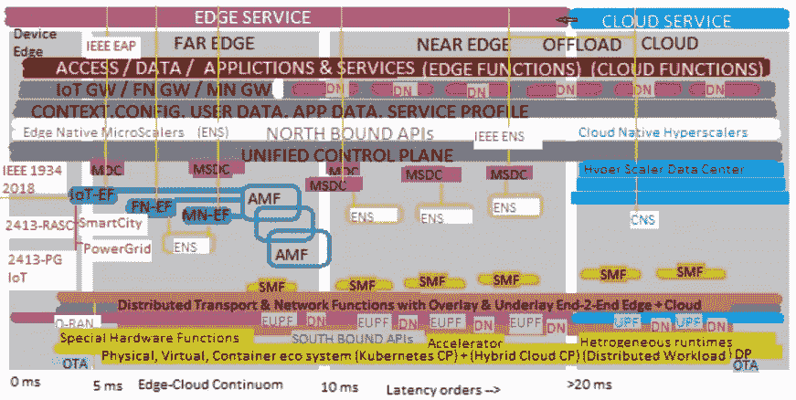
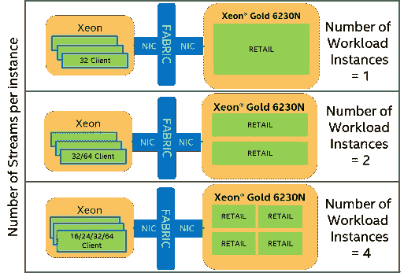
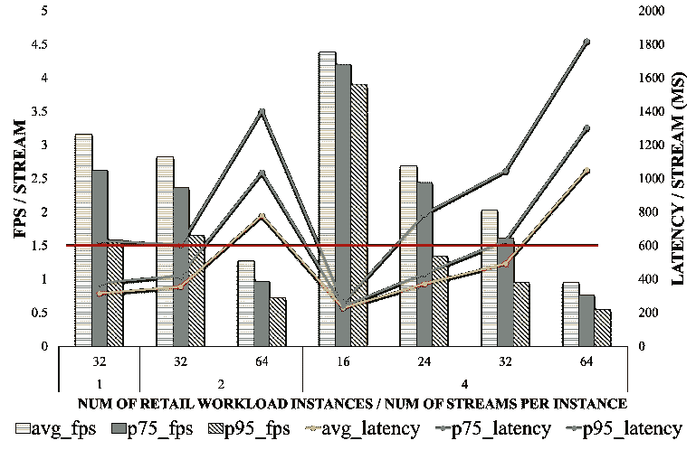
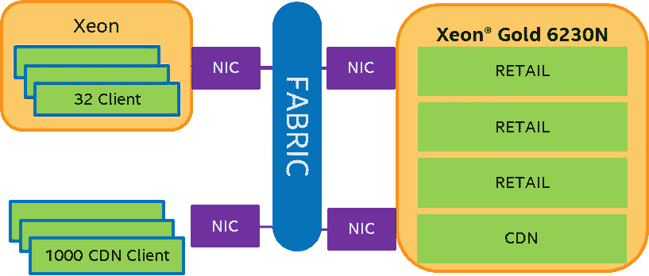
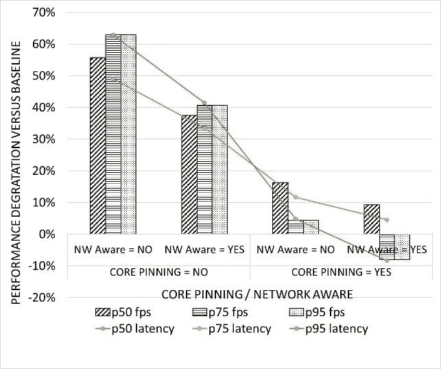
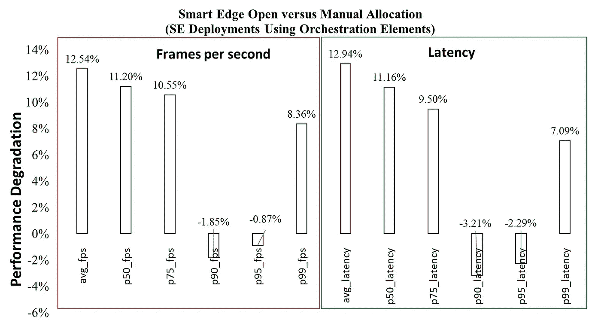

# 边缘服务和边缘基础设施的融合

> 原文：<https://itnext.io/convergence-of-edge-services-edge-infrastructure-a49537cef801?source=collection_archive---------4----------------------->

## 在边缘基础设施上集成边缘服务的挑战和技术

**摘要** —边缘云是一种高度分布式的异构边缘基础设施，遵循分散、云原生、完全协调和供应的架构原则，可以跨不同垂直领域管理应用工作负载的生命周期。整合多个工作负载，如视觉分析、人工智能、工业控制、CDN 等。，使企业能够以最佳方式搭载各种边缘服务和应用。为了提供能够将 edge 原生实例部署为标准工作流的自主架构，我们面临着工作负载、基于底层硬件功能优化服务、互操作性等方面的挑战。本文介绍了托管边缘服务的平台所需的关键组件，并使用 Smart Edge Open (SE-O)这一部署就绪的开放平台作为参考，展示了这些优势。我们选择视频分析和内容交付网络(CDN)作为工作负载来评估平台性能。与在边缘进行基于密度的手动优化相比，基于平台感知和资源优化的工作负载放置，我们能够将性能下降降低 50%。

**关键词** —边缘云、自动化、边缘服务、边缘原生、资源感知调度、融合边缘、生命周期管理、参考解决方案、cloudlet、开源、云原生、TCO

# 一.导言

多个标准旨在支持边缘计算，例如 ORAN 用于虚拟化和智能无线接入网络[1]，MEC 用于在边缘提供 IT 服务环境和云功能[2]，3GPP SA6 用于支持边缘应用的平台架构[3]等。这些标准有助于构建一类新平台的新兴生态系统，即。Edge Cloud 或 cloudlets，但对于希望利用其为云构建的创新解决方案的新解决方案供应商来说，它们是不够的。这些厂商是平台搭建商、应用开发商，或者服务运营商；他们赢得了更好的 QoE、更低的总拥有成本(TCO)、更高的工作负载密度、敏捷性和可扩展性。他们依靠 API 和编排来做出平台感知和用例感知的部署决策，换句话说，他们需要边缘基础设施和边缘服务的融合。开源云本地平台(如 Kubernetes)对此类边缘部署几乎没有提供指导。

学术论文对边缘的资源管理进行了深入研究，涵盖的主题从物联网设备到边缘[4] [5]，从边缘到云连续体[6]或边缘计算环境[7]。在过去的几十年里，已经进行了其他相关的工作[8]。然而，当谈到生产就绪的云原生解决方案时，对于与资源感知调度和服务的自主生命周期管理相关的主题，以及如何在基于 Kubernetes 的系统中部署和使用现有和即将推出的硬件功能，本文的覆盖范围有限[9]。在本白皮书中，我们展示了使用 SE-O 及其各种构建模块进行网络和计算资源管理的资源感知编排如何帮助我们降低噪音邻居的影响，并通过自动化应用生命周期管理提高应用密度。

本文其余部分的结构如下。第二节介绍了在 IEEE 未来网络国际下一代路线图(INGR) [10]的边缘服务平台章节下正在进行的工作，以详细说明这些挑战。第三部分介绍了 edge 原生服务，提供了部署和利用此类解决方案的开放参考平台的必要性。第四节介绍了这样一个解决方案的真实实例，称为 SE-O 框架。第五节描述了本文中使用此(SE-O)框架对云原生工作负载进行资源感知生命周期管理的案例研究。第六部分提供了上述案例研究的性能测试结果，强调了在边缘进行基础设施感知资源管理的必要性。第七节总结了该文件，并概述了这一领域的未来工作。

# 二。边缘服务平台框架

图 1:边缘到云连续体，IEEE ESP 框架

IEEE 未来网络国际下一代路线图(INGR)中关于边缘自动化平台的章节介绍了边缘基础设施向自动化平台发展的路线图和演进[10]。越来越需要一个整体的生命周期管理平台来部署使用利用 NFV 的边缘计算平台的应用[11]。INGR 章节向边缘服务平台的演进[12]旨在确定相关差距，并建立理想的路线图，以强调在边缘和核心数据中心之间提供无缝连接、部署和互操作性所需的工作，如图 1 所示。作为边缘服务平台(ESP)路线图计划的一部分，有一个活跃的跨产业-学术界工作组，详细介绍了在建立开放、可扩展、安全和零接触生命周期管理的边缘服务方面的一些挑战，这些服务使用边缘原生功能并利用底层硬件创新。跨数千个边缘位置部署和扩展边缘基础架构需要高效而精确的第 0 天、第 1 天和第 2 天操作。为了实现无处不在的边缘计算环境，软件需要具有智能性和适应性，以便在 MEC 生态系统(私有和 MEC 即服务供应商产品)之间实现互操作性

上述边缘平台路线图为成功部署建立了以下关键组件:

*   onboarding Edge 本机函数(ENFs)的 Edge 目录
*   用于在应用网关聚合 API 的开放服务代理
*   能够在云与边缘之间转移负载，反之亦然
*   能够使用简单的服务 API 提供边缘即服务
*   跨多个边缘云的互操作性
*   基于 DevOps 的平台有助于应用程序现代化
*   使用特殊硬件资源(GPU、FPGA、XPUs 等)加速边缘服务。(此处未涉及)
*   安全性，例如更接近应用的基于角色的访问控制(RBAC)、基础设施微服务(此处未涉及)

# 三。边缘本地服务和对开放平台的需求

边缘云是一个资源受限的平台。应用和服务必须在边缘环境的约束下充分利用可用的能力。它们可能是云原生的、基于微服务的，在安全的多租户配置中利用平台上可用的助手服务。这种分区受益于资源感知，同时促进了性能可伸缩性和安全性。移动性和联合是跨多个 MEC 域使用服务和平台功能的重要考虑因素。他们需要跨一系列设备功能的可移植性，一些具有硬件加速，一些没有。[13]中的 edge-native 范例描述了此类应用的特征。将底层功能划分到云原生微服务从另一个角度提供了帮助，即在开放平台中实现技术升级的简单即插即用途径。对于以云为中心的应用程序开发人员来说，这些需求太复杂了。从基于 ORAN 的 xApps 到安全访问服务边缘(SASE)要求[14]的多供应商和多层边缘平台方法，或者与云的多级 API 交互，对他们来说似乎太过艰巨，无法开发、部署和管理他们的边缘服务应用。开源生态系统，如 LF Edge，一直在与社区合作，帮助他们将各种框架集成到统一的 Edge 基础设施中。通过 Akraino Blueprints [15]，他们获得了关于即插即用模块化架构、低延迟布局和可扩展性的指导。

# 四。智能边缘作为支持 5G 的开放平台开放

在这项研究中，我们使用了一个开放的参考框架，Smart Edge Open 或 SE-O(以前称为开放)，这是一个具有云原生微服务架构的软件工具包，符合我们未来的研究方向。SE-O 是 CNCF 认证的基于 Kubernetes 的边缘集群，其中使用 Kubernetes 设计模式(如 CRDs、设备插件和操作符等)集成了开源组件和定制构建模块。它提供生命周期管理、基于目录的功能利用、延迟敏感操作、SASE 零信任等。，使集成、部署和管理 edge 原生应用以及其他 5G 网络功能变得更加容易。它提供了从视频分析、零售监控到内容分发等一系列使用案例。，所有这一切都发生在多租户环境中，在这种环境中，每个租户工作负载可用的 QoS 都受到保护，不会受到高噪声邻居的影响(缓存抖动)。SE-O 还可以为路边单元(rsu)、车载单元(vbu)和专用无线部署 5G 和 SD-WAN 组件以及网络工作负载；它有一个流量导向控制平面，也可以使用 N3IWF 通过 Wi-Fi 等非 3GPP 接入网络进行连接。本研究中使用了媒体和人工智能边缘工作负载的关键构建模块，涵盖资源管理、高性能数据平面、视觉推理管道以及面向生命周期管理的计算和网络资源感知。

# 动词 （verb 的缩写）资源感知生命周期管理案例研究

图 2:性能分析测试平台

在本研究中，我们比较了不同部署模式下视频分析零售使用案例的生产软件。进行了以下实验:

*   A.系统中单独运行的视频分析工作负载。
*   B.视频分析工作负载以及手动分配资源的内容交付网络(CDN)工作负载
*   C.SE-O 工作负载搭配和资源感知放置

实验使用客户机-服务器设置来模拟真实的部署系统。如图 2 所示，产生了多个客户端，使用英特尔以太网 XXV710-DA2 网卡接口连接客户端和服务器节点，将流量注入运行在基于目标至强 6230N 处理器的边缘节点上的应用服务。网卡支持将 SR-IOV 带宽划分到可以映射到特定容器的虚拟功能。

# 不及物动词绩效结果

## A.应用服务水平目标(SLO)

视频分析用例通常需要 SLO，包括每秒必须处理的输入帧数以及执行所实施用例的延迟或处理时间。在这种情况下，服务密度是并行处理的流的数量。在这个用于热图分析的零售视频分析用例中，开发人员已经确定，在 600 毫秒的延迟内，每个流至少需要处理 1.5 fps。任何具有低于该值的流 KPI 的部署模型都将违反用例需求。因此，就部署模型而言，边缘基础设施所有者将致力于在特定边缘设备中处理最大数量的服务单元(例如，流),而不违反 SLO。

视频分析服务纵向扩展到一定数量的核心数，然后横向扩展以最大化系统吞吐量。图 2 显示了使用横向扩展和纵向扩展以及不同数量的流客户端的组合对零售服务进行的实验。从每个套接字处理 32 个流的 1 个实例到每个套接字处理 4 个实例，每个实例处理 16 到 64 个流。在每个部署模型中，运行服务的容器都是使用核心固定来分配的，以便在各种服务实例之间分配计算资源。请注意，此工作负载受计算限制。因此，使用 SR-IOV 或其他伪像不会提高性能。

图 3:基线横向扩展与纵向扩展

图 3 显示了在不同配置下获得的性能结果。该图包括特定执行中所有流达到的每秒帧数和延迟(平均值、第 75 个百分点和第 90 个百分点)。水平(红色)线标记了服务需要的 SLO。低于这条线的任何内容都不能作为部署模型。使用平均 KPI 指标来确定是否满足 SLO，可以观察到，当 4 个实例(每个实例 32 个流，或总共 128 个流)用作理想的部署模型时，可以获得最大的服务密度。其他部署模型(如两个实例和 64 个流)不满足 SLO。通过这一分析，我们建立了性能基准，该基准表明，通过手动资源分配和使用纵向扩展和横向扩展配置，我们已经实现了每个插槽多达 128 个流。

## B.多租户带来的降级

为了建立多租户环境中所发生情况的基准，分析嘈杂邻居的影响并了解手动缓解机制，上面的零售用例部署了额外的工作负载组合。

图 4:多租户部署模型

图 4 显示了一个新的配置，其中我们删除了一个零售实例，并将其替换为网络密集型工作负载，在本例中为 CDN。与之前的部署测试平台一样，一个至强节点托管生成零售实例流的客户端，第二个至强节点托管生成 CDN 流量的客户端，最后一个至强节点托管服务本身。使用这种新配置，我们测试了四种不同的服务部署模型，以确定资源隔离在以下部署情况下的影响:

*   I)既不了解计算机也不了解网络
*   ii)不支持计算，但支持网络软件(使用 SR-IOV 虚拟功能(VFs)和 NUMA 支持)
*   iii)支持计算，但不支持网络(使用内核固定)
*   iv)计算感知和网络感知。

图 5:多租户性能下降

图 5 显示了分别针对这些模型获得的性能结果，并比较了零售工作负载相对于上一节中确定的最高性能所经历的性能下降(吞吐量和延迟)。可以清楚地观察到，与没有资源感知的大约 60%的降级相比，在中间值的情况下，执行资源感知分配允许降级减少到几乎为零。零售应用甚至能够改善 75%和 95%的延迟，这是因为 CDN 不是计算密集型的。然而，模型(I)需要更多的计算资源用于零售应用，即使是在不必要的时候。当没有资源计算核心固定时，各种零售应用程序会相互干扰，导致整体系统性能下降。

## C.多租户和智能边缘—开放式

本节比较 SE-O 与最佳部署模型的距离。在这种情况下，使用了三种不同的 SE-O 插件——SR-IOV 插件，用于确保 Kubernetes 环境中部署的每个服务都有自己的虚拟功能，并为每个虚拟功能分配独立的网络带宽；NUMA 感知插件，用于在与服务相连的虚拟功能所在的同一处理器中分配服务，以避免节点之间的 NUMA 流量；增强的性能感知插件，用于为服务分配计算资源，以确保服务不会跨套接字分布，从而减少资源争用

图 6: Smart Edge —开放式与手动分配

图 6 显示了 SE-O 相对于 a 部分中描述的原始场景有多远。不同的百分点显示在每秒帧数(红色)和延迟(绿色)中。可以观察到，当我们将各种资源手动分配到每个资源中时，SE-O 可以将零售服务的降级保持在非常接近于上一节中观察到的数字。第 VI(B)节显示了零售用例降级(当 CDN 工作负载被配置时)如何从 60%(当没有资源意识时)下降到 10%(当有对资源如何分配的控制时)。在 SE-O 的情况下，降解保持在大约 12-13 %,非常接近 10%。同样需要强调的是，在 SE-O 的情况下，Kubernetes 和其他相关基础架构元素消耗了少量计算资源，增加了额外编排成本的 2–3%。

不同的实验和部署模型显示了 SE-O 等框架的重要性，有助于利用底层基础设施有效管理应用服务生命周期。更重要的是，这些数字以生产就绪解决方案为例，展示了编排如何高效、自主地处理多租户和提高服务密度。

# 七。结论

本文介绍了处理 edge 本地服务和应用的实际挑战。尽管各种标准和开源团体正在研究和解决这些挑战，但我们强调了对利用开放标准接口的开放参考解决方案堆栈的需求。我们提出了这样一个候选 SE-O 框架，它展示了边缘应用和底层基础设施之间的紧密融合，以优化性能并防止 QoE 降级。进一步研究各种用例[16]，如专用 5G 无线部署、医疗保健应用、制造等。，用来验证本文中为零售案例建立的相关性

# 参考

[1] O-RAN 联盟。
【2】欧洲电信标准协会，
【3】3GPP SA6，[www . 3GPP . org/specifications-groups/sa-punctual/SA6-mission-critical-applications【4】](http://www.3gpp.org/specifications-groups/sa-plenary/sa6-mission-critical-applications[4])I .-h . Chuang 等人，“面向边缘计算的动态多资源管理”，2019 年欧洲网络与通信会议(EuCNC)，2019，第 379–383 页。
[5] Y. Li 和 L. Xu，“基于边缘-云协作的服务计算资源管理
策略”，2019 IEEE 第 10 届国际软件工程与服务科学大会(ICSESS)，2019，第 400–404 页。
[6] A. Mijuskovic 等人，“云/雾和边缘计算的资源管理技术:评估框架和分类”Sensors 2021，21，1832，doi:10.3390/s 21051832
[7]Baldoni，G 等人，5G 中立主机的 NFV 生态系统中的边缘计算增强。在 2018 年 IEEE 网络功能虚拟化和软件定义网络会议(NFV-SDN 2018)[8725644]
【8】S . a kundi 等人，“抑制 5G 网络中的噪声邻居:基于 NFV 的端到端框架，以检测和抑制噪声邻居”，《第 21 届分布式计算和网络国际会议论文集》，2020 年 1 月，doi:10.1145/3369740.3372768【9】S . Tibrewala 等人 E. Kartsakli，P. Mekikis，A. Antonopoulos
和 C. Verikoukis，“MECEnabled 5G 物联网架构中的在线 VNF 生命周期管理”，IEEE 物联网杂志，第 7 卷，第 5 期，第 4183-4194 页，2020 年 5 月，doi:10.1109/jiot . 2019.2944695 .
[12]边缘自动化平台，IEEE 5G &超越技术路线图 2019
【14】2021 SASE 融合战略路线图[www.gartner.com/en/](http://www.gartner.com/en/)
文档/3999828–2021-SASE 融合战略路线图
【15】AK raino Release 4–2 蓝图，LF Edge，[www.lfedge.org/projects/](http://www.lfedge.org/projects/)
AK raino/Release-4–2/
【16】文档，英特尔智能边缘，[www.intel.com/content www/us/en/【www】 s=Newe](http://www.intel.com/content/www/us/en/)

***注*** *:本文最初被纳入 2021 年 IEEE NFV-SDN 会议，并作为其会议录的一部分发表。所有内容权利属于其作者 Anurag Ranjan、Mandar Chincholkar、Prakash Ramchandran、Ranjan Mishra、* [*Sunku R*](https://medium.com/u/4427ab1d38b9?source=post_page-----a49537cef801--------------------------------) *和*[*Francesc Guim*](https://medium.com/u/fab8a2088779?source=post_page-----a49537cef801--------------------------------)