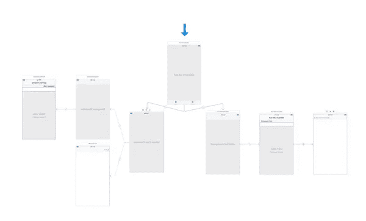

# 协调模式的问题&什么是 RouteComposer

> 原文：<https://itnext.io/coordinator-patterns-issues-what-is-routecomposer-8b50a0477917?source=collection_archive---------1----------------------->

我在继续关于我们使用的 [RouteComposer](https://github.com/ekazaev/route-composer) 库的[文章](/going-deeper-into-the-routecomposer-configuration-3a54661bb16a)的[系列](/composition-of-uiviewcontrollers-and-navigation-between-them-and-not-only-15b825da5ac)。在本文中，我想谈谈协调模式。我写这篇文章是因为之前一篇文章中关于协调模式的讨论。

最近引入的协调模式在 iOS 开发人员社区中越来越受欢迎，总的来说，原因很明显。UIKit 提供的开箱即用工具是一堆相当不标准的东西。

我以前提出过在堆栈中构建视图控制器时处理碎片的问题。为了避免重复，如果你想阅读更多，你可以这样做[这里](https://habr.com/ru/post/421097/)。

老实说，甚至苹果公司也意识到，当他们把视图控制器放在应用程序开发的中心时，他们没有提出任何明智的方法来将它们集成在一起或在它们之间传输数据。在向在 Xcode 中实现代码完成的同一批开发人员提供了这个问题的解决方案之后(*开玩笑*)，苹果在某个时候向我们展示了故事板和片段。

后来，苹果意识到他们是唯一一个开发由 2 个或更少屏幕组成的应用程序的公司。在下一次迭代中，他们提供了将故事板分成几个部分的机会，因为当故事板达到一定大小时，Xcode 开始崩溃。Segues 随着这个概念在几个迭代中发生了变化，这些迭代不一定相互兼容。他们的支持被紧密地编织到大规模的 UIViewController 类中，最终，我们得到了这个:

这段代码中强制类型转换的数量惊人。以及故事板本身中的纯字符串常量，Xcode 没有提供任何有意义的方法来跟踪它们。在使用故事板导航的过程中，最轻微的改变任何东西的愿望都可以让你毫不费力地编译项目，尽管它会在 Xcode 没有任何警告的情况下带着欢快的噼啪声崩溃到运行时。你看到的不是你得到的。

人们可以争论故事板中这些灰色箭头的优点，据说是向某人展示屏幕之间的联系。然而，根据我的经验，并且我特意采访了来自不同公司的几位 iOS 开发人员，一旦他们的项目增长超过 5–6 个屏幕，开发人员就试图找到更可靠的解决方案，并最终开始在他们的头脑中保留控制器堆栈的结构。这意味着如果你需要添加对 iPad 的支持，另一种导航模式，或者对推送通知的支持，那么一切都会变得很糟糕。

从那以后，人们已经做了一些尝试来解决这个问题——有些变成了独立的框架，有些变成了独立的架构模式。

让我们回到协调模式。由于显而易见的原因，你在维基百科上找不到任何描述。它不是标准的编程/设计模式。相反，这是一种抽象，它建议您隐藏所有这些“丑陋”的代码，创建新的控制器视图并将其插入堆栈，存储对控制器容器的引用，并在控制器之间推送数据。我找到的最有用的文章是 raywenderlich.com 的文章。协调员模式在 2015 年 NSSpain 会议之后开始流行，当时它被介绍给了公众。你可以在这里找到更多细节[，在这里](http://khanlou.com/2015/01/the-coordinator/)找到[。](http://khanlou.com/2015/10/coordinators-redux/%5D)

在继续之前，我将简要描述一下它是什么。

在所有的解释中，协调者模式大致符合这幅图:

也就是说，协调器是一个协议:

> 礼宾协调员{
> 
> func start()
> 
> }

所有“丑陋”的代码都应该隐藏在启动函数中。此外，协调员可能有到儿童协调员的链接。也就是说，它们具有某种组合的可能性，例如，您可以用一个实现替换另一个实现。听起来很优雅，对吧？

然而，它很快变得相当不雅:

1.  一些实现建议您将协调器从某种创造性的模式转换成某种更智能的模式，遵循视图控制器的堆栈，**使自己成为容器视图控制器**的代表。以 UINavigationController 的协调者为例，点击“后退”按钮或向后滑动并删除子协调者。自然，只有一个对象可以是委托，这限制了控制容器视图控制器本身的能力。最后，我们要么与协调者一起构建该逻辑，要么创建协调者的委托来将该逻辑传递给其他人。
2.  通常，创建下一个控制器**的逻辑取决于业务逻辑**。例如，要进入下一个屏幕，用户必须登录到系统中。很明显，这是一个异步过程，涉及到用登录表单显示一些中间屏幕，登录过程本身可能成功也可能失败。为了避免将协调器变成大规模协调器(类似于大规模视图控制器)，我们需要一个分解。也就是说，需要创建一个协调者的协调者。
3.  协调器面临的另一个问题是，它们本质上只是 UINavigationController、UITabBarController 等容器视图控制器的 fasades。必须有人给他们**提供这些控制器**的参考。如果所有事情都或多或少地与子协调者明确了，那么链的初始协调者就不是那么简单了。此外，当您更改导航模式时，例如对于 A / B 测试，重构和修改这样的协调器会导致另外一个令人头疼的问题。尤其是当容器视图控制器的类型改变时。
4.  当应用程序开始支持构建视图控制器的**外部事件**时，所有这些变得更加复杂。这包括推送通知或通用链接(用户点击电子邮件中的链接，并继续到应用程序的适当屏幕)。还有其他不确定性，协调器模式对此没有确切的答案。您需要准确地知道用户在哪个屏幕上，以便向他们显示外部事件请求的下一个屏幕。
    最简单的例子是由 3 个屏幕组成的聊天应用:
    *1。聊天列表。
    2。聊天本身被推入聊天列表导航控制器的导航中。
    3。可以模式化显示的设置屏幕。当用户收到推送通知并点击它时，他们可以在这些屏幕中的一个上。不确定性从这里开始；如果他们在聊天列表中，您需要推送与该特定发送者的聊天屏幕；如果他们已经在聊天屏幕中，那么你需要切换它；并且如果他们已经在与请求的发送者聊天，那么什么也不做并且更新它。但是，如果用户在设置屏幕上，可能需要关闭它并执行前面的步骤。但是如果你不关闭它，只在设置上方显示聊天模式呢？如果设置在另一个选项卡中，而不是在模态选项卡中呢？所有这些 if/else 要么开始抹黑协调员，要么以意大利面条的形式去找另一个超级协调员。此外，视图控制器堆栈的活动迭代将涉及尝试确定用户此刻的位置，或者尝试构建监控其状态的应用程序，这本身并不是简单基于控制器堆栈性质的简单任务。*
5.  蛋糕上的樱桃是 **UIKit 故障**。一个普通的例子: *UITabBarController* ，它有 *UINavigationController* ，在第二个选项卡中还有一些其他的 *UIViewController* 。用户在第一个选项卡中引发了一些事件，要求您切换选项卡并将另一个视图控制器推入第二个选项卡的 *UINavigationController* 。你需要按照那个特定的顺序来做，因为如果用户从来没有打开过第二个标签页，并且之前没有调用过 *UINavigationController* 的 *viewDidLoad* ，那么 push 方法将会失败，在控制台中只会留下一个模糊的消息。所以在上述例子中，协调者不能简单地成为事件的收听者；它们必须按照一定的顺序工作。这意味着他们必须互相了解。这已经与协调员的第一次发言相矛盾；协调器不知道关于父协调器的任何事情，并且只与子协调器相关联。这也限制了它们的互换性。

这个列表还可以继续下去，但是总的来说，协调模式显然是一个相当有限的、可伸缩性很差的解决方案。如果你不带玫瑰色的眼镜来看它，那么它只是将通常由庞大的 UIViewController 编写的一部分逻辑分解成另一个类的另一种方式。所有试图使协调器模式不仅仅是一种工厂模式并引入另一种逻辑的尝试都没有好结果。

值得一提的是，有一些基于这种模式的库，它们取得了不同程度的成功，使得这种模式在一定程度上弥补了所列出的缺点。我会指出[x 坐标](https://github.com/quickbirdstudios/XCoordinator)和 [RxFlow](https://github.com/RxSwiftCommunity/RxFlow) 。

# **我们做了什么？**

我们已经参与了一个项目，这个项目是我们从另一个团队获得支持和开发的——协调者和他们简化的“曾祖母”*路由器*——在架构方法 *VIPER* 中。我们回到了以前在我们公司的另一个大型项目中运行良好的方法。这种方法没有任何名称。它基本上位于表面。当我们有空闲时间时，我们把它隔离到一个单独的库 [RouteComposer](https://github.com/ekazaev/route-composer) 。它完全取代了我们的协调员，并被证明更加灵活。

这是什么方法？这种方法依赖于视图控制器的堆栈(树)。而不是创建需要监控的额外实体。并且不保存或跟踪应用的状态。

让我们更仔细地看看 *UIKit* 实体，并弄清楚我们的底线是什么，以及您可以使用什么:

1.  **控制器视图栈**是一种树。有一个根视图控制器，它有子视图控制器。模式化呈现的视图控制器是子视图控制器的特例，因为它们也与呈现的视图控制器相关联。这些都是现成的。
2.  我们需要创建视图控制器的实体。它们都有不同的构造函数，可以使用 Xib 文件或故事板创建，它们有不同的输入参数。但是它们都需要被创造，这一事实将它们联系在一起。所以知道如何创建控制器的模式**工厂**将适合我们。每个工厂生产一个视图控制器实体，它很容易被详尽的单元测试覆盖，并且不依赖于其他的。
3.  让我们把视图控制器分成 2 类:
    *1。只需查看控制器。
    2。* ***容器视图控制器*** *s.*
    容器视图控制器与简单视图控制器的不同之处在于，它们可以包含子视图控制器，这些子视图控制器也是容器或简单视图控制器。这些视图控制器是现成可用的: *UINavigationController* 、 *UITabBarController* 等等，但是也可以有用户创建的自定义视图控制器。如果抽象一下，可以在所有容器中找到以下属性:
    *1。他们有一个包含所有控制器的列表。
    2。一个或多个控制器当前可见。
    3。他们可能会被要求使这些控制器之一可见。这是 *UIKit* 中容器视图控制器的唯一区别。他们只是有不同的方法来达到这三个目标。*
4.  为了嵌入由所述工厂创建的视图控制器，使用父视图控制器的方法:*uinavigationcontroller . pushviewcontroller(…)*，*uitabbarcontroller . selectedviewcontroller =…*，*uiview controller . present(…)*。
    您可能会注意到，您总是需要两个视图控制器用于该流程:一个已经在堆栈(树)中，另一个需要构建到堆栈中。让我们把它们包装成一个包装器，称之为**动作**。每个动作都很容易用详尽的单元测试来覆盖，而且每个动作都是相互独立的。
5.  从上面可以看出，通过使用这些实体，我们可以构建一个配置链，如*工厂* → *动作* → *工厂* → *动作* → *工厂*，运行它之后，您可以构建一个具有任何复杂视图的树。我们只需要指定起点。这些起始点通常是属于 UIWindow 的 *rootViewController* 或者是树的最高叶子*当前视图控制器*。也就是说，这个配置正确的写法是:
    **启动视图控制器** → **动作** → **出厂**→**……**→**出厂**。
6.  此外，我们将需要一个知道如何运行和构建所提供的配置链的实体。姑且称之为**路由器**。路由器不拥有状态，也不保存任何引用。它有一个传递配置的方法，并按顺序执行配置步骤。
7.  让我们通过向链中添加**拦截器**来为配置增加一些额外的责任。我们将需要三种类型的拦截器:1。在导航开始前启动。在这里，我们可以将用户身份验证的任务交给系统和其他异步逻辑。2.在创建控制器视图时执行，以便在其中设置一些值。3.执行导航后，在这里您可以放置各种分析任务。每个实体都很容易被单元测试覆盖，并且不知道如何在配置中使用它。它只有一个责任，并履行它。复杂导航的配置可能如下所示:
    **【导航前任务…】**→**起始视图控制器** → **动作** → **(工厂+【上下文任务…】)**→**…**→**(工厂+【上下文任务…])** → **【导航后任务…】**。
    也就是说，所有任务将由路由器顺序执行，执行小的、容易阅读的原子实体。
8.  还有最后一个任务没有被配置解决——即导航应该开始时应用程序的状态。如果我们不需要构建整个视图控制器链，而只需要构建其中的一部分，会怎么样？这可能是因为用户已经手动构建了一部分。这个问题总是可以通过一个带有控制器视图的树来明确地回答。如果链的一部分已经建立，它已经在树中。
    因此，如果链中的每个工厂都可以回答它是否已建成的问题，那么路由器将能够了解链的哪个部分需要完成。当然这不是一个工厂任务，所以进入了另一个原子实体— **Finder** 。
    那么任何配置看起来都是这样的:
    **【导航前任务…】**→**起始视图控制器** → **动作**→**(Finder/Factory+【context Task…】)**→**…**→**(Finder/Factory+【context Task…])**→**【导航后任务…】**。
    如果路由器开始反向读取配置，那么其中一个发现器会告诉路由器已经建立了相应的工厂，路由器会从这个点开始向前建立链。如果它们都没有在树中找到相应的视图控制器，那么就需要从初始控制器开始构建整个链。

路由器运行配置链的方式

最后，我们希望配置是严格类型化的。因此，每个实体只使用一种类型的控制器视图；一种数据。配置完全依赖于 Swift 与**关联类型**协同工作的能力。我们希望信任编译器，而不是运行时。开发人员可能会有意弱化输入，但反之则不然。

这种配置的一个例子是:

在 UINavigationController 内部从最顶层的视图控制器模式化地呈现产品视图控制器

上述项目涵盖了整个库并描述了方法。剩下的工作就是为用户点击按钮或外部事件发生时路由器将执行的链提供配置。如果这些是不同类型的设备，例如 iPhone 或 iPad，那么我们可以使用多态性提供不同的配置。如果我们有一个 A / B 测试，我们可以做同样的事情。我们不需要考虑应用程序在导航开始时的状态，我们只需要确保配置最初是正确编写的，并且我们确信路由器会以某种方式构建它。

所描述的方法比某种抽象或模式更复杂，但是我们还没有遇到这样的任务。当然， [RouteComposer](https://github.com/ekazaev/route-composer) 需要学习和理解它是如何工作的。然而，这比学习 AutoLayout 或 RunLoop 的基础知识要容易得多。

该库以及所提供的路由器的实现没有使用 Objective C 运行时的任何调整，并且完全遵循 UIKit 的所有概念。它只是有助于将合成过程分成几个步骤，并按照给定的顺序执行它们。用 iOS 版本 9 到 13 测试的库。

谢谢你。我很乐意回答你的任何问题。

PS:如果你喜欢这个库，别忘了在 [GitHub](https://github.com/ekazaev/route-composer) 上给它一颗星！

# 证明书

## 即 ai

> *在领先的同步中风护理服务 Viz.ai，我们开始更换整个导航系统，我们知道我们需要解决复杂和动态的导航场景。协调器和其他流控制库不能满足我们的需求，并导致混合应用程序逻辑和导航，或者创建大量的协调器类。RouteComposer 非常适合我们，实际上，正如这个库的创建者所说，它是您当前使用的任何协调器代码的替代品。*
> 
> 这个库的关注点分离非常漂亮，就像任何天才的东西一样，它像魔法一样工作。它确实有一个小的学习曲线，但它的回报远远超过协调器和流控制器，并且一旦实现它，将会为您节省大量的编码。
> 
> *它让应用程序中的导航变得简单，就像说“用 y 转到 x”一样简单，不用担心当前的状态或堆栈。我真心推荐。*
> 
> ***Elazar Yifrach，资深 iOS 开发者@ Viz.ai***

## 哈得孙湾公司

> *在我们的 iOS 应用中，我们希望为用户提供无缝体验，以保证无论用户何时点击推送通知或电子邮件中的链接，他们都会无缝地进入应用中所需的视图，而不管应用的状态如何。*
> 
> *我们在代码中尝试了一种编程式导航方法，也尝试了依赖一些其他的库。然而，他们似乎都没有成功。RouteComposer 不是我们的首选，因为它看起来太复杂了。谢天谢地，这被证明是一个奇妙而优雅的解决方案。我们不仅开始用它来处理外部深度链接，还开始用它来处理应用程序内部的导航。当不同的用户有不同的导航模式时，它也是一个很好的 UI A/B 测试工具。它节省了我们大量的时间，我们真的很喜欢它背后的逻辑。*
> 
> *库的创建者反应非常迅速，帮助我们解决了所有问题。我会全力推荐它！*
> 
> ***Alexandra Mikhailouskaya，高级首席工程师@哈德逊湾公司***

## 英国广播公司

> *我们最近进行了第五次也是最大一次应用更新，包括从头开始重新构建用户导航。在我们的一位高级开发人员建议我们试用 RouteComposer 之前，我们从现有的(六个文件长的)协调器的简单迁移开始。概念验证很有挑战性，但 Eugene 让我负责将 RouteComposer 改造成我们现有的企业级代码库，当所有部分都到位时，结果就是简单性本身。*
> 
> 我们的其他开发人员已经接受了 RouteComposer 来代替 segues、unwind segues、手动推送、弹出和模态拖放，由此产生的围绕我们应用程序的导航令人愉快。
> 
> 非常感谢尤金的帮助。
> 
> ***skooter Martin，高级专业移动工程师@ B.W.A.***