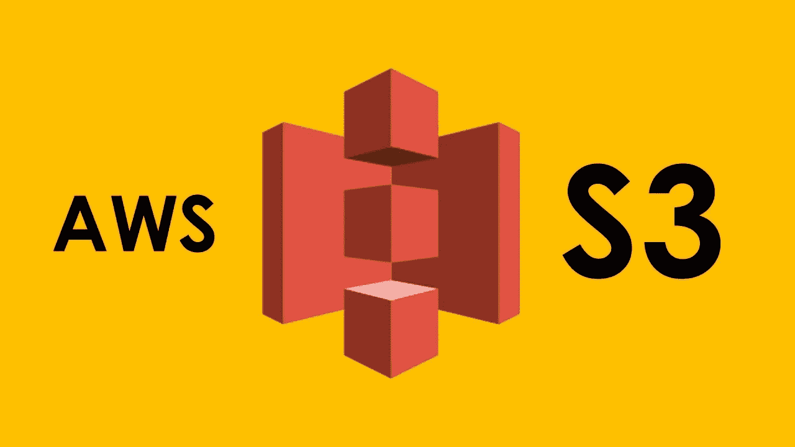

# 将本地文件复制到 AWS S3 存储桶(AWS CLI + S3 存储桶)

> 原文：<https://itnext.io/copy-files-from-local-to-aws-s3-bucket-aws-cli-s3-bucket-9dc898608ff8?source=collection_archive---------1----------------------->

## AWS CLI 和 S3 存储桶



[*点击这里在 LinkedIn* 上分享这篇文章](https://www.linkedin.com/cws/share?url=https%3A%2F%2Fitnext.io%2Fcopy-files-from-local-to-aws-s3-bucket-aws-cli-s3-bucket-9dc898608ff8)

在我当前的项目中，我需要将我的前端代码部署/复制到 AWS S3 桶中。但是我不知道如何表演。我的一个同事找到了完成这项任务的方法。

以下是自始至终的指导方针；如何安装 AWS CLI，如何使用 AWS CLI，以及其他功能。

那么，让我们从头开始。在我的 mac 上，我没有安装 aws cli，所以我在运行下面的命令时出现了错误。

打开你的终端，

```
$ aws --version

output
-bash: aws: command not found
```

(在这里我得到了解决办法，【https://qiita.com/maimai-swap/items/999eb69b7a4420d6ab64】)

现在让我们安装 brew，如果您还没有安装的话。
**Step1。安装 brew**

```
$ ruby -e "$(curl -fsSL https://raw.githubusercontent.com/Homebrew/install/master/install)"
```

在 windows 上安装，下载 aws-cli msi。

```
https://docs.aws.amazon.com/cli/latest/userguide/awscli-install-windows.html
```

**步骤 2。检查 brew 版本**

```
$ brew -v

output
Homebrew 1.5.2
Homebrew/homebrew-core (git revision 58b9f; last commit 2018-01-24)
```

**步骤 3。安装 aws cli，使用以下命令**

```
$ brew install awscli
```

第四步。检查 aws cli 版本

```
$ aws --version

output
aws-cli/1.14.30 Python/3.6.4 Darwin/17.3.0 botocore/1.8.34
```

太好了，现在是时候配置 AWS 凭证了。
**Step5。现在配置 aws 概要文件**

```
$ aws configure
AWS Access Key ID [None]: <your access key>
AWS Secret Access Key [None]: <your secret key>
Default region name [None]: <your region name>
Default output format [None]: ENTER
```

所有设置都完成了。现在你可以访问你的 s3 存储桶了。

从这里开始，我们可以学习如何管理我们的水桶。

**管理存储桶**
aws s3 命令支持常用的存储桶操作，例如创建、删除和列出存储桶。

**1。列表桶**

```
$ aws s3 ls

output
2017-12-29 08:26:08 my-bucket1
2017-11-28 18:45:47 my-bucket2
```

以下命令列出了 bucket-name/path 中的对象(换句话说，bucket-name 中由前缀 path/)筛选的对象。

```
$ aws s3 ls s3://bucket-name
```

**2。创建存储桶**

```
$ aws s3 mb s3://bucket-name
```

(aws s3 mb 命令创建新的存储桶。存储桶名称必须唯一。)

**3。移除铲斗**
使用 aws s3 rb 命令移除铲斗。

```
$ aws s3 rb s3://bucket-name
```

默认情况下，桶必须为空，操作才能成功。要删除非空的存储桶，您需要包括- force 选项。

```
$ aws s3 rb s3://bucket-name --force
```

这将首先删除存储桶中的所有对象和子文件夹，然后移除存储桶。

**管理对象**
高级 aws s3 命令也可以方便地管理亚马逊 s3 对象。对象命令包括 aws s3 cp、aws s3 ls、aws s3 mv、aws s3 rm 和 sync。cp、ls、mv 和 rm 命令的工作方式与它们的 Unix 类似

cp、mv 和 sync 命令包含一个- grants 选项，可用于将对象权限授予指定的用户或组。使用以下语法将- grants 选项设置为权限列表:

```
--grants Permission=Grantee_Type=Grantee_ID
         [Permission=Grantee_Type=Grantee_ID ...]
```

每个值包含以下元素:

*   权限–指定授予的权限，可以设置为 read、readacl、writeacl 或 full。
*   grantee _ Type–指定如何识别被授权者，可以设置为 uri、电子邮件地址或 id。
*   Grantee _ ID–根据 Grantee_Type 指定被授权者。
*   尤里——小组的 uri。有关更多信息，请参见谁是被授权者？
*   电子邮件地址–帐户的电子邮件地址。
*   id–帐户的规范 ID。

```
aws s3 cp file.txt s3://my-bucket/ --grants read=uri=http://acs.amazonaws.com/groups/global/AllUsers full=emailaddress=user@example.com
```

# ■从目录中复制多个文件

如果你想把一个目录中的所有文件复制到 s3 bucket，那么检查下面的命令。

```
aws s3 cp <your directory path> s3://<your bucket name> — grants read=uri=[http://acs.amazonaws.com/groups/global/AllUsers](http://acs.amazonaws.com/groups/global/AllUsers) — recursive
```

我们使用— recursive 标志来表示所有文件都必须递归复制。当使用参数 recursive 传递时，下面的 cp 命令递归地将指定目录下的所有文件复制到指定的桶中。

我们可以在复制文件时设置排除或包含标志。

```
aws s3 cp <your directory path> s3://<your bucket name>/ — recursive — exclude “*.jpg” — include “*.log”
```

更多详情，请通过 aws 官方链接。
[https://docs . AWS . Amazon . com/CLI/latest/user guide/using-S3-commands . html](https://docs.aws.amazon.com/cli/latest/userguide/using-s3-commands.html)

感谢您抽出宝贵的时间阅读。

享受编码。


**感谢&最诚挚的问候
Alok Rawat**

*最初发表于*[*qiita.com*](https://qiita.com/alokrawat050/items/56820afdb6968deec6a2)*。*