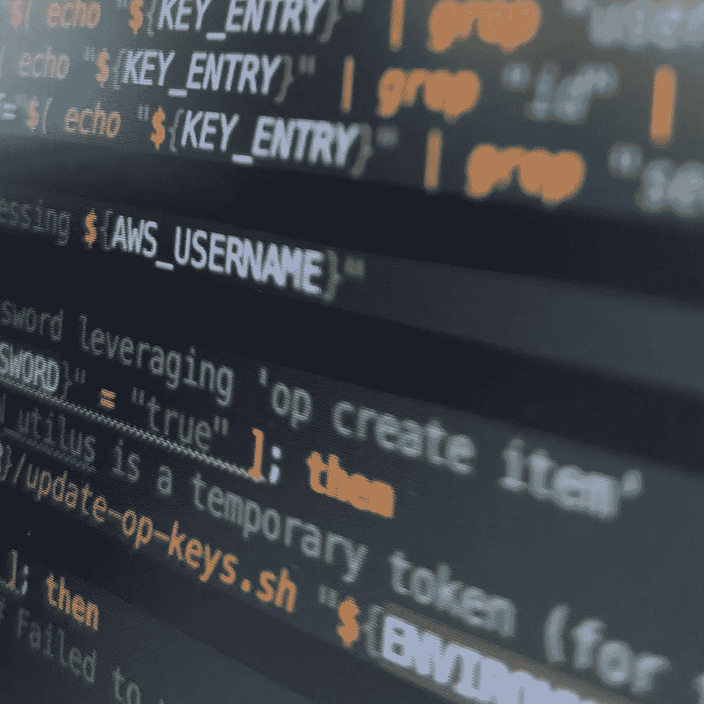

# 覆盖你的(关键)基地

> 原文：<https://itnext.io/covering-your-key-bases-9b007f3fd9a2?source=collection_archive---------8----------------------->

密钥管理很难，可以把密钥包装在密钥中，把方案包装在方案中，就像中国盒子一样。然而，总需要在某个地方有一把打开外箱的钥匙。我不打算解决那个问题。这是一个关于从完全手动的密钥管理系统到自动轮换和分发密钥的系统的旅程的故事。我们认为这非常有价值，因为:(现在诚实地回答这个问题)如果需要两个工作日来改变和重新分配你的密钥，你会多久轮换一次

我们想要的解决方案的主要特性是:

1.  与云/平台无关。(它不需要在 EC2 机器上运行)
2.  轻量级。(我们不想部署额外的基础设施来管理密钥。)

# 第一步——手动旋转很累人

当我开始从事一个正在进行的大项目时，我的第一个任务是创建和记录登机和离机程序。我们需要自动化解决方案，因为:

*   整个项目都在公共云中
*   我们自动部署了许多基础设施
*   我们必须管理多个内部和外部用户(来自多个不同的组织)的访问

我们从[cloud.gov](https://cloud.gov/docs/ops/runbook/rotating-iam-users/)那里得到了启示，并跟随他们实现如何使用 Terraform(这是我们与 API 交互的 goto 工具)旋转 AWS 键。

他们的程序可归结为以下几点:

1.  在地形配置中定义新的键。
2.  运行 Terraform 在 AWS 中创建键。
3.  在所有需要的地方更新密钥和机密。
4.  从地形配置中删除旧密钥。
5.  运行 Terraform 从 AWS 中删除旧密钥。

这让我们对 Terraform 代码进行一些手动更改，运行几次 terraform，最后手动分发密钥。然而，有一个问题:我们必须维护大量的 AWS 键！我们的细粒度访问控制实现意味着我们使用大量 AWS 密钥。

*   2 用于根帐户，而
*   24 分布在开发、tst、acc 和 prd 环境中。

对 Terraform 进行更改以创建新密钥是比较容易的部分。从 Terraform 输出中提取所有这些内容，进行解密，然后将它们分发到 git lab(terra form 部署基础架构的地方)和 1Password(我们存储所有机密以确保安全的地方)非常繁琐。

# 第二基地-地球化 Gitlab 变量

繁琐我可以处理(一天)，但是手动操作会导致错误，尤其是重复、相似的手动操作。断裂的 CI/CD 管道很多。因为您可能会出错或忘记需要复制到 Gitlab 的两个部分中的每一个。(56 个“复制和粘贴”动作…实际上更多，因为在多个地方需要一些 AWS 键)。所以接下来两周的模式变成了每次失败的构建都意味着首先检查键。幸运的是:Terraform 有一个 Gitlab 提供商。对我们来说不那么幸运:它不完全支持管理 Gitlab 组和项目中的 CI/CD 变量。嗯，至少最初支持将变量放在项目中，在一个分支中。很明显，这也需要一些工作。好消息是:这段代码现在是由你真正写的了(写平台提供者实际上很有趣！).有了这一新功能，我们可以构建一个管道:

1.  [污点](https://www.terraform.io/docs/commands/taint.html)全部按键。

1.  运行 Terraform apply 以生成新密钥，并将密钥作为项目或组变量存储在 Gitlab 中。

# 第三层—共享且安全的访问 AWS 密钥

一旦我们将 AWS 密钥自动分发到 CI/CD 管道，我们就不会因为 AWS 密钥不正确或丢失而导致构建中断。然而，有时 CI/CD 不可用，我们需要手动运行我们的自动化管道(即从我们的笔记本电脑)。鉴于我们设置 CI/CD 的方式，这应该不成问题，因为我们可以轻松地执行作业执行的相同脚本。除此之外，CI/CD 变量拥有最新和正确的 AWS 密钥，而我们的笔记本电脑却没有！

现在，如果我们的笔记本电脑能够像 CI/CD 管道一样(自动)访问完全相同的 AWS 密钥，会怎么样呢！换句话说，如果我们可以将相同的 AWS 密钥分发给 CI/CD 管道和开发人员，会怎么样？这样我们就能绝对肯定它们不会出现分歧。

输入密钥库。 [Keybase](https://keybase.io/) 是一个很好的上升和未来的项目，“一个松弛，但对整个世界来说。”正如他们网站上所说。一切都基于非对称密钥加密技术进行端到端加密。我们在使用 Terraform 时了解到了 Keybase，因为 Terraform 可以[使用 Keybase 来加密保存在其状态](https://www.terraform.io/docs/providers/aws/r/iam_user_login_profile.html#pgp_key)中的 AWS 密钥，使用 Keybase 用户句柄。这保护了存储在共享状态文件中的密钥，以确保只有其所有者可以实际使用它(通过使用 Keybase 来解密它)。此外，Keybase 提供了一个用户空间挂载点(通常在`/keybase`)，它模拟了一个包含 3 个主要目录的文件系统树:

*   public:保存用户希望公开的文件。
*   private:保存用户希望保密的文件。
*   team:保存用户所属的每个团队的子目录，每个团队的成员都可以使用私有文件。

这个文件系统树的特别之处在于，文件和目录实际上并不在文件系统上，而是每次我们访问它们时，Keybase 客户机都会调用 Keybase APIs 来检索它们。对我们来说，最有意义的实现是利用 Keybase 团队来存储共享的 AWS 密钥。我们的个人用户帐户没有 AWS 密钥，相反，我们使用的 AWS 密钥属于我们团队成员共享的功能/系统/bot 帐户。这就是为什么经常轮换这些钥匙对我们如此重要，尤其是当有人离开团队的时候。

现在，我们开始将 AWS 密钥分发到 Keybase 团队的 [AWS 凭证文件](https://docs.aws.amazon.com/cli/latest/userguide/cli-configure-files.html)，而不是分发到 Gitlab CI/CD 变量。当然，通过设置适当的[环境变量](https://docs.aws.amazon.com/cli/latest/userguide/cli-configure-envvars.html)，我们可以在任何地方使用这些文件。我们必须确保的是，我们所有的团队成员都在正确的 Keybase 团队中，并且我们的 bot(为我们运行 CI/CD 管道)也是这些团队的成员。实际上，我们还必须确保运行 CI/CD 管道的 bot 可以通过 Keybase 客户端登录到 Keybase，并且运行我们构建的容器能够通过用户空间中的文件系统(FUSE)与 Keybase 文件系统进行适当的交互。我们确实面临一些正常的自动化问题，因为我们必须在访问团队文件系统之前等待 Keybase client 准备好，并确保在终止运行管道作业的容器之前[更新已经被刷新到 Keybase 服务器](https://github.com/keybase/client/issues/14281)。

为了完成图片，同样的 AWS 密钥也需要存储在 1Password 中，因为这是我们所有秘密的真实来源。幸运的是，1Password 拥有能够与其 API 对话的[‘op’命令行客户端](https://support.1password.com/command-line/)，因此我们也可以将其自动化。

通过一些脚本，我们能够将 aws 密钥从 terraform 状态中取出，并将其推送到正确的 AWS 凭据文件和正确的 1 密码存储库。该脚本主要做两件事:

1.  要求 Terraform 提供该州的 AWS 密钥；
2.  每个 AWS 密钥都存储在 aws-credentials 文件和 1Password 中。

当我们现在轮换密钥时(通过 CI/CD 管道或在笔记本电脑上本地)，相同的文件被更新，并且几乎立即可供任何有权访问 Keybase 团队的人(无论是开发人员还是运行 CI/CD 管道的机器人)使用。

# 密钥库—分布式访问所有机密，而不仅仅是 AWS 密钥

鉴于我们在 Keybase 团队存储 AWS 密钥方面取得的成功，我们决定进一步推动这种方法，并将其推广到所有类型的秘密。我们不仅需要提供基础架构和应用程序，还需要访问所述基础架构和应用程序。

我们使用和需要供应系统的其他秘密通常存储在一个`secrets.tfvars`中(或者许多其他在文件名中包含 AWS 区域、项目和环境名称的变体)。这些文件以前在 git 中是不存在的，因为我们没有费这么大的劲来管理这些秘密，让它们进入 git。我们将这些文件移动到我们的 Keybase 团队中的正确位置(使用一个路径结构来反映我们在多个 git 存储库上的代码结构),然后在 git 存储库中创建指向秘密文件的符号链接。这样做的目的是，一旦开发者或机器人检查出 git 库(同时登录到 Keybase ),它就可以立即访问它需要的所有秘密，但只是在它需要的时候，而不是之前*尤其是之后*。

其他一些通常不存在于 terraform 变量文件中的秘密是 SSH 私有密钥。我们不需要私钥来配置主机，因为我们可以完全依赖安装在主机上的公钥来让我们进入。但是，当我们确实需要登录到主机时(这种情况不常发生)，我们需要从 1Password 中获取正确的密钥(如果我们还没有获取，或者如果密钥没有同时轮换)，然后我们可以使用它登录到主机。现在有了 Keybase，我们可以简单地创建私有密钥文件的符号链接(甚至在我们的本地`~/.ssh`文件夹中),并使用这些密钥，就像它们是本地的并且总是最新的一样。

只要我们能够利用文件来保存和检索它们，Keybase 最终会为任何种类的秘密(TLS 证书、密码等)提供存储。

# 最终考虑

我们现在使用 Keybase 已经有一段时间了，并且已经完成了无痛的密钥轮换。(我们甚至在谈论每周轮换一次所有密钥的完全自动化。)我们仍然需要手动旋转一把钥匙，那就是纸钥匙。纸密钥是一个特别长的密码，每个用户都应该创建它，以便在被锁定时恢复他们的 Keybase 帐户。基本上，Keybase 强制执行一个设备到设备的信任协议，该协议只允许新设备在现有设备信任它的情况下登录到 Keybase。如果有人不得不手动信任我们运行的每一个容器，这显然不适用于 CI/CD 管道。通过使用纸质密钥，我们绕过了该协议，这意味着该密钥现在比所有其他密钥都更重要(或与我们的 1 密码主密钥同等重要)。

**—4 月 6 日更新—** *据我从* [*约翰兹拉*](https://medium.com/u/6a0e7ef0a5df?source=post_page-----9b007f3fd9a2--------------------------------) *这里的评论中了解到，实际上有一个可审计的历史可用，并且能够回到旧版本(两者都至少持续两周)。太好了！*

文件没有在 Keybase 上进行版本控制，这是一个风险。有一些关于谁在什么时候做了最后一次修改的审计，但仅此而已。因此，如果您依赖 Keybase 作为您的主要事实来源(我们不依赖，对我们来说那是 1 密码),那么您可能需要考虑备份您的 Keybase 文件。我们实际上是在考虑，如果有一天 Keybase 服务器不存在了，我们所有的自动化都希望有一个`/keybase`挂载点，这样会使我们的生活更容易。我们还可以从 Keybase 获得文件版本控制，因为它提供了安全的(即加密的)git 存储库。然而，每当我们克隆一个 git 存储库时，所有的文件都会以未加密的形式存在于执行克隆的磁盘上。当然，我们可以在使用克隆的存储库后将其删除，但这仍然没有将任何文件写入磁盘安全。

Keybase 团队(和子团队)是一个很好的机制，可以提供对共享文件的访问(比如聊天室)。Keybase 团队的棘手之处在于他们的名字永远是唯一的。也就是说，如果你创建了一个团队，你使用的名字将被永久保留，即使你删除了这个团队。给你个建议，明智地选择你的名字。

# 如果你想深入了解，从哪里开始

如果您想开始在管道内使用密钥库，我们提供 3 个容器:

1.  [带密钥库的 Alpine 容器](https://gitlab.com/open-source-devex/containers/keybase)它将 kbfs 卷安装在 Alpine 容器内。
2.  [构建容器](https://gitlab.com/open-source-devex/containers/build)用于在 Gitlab Runner 中运行构建作业。(基于 Keybase 容器。)
3.  [一个 build-terraform 容器](https://gitlab.com/open-source-devex/containers/build-terraform)，用于从 Gitlab Runner 部署 terraform 项目。(您猜对了:基于构建容器)

我们使用 bash 将大部分任务粘在一起。如果你有具体的问题，我不介意用一些额外的代码示例更新帖子。

这个解决方案巧妙地解决了密钥创建和到构建管道的分发。然而，在本地使用密钥的团队成员不得不在他们的开发系统上手动更新密钥。更准确地说，它们运行到失败的构建中，然后更新它们的键。