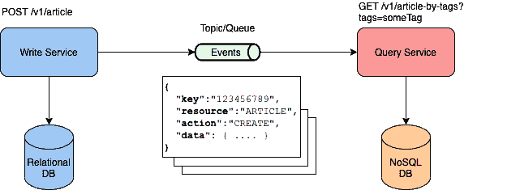

# 使用 CQRS 架构模式优化您的数据访问—第一部分

> 原文：<https://itnext.io/cqrs-architecture-pattern-c7f5c613c59c?source=collection_archive---------1----------------------->

## 理论和实践相结合的方法

您是否曾经想知道有多少次您已经开始从您的有限上下文中为某个领域对象开发一个具有简单 CRUD 架构的新服务，并且在那一刻“还可以”,而周围的生态系统随着时间的推移不断增长和扩展，直到您开始注意到其中一个(或两个):

1.  围绕对象执行查询的需求变得很复杂(对其他服务的多次 HTTP 调用、跨表的昂贵连接等)。
2.  写操作的性能下降，因为服务的读操作比写操作多。

当然，上面指出的一些问题可以用许多方法来解决。我可以想出一些数据模式，比如分片策略、数据库上的物化视图、数据报告卸载(数据仓库)、用于读取和更新的不同数据库访问技术，当然，通过使用不同的模式和方法组合也可以解决其他一些问题。

然而，我将把这篇文章的重点放在我最喜欢的 CQRS 模式上。

# 它解决了什么问题？

当使用像 CRUD 这样的传统架构时，使用相同的数据模型来更新和查询大规模解决方案的数据库，最终可能会成为一种负担。例如:

*   读取端点可以在查询端对不同的源执行多个查询，以返回具有不同形状的复杂 dto 映射。我们已经知道映射会变得非常复杂。
*   在写入方面，模型可以实现多个复杂的业务规则来验证创建和更新操作。
*   我们可能希望以其他方式查询模型，可能将多个记录合并为一个，或者将更多的信息聚合到模型中，而这些信息当前在其域中是不可用的，或者只是通过使用一些辅助字段作为键来改变查询查看记录的方式。

结果，我们的模型对象周围的 CRUD 服务开始做太多事情，当它增长时变得更糟。然后，这种模式进入我们的工具带，帮助我们解决这些可伸缩性问题。

# **花样！**

CQRS 是*命令和查询责任分离*的首字母缩略词。它的主要目的是基于将数据突变操作(命令)与读取操作(查询)分离的简单思想。为了实现这一点，它将读取和写入分离到不同的模型中，使用命令进行创建/更新，并使用查询从模型中读取数据。

CQRS 总体概念建筑

如上图所示，您会注意到，每次在写入端创建/更新我们的域的实例时，都有一个事件队列，它通过将事件推送到主题上来连接写入和读取世界。然后，查询服务将从传入的事件中读取数据，对数据进行反规范化、丰富、切片和切分，以创建查询优化模型，并存储它们供以后读取。

特别是，我将本系列文章的重点放在通过在组合中添加事件源架构来利用 CQRS 模式上。当我们希望保持这个流具有清晰的关注点分离、异步，并且还希望利用适当的数据库引擎来提高查询性能时，它非常合适(假设一个 SQL 数据库用于写操作，一个 NoSQL 用于物化视图上的查询操作，物化视图针对查询进行了优化，以避免昂贵的连接)。

除此之外，当我们使用事件源架构时，事件主题将成为我们的黄金数据源，因为它可以在任何时候用于重放整个事件集合并再现数据的当前状态。这样我们就有可能从一开始就异步读取队列，并在系统发展或读取模型必须改变时从原始数据生成一组新的物化视图。物化视图实际上是数据的持久只读缓存。

拥有独立世界的另一个好处是可以分别扩展两个世界，从而减少锁争用。此外，通过分离模型，使它们更加灵活，并简化了维护，因为大多数复杂的业务逻辑都写入了模型。读操作可以相对简单。

# 什么时候这种模式是一种方便的解决方案？

像任何模式一样，CQRS 有时很有用，但并不总是如此。我们在许多场合都认识到，没有解决所有问题的灵丹妙药。但是，在这些可能的需求下，它会很有用:

*   数据读取的性能必须与数据写入的性能分开进行微调，尤其是当读取次数远大于写入次数时。在这种情况下，您可以扩展读取模型，但是只在少数实例上运行写入模型。
*   一个开发团队可以专注于作为写模型一部分的复杂域模型，而另一个团队可以专注于读模型和用户界面。
*   系统预计会发展，可能包含模型的多个版本，或者业务规则经常变化的地方。
*   与其他系统集成，特别是与事件源相结合，其中一个子系统的暂时故障不应该影响其他子系统的可用性。
*   允许读取最终一致的数据。因为这种模式的异步特性。

# **总结**

正如我上面所说的，这不是我们所有缩放/查询问题的解决方案。使用 CQRS 模式时，我们应该非常谨慎。它有时有用，但不总是有用。许多系统确实适合 CRUD 模型，并且工作得很好，因为它们足够简单，因此如果我们希望切换到 CQRS 模式，就会浪费时间，并且将易于管理的东西放在非常复杂的架构上实现和维护。因此，除非必要，尽量保持简单。请记住，从队列中读取数据并进行所有数据转换以反规范化原始输入在时间消耗和资源使用方面可能非常昂贵。

然而，尽管很复杂，我很容易发现这种模式在面临需要多种方式查询我们的模型而不影响写性能的问题时非常有用。不仅如此，值得强调的是，我们可以重放整个队列来创建原始数据的新视图，从而使查询更简单、成本更低，因为我们可以避免表连接和数据合并。

# **接下来的步骤**

当然，这种模式的许多其他方面将在一篇更长的文章中讨论，但是我想在这里至少强调统治这种架构的核心原则。因此，让我们直接进入本系列的第二部分，通过使用 GoLang、Kafka、MongoDB 和 Cassandra 编写一些愚蠢的例子，来看看这种模式的实际例子以及移动部分的交互是如何进行的。下一场见！

[更新]第二部分为你们准备好了！

 [## 使用 CQRS 架构模式优化您的数据访问——理论和实践…

### 为什么应该避免使用 CRUD 架构，对于某些用例，使用 CQRS 模式会更好。第二部分

godoy-lucas-e.medium.com](https://godoy-lucas-e.medium.com/optimize-your-data-access-by-using-cqrs-architecture-pattern-a-theoretical-and-practical-approach-part-1-b31fe259ea04)