# 使用 Kops 在 AWS 上创建高可用性 Kubernetes 集群

> 原文：<https://itnext.io/create-a-high-availability-kubernetes-cluster-on-aws-with-kops-c12c6cd4f976?source=collection_archive---------2----------------------->

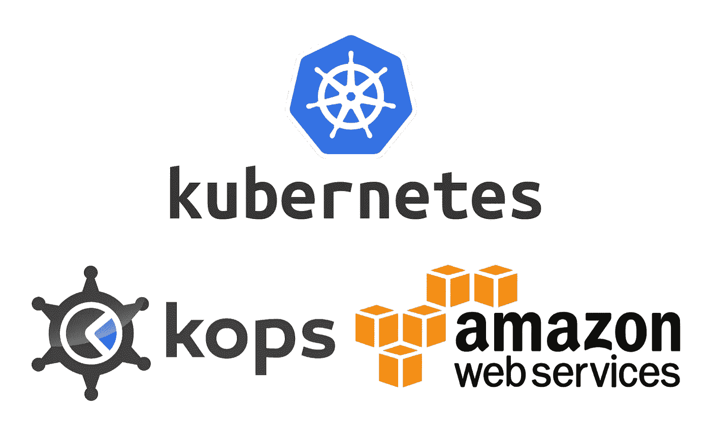

与以前的文章相比，这篇文章更有 DevOps 的味道，更侧重于灵丹妙药。在本文中，我将展示如何在 AWS 上轻松运行多区域 Kubernetes 集群，在这里我们将部署一个 Phoenix Chat 应用程序。

有很多方法可以在 AWS (Amazon Web Services)上部署 Kubernetes 集群。目前，AWS 提供 [EKS，弹性 Kubernetes 服务](https://aws.amazon.com/eks/)，帮助我们部署和管理我们的 Kubernetes 集群。它的成本是 0.20 美元/小时，也就是 144 美元/月:这实际上并不便宜，尤其是如果我们想要运行一个小型集群的话。这不仅仅是成本的问题:我发现 EKS 仍然太年轻，更喜欢 T2 的 kops。

[Kops(Kubernetes Operations)](https://github.com/kubernetes/kops)，这是一款开源的免费工具，帮助我们在不同的云提供商上轻松部署和管理 HA(高可用性)Kubernetes 集群。

这里我们将重点关注的提供商是 AWS。kops 非常支持它，让我们能够轻松地将 EC2 资源(卷、负载平衡器……)集成到我们的 Kubernetes 集群中。

一旦在 AWS 上创建了一个空的高可用性 Kubernetes 集群，我们将看到如何在开始时部署一个连接到 ELB(弹性负载平衡器)的简单 nginx 服务器，然后部署一个 [**Phoenix Chat** 示例](https://github.com/poeticoding/phoenix_chat_example) **应用程序**。我们还将了解为什么横向扩展聊天应用程序不能开箱即用。

## 高可用性集群

本文的目标是创建一个 HA Kubernetes 集群，这意味着我们希望有多个 Kubernetes 主集群和工作集群，跨多个区域运行。

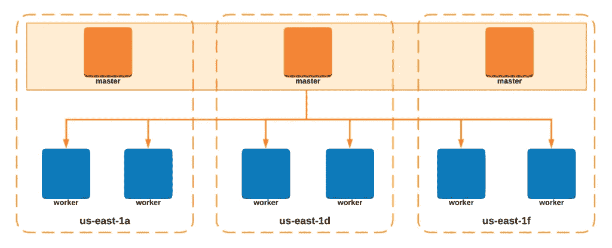

跨 3 个可用区域的 3 名主管、6 名员工

在上面的例子中，为了使我们的集群高度可用，我们将 EC2 实例分布在多个 **AZ** (可用区域): **us-east-1a** 、 **us-east-1d** 和 **us-east-1f** 。

> 每个可用性区域都运行在自己的**物理上不同的**、独立的基础设施上，并且被设计为高度可靠。**发电机和冷却设备**等常见故障点**不在可用区域**之间共享。
> 
> [彼此之间的隔离程度如何](https://aws.amazon.com/ec2/faqs/#How_isolated_are_Availability_Zones_from_one_another)

要拥有一个 HA 集群，我们至少需要三个主机(管理整个 Kubernetes 集群的服务器)和两个工作机，位于三个不同的可用性区域。这样，如果一个主设备或更糟的是一个区域出现故障，我们将有另外两个区域有两个主设备和两个工作设备。如果一个工作(或主)节点失败，kops 将产生一个新的 EC2 实例来替换该节点。

可用性区域的优势在于它们彼此靠近，并且延迟非常低。这意味着主节点之间和容器(运行在工作节点上)之间的通信非常快。目前，我在同一区域看到的 ping 实例的往返时间大约为 0.1 毫秒(us-east-1a)，在 us-east-1a 和 us-east-1d 之间，我得到的时间几乎相同。这个延迟还取决于 EC2 实例的网络类型。

考虑一下，虽然同一区域内实例之间的流量是免费的，但不同区域之间的**流量要收取 0.01 美元/GB** 。这个价格可能看起来很低，但是如果您有一个跨多个区域的复制数据库，每分钟有数千次更新，这种流量最终可能会成为集群成本的一个显著部分。

## AWS 帐户和 IAM 角色

现在让我们设置我们的 AWS 帐户，这样我们就可以通过 *kops cli* 创建我们的集群。

我们显然需要一个 AWS 账户。如果你还没有，只需点击[这里](https://aws.amazon.com/)并点击“创建一个免费账户”。
如果您不习惯 AWS 计费，请**小心**您使用的资源，并定期查看[计费页面](https://console.aws.amazon.com/billing/home)！

一旦帐户准备就绪，我们需要创建和配置 IAM 用户，创建*访问密钥*和*秘密访问密钥*。如果你不知道如何管理 IAM 用户，看看这两个页面:[添加用户](https://docs.aws.amazon.com/IAM/latest/UserGuide/id_users_create.html)和[访问键。](https://docs.aws.amazon.com/IAM/latest/UserGuide/id_credentials_access-keys.html)

一旦你创建了密钥，使用`aws-cli`在你的计算机上设置它们。如果您从未使用过 aws-cli，请看一下:[安装 AWS CLI](https://docs.aws.amazon.com/cli/latest/userguide/cli-chap-install.html) 和[配置 AWS CLI](https://docs.aws.amazon.com/cli/latest/userguide/cli-chap-configure.html) 。AWS CLI 安装也在 [kops 安装页面中进行了简要说明。](https://github.com/kubernetes/kops/blob/master/docs/install.md#installing-aws-cli-tools)
安装好 aws-cli 后，开始配置并输入您的*访问*和*秘密访问密钥*。

```
$ aws configure

AWS Access Key ID: YOUR_ACCESS_KEY
AWS Secret Access Key: YOUR_SECRET_ACCESS_KEY
Default region name [None]:
Default output format [None]:
```

**重要。**在配置 IAM 用户时，我们需要添加`AdministratorAccess`权限策略。这样，运行在本地计算机上的 kops 命令将能够创建它需要的所有资源。

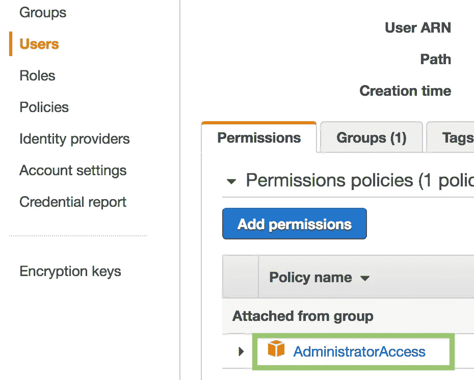

IAM 用户权限策略-管理员访问

要知道凭证在我们的系统中设置正确，我们可以使用`aws`命令列出用户。

```
$ aws iam list-users
{
    "Users": [
        {
            "Path": "/",
            "UserName": "alvise",
            "UserId": ...,
            "Arn": ...
        }
    ]
}
```

## 安装 kops 和 kubectl

`kops`是我们在 AWS 上创建 Kubernetes 集群所需的工具。`kubectl`是我们在集群启动并运行后用来管理集群的 cli。
对于 linux 和 MAC,[kops 安装页面](https://github.com/kubernetes/kops/blob/master/docs/install.md)快速展示了如何安装`kops`和`kubectl`工具。

如果你有 mac，我的建议是用自制软件安装这两个工具。它使得这些二进制文件的安装和升级变得非常容易。

对于 Windows 用户，我没有找到二进制文件，但似乎可以在 Windows 机器上编译 kops cli。老实说，我会直接在 Windows 上使用 Docker 来运行 kops 和 kubectl。dockerhub 上有 kops 和 kubectl 不同的 docker 图片: [dockerhub kops 图片](https://hub.docker.com/search?q=kops&type=image)。
要使用 Powershell 在 Windows 上原生安装`kubectl`，这似乎是一个简单的解决方案:[用 PSGallery 的 Powershell 安装](https://kubernetes.io/docs/tasks/tools/install-kubectl/#install-with-powershell-from-psgallery)。目前我还没有一个简单的方法在 Windows 上测试这些工具，所以如果你是 Windows 用户，请留下你的评论，告诉我什么最适合你！

## Route53 中的实域

Kops 需要一个真正的域和有效的区域设置到 AWS Route53 中。我知道，这可能是一个阻碍步骤，尤其是如果你只是想在 AWS 上尝试 kops。你可以暂时将一个域名移入 Route53，或者在 [Route53 域名注册页面](https://console.aws.amazon.com/route53/home?region=us-east-1#DomainRegistration:)购买一个便宜的域名。

我个人已经把我的*poeticoding.com*域名服务器换成 Route53 了。这非常简单。我只需从 GoDaddy 下载区域文件，并将其导入 Route53，告诉 GoDaddy 使用 Route53 名称服务器。

AWS 为此提供了一个方便的文档:[通过导入一个区域文件](https://docs.aws.amazon.com/Route53/latest/DeveloperGuide/resource-record-sets-creating-import.html)来创建记录。请记住，如果你对这个过程有任何问题或疑问，请在本文底部留下评论，我会尽力帮助你！

现在我们已经将我们的域正确地配置到 Route53 中(在我的例子中是*poeticoding.com*)，它应该看起来像这样

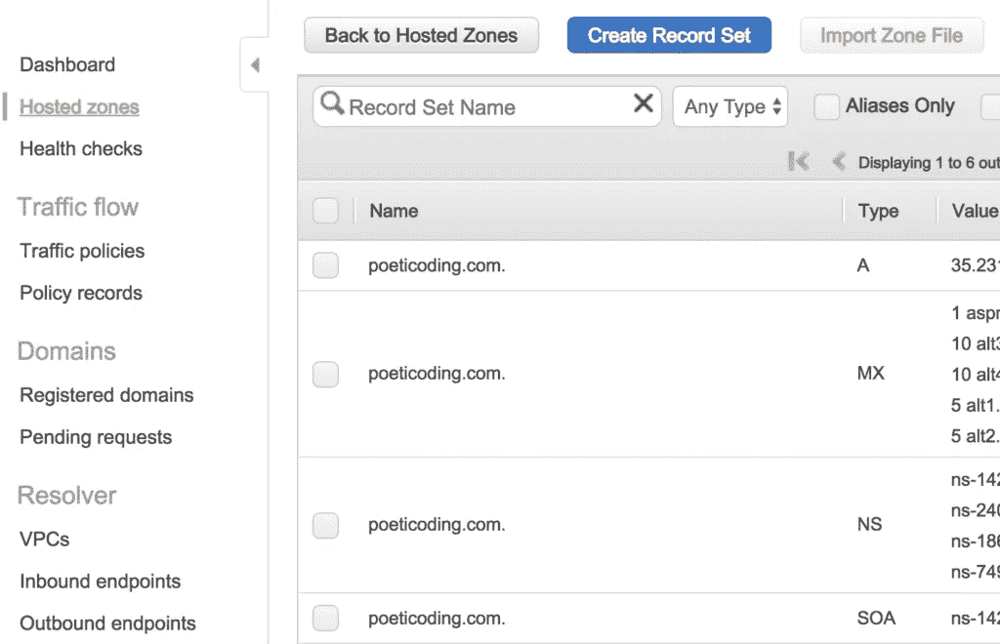

53 号公路上的 poeticoding.com 区域

## 存储集群状态的 S3 存储桶

这是真正准备好创建集群之前的最后一步！我们只需要创建一个 S3 桶，kops 将使用它来保存集群的状态文件。由于我们计划部署[凤凰聊天示例](https://github.com/poeticoding/phoenix_chat_example)，我将我的 bucket 命名为子域*state.chat.poeticoding.com*，但是您可以随意命名它，它不必是域名。

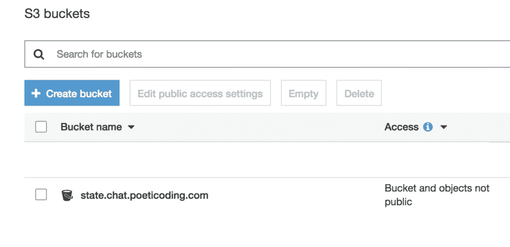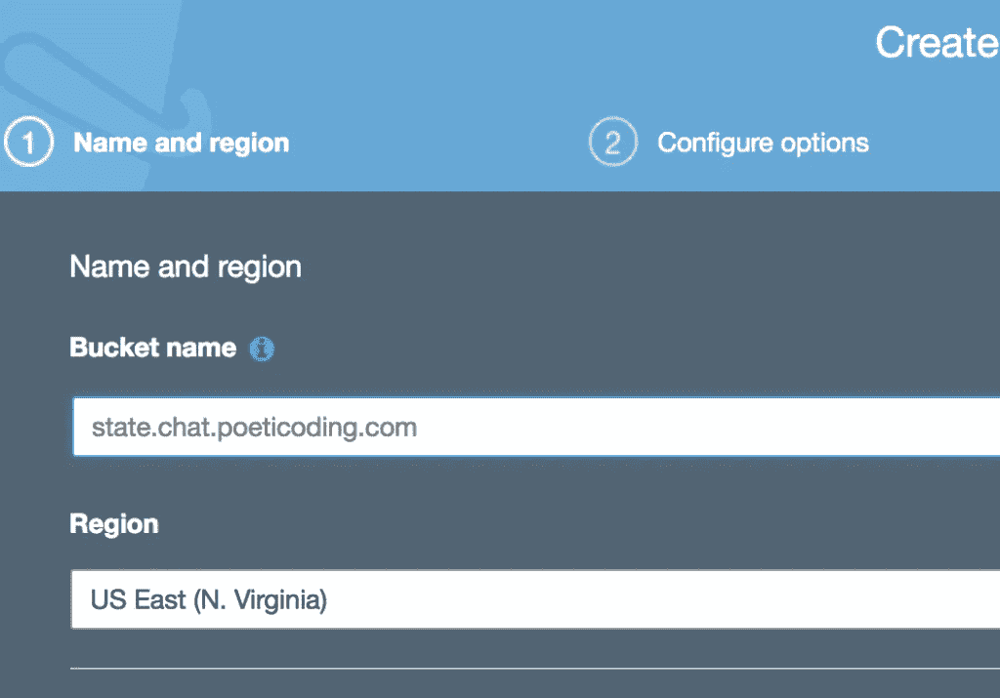

创建 S3 存储桶以保存 Kubernetes 集群状态

## 创建 Kubernetes 集群

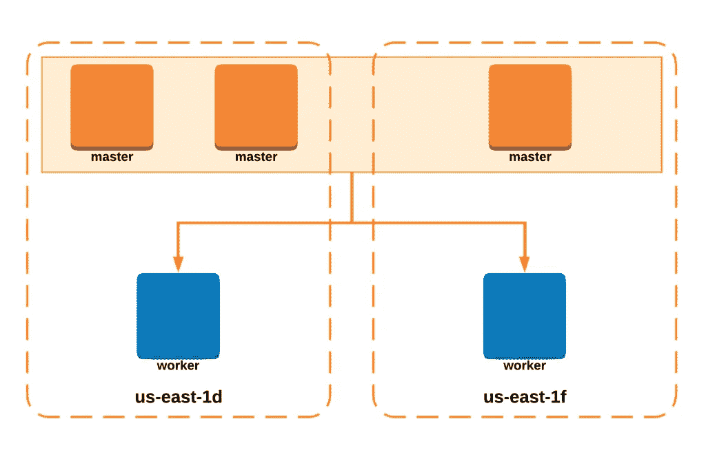

2 个可用区域— 3 个主区域— 2 个工作区域

与开始的示例不同，在开始的示例中，我们有 3 个主节点和 6 个工作节点，分布在 3 个可用性区域，为了简单起见，我们现在将创建一个小得多的集群，仅使用两个区域。这对于我们的测试来说没问题，但是在生产集群中就没那么好了，因为我们可能会遇到 consesus/quorum 的问题。为了拥有一个合适的 HA 集群，我们至少应该使用 3 个区域，每个区域中有一个主节点。

```
$ kops create cluster \
       --state "s3://state.chat.poeticoding.com" \
       --zones "us-east-1d,us-east-1f"  \
       --master-count 3 \
       --master-size=t2.micro \
       --node-count 2 \
       --node-size=t2.micro \
       --name chat.poeticoding.com \
       --yes
```

通过这个简单的命令，kops 了解了我们想要构建的集群的所有信息。

*   是 S3 桶，kops 在那里存储状态文件
*   `--zones`我们在同一地区指定了两个可用性区域，美国东部-1d 和美国东部-1f
*   `--master-count`主人的数量必须是奇数(1，3，5...)，所以如果我们想要一个高可用性集群，我们至少需要 3 个主机。因为为了简单起见，我们选择只使用两个 AZ，所以两个区域中的一个将有两个 masters。
*   `--master-size`这是主服务器的 EC2 实例类型。对于中等规模的集群，我通常使用 C4/C5.large masters，但是对于这个例子来说 *t2.micro* 工作得很好。你在这里找到 t2 实例定价。
*   `--node-count`和`--node-size`在这个例子中，我们只需要两个节点，在这个例子中是两个 t2.micro 实例。
*   我们集群的名称，这也是一个将在 route53 上创建的真实子域。

这些节点是 kubernetes 的工作器，是我们运行容器的服务器。通常这些服务器比主服务器大得多，因为大部分负载都在那里。

如果你在没有`--yes`的情况下运行这个命令，kops 会在你的 AWS 账户上打印出所有操作的列表。创建 IAM 角色、安全组、卷、EC2 实例等。
在运行带有`--yes`选项的命令之前，看看 kops 要做什么通常是个好习惯。

```
$ kops create cluster ... --yes

Inferred --cloud=aws from zone "us-east-1d"
Running with masters in the same AZs; redundancy will be reduced
Assigned CIDR 172.20.32.0/19 to subnet us-east-1d
Assigned CIDR 172.20.64.0/19 to subnet us-east-1f
Using SSH public key: /Users/alvise/.ssh/id_rsa.pub
...
Tasks: 83 done / 83 total; 0 can run
Pre-creating DNS records
Exporting kubecfg for cluster
kops has set your kubectl context to chat.poeticoding.com

Cluster is starting.  It should be ready in a few minutes.
```

只需等待几分钟，集群就应该启动并运行了。我们可以使用`validate`命令来检查集群创建的状态。

```
$ kops validate cluster \
       --state "s3://state.chat.poeticoding.com" \
       --name chat.poeticoding.com
```

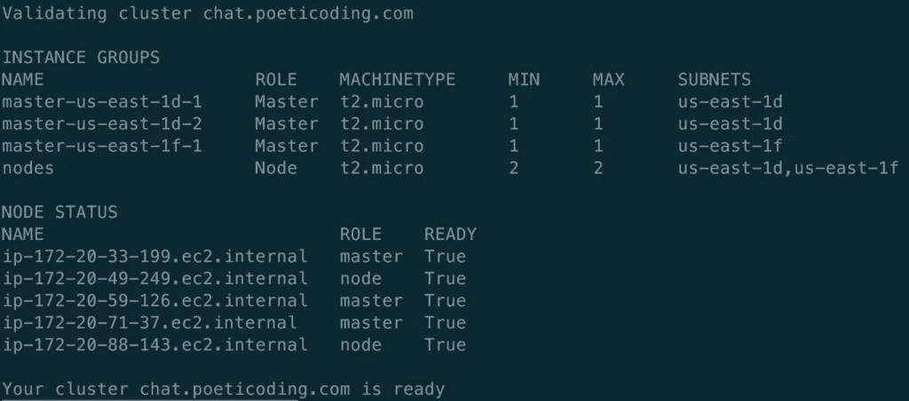

kops 验证集群—集群就绪


AWS 控制台— EC2 实例

Kops 为我们导出了 Kubernetes 配置，所以集群应该可以用`kubectl`立即访问。

```
$ kubectl get nodes
NAME                            STATUS    ROLES     AGE       VERSION
ip-172-20-33-199.ec2.internal   Ready     master    11m       v1.11.6
ip-172-20-49-249.ec2.internal   Ready     node      10m       v1.11.6
ip-172-20-59-126.ec2.internal   Ready     master    11m       v1.11.6
ip-172-20-71-37.ec2.internal    Ready     master    11m       v1.11.6
ip-172-20-88-143.ec2.internal   Ready     node      10m       v1.11.6
```

我们还可以看到 kops 如何为我们的集群创建 VPC(虚拟私有云),并在我们的 Route53 区域中添加新的 DNS 记录。


AWS 虚拟私有云

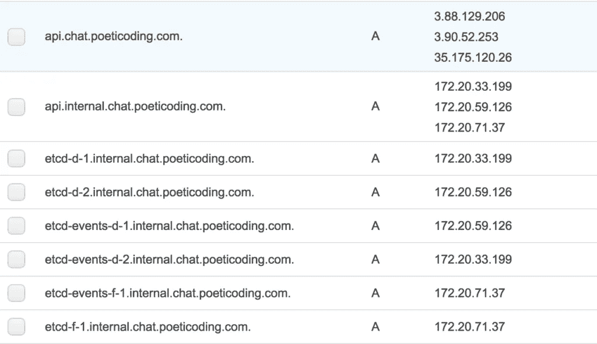

新 DNS 记录

## Kubernetes API 和安全组

默认情况下，Kubernetes API 在互联网上公开。最后，这是我们可以轻松连接到我们的集群的唯一方法(不使用 VPN 连接到我们的 VPC)。老实说，我不喜欢将 API 公开的想法，尤其是在去年 12 月的 bug 之后[。如果我们在办公室或家里有一个静态 ip，我们可以设置一个防火墙规则，只允许我们的 IP。当我们拥有动态 IP 时，我们可以仅在需要时打开外部访问。这可能有点乏味，因为每次我们想要访问我们的集群时，我们都需要进入 AWS 控制台并临时更改防火墙规则。我们可以使用`aws-cli`创建一个脚本来改变防火墙。
这些防火墙规则由主实例安全组处理。](https://www.youtube.com/watch?v=eBJs4mJjEDA&feature=youtu.be)

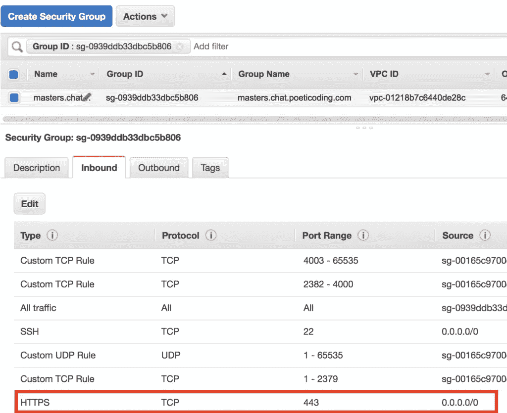

默认情况下，Kubernetes API HTTP 端口是打开的


限制 API 访问

## 部署 Nginx 服务器

现在是时候使用`kubectl`命令并部署一个简单的 Nginx 服务器了。首先，让我们检查命令是否有效，集群配置是否正确导入。我们可以用`kubectl get nodes`命令列出我们的节点

```
$ kubectl get nodes
NAME                            STATUS    ROLES     AGE       VERSION
ip-172-20-33-199.ec2.internal   Ready     master    11m       v1.11.6
ip-172-20-49-249.ec2.internal   Ready     node      10m       v1.11.6
ip-172-20-59-126.ec2.internal   Ready     master    11m       v1.11.6
ip-172-20-71-37.ec2.internal    Ready     master    11m       v1.11.6
ip-172-20-88-143.ec2.internal   Ready     node      10m       v1.11.6
```

要部署 Nginx 服务器，我们需要创建一个 [kubernetes 部署](https://kubernetes.io/docs/concepts/workloads/controllers/deployment/)。添加多个 pod 副本，它们将在不同的节点上运行，将负载分散到不同的工作人员。

```
# nginx_deploy.yaml
kind: Deployment
apiVersion: apps/v1
metadata:
  name: nginx
  namespace: default
spec:
  replicas: 1
  selector:
    matchLabels:
      app: nginx

  template:
    metadata:
      labels:
        app: nginx
    spec:
      containers:
      - name: nginx
        image: nginx:1.15
        ports:
        - containerPort: 80
```

这是一个非常简单的部署。我们要求 kubernetes 用一个`nginx`容器运行一个单独的 pod，并暴露容器端口 80。

```
$ kubectl create -f nginx_deploy.yaml
deployment.apps "nginx" created

$ kubectl get pod
NAME                   READY     STATUS    RESTARTS   AGE
nginx-c9bd9bc4-jqvb5   1/1       Running   0          1m
```

太好了，我们的吊舱正在运行。我们现在需要一个接近它的方法。我们可以使用负载平衡器。

```
# nginx_svc.yaml
kind: Service
apiVersion: v1

metadata:
  name: nginx-elb
  namespace: default
  annotations:
    service.beta.kubernetes.io/aws-load-balancer-type: "nlb"

spec:
  type: LoadBalancer
  selector:
    app: nginx
  ports:
    - name: http
      port: 80
      targetPort: 80
```

Kubernetes 与 AWS 集成的一个优点是，我们可以直接从 Kubernetes 配置文件中管理云资源。在`nginx_svc.yaml`中，我们定义了一个`LoadBalancer`服务，它将其端口 80 的流量重定向到 Nginx 的 pod 的端口 80。
我们可以使用`annotations`来设置我们想要的负载平衡器类型(在本例中是网络负载平衡器)、SSL 证书等。您可以在这里找到服务注释[的完整列表。](https://gist.github.com/mgoodness/1a2926f3b02d8e8149c224d25cc57dc1)

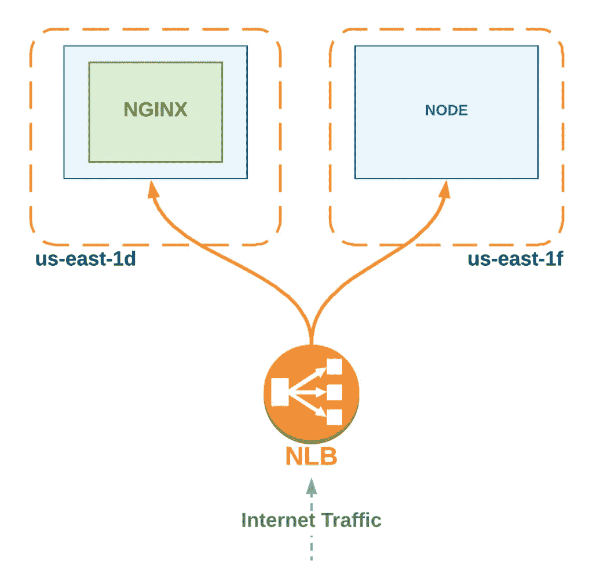

网络负载平衡器

```
$ kubectl create -f nginx_svc.yaml
service "nginx-elb" created

$ kubectl describe svc nginx-elb
Name:                     nginx-elb
...
LoadBalancer Ingress:     a41626d3d169811e995970e07eeed2b2-243343502.us-east-1.elb.amazonaws.com
Port:                     http  80/TCP
TargetPort:               80/TCP
NodePort:                 http  31225/TCP
...
```

一旦创建了负载平衡器，我们可以使用`describe`命令查看它的详细信息。所有资源在 AWS 控制台上都是可见的。

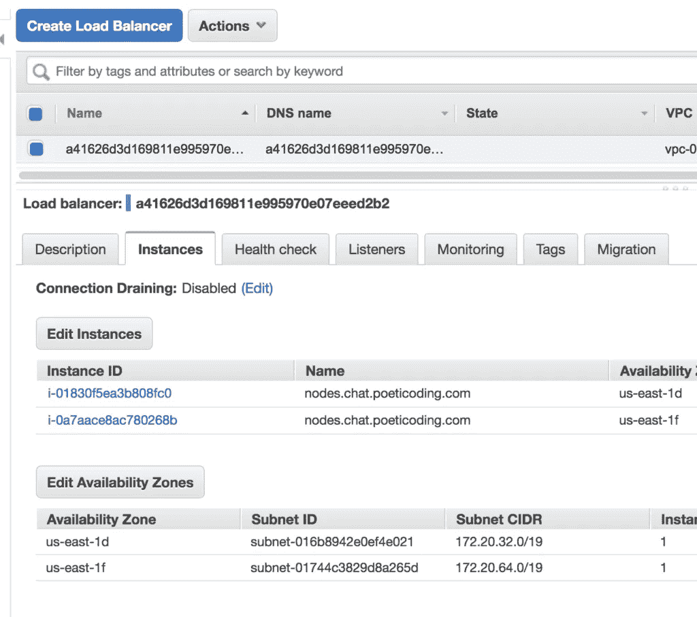

AWS 控制台—负载平衡器

在负载平衡器服务的描述中，我们看到了`LoadBalancer Ingress`属性，这是我们将用来连接到 web 服务的 DNS 名称。通常我们不直接使用它，而是创建一个具有可读域(如 chat.poeticoding.com)的 CNAME 记录，它指向负载平衡器的 dns 名称。
负载平衡器暴露端口 80，并将该流量重定向到 kubernetes 节点端口 31225。然后，该节点会将流量重定向到 nginx 容器。为了测试它是否工作，我们只需要使用负载平衡器入口地址。

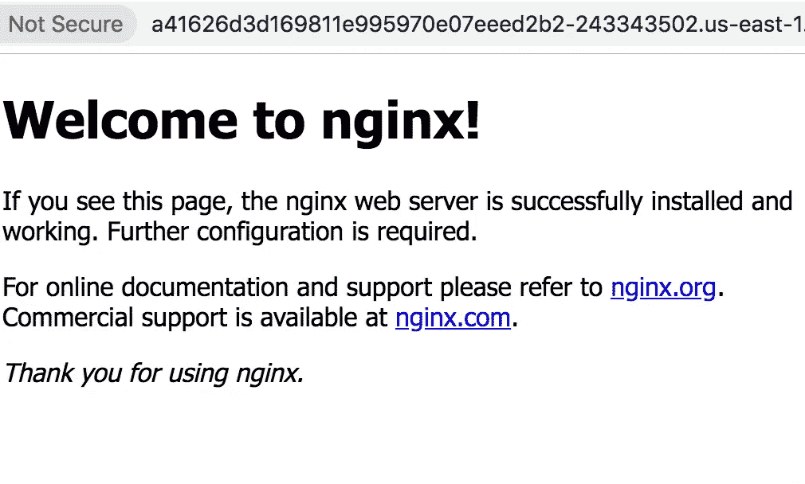

Nginx 索引页面

太好了，成功了！
如果不起作用，请尝试等待几分钟，让负载平衡器 DNS 进行传播。

在进入下一步之前，让我们删除 nginx pod 和负载平衡器。

```
$ kubectl delete svc nginx-elb
service "nginx-elb" deleted
$ kubectl delete deploy nginx
```

## 部署 Phoenix 聊天

由于我们将使用一个现成的图像，我们的 Phoenix chat 的部署将与我们用 Nginx 所做的非常相似。
我准备了一张图片，你可以在 DockerHub、[alvises/phoenix-chat-example](https://cloud.docker.com/repository/docker/alvises/phoenix-chat-example)上找到。你也可以在 GitHub 上找到完整的代码:[poeticoding/phoenix _ chat _ example](https://github.com/poeticoding/phoenix_chat_example)

```
kind: Deployment
apiVersion: apps/v1
metadata:
  name: chat
  namespace: default
spec:
  replicas: 1
  selector:
    matchLabels:
      app: chat

  template:
    metadata:
      labels:
        app: chat
    spec:
      containers:
      - name: phoenix-chat
        image: alvises/phoenix-chat-example:1_kops_chat
        ports:
        - containerPort: 4000
        env:
        - name: PORT
          value: "4000"
        - name: PHOENIX_CHAT_HOST
          value: "chat.poeticoding.com"
```

这个部署的配置与上一个非常相似。我们添加了两个环境变量来配置应用程序

*   `PORT`将凤凰 app 端口设置为`4000`
*   `PHOENIX_CHAT_HOST`让 Phoenix 知道聊天是在哪个域中进行的，在这里是`"chat.poeticoding.com"`

负载平衡器的配置也非常相似。在这种情况下，我们使用 4000 目标端口。

```
kind: Service
apiVersion: v1

metadata:
  name: chat-elb
  namespace: default
  annotations:
    service.beta.kubernetes.io/aws-load-balancer-type: "nlb"

spec:
  type: LoadBalancer
  selector:
    app: chat
  ports:
    - name: http
      port: 80
      targetPort: 4000
```

几分钟后，您将看到 pod 正在运行，负载平衡器和它的 DNS 已经启动。

```
$ kubectl get pod
NAME                   READY     STATUS    RESTARTS   AGE
chat-b4d7d4b98-vxckn   1/1       Running   0          3m

$ kubectl get svc
NAME         TYPE           CLUSTER-IP      EXTERNAL-IP        PORT(S)        AGE
chat-elb     LoadBalancer   100.66.10.231   a28419b91169b...   80:31181/TCP   3m
```

我们不像以前那样直接使用负载平衡器的 dns，而是在我们的区域中手动添加一条可读的记录。

这个步骤也可以使用[外部 dns](https://github.com/kubernetes-incubator/external-dns) 自动完成，这是一个根据服务注释更新 Route53 记录的工具。

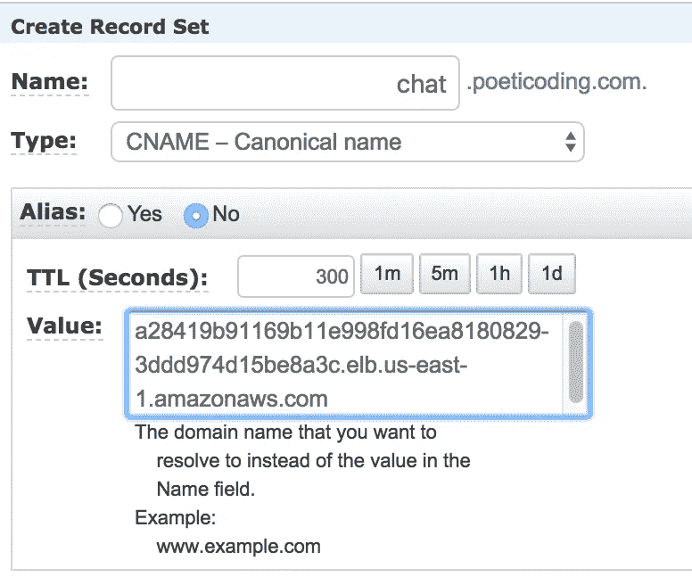

CNAME 53 号公路

现在是聊天的时候了！我们打开两个浏览器，连接凤凰聊。

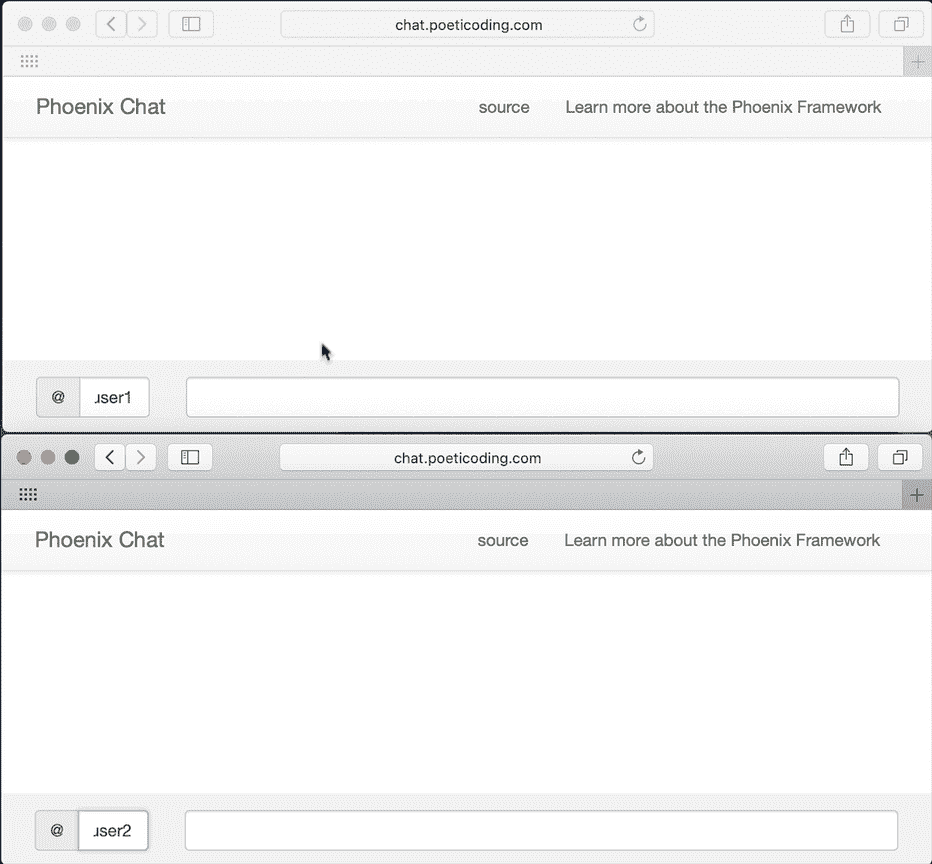

工作凤凰聊天

每个浏览器打开一个 WebSocket 连接来发送和接收消息。用一个容器就可以很好地工作。所有的流量都被重定向到一个 Phoenix 聊天服务器。

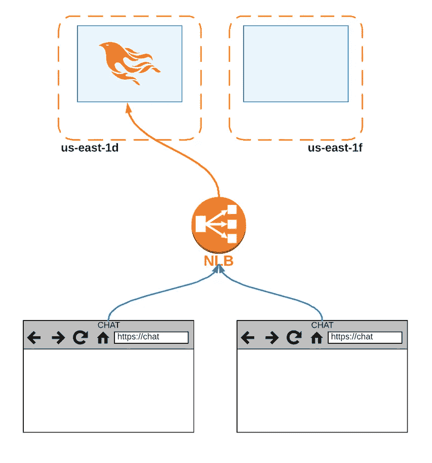

两个浏览器—一个容器

## 多个聊天副本

集群没有得到充分利用，我们只有一个聊天窗格/容器在一个节点上运行。如果我们尝试横向扩展，添加另一个副本，会发生什么情况？

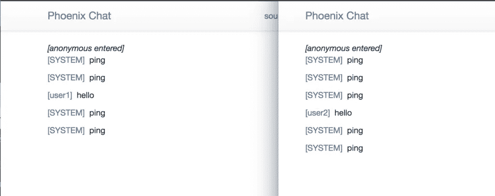

两个副本—不同步

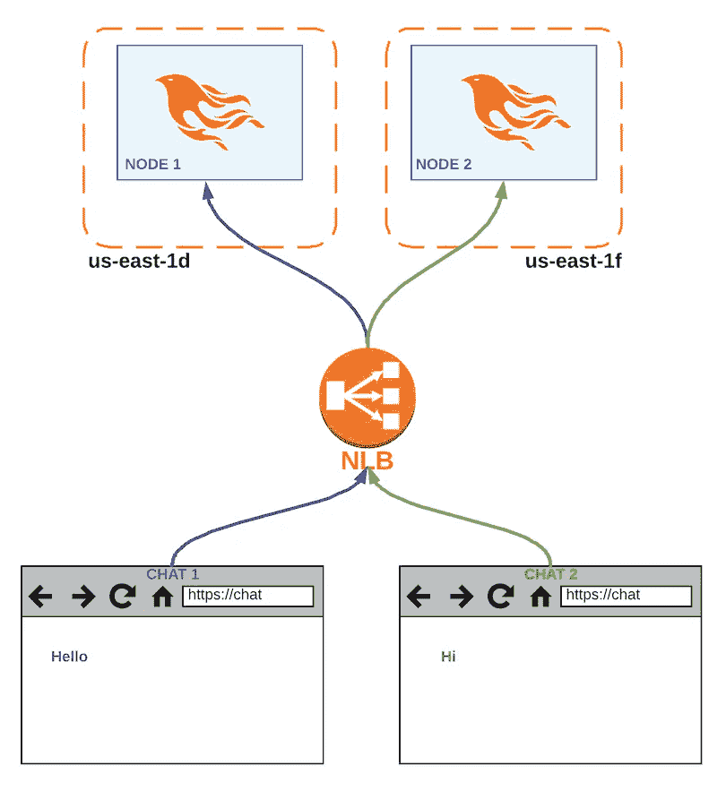

两个 Phoenix 聊天容器

由于负载平衡器使用循环法在不同容器之间分配连接，我们看到 chat-1 连接到 node-1 中的 chat，chat-2 连接到 node-2 中的 chat。

有了这个简单的配置，两个 phoenix 服务器彼此不对话，所以它们就像两个独立的服务器运行不同的聊天室。我们将在以后的文章中看到如何处理这些情况，尤其是在 Kubernetes 集群上。

在使用 Redis PubSub 的[分布式凤凰聊天中，我们看到了解决这个问题的方法。](https://www.poeticoding.com/distributed-phoenix-chat-using-redis-pubsub/)

## 摧毁集群

现在是时候摧毁我们的集群并释放 AWS 资源了。我们使用带有`delete cluster`子命令的`kops` cli 来完成。

```
$ kops delete cluster \
       --state "s3://state.chat.poeticoding.com" \
       --name chat.poeticoding.com \
       --yes
...
Deleted kubectl config for chat.poeticoding.com
Deleted cluster: "chat.poeticoding.com"
```


kops 删除集群 EC2 终止的实例

正如我们之前所做的，我们需要用`--yes`选项来确认动作。
删除过程可能需要几分钟时间。删除集群时，我们看到 EC2 实例被终止，卷、负载平衡器和 VPC 也被删除。

*原载于* [*诗歌集*](https://www.poeticoding.com/create-a-high-availability-kubernetes-cluster-on-aws-with-kops/) *。*