# 10 分钟内在 AWS Lambda 和 API Gateway 上创建高度可扩展的图像处理服务

> 原文：<https://itnext.io/create-a-highly-scalable-image-processing-service-on-aws-lambda-and-api-gateway-in-10-minutes-7cbb2893a479?source=collection_archive---------0----------------------->


由[阿里安·达尔维什](https://unsplash.com/photos/wh-RPfR_3_M?utm_source=unsplash&utm_medium=referral&utm_content=creditCopyText)在 [Unsplash](https://unsplash.com/?utm_source=unsplash&utm_medium=referral&utm_content=creditCopyText) 上拍摄的照片

*如今，我正在写* [*子栈*](https://themirrorworld.substack.com) *。*

像所有的无服务器文章一样，我需要从解释什么是无服务器开始这篇文章。

> 无服务器不是无服务器，只是在想服务器，少一些。

现在，让我们来看看如何让一个简单的 Python 3.6 应用程序运行它

*   将输入照片转换为黑白照片
*   具有 OpenCV Python 依赖性

*可通过 API 访问，该 API*

*   接受二进制数据负载(jpeg)
*   返回二进制数据负载(jpeg)

*全无*

*   设置服务器
*   支付费用*

**除非你的流量超过* [*慷慨λ免费定价 tier*](https://aws.amazon.com/lambda/pricing/) *。*

首先确保你已经安装了 [Docker](https://www.docker.com/) 。

对于这个例子，我们将使用 AWS 的一个名为 [Lambda](https://aws.amazon.com/lambda/) 的服务，它允许我们部署我们的功能及其依赖项，并轻松地将其连接到 API。为了创建 API，我们将使用 [API 网关](https://aws.amazon.com/api-gateway/)——也是由 AWS 提供的服务。

为了简化本教程，我们将通过 AWS Web 控制台将代码上传到 Lambda 来部署代码。为了简单起见，我们还将在 AWS 控制台中编写函数代码。在任何严重的情况下，您都可以通过 [AWS CLI](https://aws.amazon.com/cli/) 进行部署。

1.  首先登录 AWS 控制台，搜索 **Lambda。**

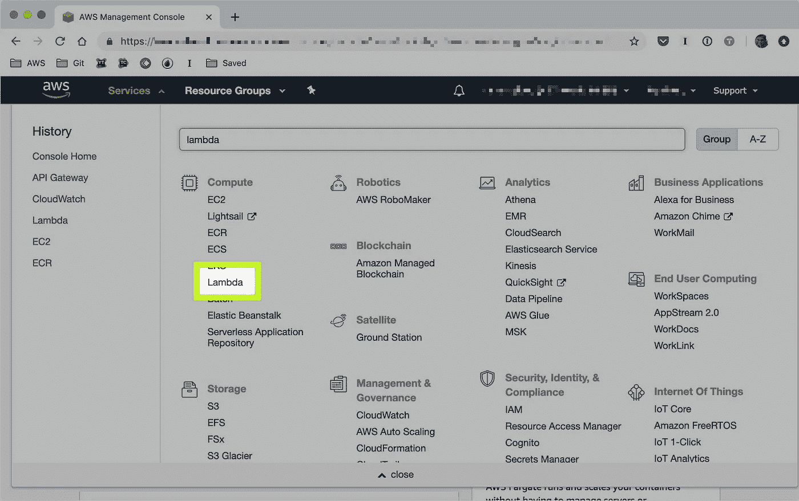

2.点击**创建功能**。

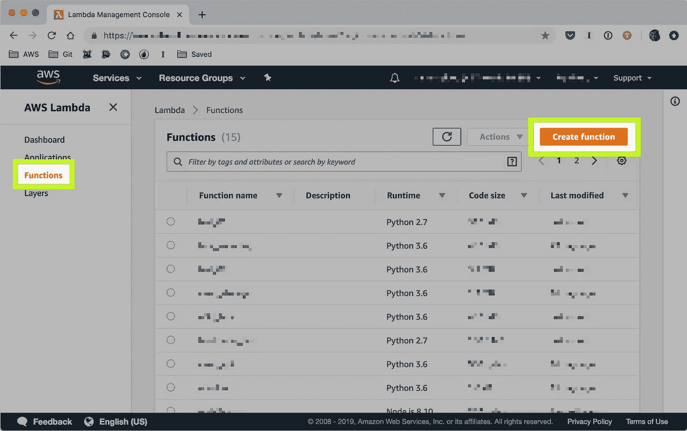

3.设置功能参数。我们将我们的函数命名为`lambda-demo`。确保选择`Python 3.6`作为运行时，并从 AWS 策略模板创建一个新角色。

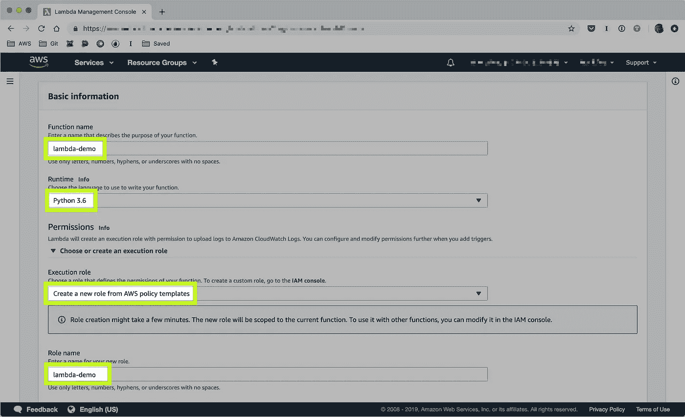

4.创建函数后，Lambda 控制台会给你一些模板代码。

```
import jsondef lambda_handler(event, context):
    # TODO implement
    return {
        'statusCode': 200,
        'body': json.dumps('Hello from Lambda!')
    }
```

您可以通过配置一个测试事件来立即调用这个函数。点击**测试**并配置第一个测试事件。出于本文的目的，默认模板工作良好。

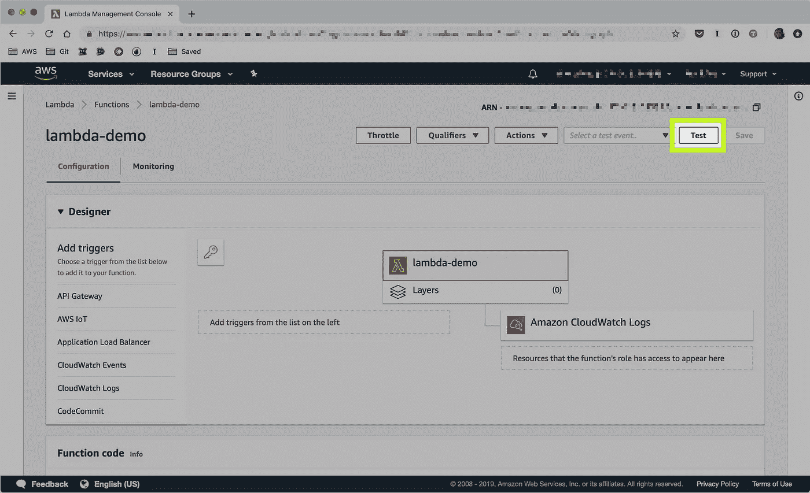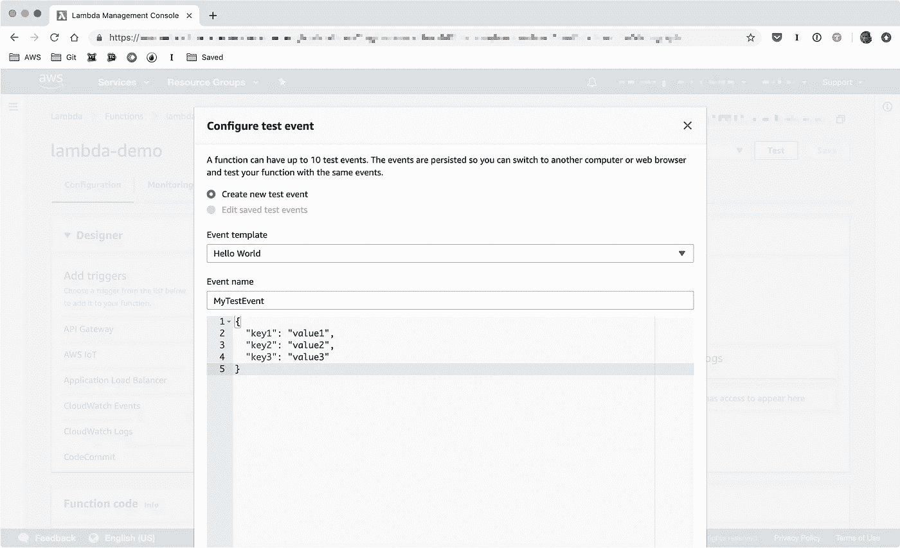

创建测试事件后，点击**测试**。您应该会在函数日志中收到以下内容:

```
{
  "statusCode": 200,
  "body": "\"Hello from Lambda!\""
}
```

太棒了。

现在让我们创建一些比这更有用的东西。

让我们构建一个将图像作为输入并将其转换为灰度的函数。为此，我们将使用 [OpenCV](https://opencv.org/) ，特别是它的 Python 绑定。虽然使用 OpenCV 对于这样一个任务来说可能有些过头了，但是它演示了如何相对容易地将这样一个有用的库包含到您的 Lambda 环境中。

我们现在会的

1.  为 OpenCV 生成一个 Lambda 就绪的 Python 包。
2.  将这个包上传到 Lambda 层，这样它就可以用在你构建的任何函数中。
3.  将 OpenCV 导入我们的 Lambda 函数。

## 1.为 OpenCV 生成 Lambda 就绪的 Python 包

我组装了一个非常简单的工具——一个 Docker 镜像，它可以收集任何`pip`包并生成一个. ZIP 文件，我们可以上传到 Lambda 层。如果你想探索这个工具，你可以从 [LambdaZipper](https://github.com/tiivik/LambdaZipper) 中找到它。

如果你安装了 Docker，你可以打开你的终端并运行

```
docker run --rm -v $(pwd):/package tiivik/lambdazipper opencv-python
```

就是这样！在您当前的工作目录中，您会找到`opencv-python.zip`

*最有用的无服务器工具包之一是* [*无服务器*](http://serverless.com) *。然而，我们不打算在这个例子中使用它。重新发明轮子很少是一个好主意，除非你想知道引擎盖下的东西是如何工作的。虽然成熟的框架如* [*无服务器*](http://serverless.com) *已经存在，但是深入研究这些框架抽象的一些核心功能是一个好主意。*

让我们探索一下这个工具从我们身上抽象出了什么。

如果你看一下 [package.sh](https://github.com/tiivik/LambdaZipper/blob/master/package.sh) ，那么你可以看到它执行了一个带有`opencv-python`参数的`pip install`命令。所有这些都是在`amazonlinux:2017.03`环境中执行的，这在某种程度上模仿了 AWS Lambda 环境。您可以在[docker 文件](https://github.com/tiivik/LambdaZipper/blob/master/Dockerfile)中探索执行环境。

## 2.将包上传到 Lambda 层，这样它就可以用在你构建的任何函数中

让我们把`opencv-python.zip`上传到 Lambda 层，这样我们就可以从现在开始在我们所有的函数中使用这个包了。将层视为可以在您编写的任何函数中使用的数据。这可以是 Python 模块、代码片段、二进制文件或任何东西。

导航到 AWS Lambda 中的**层**面板，并按**创建层**。

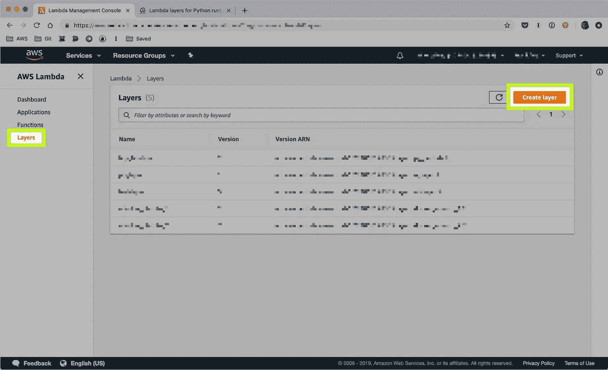

设置图层名称、描述并上传 zip 文件。确保选择正确的运行时，在我们的例子中是 Python 3.6。按下**创建图层**。

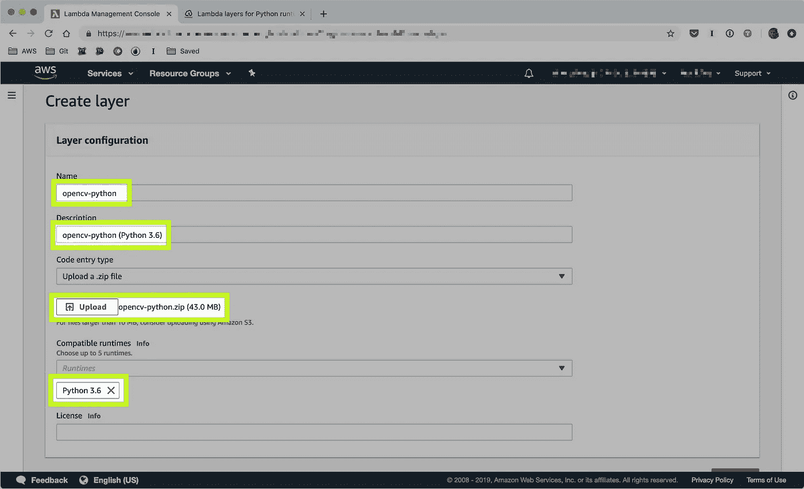

在撰写本文时，从 web 界面上传 ZIP 文件被限制在 50MB 以内。幸运的是我们的`opencv-python`套餐比那个少。如果你的包超过了，你可以提供一个 S3 桶的链接包。请记住，Lambda 将部署包限制设置为 250MB。

创建函数后，您应该会看到一条消息

`Successfully created layer opencv-python version 1.`

耶！

让我们回到我们的`lambda-demo`函数，并将`opencv-python`层添加到我们的函数执行环境中。点击**图层** > **添加一个图层**并选择你的`opencv-python`图层。

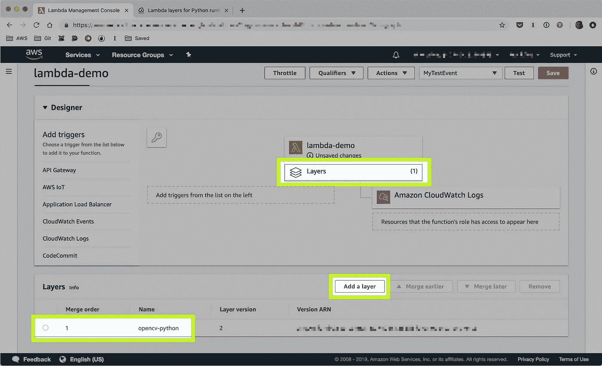

## 3.导入 OpenCV

让我们像往常一样尝试导入库:

```
import json
**import cv2**def lambda_handler(event, context):
    # TODO implement
    return {
        'statusCode': 200,
        'body': json.dumps('Hello from Lambda!')
    }
```

现在让我们点击**测试**。我们得到的回应是:

```
Response:
{
  "errorMessage": "Unable to import module 'lambda_function'"
}
```

出于某种原因，Lambda 无法找到我们的 Python 包。我们来探索一下。

默认情况下，所有 Lambda 层都安装在`/opt`上。让我们注释掉我们的`cv2`导入，看看`/opt`里面有什么。

```
import json
**#import cv2**
**from os import listdir**def lambda_handler(event, context):
    # TODO implement
    **print(listdir("/opt"))**
    return {
        'statusCode': 200,
        'body': json.dumps('Hello from Lambda!')
    }
```

在功能日志中，我们可以看到`/opt`中的`cv2`模块。

```
[‘bin’, ‘cv2’, ‘numpy’, ‘numpy-1.16.2.dist-info’, ‘opencv_python-4.0.0.21.dist-info’]
```

默认情况下`/opt/bin` 被添加到`$PATH` 环境变量中。你可以参考 [AWS 文档](https://docs.aws.amazon.com/lambda/latest/dg/current-supported-versions.html)。然而我们的层模块存在于`/opt/` 而不存在于`/opt/bin`。因此，让我们将`/opt`也包含到`$PATH`中，这样 Lambda 就可以看到我们的包。

在环境变量部分，添加以下环境变量。键:`PYTHONPATH`值:`/opt/`


通常你可以直接导入包而不改变路径，但是在这种情况下，Lambda 环境需要检测我们的包。

让我们修改我们的代码:

```
import json
**import cv2**def lambda_handler(event, context):
    # TODO implement
    **print(cv2.__version__)**
    return {
        'statusCode': 200,
        'body': json.dumps('Hello from Lambda!')
    }
```

保存您的更改并点击**测试**。控制台中出现了`4.0.0`，通知我们使用的 OpenCV 版本。

太棒了，Python OpenCV 在 Lambda 中运行！

让我们继续实现核心应用程序逻辑——将图像转换成灰度。让我们修改我们的 Lambda 函数代码:

```
import json
import cv2
import base64def write_to_file(save_path, data):
  with open(save_path, "wb") as f:
    f.write(base64.b64decode(data))def lambda_handler(event, context):
    # Write request body data into file
    write_to_file("/tmp/photo.jpg", event["body"])

    # Read the image
    image = cv2.imread("/tmp/photo.jpg")

    # Convert to grayscale
    gray = cv2.cvtColor(image, cv2.COLOR_BGR2GRAY)

    # Write grayscale image to /tmp
    cv2.imwrite("/tmp/gray.jpg", gray)

    # Convert grayscale image into utf-8 encoded base64
    with open("/tmp/gray.jpg", "rb") as imageFile:
      str = base64.b64encode(imageFile.read())
      encoded_img = str.decode("utf-8")

    # Return the data to API Gateway in base64.
    # API Gateway will handle the conversion back to binary.
    # Set content-type header as image/jpeg.

    return {
      "isBase64Encoded": True,
      "statusCode": 200,
      "headers": { "content-type": "image/jpeg"},
      "body":  encoded_img
    }
```

我们马上要设置的 API 将接受来自客户端的二进制图像。然后，AWS API Gateway 将二进制图像转换为 base64 格式，并传递给 Lambda。

当然，API 网关还没有设置，所以用我们当前的测试来测试这段代码将会失败。然而，在我们开始设置调用这个 Lambda 的 API 之前，我们可以在 Lambda 控制台中测试它，方法是在事件体中提供一个 base64 编码的图像。

用该机体重新配置**测试**。如果你想知道，这是一张 base64 编码的猫照片😺[https://imgur.com/a/0NpkzzL](https://imgur.com/a/0NpkzzL)

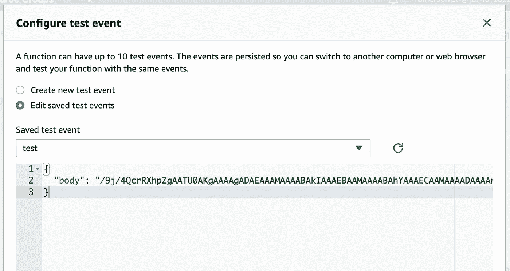

调用这个测试现在应该成功了:

```
Response:
{
  "isBase64Encoded": true,
  "statusCode": 200,
  "headers": {
    "content-type": "image/jpeg"
  },
  "body": "/9j/4AJRgAB.....P+WqHNf//Z" **<- long base64 string of black and white image here**
}
```

我们现在准备设置一个调用这个 Lambda 函数的 API。

## 设置 API

打开 AWS API 网关控制台。按下**创建 API** 。

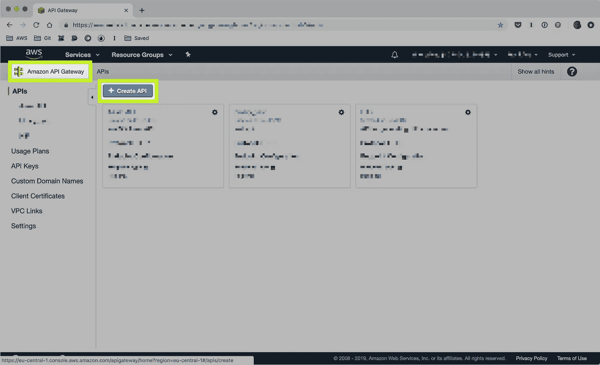

创建一个新的 **REST** API，提供 API 名称和描述。在本例中，我们调用我们的 API `lambda-demo`。

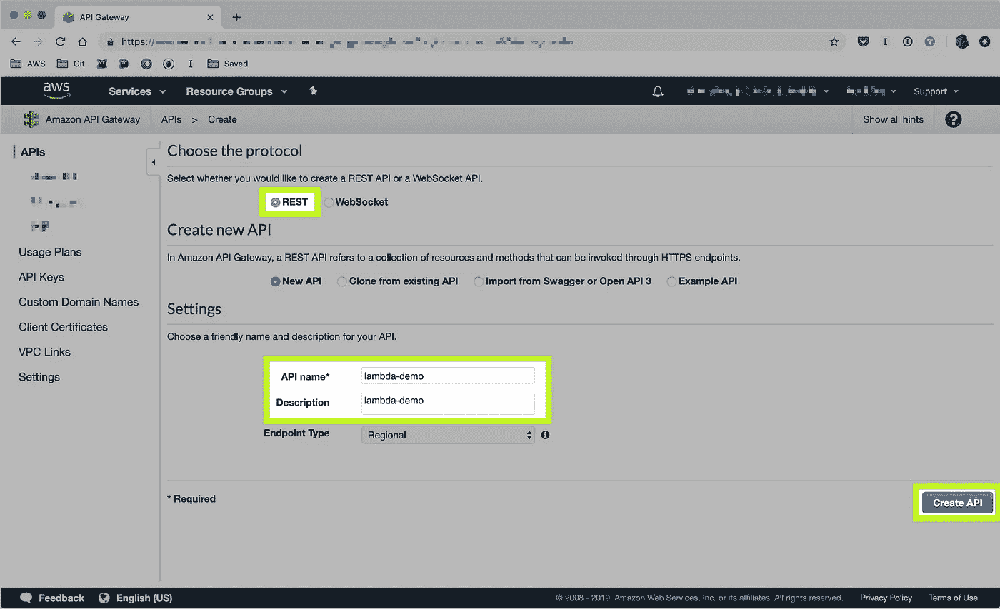

从**资源** > **动作**中选择**创建方法**并定义一个**发布**方法。

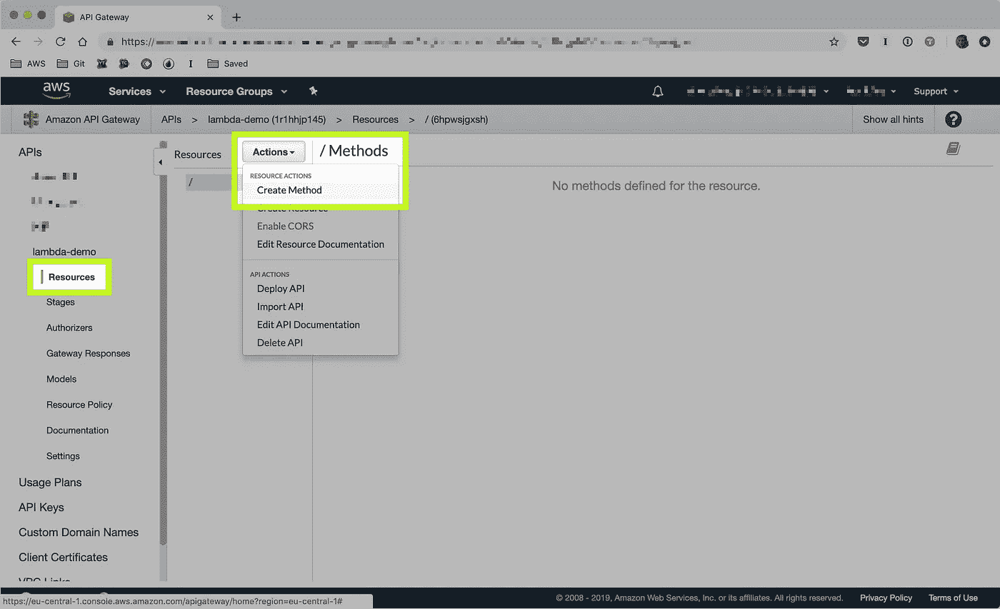

对于**集成类型**，选择 **Lambda 函数**并从下拉菜单中选择您的 Lambda 函数。启用**使用 Lambda 代理集成**并点击**保存**。

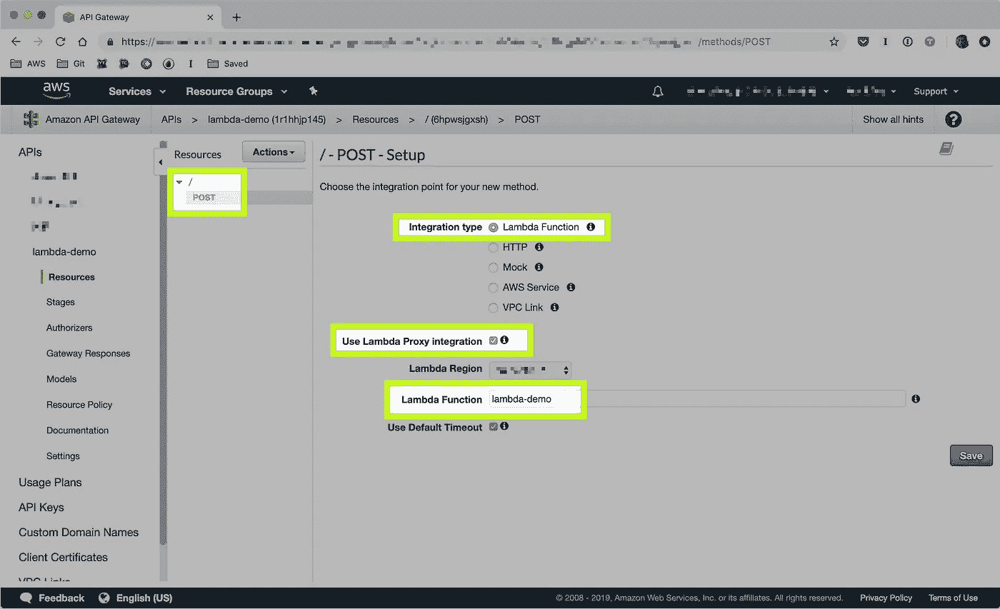

我们希望我们的 API 能够处理二进制数据。

从**设置** > **二进制媒体类型**点击**添加二进制媒体类型**并将二进制媒体类型定义为:

```
image/jpeg
image/png
*/*
```

按下**保存更改**。

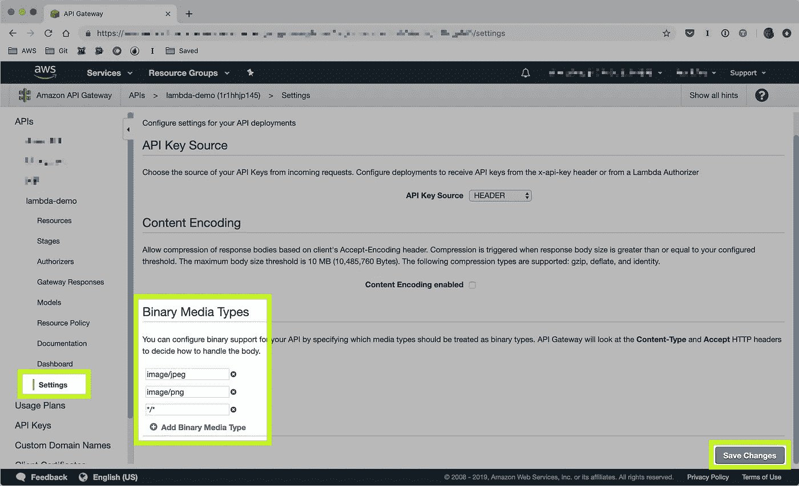

导航回我们的 POST 方法。

在方法响应下添加一个`Content-Type`响应头，并将类型设置为`image/jpeg`:

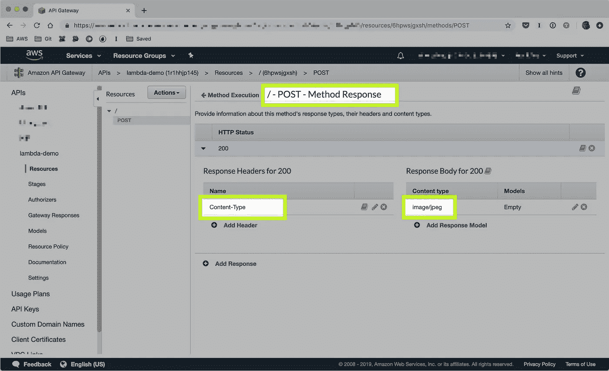

在发布 API 之前，您可以点击**客户端**T42【测试】按钮进行测试:

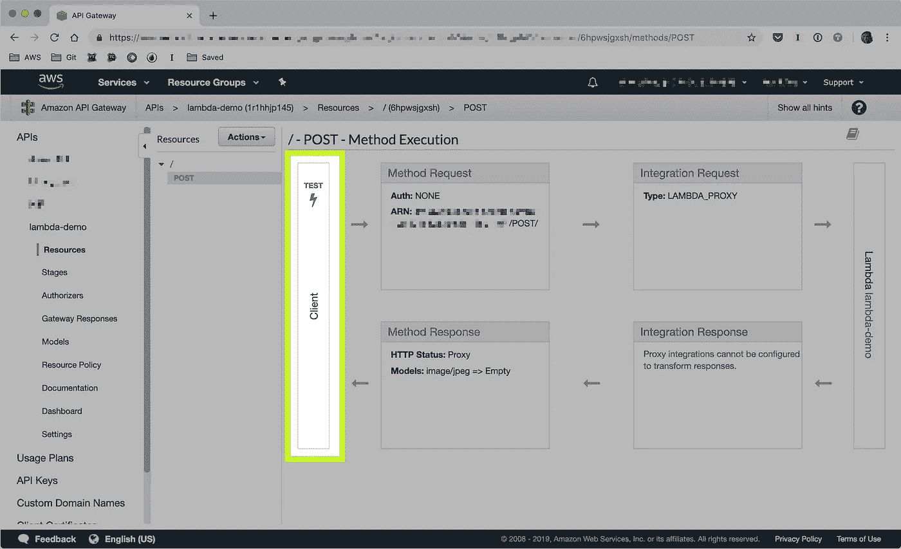

在这种情况下，我们提供的是 base64 图像主体本身，而不是 json 对象。为了方便起见，您可以尝试将以下链接中的原始 base64 字符串粘贴到请求正文字段 [cat_base64_body](https://gist.githubusercontent.com/tiivik/4c6bae4b3dc21c6a3c340eef9c254e2b/raw/37d660b229d462cf00d2cdfaa966ca54ee89b809/cat_base64_body) 中。

响应是黑白照片的 base64 字符串。

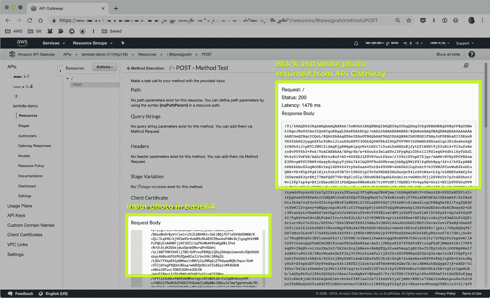

点击**动作** > **部署 API** 。

创建一个新的部署阶段，给它一个描述性的名称，例如`development`，然后按 **Deploy** 。

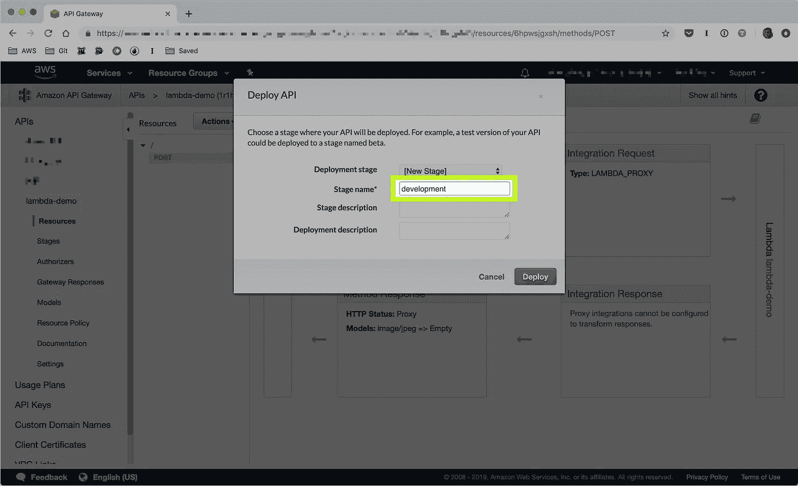

该 API 现在已经上线并开始运行了！您将收到一个部署 API 的 url:

`[https://XXXXX.execute-api.XXXX.amazonaws.com/development](https://XXXXX.execute-api.eu-central-1.amazonaws.com/development)`

我们来试试吧！

1.  让我们将同一张照片下载到我们的本地环境中

```
curl https://i.imgur.com/offvirS.jpg -o kitty.jpg
```

2.将图像作为二进制数据发布到我们的 API。结果是你当前工作目录中的黑白图像。🎉

```
curl -X POST --data-binary @kitty.jpg https://XXXXX.execute-api.eu-central-1.amazonaws.com/development -o kitty_bw.jpg
```

*记住，为了简单起见，本教程没有错误处理、请求验证或授权设置。对于生产应用程序，这些应该在 API Gateway 和 Lambda 函数代码中设置。*

就这些，希望你觉得这个指南有用！如果你有，你可以在这里[订阅未来的文章](https://medium.com/@tiivik)或者在 [Twitter](https://twitter.com/tiivik) 上找到我。👏