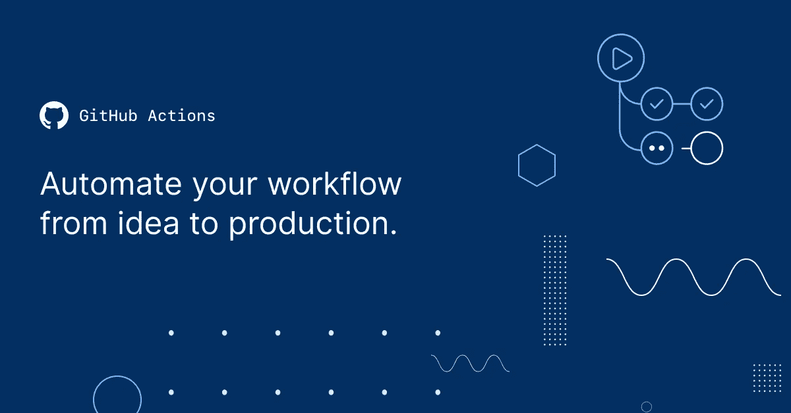

# 创建 Github 动作来标记提交

> 原文：<https://itnext.io/creating-a-github-action-to-tag-commits-2722f1560dec?source=collection_archive---------1----------------------->



来源: [Github](https://github.com/)

> GitHub Actions 现在拥有世界一流的 CI/CD，可以轻松实现所有软件工作流程的自动化。直接从 GitHub 构建、测试和部署您的代码。按照您想要的方式进行代码审查、分支管理和问题分类。
> 
> [Github 动作文档](https://github.com/features/actions)

# 介绍

在本帖中，我们将创建一个新的 Github 动作，在合并一个 pull 请求时自动标记提交。

Git 标签是存储库历史中被标记为重要的特定点，通常用于标识发布版本。自动标记我们的 Github 项目是迈向完全自动化的 [CI](https://www.atlassian.com/continuous-delivery/principles/continuous-integration-vs-delivery-vs-deployment) 管道的第一步，在 Github 中存储和版本控制！让我们开始吧。

[](https://github.com/anothrNick/github-tag-action) [## anothrNick/github-tag-action

### 一个 Github 动作，在合并时，用最新的 semver 格式版本自动碰撞和标记 master。名称:凹凸…

github.com](https://github.com/anothrNick/github-tag-action) 

# 创建标签

首先，我们需要从 git 存储库中获取最新的标签。这可以通过以下 git 命令来完成:

```
# get latest tag
t=$(git describe --tags `git rev-list --tags --max-count=1`)# print latest
echo $t
1.0.0
```

示例 repo 具有最新的标签`1.0.0`。我们将使用语义版本化方案来实现这个版本。

[语义版本化(又名 SemVer)](https://semver.org/) 是目前最广为人知和最广泛采用的版本方案。由于 SemVer 如此受欢迎，已经有很多工具可以产生语义版本标签，所以我最终决定使用[fsaintjacques/SEM ver-tool](https://github.com/fsaintjacques/semver-tool)。

 [## fsainjacques/SEM ver-tool

### semver 是一个小工具，用于在遵循 semver 规范的项目中操纵版本碰撞。它的用途是…

github.com](https://github.com/fsaintjacques/semver-tool) 

semver-tool 是一个 bash 脚本，给定一个有效的 semver 标记，它将根据 major、minor 或 patch 参数将版本提升到它的下一个值。

现在我们有了最新的标签、版本控制方案和修改标签的工具，应该增加哪个数字；大调、小调还是补丁？一种简单而直接的方法是基于自最后一个标记以来提交消息中特定语法的存在进行跳转。所以，如果我们要传达一个信息:

```
git commit -m "Small bug fixes. #patch"
```

Github 动作脚本将知道增加补丁数字，而不是大调或小调。

以下脚本将检索提交并基于提交消息碰撞标记，如果没有找到标记语法，则默认为`minor`:

我们现在有一个新标签可以发布到 Github 了！

# 将新标签推送到 Github

接下来，我们需要用新版本标记的当前提交散列。由于这个动作将在每次推(或合并)到 master 时运行，我们可以假设最新的提交散列将比最新的标签新。

```
# get current commit hash
commit=$(git rev-parse HEAD)
```

标签是一个 [Git 引用](https://git-scm.com/book/en/v2/Git-Internals-Git-References)。所以要在 Github 中创建新的标签，我们可以向 Github API 的 ref 资源发送一个 POST 请求，将标签(ref)和提交散列作为请求体。更多详情请参见 [Github 创建参考文档](https://developer.github.com/v3/git/refs/#create-a-reference)。

下面是一个 cURL 命令，它将使用 API 令牌发布对 Github API 的引用:

使用了两个环境变量:

**REPO_OWNER** :拥有该 REPO 的 Github 用户的名称(即您想要标记的项目的 Github 用户名)。在为操作设置工作流时，这将是一个可配置的参数。

GITHUB_TOKEN : API 令牌，用于对 Github API 的请求进行认证和授权。这也需要传递到环境中，但是 Github 会自动为您创建一个令牌秘密，所以您不需要为您配置的每个项目工作流创建一个新的秘密。更多信息，请参考[Github 动作的虚拟环境](https://help.github.com/en/articles/virtual-environments-for-github-actions#github_token-secret)。

我们创建新标签并将其发布到 Github 的最终脚本应该是这样的:

现在让我们将我们的操作打包成一个 Docker 图像:

我们的行动已经准备好了！

要在您的项目中使用此操作，只需在 repo 的`.github/workflows/`目录中创建一个工作流文件。例如，Github Tag Bump 项目用它来标记自己:

*注意:工作流使用* `*actions/checkout@master*` *动作来签出 git 存储库。*

只需将`REPO_OWNER`改为你的 Github 用户名或组织。现在推一些修改给 master，或者提交一个 PR。一旦合并，这个 Github 操作将运行并标记您的 repo。

感谢阅读！

Github Tag Bump 发布到 Github 市场:

[](https://github.com/marketplace/actions/github-tag-bump) [## Github 标签碰撞- GitHub 市场

### Github 动作一个 GitHub 动作，在合并时，用最新的 semver 格式版本自动碰撞和标记 master

github.com](https://github.com/marketplace/actions/github-tag-bump)