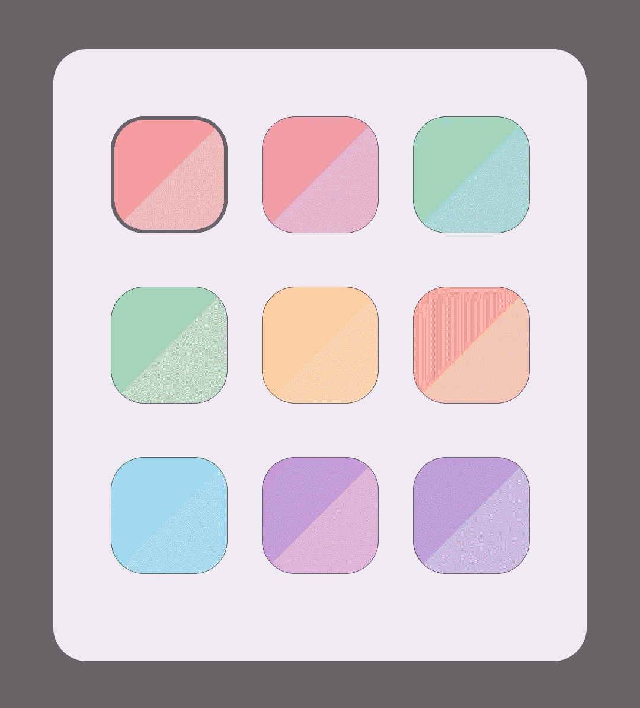

# 在 Jetpack Compose 中创建一个简单的颜色选择器

> 原文：<https://itnext.io/creating-a-simple-colour-picker-in-jetpack-compose-2e4e77ffc016?source=collection_archive---------1----------------------->

我最近发布了一款储蓄追踪应用程序。作为该应用的一部分，用户可以创建罐子，这是为特定目标存钱的一种方式。我想给用户一个选项来选择颜色的罐子，但从一个特定的调色板，以适应主题。我想出了一个简单的颜色选择器，我想在这里分享。最后，我还将展示一个双色版本，它可以代表亮/暗模式颜色，以及其他颜色。

## 我们将建造什么

## 让我们从按钮开始

你也许可以从 Material3 组件库中定制`Button`,但我发现，要获得我想要的效果，只需使用一个盒子，并创建适合我的应用程序主题的自己的按钮，这要简单得多。如果我们看到我们所需要的，它只是以下内容:按钮周围的轮廓，与它交互的方式，一些文本和颜色的预览。我们可以从创建一个按钮的大致形状和轮廓的盒子开始。

你可以随意定制，但是最重要的是轮廓的边框和`clickable`,当点击这个框时，你可以执行一些动作。在这里，我们可以打开拾色器对话框。

接下来，我们要添加文本和预览。文本只是包装在一行中的简单的`Text` 组件，不值得在这里详细查看。完整的代码可以在最后找到。我们应该看的是彩色预览。为此我使用了`Canvas`,尽管它实际上非常简单，我们甚至不需要画任何路径。

正如我们所见，画布的主体是空的。我们所需要的只是一个纯色块，所以真正的画布就足够了。我们只需要将背景设置成我们想要的任何颜色，添加一个细边框，然后让它变得和我们想要的一样大。我发现`30.dp`是合理的，但你可以定制这个。我们也有相同的`clickable`代码，因为我们希望颜色选择器在用户点击预览时也能打开。现在让我们继续实际的颜色选择器对话框。

## 颜色选择器对话框

颜色选择器对话框实际上非常简单。我们已经看到了如何使用画布显示色块。现在我们只需要用同样的技巧一次显示一堆颜色。

我们将使用材料 3 中的 [AlertDialog](https://developer.android.com/reference/kotlin/androidx/compose/material3/package-summary#alertdialog) ,因为我希望它是一个弹出对话框。如果您希望这是一个全屏颜色选择器，您可以将 AlertDialog 的内容放在另一个屏幕中，并在单击上面的按钮时导航到它。

接下来，我们要保存当前选择的颜色。这将来自呼叫者，因为我们希望按钮也是同样的颜色。

```
var currentlySelected by rememberSaveable(saver = **colourSaver**()) **{            mutableStateOf**(colors[0]) 
**}**
```

我们在这里看到我们需要一个自定义的`saver`,因为默认情况下`rememberSaveable`不能保存颜色。也许有办法解决这个问题，但是我发现如果你想直接使用颜色，最简单的方法就是提供一个简单的自定义`saver`。`saver`只需要将类型(在本例中是`Color`)转换成可保存的类型，比如`String`。我们可以在下面看到，在保存时，保存程序将`Color`转换成一个`String`，它包含了颜色的十六进制表示。当`Color`恢复时，十六进制字符串用于恢复颜色。

```
fun colourSaver() = **Saver**<MutableState<Color>, String>(
    save = **{** *state* **->** *state*.value.**toHexString**() **}**,
    restore = **{** *value* **-> mutableStateOf**(*value*.**toColor**()) **}** )

fun Color.toHexString(): String {
    return String.**format**(
        "#%02x%02x%02x%02x", (this.alpha * 255).toInt(),
        (this.red * 255).toInt(), (this.green * 255).toInt(), (this.blue * 255).toInt()
    )
}

fun String.toColor(): Color {
    return **Color**(android.graphics.Color.parseColor(this))
}
```

我们将使用 Jetpack Compose 中的 [LazyVerticalGrid](https://developer.android.com/reference/kotlin/androidx/compose/foundation/lazy/grid/package-summary#LazyVerticalGrid(androidx.compose.foundation.lazy.grid.GridCells,androidx.compose.ui.Modifier,androidx.compose.foundation.lazy.grid.LazyGridState,androidx.compose.foundation.layout.PaddingValues,kotlin.Boolean,androidx.compose.foundation.layout.Arrangement.Vertical,androidx.compose.foundation.layout.Arrangement.Horizontal,androidx.compose.foundation.gestures.FlingBehavior,kotlin.Boolean,kotlin.Function1)) 来显示颜色网格。这一点实际上相当棘手。对于 9 种颜色，它真的很好，因为我们只有一个 3x3 的网格。但是如果你有 10 种颜色呢？还是 17？这可能看起来很奇怪，我只能建议你尝试不同的价值观，看看什么是可行的。在下面的代码中，我使用了`GridCells.Fixed`，因为我知道只有 9 种颜色，我想要 3 列。如果你有多种颜色，使用`GridCells.Adaptive`可能更有意义。

```
LazyVerticalGrid(
  columns = GridCells.Fixed(3),                
  state = gridState
)
```

我们要做的最后一件事是在当前选择的颜色周围画一个边框。这非常简单，因为如果网格中的当前颜色是当前选择的颜色，我们就可以设置一个边框。

```
var borderWidth = 0.dp                    
if (currentlySelected == color) {                        
  borderWidth = 2.dp                    
}
```

我们现在需要的东西都有了。我没有再次提到实际的色块，因为它与预览版中的画布代码非常相似。唯一的区别是块的大小。颜色对话框的完整代码在这里:

## 双色版本



双色版本

如果我们想显示两种颜色而不是一种颜色呢？也许是为了分别显示在亮暗模式下使用的颜色？在这种情况下，我们必须在画布上做更多的工作。我们需要画两个三角形，而不是仅仅改变背景，这两个三角形一起组成正方形。在 Canvas 中，我们可以访问`DrawScope`，并且可以使用`DrawPath`绘制路径。我们需要画两张，每种颜色一张。每一个都是三角形。第一个三角形从左上角开始，穿过右上角，然后在左下角结束。第二个三角形从右上角开始，向下到左下角，在右下角结束。当然，这只是一种可能的方向。您可以更改顺序和访问的点来绘制不同的方向。

您还需要更改预览代码来显示两种颜色，但这并不重要，因为代码几乎完全相同。

为了简明起见，我在上面的代码片段中省略了许多样板代码。如果你想了解更多细节，你可以在 https://github.com/JamalMulla/ColourPickerExample[查看完整的样本应用程序，包括单色和双色版本。](https://github.com/JamalMulla/ColourPickerExample)

如果你能在 Google Play 上查看我的应用 [JamJars](https://play.google.com/store/apps/details?id=com.jamal.jamjars) ，我也会很感激。

关注我，获取更多关于 Android 和编程的文章。