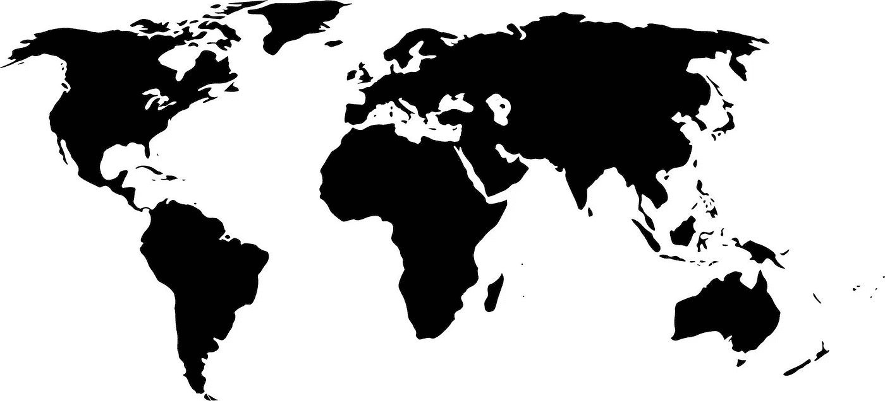

# 🌍创建 React usePosition()挂钩以获取浏览器的地理位置

> 原文：<https://itnext.io/creating-react-useposition-hook-for-getting-browsers-geolocation-2f27fc1d96de?source=collection_archive---------0----------------------->



## TL；速度三角形定位法(dead reckoning)

在本文中，我们将创建一个 React *usePosition()* 钩子来获取并跟踪浏览器的位置。我们将使用全局对象 *navigator.geolocation* 提供的[*getCurrentPosition*](https://developer.mozilla.org/en-US/docs/Web/API/Geolocation/getCurrentPosition)和 [*watchPosition*](https://developer.mozilla.org/en-US/docs/Web/API/Geolocation/watchPosition) 函数。 *usePosition()* 钩子的最终版本是 [***发布在 GitHub***](https://github.com/trekhleb/use-position) 和[***【NPM】***](https://www.npmjs.com/package/use-position)上，准备好被你的应用消费。

## 为什么我们可能需要 usePosition()钩子

[反应钩子](https://reactjs.org/docs/hooks-intro.html)的一个优点是*能够分离关注点*。我们可以完全避免使用状态，而只使用两个不同的钩子来为我们处理状态管理，而不是使用一个带有地理位置**和**套接字连接的状态对象。此外，我们可以将这个逻辑分成两个独立的钩子，而不是在同一个*componentidmount()*回调中启动浏览器位置监视器**和**打开套接字连接。这给了我们更干净和更易维护的代码。

## 我们将如何使用 Position()钩子

让我们做一些逆向工程，想象我们已经实现了一个 *usePosition()* 钩子。下面是我们可能想要使用它的方式:

```
import React from 'react';
import {usePosition} from './usePosition';export const UsePositionDemo = () => {
  const {latitude, longitude, error} = usePosition(); return (
    <code>
      latitude: {latitude}<br/>
      longitude: {longitude}<br/>
      error: {error}
    </code>
  );
};
```

你看，用 *usePosition()* 钩子只有一行，你已经有数据了(*纬度*和*经度*)。我们这里甚至不用 *useState()* 和 *useEffect()* 。位置订阅和观察器清理封装在 *usePosition()* 钩子中。现在，React 将为我们处理重绘组件魔术，我们将看到 *<代码>…</代码>* 块不断更新浏览器的最新位置值。看起来很整洁干净。

## usePosition()钩子实现

我们自定义的 *usePosition()* hook 只是一个 JavaScript 函数，它使用了其他类似 [*useState()*](https://reactjs.org/docs/hooks-state.html) 和 [*useEffect()*](https://reactjs.org/docs/hooks-effect.html) 的钩子。它看起来会像这样:

```
// imports go here...export const usePosition = () => {
  // code goes here...
}
```

我们将使用 *useEffect()* 钩子来钩住组件(将使用我们的钩子)被渲染的时刻，并订阅地理位置的变化。我们还将使用 *useState()* 钩子来存储*纬度*、*经度*和*错误*消息(以防用户不允许浏览器共享其位置)。所以我们需要首先导入这些钩子:

```
import {useState, useEffect} from 'react';export const usePosition = () => {
  // code goes here...
}
```

让我们为位置和错误初始化一个存储:

```
import {useState, useEffect} from 'react';export const usePosition = () => {
  const [position, setPosition] = useState({});
  const [error, setError] = useState(null);

  // other code goes here...
}
```

让我们从函数中返回一个理想值。我们还没有它们，但是让我们返回到目前为止的初始值，以后再填充它们:

```
import {useState, useEffect} from 'react';export const usePosition = () => {
  const [position, setPosition] = useState({});
  const [error, setError] = useState(null);

  // other code goes here... return {...position, error};
}
```

这是我们钩子的一个关键部分——获取浏览器的位置。我们将在组件渲染后执行提取逻辑(useEffect hook)。

```
import {useState, useEffect} from 'react';export const usePosition = () => {
  const [position, setPosition] = useState({});
  const [error, setError] = useState(null);

  // callbacks will go here... useEffect(() => {
    const geo = navigator.geolocation;
    if (!geo) {
      setError('Geolocation is not supported');
      return;
    } watcher = geo.watchPosition(onChange, onError); return () => geo.clearWatch(watcher);
  }, []); return {...position, error};
}
```

在 useEffect() hook 中，我们首先做一些检查，看看浏览器是否支持 *navigator.geolocation* 。如果不支持地理定位，我们将设置一个错误并从效果中返回。如果支持 *navigator.geolocation* ，我们将通过提供 *onChange()* 和 *onError()* 回调来订阅位置更改(我们稍后将添加它们)。注意，我们从 *useEffect()* 返回了一个 lambda 函数。在 lambda 函数中，一旦组件被卸载，我们就清除观察器。因此，这个订阅/取消订阅逻辑将由我们的 *usePosition()* 钩子在内部处理，消费者不必担心。

现在让我们添加缺失的回调:

```
import {useState, useEffect} from 'react';export const usePosition = () => {
  const [position, setPosition] = useState({});
  const [error, setError] = useState(null);

  const onChange = ({coords}) => {
    setPosition({
      latitude: coords.latitude,
      longitude: coords.longitude,
    });
  }; const onError = (error) => {
    setError(error.message);
  }; useEffect(() => {
    const geo = navigator.geolocation;
    if (!geo) {
      setError('Geolocation is not supported');
      return;
    } watcher = geo.watchPosition(onChange, onError); return () => geo.clearWatch(watcher);
  }, []); return {...position, error};
}
```

我们结束了。钩子 *usePosition()* 可以被使用，它只封装地理位置相关的逻辑。

## 编后记

你可能会在 GitHub 上找到一个 [**演示**](https://trekhleb.github.io/use-position/) 和更详细的 [**usePosition()钩子实现。我希望这个例子对你有所启发。编码快乐！**](https://github.com/trekhleb/use-position)