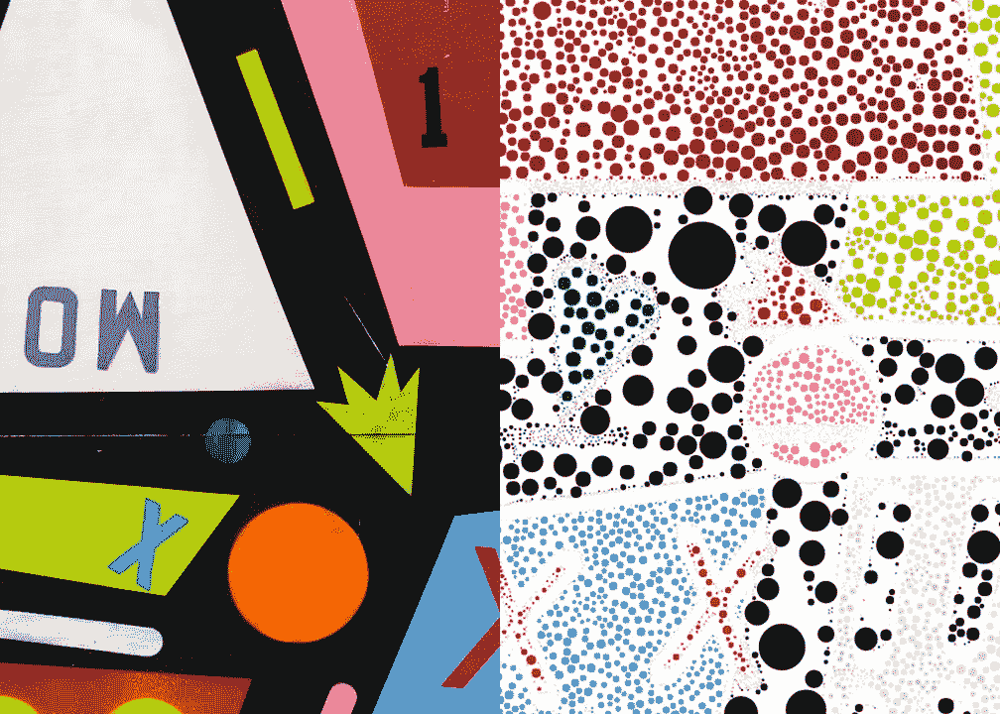

# 创造性编码——用圆圈重画图像

> 原文：<https://itnext.io/creative-coding-image-redrawing-with-circles-1ba2e7eaebe?source=collection_archive---------6----------------------->

完成本教程后，你可以期待的一个例子

[*点击这里在 LinkedIn* 上分享这篇文章](https://www.linkedin.com/cws/share?url=https%3A%2F%2Fitnext.io%2Fcreative-coding-image-redrawing-with-circles-1ba2e7eaebe)

我想向你们展示我最喜欢的编码工作之一:创造艺术！你可以追求无限多的艺术理念，唯一的限制是你的想象力。

最终结果可以在[我的笔友](https://codepen.io/muradkhan101/pen/evxPZp))上看到。您可以使用 Codepen 或您喜欢的任何其他方法来跟进。在它的核心，正在发生的事情是图像的细节水平，这是由颜色的变化来衡量的，并用圆圈来可视化。细节量高的区域圆较小，细节量低的区域圆较大。这种可视化选择导致最终图像与原始图像非常相似，但仍然是独一无二的。介绍完了，我们开始吧。

# 加载图像

重新绘制图像的第一件事是加载并显示它。为此，我们将利用[画布元素](https://developer.mozilla.org/en-US/docs/Web/API/Canvas_API)。让我们首先编写我们的 HTML 标记，这将是最少的。

我们正在制作两个画布元素，一个显示原始图像，另一个显示重新绘制的图像。接下来我们要做的是加载我们想要绘制的图像，但是这里有一个问题。如果你跟随 Codepen 或者其他在线 HTML 测试网站，你将只能从设置了 [CORS 标题](https://developer.mozilla.org/en-US/docs/Web/HTTP/Access_control_CORS)的网站加载图片。这是一个安全设置，仅允许图像和其他内容加载到具有相同原始 URL 的网站上，除非明确告知。幸运的是， [imgur](http://imgur.com) 设置了正确的 CORS 标题，因此我们可以从那里提取图像！继续并找到您想要使用的图像(我会等待)，我们会将该图像加载到我们的画布元素中。

这里发生了很多事情，但总的来说，我们只是加载图像文件并将其绘制到画布上(如果您不关心我们如何加载图像，可以跳到下一部分)。

首先，我们声明 loadImage，在其中创建一个 Image 对象，并将 crossOrigin 属性设置为“Anonymous ”,这样我们就可以从外部源加载图像。在图像的`onload`函数中，我们获得一个画布元素，将其宽度和高度设置为原始图像的缩放版本，然后将图像绘制到画布上。在行`imgData = ctx.getImageData(0,0,w,h)`中，我们将图像的像素数据提取到一个数组中以备后用。下一行使用 canvas 元素的“toDataURL”方法将图像转换成[base64]([https://en.wikipedia.org/wiki/Base64](https://en.wikipedia.org/wiki/Base64))，然后发出一个带有该信息和画布高度/宽度的回调。我们的回调会将图像源更改为 base64，设置重绘画布的高度/宽度，并开始绘制周期。最后，我们加载图像，如果一切顺利，你应该看到它在你的屏幕上弹出！

# 编写一些助手函数

在我们被将要画的圆圈弄得不知所措之前，让我们写几个辅助函数来使我们的生活更容易。

`dist`函数计算两点之间的欧几里德距离(基本上就像用尺子测量距离一样)，`random`在我们指定的范围内给我们一个随机数，`getPixelColor`从我们的图像中取一个 X/Y 位置并返回该点的像素颜色。为了从二维 X/Y 位置到一维数组索引(因为我们的像素颜色数组是平面的，从左上角开始列出像素，到右下角结束)，我们使用公式`index = (width * yPos * 4) + (xPos * 4)`。我们将 Y 位置乘以宽度，因为当我们向下移动一个像素行时，我们移动了相当于宽度的像素，我们加上 X 位置，因为这是我们在该行中通过的像素数量。两者都乘以 4，因为每个像素包含 4 个颜色值，分别代表红色、绿色、蓝色和 alpha。

请记住这些内容，因为它们将在后面的章节中用到。但是不要太担心，因为当我们使用它们时，我会提醒你；)

# 创建圆对象

现在我们已经准备好了图像，我们可以开始编写代码在屏幕上放置圆形。因为我们要画很多圆，所以创建一个 Circle 对象来保存所有的逻辑是有意义的。

我们希望我们的圆知道它们的位置、大小、颜色以及应该画在哪里，所以我们通过构造函数传递所有这些信息。我们不希望我们的圆在绘制时相互重叠，所以我们添加了`outsideCircle`方法来检查这种情况下的测试。

`outsideCircle`函数获取一个圆对象和一个新圆的位置和半径，并返回新圆是否会接触到现有圆。如果两个圆的圆心之间的距离大于它们的半径之和，它们就不重叠(如果你需要帮助概念化的话，在纸上画出来)。+1 只是作为圆圈之间的填充。

最后，为了画圆，我们有一个恰当命名的`drawCircle`方法。它从 circle 对象获取位置和大小，并用这些参数画一个圆。顺便提一下，你可以做的一件有趣的事情是将`this.ctx.fillStyle`改为`this.ctx.strokeStyle`，将`this.ctx.fill`改为`this.ctx.stroke`来画空心圆。对于一些图片来说，这看起来比实心圆更酷！

# 确定方差

接下来我们要做的是确定图像中某一点周围的方差(记住我们假设高方差意味着高细节水平)。这将是这个项目中最困难的部分，所以做好准备！为了确定方差，我们首先需要将二维图片中一个点周围的像素映射到一维数组，下一个函数以一种非常简单的方式完成了这个任务。

好吧，我承认这个函数看起来又大又吓人(或许可以写得更好)，但是它的工作很简单。它使用递归查找初始起始点一定距离内的所有像素。如果当前点在最大距离之外或之前已经找到，它将停止在该点周围检查。否则，它会将该点添加到数组中，并检查它周围的其他点。里面所有的 if/else 语句都检查边缘情况(字面意思),因为如果一个像素在图像的边缘，与它直接接触的像素将少于四个。例如，对于左边缘的像素，我们只需要检查起始像素上方、下方和右侧的像素。该函数返回一个索引数组，对应于图像中的像素，我们接下来将使用它来计算方差。

`calcVar`函数接收像素信息数组(从`loadImage`函数获得)和索引数组(从`findIndices`函数获得)。它遍历来自`indexArray`的每个索引，并从`pixelArray`提取相应的 R、G 和 B 值。然后，它使用提取的值来计算颜色的总[方差](http://www.statisticshowto.com/probability-and-statistics/variance/)，作为 RGB 值的单个方差的总和。请记住，我们使用这个函数来计算某个点周围的颜色变化，所以我们需要在每次选择新点时重复这个计算。

# 把所有的放在一起

现在我们已经有了画圆和计算点周围颜色变化的方法，让我们添加一个选择在哪里画新圆的方法。

这里发生的是，我们在画布的边界内选择一个随机点来放置下一个圆(使用我们之前编写的“随机”辅助函数)。我们通过将某个数字(在本例中为 50)除以方差的平方根(即标准偏差)来确定圆的大小。作为旁注，50 的选择是任意的；你可以选择任何数字，改变的只是新圆圈的平均大小。

一旦我们有了一个位置和大小，我们就循环遍历已经画好的每个圆，并测试新的圆是否与任何圆重叠。如果不是，我们返回一个新的圆形对象，它是用上面的位置和大小以及该位置的像素颜色创建的。如果有重叠，我们返回 null。

我们现在只需要再写一个函数，它控制在画布上画圆！这个函数是在`loadImage`函数中第一次提到的，以防你不记得(我不会怪你那是很久以前的事了)。

我们通过声明变量`count`、我们已经找到的有效新圆的计数、`max`、我们希望用每个循环画出多少个新圆，以及`attempts`、我们已经尝试找到新的有效圆的次数来开始这个函数。虽然我们拥有的圈子比我们想要的少，但我们试图创造一个新的圈子。如果它是有效的，我们把它添加到我们的圆形数组中，并增加计数。我们总是增加我们的尝试次数，如果它大于 250，我们输出‘Done’并结束我们的程序。一旦我们找到了足够多的新圆，我们就退出 while 循环，清空当前的画布，画出我们所有的圆，然后重复这个过程。

瞧啊。你有它！你自己的图像循环重绘。我在下面提供了我的版本，其中包含一些代码，如果你取消注释，将使每个圆圈在 draw 函数的每个循环中增长一点。

# 自定义绘图

将我们上面编写的代码视为您可以实现的所有定制的基础。比如不一定要画圆，可以用正方形，或者六边形，甚至三角形！您只需创建自己的形状、对象和函数来测试有效的位置并绘制形状。

另一个更简单的定制是改变形状大小的确定方式。您可以基于某种颜色的数量或其在 RGB 数组中的索引，而不是基于该点的细节数量。有大量的可能性可以探索，我很想看看你做的那些，所以当你想出一个新的风格时，把它们发给我！

*原载于* [*blog.tycc.io*](http://blog.tycc.io/posts/image-redrawing-circles)