# “信用卡还是借记卡？”—或者在 OutSystems 平台中接受支付的故事

> 原文：<https://itnext.io/credit-or-debit-or-the-story-of-accepting-payments-in-the-outsystems-platform-b1b4bf15f736?source=collection_archive---------1----------------------->

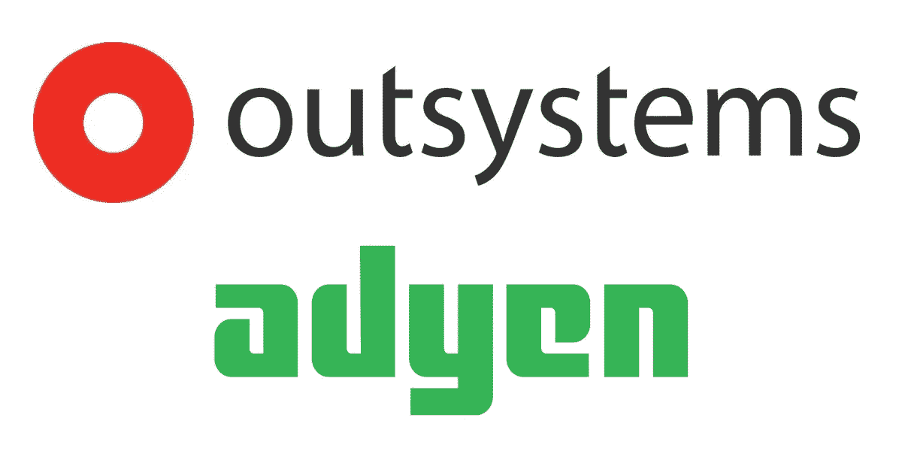

OutSystems 遇见 Adyen

> 移动设备、高速数据通信和在线商务正在创造这样一种期望，即无论何时何地，只要需要，便捷、安全、实时的支付和银行功能都应该是可用的。

我决定从 Jerome H. Powell 在[的一段话开始，因为我认为这是这个故事的一个很好的起点。现在，亲爱的读者，让我问你一个问题:你最后一次在网上付款是什么时候？好吧，我可以告诉你一些我的故事:就在我写这篇文章的时候，我刚刚为我的专业网站买了一个新的域名——你会在文章的结尾找到它——使用了一个叫](https://www.federalreserve.gov/newsevents/speech/powell20170303b.pdf) [MBWay](https://www.mbway.pt/) 的神奇东西。

我如何付款不是这里的重点。相反，如今的科技让我们可以随时随地接触到几乎任何东西。而且，因为几乎每个人都喜欢买东西，所以我想什么时候“成交”就什么时候“成交”。比如，为什么我不能在凌晨 4 点买一些鸡蛋面和一包红烧酱？我知道有句谚语说凌晨 2 点后不会有好事发生，但是……鸡蛋面，对吗？

所以我决定接受挑战，为一个非常著名的支付网关 [Adyen](https://www.adyen.com/) 实现一个集成包装器(或者插件，我更喜欢)。你可以——我建议——看看他们的故事，了解更多关于他们做什么和为什么做的事情。这始于我为[我的游戏解决方案](https://www.mygamesolutions.com/)工作的时候，现在，作为一名自由职业者 OutSystems 开发者，我决定创建一个 2.0 版本。别再闲聊了！

# 商业案例

因此，商业案例相当简单:我们希望在我们的应用程序中接受支付，在我们的两个渠道中——网络和移动。支付的接受与我们希望实现的特定功能相关联，尽管当时的服务仅专注于移动设备，但我们也希望支持网络，因为由于技术困难或通过不同的销售渠道，可以发布一次性网络支付表单。

因此，*强调*我们想做的是:

*   我们希望在移动应用程序上接受支付
*   我们希望在网络应用程序上接受付款
*   我们希望能够生成一个一次性的形式来接收付款
*   我们希望能够向顾客退款

现在，最重要的部分:**约束**。嗯，我们有一个主要的限制—或者，对于这个场景，这是我们将考虑的，因为它将是大多数情况:我们不会被认为是 PCI 兼容的。符合 PCI 标准有一些好处，但也有很多要求，以确保我们支付数据的安全。幸运的是，Adyen 通过提供**客户端加密**(或 CSE)来支持不兼容的商家(美国)。除此之外，不再考虑其他约束。

# 履行

实现部分将被分成三个更小的子部分:核心服务，其中我们将讨论远程 API 调用；移动插件，尽管不是原生插件，但我仍称其为插件，最后是 web 部分，它将具有一次性付款形式。在本文中，我们将只讨论核心服务和移动插件，而 web 部分将在另一篇文章中讨论，您可以查看以下内容:

[](/dont-worry-ma-am-you-don-t-need-to-share-your-credit-card-details-over-the-phone-or-the-story-6e785175d1a5) [## “别担心，女士，你不需要在电话里分享你的信用卡信息”——或者…

### 又见面了！今天，我们的主要课程是在用开发的 web 应用程序中接受信用卡支付

itnext.io](/dont-worry-ma-am-you-don-t-need-to-share-your-credit-card-details-over-the-phone-or-the-story-6e785175d1a5) 

## 核心服务

使用之前陈述的基线和来自 Adyen 、**的文档，我们已经决定了两件事**:第一件是，尽管也提供 SOAP 服务，**我们将使用 JSON** 和它们的 RESTful 端点来实现 API。第二个是**我们希望记录来自 API 的请求和响应，并且只使用我们真正需要的字段**。API 文档相当广泛，因为它们不仅支持电子商务，还支持应用内支付和销售点。

因此，我们将为以下端点实现服务:***/pal/servlet/Payment/v 30/authorise****用于支付捕获，以及*[***/pal/servlet/Payment/v 30/canceler refund***](https://pal-test.adyen.com/pal/servlet/Payment/v30/cancelOrRefund)用于处理退款。**

****注意**:如果您正在查看 API 文档，并且想知道为什么我们使用这个端点而不是位于[***/pal/servlet/Payment/v 30/退款*** ，](https://pal-test.adyen.com/pal/servlet/Payment/v30/refund)的端点，原因很简单:当我们希望支持预授权时，我们希望避免实现新服务的麻烦。别担心，这不在本文的讨论范围之内，但是谁知道呢，也许将来我们会看到更多的内容…**

**接下来，我们创建了一个名为 Adyen Core 的应用程序，其中包含一个名为… AdyenCore 的模块。这是我们的核心服务和支持数据模型。**

**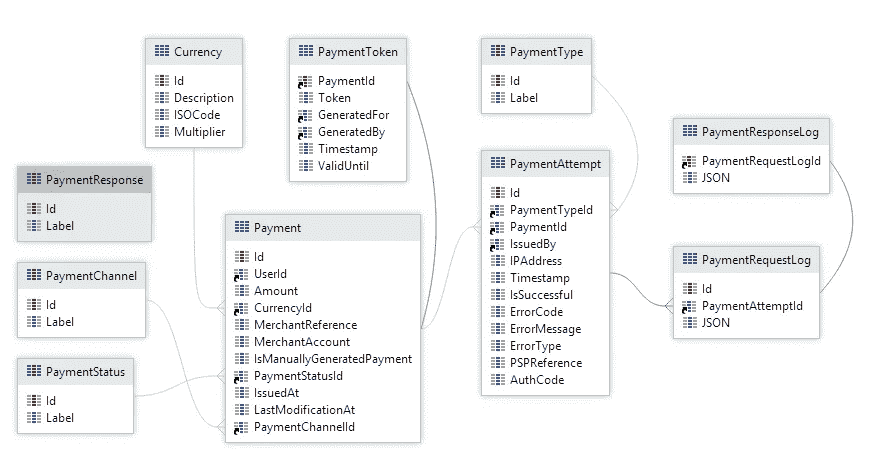**

****图 1 — AdyenCore 数据模型****

**图 1 显示了实现的数据模型。我们将把它分成三种类型的实体:**控制实体**，它们的目的只是帮助控制执行流；**日志实体**，顾名思义，具有日志功能，最后是**核心实体**，存储与支付相关的相关用户数据。**

**关于核心实体，我想强调几点:**

*   **在货币实体上，有一个名为**乘数**的属性。该属性存储的值是 10 的幂。这是因为 Adyen gateway 不接收小数点分隔符，并且根据货币的不同，小数位数可能会有所不同，例如，对于日元，不考虑小数位数，而对于欧元，则考虑两位小数位数。当我们到达服务映射时，我们将更仔细地看一看。作为补充说明，**货币实体在第一次发布模块时会自动引导**。**
*   ****一次付款可能有多种尝试**。PaymentAttempt 实体的工作方式类似于历史实体。我们需要这种行为，因为我们希望将授权和退款存储在同一个实体中，除此之外，还有可能的拒绝。这使我们能够建立一些分析并检测潜在的欺诈——快速提醒:分析和潜在的欺诈将在后续文章中涉及。**
*   **PaymentToken 实体用于存储一次性付款的条目。该实体中的条目应由一些管理人员通过 GUI 创建。在创建 PaymentToken 记录时，会生成一个唯一的 URL，并可以将其发送给客户。与前一点类似，web 部件将在关于这个主题的后续文章中讨论。**

**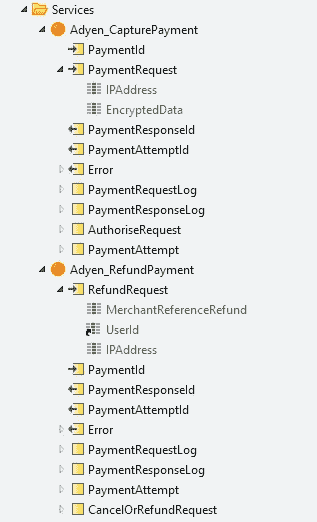**

****图 2 —我们行动的签名****

**到目前为止，我们已经介绍了我们的数据模型…但是我们的服务集成呢？**

**正如您在图 2 中看到的，并且知道我们想要实现两个不同的端点，我们已经将服务器逻辑分成了两个动作。在第一个示例中， **Adyen_CapturePayment** ，我们收到一个支付标识符(针对一个已经创建的支付(图 1 和图 2))，以及一些关于我们的“欺诈检测”可能性的更多细节(此时，只有 IP 地址)。然后，关闭我们的输入参数，我们有了 **EncryptedData** 参数。那个参数**是 CSE 算法**的结果，我们将在我们的手机和网络界面上都有它。最后，我们将返回一个 PaymentResponseId(未执行、拒绝、技术错误或成功)、尝试的标识符(如果我们想对它做一些额外的逻辑)和一个常见的错误结构(ErrorCode 和 ErrorMessage)。在 Adyen_RefundPayment 操作方面，我们将收到相同的付款标识符以及一个稍微复杂一点的结构，因为我们想知道谁是执行退款的用户以及所述退款的引用。除此之外，我们还有用于日志记录(Payment*Log)、REST 服务调用(*Request)和支付尝试的公共本地记录。**

**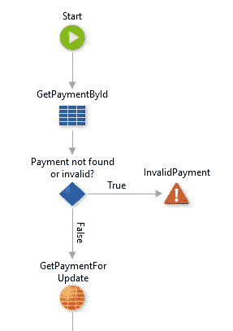**

****图 3 —两个动作的初始逻辑****

**由于我们接收 PaymentId 作为输入参数，**我们需要确保两件事**:**

*   ****标识符有效** —这意味着它存在并且处于允许修改的状态，并且…**
*   ****交易是唯一的**，即同一笔支付没有并发执行。**

**对于后者，我们通过使用 [GetPaymentForUpdate 来实现，它锁定数据库中的记录，直到事务完成，防止其他进程访问该记录。](https://www.outsystems.com/help/ServiceStudio/9.0/Using_Data/Get_for_Update_Action.htm)**

**如果付款标识符对于操作无效(为空或处于无效状态，即，已退款项不符合捕获条件)，则流程会中断并引发异常。然后，记录错误，中止事务，并正确分配错误输出结构。[易如反掌](https://www.youtube.com/watch?v=2jittOv0ESg)，对吧？**

****

****图 4 —请求逻辑****

**既然我们已经验证了一切都是正确的，并且请求的完整性得到了保证，那么是时候构建、记录和执行请求了(图 4)。授权和退款的初始部分是相同的，因为我们:**

*   ****创建一个支付尝试**和交易细节——类型、用户，你知道……常规的东西。**
*   ****为 REST 请求映射结构****
*   ****将其序列化为 Text** 数据类型(或者，用简单的“编程”语言来说，是一个字符串),并将其映射到我们的日志记录中**
*   ****调用映射结构的集成**。**

**如果一切都做得很好，并且您的 CSE 集成“就在现场”，那么这应该是一件轻而易举的事情，您的请求应该不会有任何相关的问题。但这是编程和计算机，对吧？顺便说一下，人们倾向于嘲笑我，因为我总是说计算机有感情。如果你对他们好，他们也会对你好。如果你不…**

**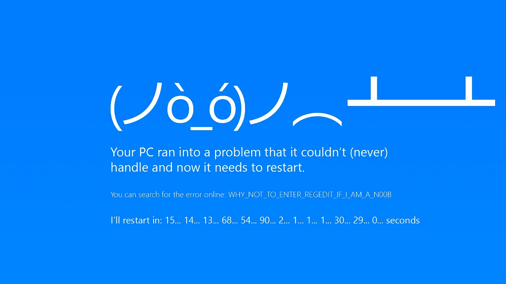**

****图 5——你的电脑:“你说我什么？我又老又迟钝？！？!"来源:**[**http://bit.ly/W10BSOD**](http://bit.ly/W10BSOD)**

****在调用这个 Adyen 的授权服务时，有两个常见的问题**——我曾经遇到过: **401 未授权**和 **422 不可处理实体**。它们看起来很吓人——第二个才是真正的 b***h！—但是，一旦你理解了根本原因，它们就变得相当琐碎了。**

**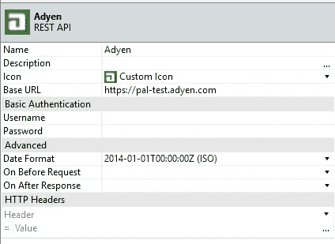**

****图 6 —认证是关键。字面上。****

**关于 **401 未授权**，修复就像查看图 6 中那个神奇的东西“基本认证”一样简单？是的，你必须填写。您可以在这里完成，也可以通过服务中心完成—我建议您通过服务中心完成，因为它们会随着环境的不同而变化，这样您就可以掌握集成选项卡。**

**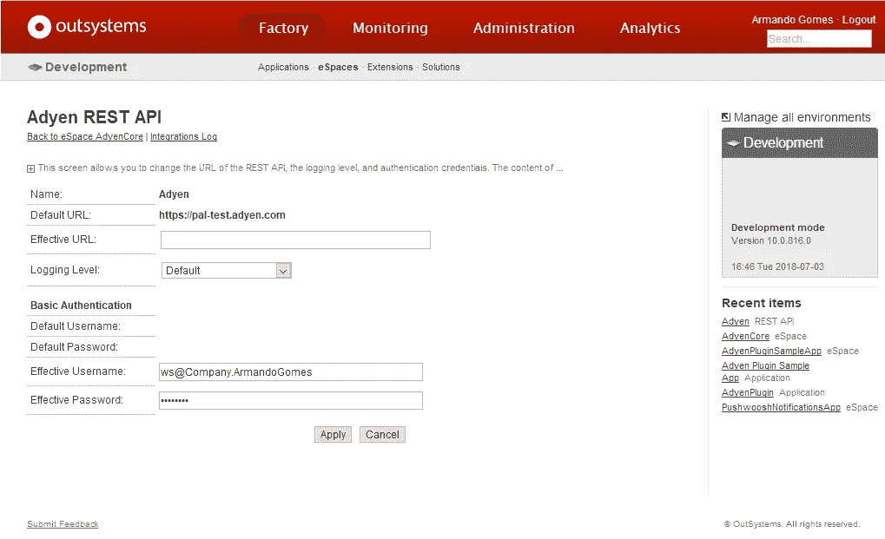**

****图 7——认证是关键，请看第二部分。****

**随着我们的 401 未授权的方式，我们仍然与 **422 不可处理的实体**在一起。如果可以的话，我想把这个“放在口袋里”一会儿，等我们讨论移动实现时再说。*还给你，流！*(用电视新闻主播语气读这个)。**

**因此，现在我们能够让我们的请求进行下去。我不知道你是否意识到类似“伟大的请求带来伟大的回应”这样的惊人之语。我们肯定非常重视我们的回应，我们必须尽可能以最有效的方式处理它——或者说是某种方式。**

**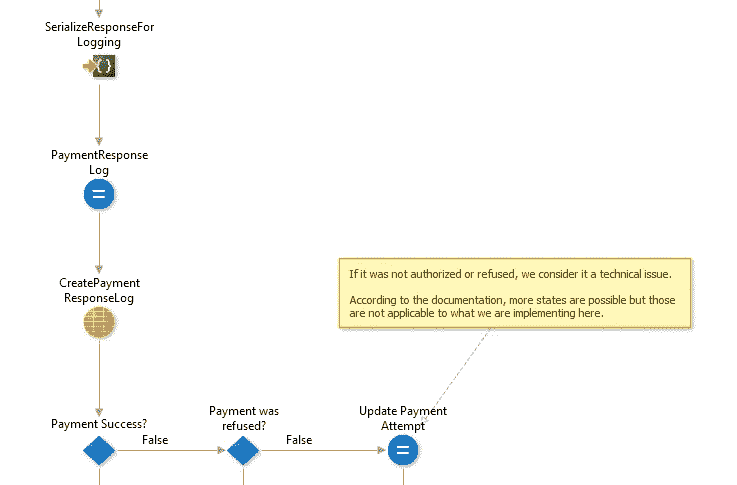**

****图 8 —处理授权响应****

**因为我们不区分请求和响应，所以我们以同样的方式对待它:我们序列化响应，然后使用我们的支持记录和实体记录它。然后，我们评估响应中的特定值，以查看请求是否成功:**

****

****图 9 —支付成功？条件****

****

****图 10 —付款被拒？条件****

**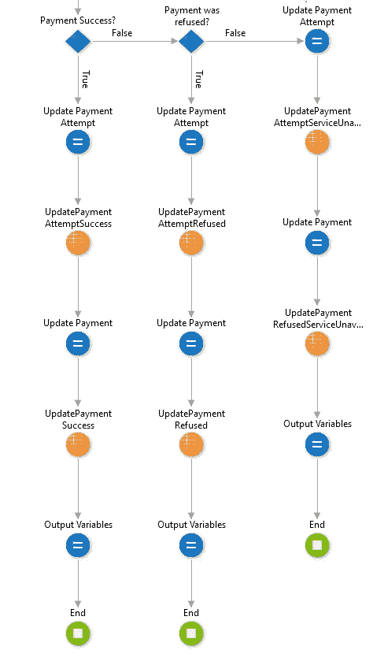**

****图 11 —授权动作的剩余逻辑****

****我们请求**的结果在授权中指定。ResultCode，它是一个文本——或者一个字符串，如果您愿意的话。在图 9 和图 10 中，我们有成功和拒绝的条件。但是，你可能会想，如果它既不是鱼也不是肉呢？在这种情况下，正如您在图 8 中看到的可怕的黄色方框所示，我们认为任何其他情况都是技术错误，因为响应没有达到预期，如果响应“成功”并且没有返回任何先前的结果代码，我们就有问题了。因此，最好标记它们，然后手动跟踪我们的付费客户或服务提供商。**

**在图 11 中，您可以看到每种情况下的剩余流量。这里有两点需要注意:我知道[安德鲁·亨特和戴维·托马斯是“不要重复自己”原则的坚定信徒](https://pragprog.com/the-pragmatic-programmer/extracts/tips)。因此，我们可以只有一个流，而不是三个“90%++相同”的流。但是，就个人而言，我更像是约翰·伍兹类型的程序员，因为，你知道，*最终维护这个的家伙可能是一个知道我住在哪里的暴力精神病患者*。**可读性代码**。**

**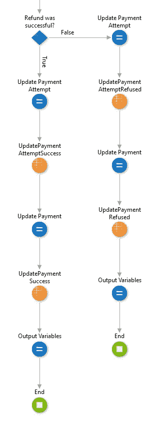**

****图 12 —退款操作的剩余逻辑。****

**最后但同样重要的是，在这个 AdyenCore 模块中，**在退款**响应处理上有一个非常相似但非常不同的方法。流程和逻辑保持不变，但这一次我们只有两种可能的选择:**要么成功，要么失败**。这里面没有任何“拒卡”一层。因此，我们只是通过验证一个输出值来验证退款请求是否被很好地接收:**响应**。如果这个响应包含一个给定值，我们知道它是成功的。那个值是***-接收】*** 。我们进行验证，如图 13 所示。亲爱的读者，这是我们 AdyenCore 模块的最后一句话。是时候把我们的核心服务放在一边，深入移动部分了。让我们建立一个令人敬畏的图形用户界面，好吗？**

****

****图 13 —验证成功的退款。****

## **移动插件**

**我们已经完成了一半，现在我们已经关闭了核心服务部分，我们将进入移动插件。我们的插件将有以下前提:**我们将有一个表单**，插入支付，然后我们的**支付动作(客户端动作)**将在我们调用支付网关之前做所有需要的加密。很简单，对吧？**

**所以让我从我们的支付表单的整体外观开始——不要忘记我之前说过，这将是一个令人惊叹的 GUI，好吗？开始了…**

**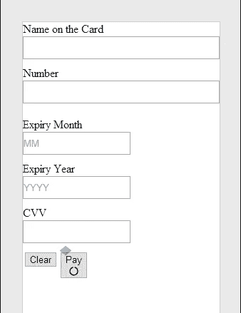**

****图 14 —移动支付表单****

**很神奇吧？太美了。它看起来像是由一个了不起的用户界面设计师制作的，他是获奖的设计师之一。我知道，我知道，我开玩笑的。看起来糟透了！但是，在你开始怀疑这是否有原因之前，答案是肯定的:**这是有原因的**！现在，让我们来看看在定义了适当主题的移动模块上使用它的情况:**

**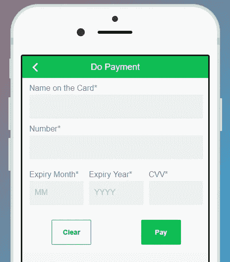**

****图 15 —具有合适主题的支付表单。****

**我可以打断你吗？在我们继续之前，如果蓝色背景立即告诉你这是 ***预览设备*** ，不要——我重复一遍——不要双击 home 键。我不对任何副作用负责。已经警告过你了。**

**所以，原因。我特意决定在表单上不使用任何样式，因为根据您想在哪里使用它，样式可能会有所不同。因此，AdyenPlugin 模块没有定义主题，所有使用的元素都是通用元素——除了 Columns2 小部件(来自 MobilePatterns 模块)之外，还有容器、标签、输入和按钮——因此，根据上下文，您可以拥有带有自己的 UI 定制的相同“生产者”模块。**

**关于 UI 上的字段，除了数据类型之外，我们没有应用任何特定的东西。姓名字段的最大长度为 26 个字符——根据我的研究，这似乎是一个常见的值，尽管[卡上允许的最大值约为 100 个字符](https://www.sis.se/api/document/preview/917987/)。显然，对于 VISA 和 Mastercard 来说，这一数值更低，分别为 21 和 22。总结一下，这个应该没问题。**

**然后是数字字段，这是一个数值字段。这是一件好事:在你的设备上，数字键盘会弹出。弊端？你需要采取额外的措施来避免用户输入超过 16 个数字——常见的 XXXX-XXXX-XXXX-XXXX——这些措施我们还没有到位。这个库已经对它做了一些验证，所以它可能有点多余。[还有，如果他们把信用卡号增加到 19 位数呢？](https://www.nccgroup.trust/us/about-us/newsroom-and-events/blog/2016/november/prepare-for-19-digit-credit-cards/)**

**最后，我们对截止日期和 CVV 字段应用同样的方法。然而有趣的是:我第二次用类似的表格付款时，用的是美国运通。我一生都有维萨卡和万事达卡，所以我一直期待一个 3 位数的 CVV 密码。剧情转折:美国运通有四个数字——它被称为 CID。不仅如此，卡号实际上还少了一个数字——只有 15 个——这最终意味着与签证的大小相同(15 + 4 对 16 + 3)。**

**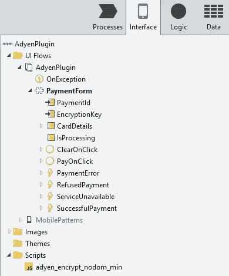**

****图 16 —移动插件剖析****

**好了，用户界面说够了。让我们进入加密和支付的“技术细节”。还记得客户端加密吗？由于我们不是 PCI 兼容的，我们不能存储信用卡数据。因此，我们需要令人敬畏的 Adyen 的 JavaScript 库。这里我们要做的第一件事是将这个脚本导入到我们的模块中。您可以通过转到界面选项卡并查找最后一个文件夹来实现这一点。然后，只需右键单击文件夹并选择导入脚本。**

**现在我们已经导入了我们的脚本，让我带您看一下插件的结构。通过查看图 16，您可以看到带有两个输入参数的 PaymentForm 块:PaymentId(它是预先创建的)和 EncryptionKey。此加密密钥由 Adyen 提供，可在您的客户区访问。除此之外，您可以指定库版本(图 17)。**重要提示:**这个插件使用 V0_1_20，因为 V0_1_21 正在抛出一个错误。它运行得很好，在错误被修复之前，我们将继续使用这个版本。**

**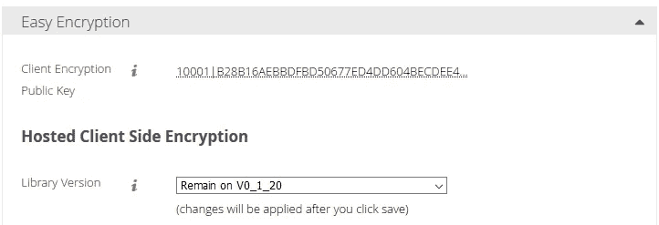**

****图 17 —客户端加密公钥****

**关于局部变量，我们有一个 CardDetails 记录，它存储来自表单的数据，然后我们有一个“非常普通”的 IsProcessing 变量来控制我们的 UI 更改。对于客户端动作，每个按钮都有一个，然后我们有几个事件:更准确地说是四个，每个事件都有特定的用途。虽然拒绝付款、成功付款和服务不可用事件可能不会带来任何问题，但您可能会想知道付款错误是什么意思，为什么会出现在那里？答案很简单。如果出于某种原因，其他三个事件都没有被引发，我们将引发 PaymentError，并从此开始采取措施。**

****

****图 18 —支付错误事件****

**让我们仔细看看我们的 PayOnClick 客户端动作——因为它是移动插件的核心。**

**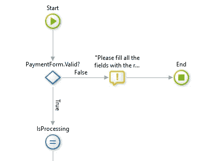**

****图 PayOnClick 操作的简单验证****

**在 PayOnClick 操作中，我们首先进行非常简单的验证——根据数据类型，表单是否已填充并有效——如果是，我们将把 IsProcessing 标志标记为 true。处理时，我们的用户界面将被禁用，以避免一些数据篡改和/或多个请求。**

**现在一切似乎都很好，我们将利用我们的 Adyen 库来验证数据。为了实现这一点，我们将使用一个 JavaScript 小部件来返回验证结果。从图 20 中，您可以看到整个流程以及库可能返回无效的字段:编号、到期日期和 CVC。**

****

****图 20 — Adyen 的库数据验证****

**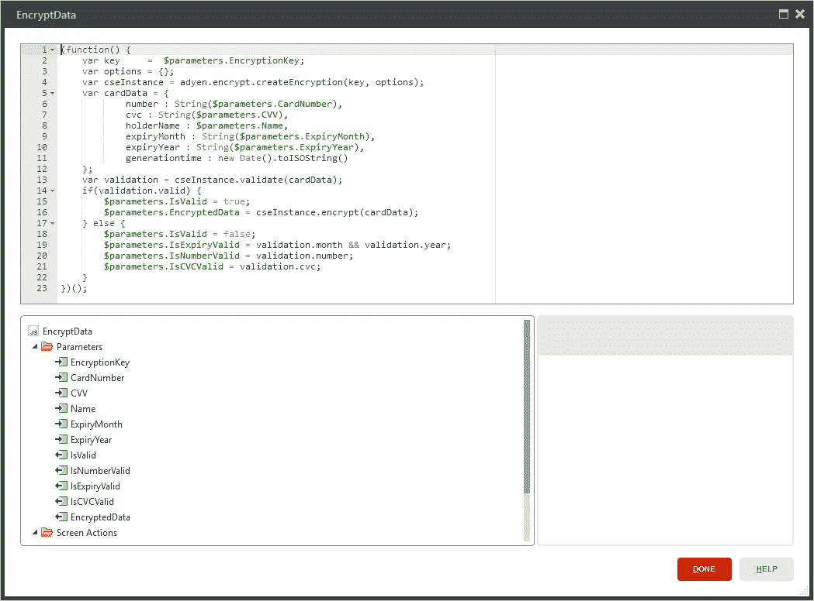**

****图 21 —加密数据 JavaScript****

**通过预检查后，我们用加密密钥和一组选项实例化我们的 Adyen 库。如您所见，没有定义选项，因为我们不需要它们。你可以在他们的 GitHub 项目上找到完整的选项列表。然后，我们通过使用小部件的输入参数(通过$parameters 别名)创建 cardData 对象。加载后，我们验证数据并处理结果。如果值是有效的，我们只需调用 validate 方法，就会返回一个字符串，如下所示:**

```
****adyenjs_0_1_20_1**$ERKC5mmDasXN+5YcQRaZsYGQkWra5rNlY7LQcnnkn3cT9MaKD6AvzlZD1Fwb394NVtx0nGQscR02OsbRbYqgzxvJC2dEj9z49VXaWzkpQ5RHtSP5MF4R2roRP6CH8Y4wVTxE6if207XdsomEajp1mug6ZDJVtisu6h6lC/UV1Zo+CS38YsSkFCdWXB3Y9ir/V3J4W1a4RoLjhqwLggPrZ6Ist+WCCpNirMIsLiqa6lY/XQhwd7tLqPwaMrOFSvjqQfN3RUw0Ihe2ahFBQmIHl+5NVFvHwybgIaekz5Bzjq/R3llsyotGsor/7oIEjjkbNAR+KGnJWdCNcYPTtQ2S1A==$yJXXA0GBGkqTIBH24vfZ45eluvLSeyByDCsDnW5FYQ/yQbTs65qQVSpPFKgsknSbdKlCa39LseepHdZBoSRM88RVKUxLzP8URiUKgB1wXIpdLm0qLAq+HuRhX1droyWcP7rQcnJSmQN91D1WitTUDvxzDL6rWYoO3AmiA3kjHV3Gni6SmvebOP48KJa0IdhHJqssxc+21guvRMHlt7itTQZUjgQQSyAK3WQ21C8j/fm6cMkPbjXClmH6CLG2py55kg5FunfSPrFQhReWtHBMC8SxfPf/ozE+KKHqeAuLJc4j+02Vud2aa6une3EHneKklO+/sfkNE2CFA0JfOJC+KwN/YXuBtrxRVL3wjtUYu54YwdSkzAA=**
```

**以粗体突出显示，您可以看到您正在使用的库版本——这非常重要，尤其是对于调试目的。还记得那个神话般的 **422 无法处理的实体**吗？是的，没错。所有——我真的是说，A-L-L——我出现这个错误的时候，**是加密数据的问题**。读懂你的心，你可能会想:“好吧，阿曼多，但我怎么知道呢？”。如果所有的问题都可以这么简单……好吧，事实上， **Adyen 提供了一个名为** [**API Exporer**](https://docs.adyen.com/api-explorer/#/Payment/v30/authorise) 的“游乐场”，你可以用它来验证你的调用。只需检索发送到端点的完整 JSON 不需要头——您将立即收到问题，如图 22 所示。**

**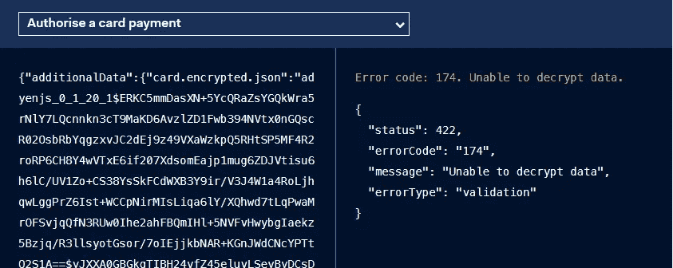**

****图 22 —你好 422，我的老朋友。****

**既然我们已经讨论了这个严重的错误，让我们继续讨论 PayOnClick 客户端操作的其余部分。在成功通过所有验证检查并获得加密数据之后，我们需要:a)获得更多的审计数据，b)构建我们的请求数据。图 23 显示了这是如何实现的。**

**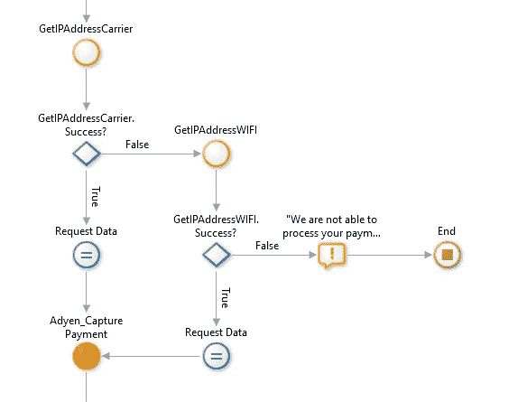**

****图 23 —准备请求****

**因此，为了检索更多的审计数据，**我们获得了分配给设备**的 IP 地址。这是使用一个扩展完成的——也是我构建的——叫做 [NetworkInterfacePlugin](https://www.outsystems.com/forge/component/2950/network-interface-plugin) 。顾名思义，这实现了*Cordova-plugin-network interface*原生插件。**不幸的是，这有一个警告**:如果你连接到一个 Wi-Fi 网络，GetIPAddressWIFI 客户端动作将返回你的内部 IP 地址——这是为了这个目的，但是，嗯……它可能会更好。如果我们无法获得任何 IP 地址(内部或外部)，我们会停止请求，因为 a)您没有连接到互联网，或者 b)您没有 Cordova。两者都是交易破坏者，所以…**

**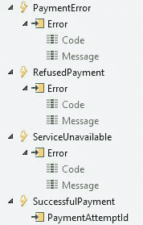**

****图 24 —事件的输出结构****

**现在，如果我们能够获得您的 IP 地址，我们就可以构建请求数据——包含您的 IP 地址和加密数据的记录——并调用 Adyen_CapturePayment 服务器操作。这是我们事先在核心服务(AdyenCore)模块中创建的操作。**

**根据 Adyen_CapturePayment 服务器操作的返回值，我们将触发一个特定的事件，并传递相应的参数。对于 SuccessfulPayment，Payment 将是 PaymentAttemptId —在这种情况下，用户想要做任何事情，而对于其他人，将是常见的错误结构。最后，我们重置 IsProcessing 变量的值，以便用户可以在需要时键入新的细节。**

****

****图 25 —安卓测试二维码****

****作为一个“赠品”**，我开发了一个示例手机应用程序，允许你授权和退款。如果你有安卓设备，可以使用图片上的二维码【用户名:**neo**；密码: **123！" #** ]。如果你有 iOS 设备，你可以:a) **付给我一杯免费啤酒**(非常重要)，我会把你的 UUID 添加到我的开发者账户，或者 b)使用下面的示例应用程序，自己发布/生成应用程序。**

**亲爱的读者们，这就结束了我们的移动插件部分和故事的这一部分。在下一章，我将讨论 web 实现，以及我们如何能够以一种安全的方式拥有一个好看的体验。**

**哦，我差点忘了。还记得我在本文开头购买并自豪地宣布的专业域名吗？嗯，你可以在这里看一下[(或者直接输入](https://armandogom.es) [https://armandogom.es](https://armandogom.es).) )。它还在建设阶段，但是你会发现更多关于我的信息，我到目前为止做了什么，我现在正在努力做什么。请随时联系我或通过 [hello@armandogom.es](mailto:hello@armandogom.es) ！这是我的荣幸——我真的很感谢你的努力，如果你一直读到最后的话——希望能很快再见到你！**

**保重。**

## **相关链接**

**AdyenCore 锻造部件:[https://www.outsystems.com/forge/Component_Overview.aspx?ProjectId=4015](https://www.outsystems.com/forge/Component_Overview.aspx?ProjectId=4015)**

**AdyenPlugin 伪造组件:[https://www.outsystems.com/forge/Component_Overview.aspx?ProjectId=4016](https://www.outsystems.com/forge/Component_Overview.aspx?ProjectId=4016)**

**AdyenPluginSampleApp 组件:[https://www.outsystems.com/forge/Component_Overview.aspx?ProjectId=4017](https://www.outsystems.com/forge/Component_Overview.aspx?ProjectId=4017)**