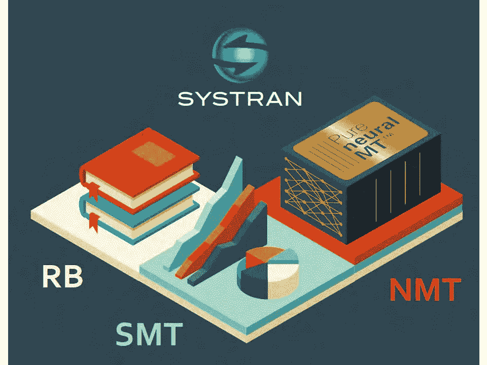
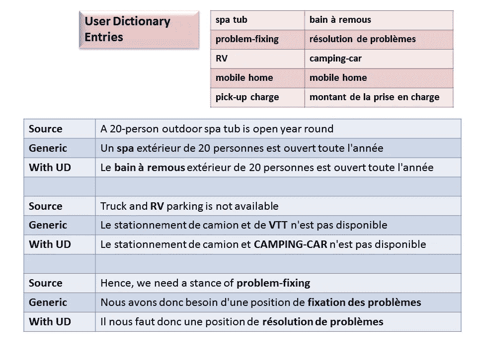
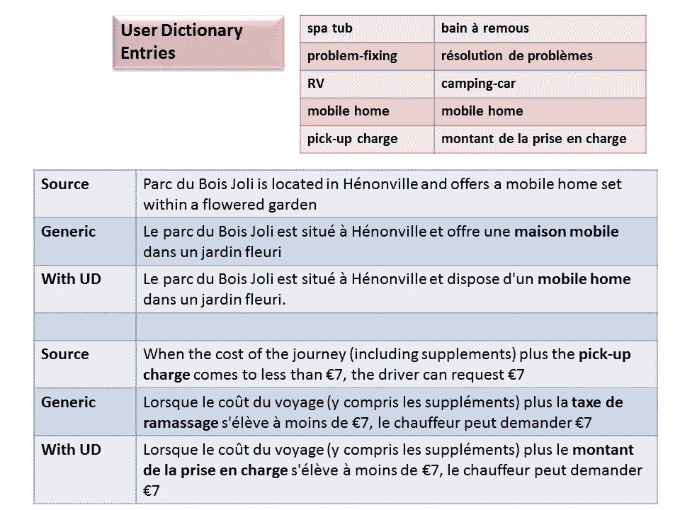
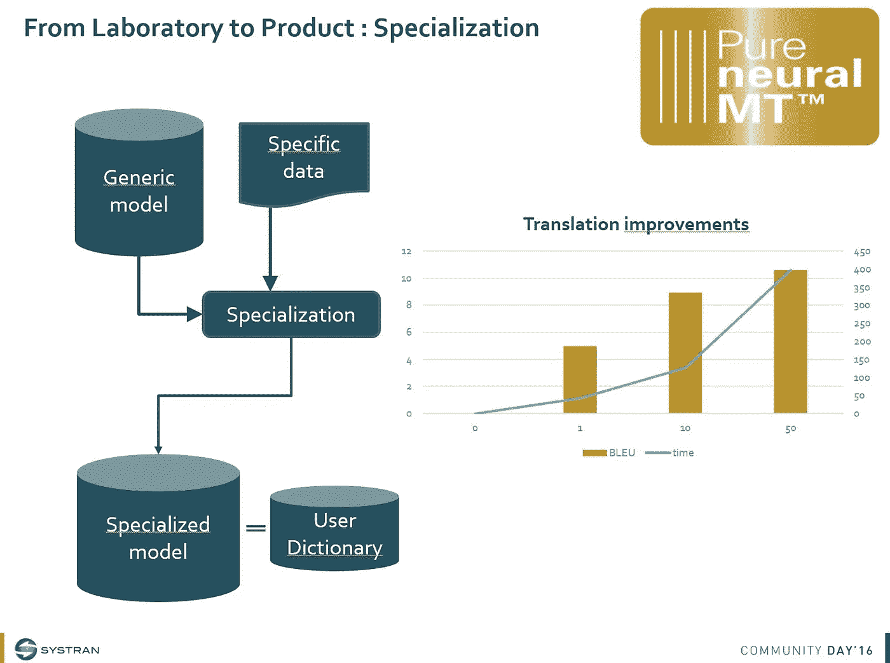
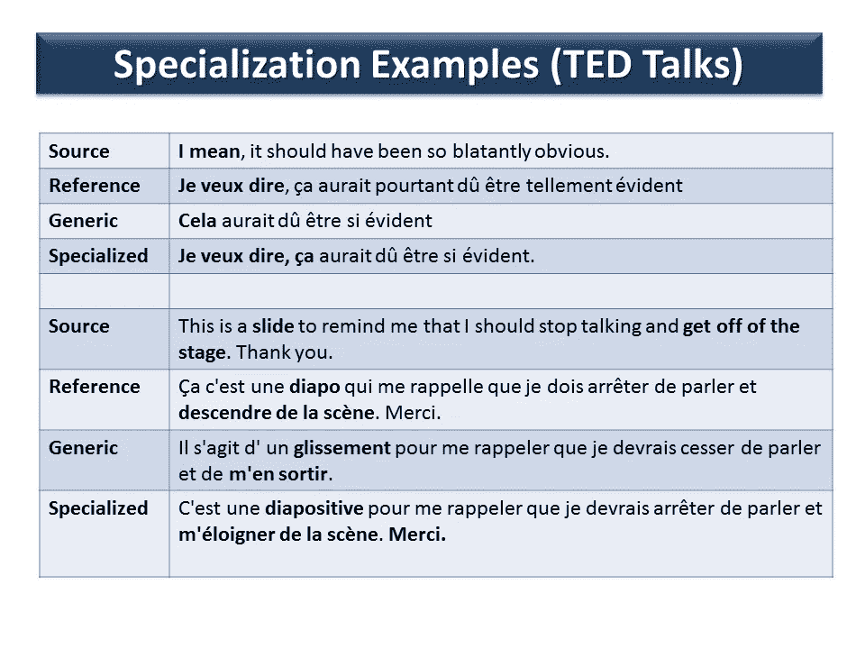
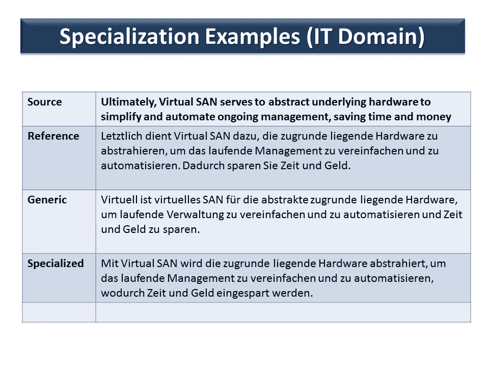
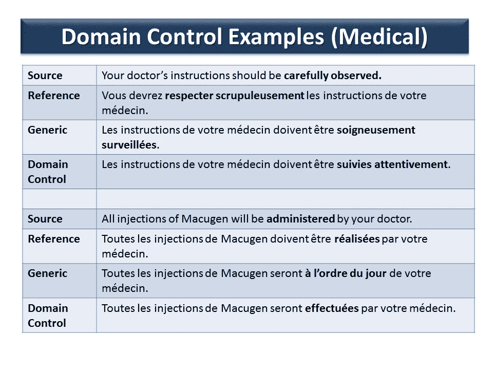
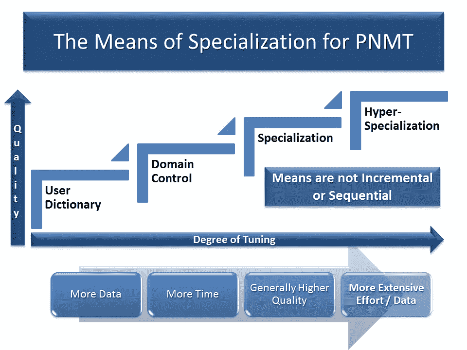

# 定制或“专门化”SYSTRAN 中的神经机器翻译

> 原文：<https://itnext.io/customization-or-specializing-neural-machine-translation-in-systran-261e67d7fb57?source=collection_archive---------8----------------------->

我们看到神经机器翻译(NMT)继续建立势头，并且大多数人已经同意通用 NMT 引擎优于通用基于短语的统计机器翻译(SMT)引擎。事实上，在最近的 DFKI 研究分析中，通用 NMT 甚至胜过许多领域调整的基于短语的 SMT 系统。谷歌和微软现在都为他们最常用的机器翻译语言建立了 NMT 基金会。然而，在专业使用机器翻译的情况下，机器翻译引擎需要为特定的业务目的进行非常仔细的调整和修改，PB-SMT 仍然是目前的首选模型。这花了很多年，但今天许多从业者更好地理解了 SMT 技术，有些人甚至知道如何使用各种可用的控制杆来调整 MT 引擎以满足他们的需求。今天，大多数定制的 PB-SMT 系统除了基本的翻译记忆库衍生的翻译模型之外，还涉及建立一系列模型，以解决自动化翻译过程的各个方面。因此，有些人可能还会添加语言模型来提高目标语言的流畅性，并添加重新排序模型来处理单词重新排序问题。因此，在交付最终的目标语言翻译之前，源句子可以通过解决不同语言挑战的这些子模型中的几个。2017 年 5 月，可以公平地说，企业环境中的大多数**生产 MT 系统**要么是 PB-SMT，要么是 RBMT 系统。

当今(在专业翻译界)对 NMT 的主要批评之一是，NMT 很难调整和适应商业客户的特定需求，这些客户希望他们的机器翻译系统输出更加精确和准确。人们普遍认为，困难基于三点:

1.  调整和定制 NMT 系统所花费的**时间**，
2.  隐藏层的**神秘性**使得很难确定什么可以修复特定种类的错误模式，
3.  除了实际的墙时间之外，所需的计算资源的绝对数量/成本。

然而，正如我在之前[所描述的，SYSTRAN 可能是唯一有资格解决这个问题的公司，因为他们是唯一一家在以下所有方法中拥有深厚专业知识的机器翻译技术开发商:RBMT、PB-SMT、混合 RBMT+SMT 以及现在的 Neural 机器翻译。深厚的专业知识意味着他们已经使用所有这些不同的方法开发出生产就绪型系统。因此，那里的团队可能会看到常规 SMT 和 RBMT 的人看不到或不理解的线索。我最近与他们的产品管理团队坐在一起，深入探讨他们将如何使客户能够调整和适应他们的纯神经机器翻译系统，他们提供了一个清晰的轮廓，说明了他们今天已经解决这个问题的几种方法，并描述了几个处于后期开发阶段的更复杂的方法，预计将在今年晚些时候发布。](https://kv-emptypages.blogspot.com/2016/09/comparing-neural-mt-smt-and-rbmt.html)

**业务使用环境对 NMT 定制的关键要求是能够快速、经济地调优系统，即使在大量域内数据不可用的情况下也是如此。**

当我们讨论这个问题时，使用正确的术语是有用的，因为混淆很少导致理解和有效的反应或行动。**我使用术语定制** *(在本博客的许多帖子中)* **作为一个宽泛的术语，指的是用于调整机器翻译系统**的调优过程，以达到特定的、通常有限的或集中的商业目的，我想他们称之为数学上的“局部最优”。请记住，在任何机器学习过程中，一切都与数据有关。我使用定制这个术语来表示一般的机器翻译系统优化过程，这可能是以下任何一种情况:你的数据+我的数据，我的所有数据，你的部分数据+我的数据，实际上，我自己使用定制这个术语时有很大的 SMT 偏见。

SYSTRAN 产品管理部门更喜欢使用术语**“专业化**”来表示任何可能执行不同功能，但都包括使 NMT 模型适应特定翻译环境(领域、行话、风格)的过程。从他们的角度来看，专业化这个术语更好地反映了 NMT 模型的培训方式，而不是定制，因为 NMT 模型获取新知识，而不是只在一个领域专门用于生产。对于一些人来说，这可能是一个细微的区别，但是对于那些长期以来一直在用数以千计的 NMT 模型进行实验的人来说，这是非常重要的。**训练过程及其对 NMT 的影响非常不同，我们应该在前进的过程中理解这一点。**

用户词典(UD)是与特定目标语言表达式相关联的一组源语言表达式，可选地与词性(POS)信息相关联。在其他系统中，这有时被称为术语表。用户词典用于确保特定翻译用于给定机器翻译系统中源句子的某些特定部分。此功能允许最终用户集成他们自己喜欢的关键术语术语。在 SYSTRAN 产品中，UDs 在历史上就已存在，并因其基于规则的系统而被广泛使用。SYSTRAN SMT 和混合(SPE——统计后期编辑)系统也实现了用户词典功能。SYSTRAN 在其产品中提供了四个级别的用户词典功能，如下所述:

*   **级别 1:基本模式匹配:**简单地将翻译源输入与精确的源词典条目进行匹配，并输出首选翻译目标字符串。
*   **第二级:第一级+同形异义词消歧:**有时，一个源词可能有不同的词性(POS)关联。根据其在翻译输入中的位置选择 2 级 UD 条目，然后提供正确的翻译。一个例子:
*   “铅”作为名词:黄金比**铅** > L'or est 加 lourd que le **plomb** 重
*   作为动词的“lead ”: He will**lead**the meeting>Il**dirigera**la reunion
*   **第三级:形态学:**来自 UD 词条的单个基本形式可以匹配同一词条的不同屈折形式，因此根据匹配的词性和语法类别，通过 UD 词条的目标形式的适当屈折来产生翻译。
*   **第 4 级:相关性:**这允许用户定义规则，根据其他条件匹配的条目来翻译匹配的条目。

截至 2017 年 4 月，只有 1 级用户词典功能可用于 PNMT 系统，但其他选项预计将在今年发布。从下面可以看出，即使是 1 级基本 UD 调谐功能，也会对 NMT 系统的输出质量产生影响。

机器翻译系统进行“领域专门化”的能力总是受制于领域内训练语料库的可用性。但是通常没有足够数量的正确的领域内语料库可用。在这种情况下，NMT 显然比 SMT 有很大的优势。事实上，NMT 系统可以利用通用数据和域内数据的混合。这是通过采用已经训练过的通用 NMT 引擎，并在可用的稀疏域内数据上对其进行“过度训练”来实现的。*(在某种程度上，这在 SMT 中也是可能的，但是一般来说，需要更多的数据来压倒现有的统计模式优势。)*

根据该团队的说法:“通过这种方式，有可能获得一个已经学习了该语言的一般(和通用)结构的系统，并且该系统还被调整以产生与特定领域相对应的内容。这种操作是可能的，因为我们可以无限迭代我们的神经网络的训练过程。这意味着专门化一个通用的神经系统只是继续一个通常的训练过程，但是是基于代表该领域的不同种类的训练数据。这种训练迭代在时间上比整个训练过程短得多，因为它是在更少量的数据上进行的。**专门化一个通用模型通常只需要几个小时，而第一次训练通用模型本身可能需要几个星期**。”

他们还指出，这种“过度训练”过程对于狭窄的领域和他们所谓的“超专业化”尤其有利。“专业化产生的质量实际上取决于域内数据的相关性。**当我们必须翻译非常严格的领域的内容时，例如打印机手册，我们称之为“超专业化”,因为只需要非常少量的数据就可以很好地代表该领域，而专业化的系统只适合这种严格的内容，但确实非常适合。**

对于那些想要了解数据量和训练迭代可能如何影响专业化产生的质量的人，SYSTRAN 向[提供了这篇研究论文](https://arxiv.org/pdf/1612.06141.pdf)，该论文详细描述了一些特定的实验，并表明使用更多的域内训练数据会产生更好的结果。

这是一个有趣的特性和用例，他们让我来处理特殊类型的语言问题。他们现有的调优能力被定位为能够被扩展以处理一些语言中的自动域识别和特殊风格以及礼貌级别问题。**域控制是一种允许开发单个训练和模型的方法，可用于处理多个域，下面给出一些例子。**在一些语言中，考虑到礼貌语境，同一来源的翻译可能不同，或者可能需要不同的风格。礼貌水平对于朝鲜语和日语(以及阿拉伯语)尤为重要。该功能是 SYSTRAN 为希望根据非常具体的用例要求调整系统的客户提供的众多控制手段之一。“为了解决这个问题，我们训练我们的模型，添加关于每个训练示例的礼貌上下文的元数据。然后，在运行时，翻译可以被“驱动”以基于上下文产生正式或非正式的翻译。目前，这种上下文是由用户手动设置的，但在不久的将来，我们可以想象包括一个礼貌分类器来自动设置这种信息。”他们指出，这也很有趣，因为相同的概念可以应用于领域适应。“事实上，我们将标注了不同领域(法律、IT、新闻、旅游等)的语料库用于神经网络训练。通过这种方式，该模型不仅受益于来自几个不同领域的大量训练示例，而且还学会了使其生成的翻译适应给定的上下文。同样，到目前为止，我们只在用户手动设置他/她想要翻译的领域时使用这种模型，但我们已经在集成自动领域检测，以便在运行时将这些信息提供给模型。因此，一个模型可以处理多个领域。”

就领域控制而言，训练数据标记是在训练语料库准备过程中采取的步骤。这些标签/元数据基本上是注释。它们表示多种信息，如礼貌，风格，领域，类别，任何可能有助于推动翻译向特定方向发展的信息。**因此，这种能力也可以用来处理你可能在亚马逊或易贝这样的电子商务网站上发现的多个域和内容类型。**

注释可以由人工/注释者生成，也可以通过使用 NLP 过程的自动化系统生成。然而，由于这是在培训准备期间进行的，SYSTRAN 客户通常不会这样做。然后，在运行时，模型需要为要翻译的源内容提供相同种类的注释，同样，该信息可以由用户操作(例如:用户选择一个域)或者由自动化系统(自动域检测)提供。

在本文中有一些关于域控制[的进一步技术描述。](https://arxiv.org/pdf/1612.06140.pdf)

下图将可用的适应方法放在上下文中，并显示这些不同的方法在投入的精力/时间方面如何不同，以及不同的策略可能对输出质量产生什么影响。同时使用多种方法也为整个适应方案增加了更多的权力和控制。这里显示的调优方法不是递增的，也不是顺序的。它们可以根据需要尽可能一起使用。对于那些一直在关注他们的[“MT 评估”研究的讨论的人来说，](https://kv-emptypages.blogspot.com/2017/01/the-trouble-with-competitive-mt-output.html)现在也许可以理解为什么基于即时 BLEU 快照的评估有些没有意义。像 Lilt 所做的那样，在没有正确使用调优工具的情况下，根据 BLEU 分数对机器翻译系统进行比较判断和排名，是误导性的，甚至是非常粗鲁的**。能够使其 MT 系统适应其特定需求和要求的客户总是会这样做，并且通常会使用他们所掌握的所有控制手段。**除了前面介绍的完全(我的所有数据+你的所有数据训练)定制之外，SYSTRAN 还提供了多种控件。我希望我们将很快收到客户和合作伙伴的来信，他们已经学会了操作和使用这些控制手段，并愿意分享他们的经验，以便我们的 MT 计划继续获得动力。

*原载于 2017 年 7 月 19 日*[*kv-emptypages.blogspot.com*](https://kv-emptypages.blogspot.com/2017/05/specializing-neural-machine-translation.html)*。*