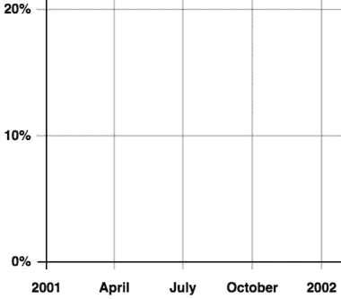
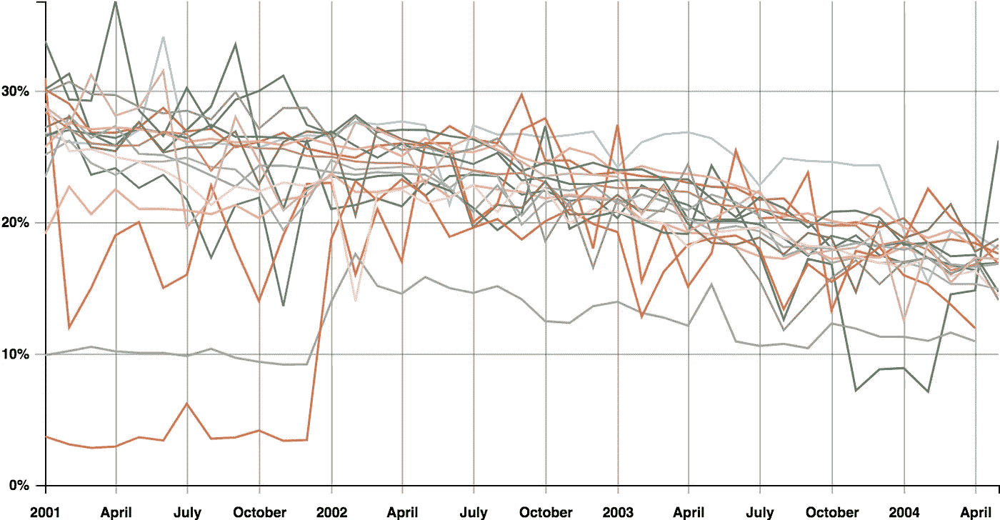
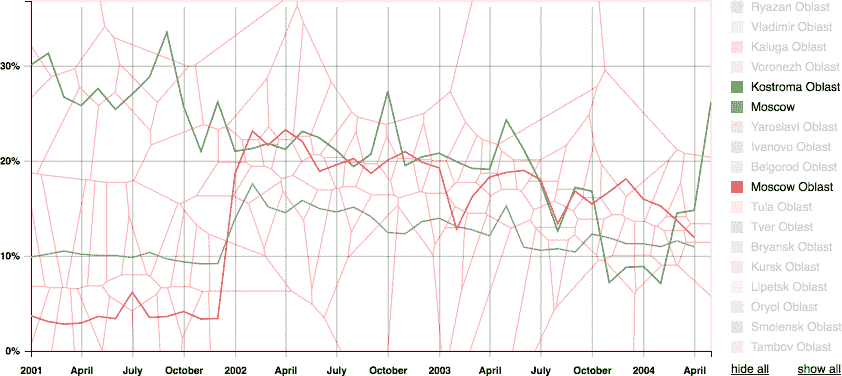
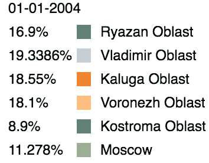
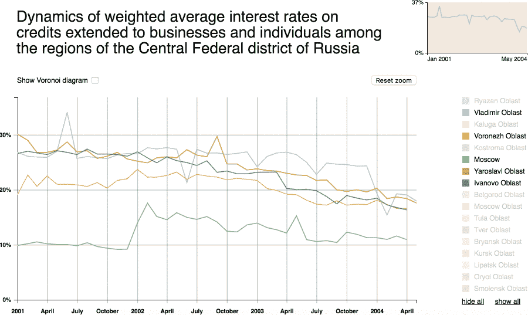

# 辉煌中的 D3.js

> 原文：<https://itnext.io/d3-js-in-all-its-glory-7066601aa16b?source=collection_archive---------2----------------------->

## 提高普通折线图交互性的一些技巧。

[*见这篇俄文文章(этастатьянарусском*🇷🇺*)。*](https://medium.com/factorymn/%D0%BF%D1%80%D0%B5%D0%B4%D1%81%D1%82%D0%B0%D0%B2%D0%BB%D0%B5%D0%BD%D0%B8%D0%B5-%D0%B1%D0%BE%D0%BB%D1%8C%D1%88%D0%BE%D0%B3%D0%BE-%D0%BE%D0%B1%D1%8A%D0%B5%D0%BC%D0%B0-%D0%B4%D0%B0%D0%BD%D0%BD%D1%8B%D1%85-%D0%B2-%D0%B2%D0%B8%D0%B4%D0%B5-%D0%BB%D0%B8%D0%BD%D0%B5%D0%B9%D0%BD%D1%8B%D1%85-%D0%B3%D1%80%D0%B0%D1%84%D0%B8%D0%BA%D0%BE%D0%B2-%D1%81-d3-js-61ebfa5909dc)

在本文中，我们将考虑几种技术，如何使用用于数据可视化的 JavaScript 库 [D3.js](https://d3js.org/) 使普通的折线图更具信息性和交互性。

我们将从俄罗斯开放数据中心获取原始数据，并可视化俄罗斯中央联邦区各地区企业和个人信贷的加权平均利率动态。

我将尝试对代码中最重要的部分进行评论。但是，对于一个不熟悉本库基本概念的人来说(比如[选择](https://github.com/d3/d3-selection)、[缩放](https://github.com/d3/d3-scale)、[变换](https://github.com/trinary/d3-transform)、[缩放](https://github.com/d3/d3-zoom)、[更新图案](https://bl.ocks.org/cmgiven/32d4c53f19aea6e528faf10bfe4f3da9))，很多事情可能看起来并不明显。我们将使用 D3.js 库的最后第五个版本，并使用现代 ES6 语法编写代码。如果您需要将代码的某些部分转移到您自己的项目中，在不支持任何 ES6 特性的环境中工作，不要忘记使用代码转换器。

开始之前，让我们看一下初始数据的结构:


csv 文件中的行是:地区 ID ( `regionId`)、地区名称(`regionName`)、日期(`date`)和利率(`percent`)。

# 画图表。

我们使用`d3.csv`方法加载数据文件，该方法获取源 url 作为参数并返回一个承诺。文件加载后，将运行`draw`功能。

让我们考虑一下`draw`函数本身。首先，定义一些常量(`margins`、`width`、`height`)和我们需要的三个刻度——X 轴和 Y 轴的刻度以及我们将用来设置图表颜色的色标。然后，我们将在`svg`变量中存储一个元素，该元素是我们可视化的其他元素的容器。

更新源数据数组中每个元素的`date`和`percent`属性，分别将它们的值从字符串转换为日期对象和从字符串转换为数字。

之后，我们可以为我们的规模设置域。



定义 X 轴和 Y 轴，并将它们添加到页面中。

注意，我们已经将`tickSize`设置为 X 轴等于图形的宽度，Y 轴等于高度。因此，我们在图形区域有网格。

现在我们可以在图表上画线了。在对原始数据集进行一些操作后，我们得到一个对象(存储在`regions`变量中),其形式为:键——区域 id，值——适当区域的数据数组。我们使用区域 id 数组进行数据绑定。因此，我们可以这样设置`d`属性的值:

```
.attr('d', regionId => lineGenerator(regions[regionId]))
```

现在，当[图表建立](https://codepen.io/levvsha/pen/NwMxNr)时，我们可以看到我们的问题。有许多行，它们相互重叠，所以用户很难从这些混乱的行中获得任何有用的信息。



在本文的以下部分中，我们将尝试为用户增加最大的机会来解决这个问题，并使图表具有交互性。我们首先添加的是图例。没有它，图表就没有意义。

下面的部分将有这样的结构:在开始，我将把链接放在我们在先前的特性完成之后的代码和我们在当前的特性实现之后的代码之间的差异上。之后，我们将回顾更改/添加的代码的关键片段，最后，您可以启动内置的演示程序，看看它是如何工作的。

## 添加图例并能够控制线的可见性

[*更改了代码*](https://github.com/levvsha/d3-in-all-its-glory-en/commit/b349e66a1201c95140e41b3b444c9e243f2f3ff8?diff=split)

除了图例，我们还将实现一个功能，通过单击适当的图例项来控制图表线条的可见性。

我们将区域名称保存为值，区域 id 保存为`regionNamesById`变量中的键。

我们将改变先前存储在`regions`变量中的对象的结构，现在我们不仅存储某个区域的数据数组(`data`属性)，还存储该区域的直线在图表上的可见性状态(`enabled`属性)。

在图形的右侧，我们显示了区域列表及其对应的线条颜色。在图例元素上添加点击事件监听器(`clickLegendRectHandler`功能)。

在这里，我们将更改该区域的`enabled`属性的值。然后重新运行渲染图形的功能`redrawChart`:

通过过滤区域的 id 数组，我们将只得到启用了可见性的区域。

筛选的数组用于数据绑定。因为图形将被重绘，所以在添加新的 DOM 节点之前，您应该记住删除旧的 DOM 节点:`paths.exit().remove()`。运行下面的代码笔演示，看看它是如何工作的。

如您所见，我们还添加了链接“全部隐藏”和“全部显示”(参见字符串 143 的源代码)。这个图形对用户来说已经变得更加友好了。我们可以隐藏所有的线条，选择我们感兴趣的区域。但是让我们想想我们还能如何改善用户与图表的交互。

对于当前的实现，用户要改变他感兴趣的行的可见性有点困难。他应该在图例中的区域名称中用适当的颜色直观地找到该项目。

在这种情况下，我们能做些什么来帮助用户吗？答案是肯定的。D3.js 对此有一个特殊的布局。

## 添加 Voronoi 图

[*修改代码*](https://github.com/levvsha/d3-in-all-its-glory-en/commit/f9dbae0876f9715ba6273072f6f3ba06ca65fd94?diff=split)

> 一组“点”(点)的 Voronoi 图是划分平面的区域的集合。每个区域对应于其中一个站点，并且一个区域中的所有点都比任何其他站点更靠近相应的站点。



我在这一节的开头添加了一个工作示例的链接，这样您就可以先了解它是如何工作的，然后再关注实现细节。运行以下示例，激活“显示 Voronoi”复选框，并尝试通过单击图例项或单击图形区域来更改某些区域的线条可见性。

现在，只要鼠标光标在图形区域上，我们就可以将当前光标位置与图表上最近的数据点相关联，并激活一条线(增加粗细)。看例子。如您所见，这极大地简化了图表线的选择。单击后，我们隐藏除活动行之外的所有其他行(再次单击会返回到之前的状态)。

库的创建者为我们实现了整个复杂的数学算法。我们只需要定义函数来计算 X 和 Y 位置，并将应该发生分区的区域的左上角和右下角的坐标传递给适当的方法。将作为添加多边形容器的元素保存到`voronoiGroup`变量。我们将通过切换`voronoi-show`类来控制多边形边界的可见性。

现在我们可以调用`voronoi.polygons`方法，将初始数据作为第一个参数传递。这个调用返回一个绘制多边形的坐标数组。

我们将在`mouseover`事件处理程序中添加`region-hover`类(增加线条粗细)并在`mouseout`事件处理程序中移除它。在`click`事件处理程序中，我们将隐藏除当前行之外的所有行，或者将图表返回到之前的状态。

实现的特性告诉我们如何改进图表。现在，当我们在图表区域上移动时有一个活动的数据点，为什么我们不在图例附近显示每个区域的利率值呢？

现在，用户只能在心里画一条垂直于 Y 轴的线来确定近似值。

## 将鼠标悬停在图表区域上时显示值。

[*更改了代码*](https://github.com/levvsha/d3-in-all-its-glory-en/commit/ba98a0b2caee0fd2378ce4148318ccfa723e4605)



向每个图例项追加文本元素。我们将在这里显示一个适当的地区利率值。日-月-年格式的相应日期将显示在该列表上方(`legendsDate`)。

填写`percentsByDate`变量，这样我们可以通过以下方式获得给定地区特定日期的利率值:

```
percentsByDate[/* date */][/* region ID */]
```

我们将在每次光标穿过 Voronoi 图段时更新这些值。

这里，我们将为显示当前在活动行上高亮显示的日期的点设置偏移量(变量`hoverDot`中的元素)。运行下面的例子，看看结果。

增加图形交互性的下一项技术是缩放图形的能力。考虑到我们现有的数据密度，这将非常有用。

## 增加缩放图表的能力。

[*更改了代码*](https://github.com/levvsha/d3-in-all-its-glory-en/commit/3bcc6b5d1aa65db85557c660f368e71e45d17f34?diff=split)

D3.js 的另一个显著特性是缩放特定区域的能力(`[d3.zoom](https://github.com/d3/d3-zoom)`)，它只需要几行代码。

为了创建缩放行为，我们应该指定最小和最大允许的缩放因子(`scaleExtent`)，限制翻译区域(`translateExtent`，并附加`start`和`zoom`事件监听器。

我们将使用`[clipPath](http://tutorials.jenkov.com/svg/clip-path.html)` [来裁剪由于缩放](http://tutorials.jenkov.com/svg/clip-path.html)而位于图表区域之外的元素。

在`zoom`事件处理程序的函数中，使用事件对象`d3.event.transform`的参数，我们获得坐标轴刻度的新值(`rescaledX`和`rescaledY`)，并使用它们来更新坐标轴上的刻度和绘制图形的刻度线。

我们使用线生成器的`rescaledX`和`rescaledY`值，并且在 Voronoi 多边形的`mouseover`事件处理程序中设置指针点的偏移量。

我们还将添加一个“重置缩放”按钮，以便用户可以通过单击将图形恢复到初始状态。

在最后一步，让我们修复一个小缺陷，它是由图形的缩放比例引起的。缩放后，用户并不十分了解比例放大了多少，隐藏在缩放部分后面的区域有多大，以及图表在超出缩放部分后的表现如何。

## 添加图表预览

[*改变了代号*](https://github.com/levvsha/d3-in-all-its-glory-en/commit/e9195cc192ff02c26e55b12f55ab3d4aa247eebf?diff=split)

以 gif 开始这一部分，展示它是如何工作的:



图形的预览区域将比区域本身小四倍。将该值保存在一个`ratio`变量中。

定义在预览中生成图形线条的比例和功能。

实际上，预览将由一行(我们将只显示一行，最后活动的行)和两个`rect`元素组成:一个静态背景和一个缩放时将改变其大小的元素(存储在变量`draggedNode`中)。我们还将实现用鼠标使用 [d3 拖动行为](https://github.com/d3/d3-drag)来移动这个元素的能力。

在`dragged`函数中，我们将更新被拖动元素本身的`x`和`y`属性的值，并以编程方式为缩放的图表区域设置转换值。

在`zoom`事件处理函数中，我们将计算并更新`draggedNode`元素的`x`、`y`、`width`和`height`属性，以确保该元素覆盖预览中的适当区域。

绘制活动行的预览在`redrawChart`和`voronoiMouseover`函数中(分别参见第 328 行和第 405 行的代码)。

最后，是最后一个演示，包括我们在本文中所做的一切:

完美是不可企及的，我们可以想出几个其他的方法来改善这种形象化。例如，使用 [d3-brush](https://github.com/d3/d3-brush) ，我们可以实现[选择图形的任意区域，随后进行缩放](https://bl.ocks.org/mbostock/f48fcdb929a620ed97877e4678ab15e6)。但是，我们在本文中实现的内容足以看出该库的功能有多广泛。感谢许多基于 D3.js 的库(如 [C3.js](http://c3js.org/) 、[symbol signal](https://emeeks.github.io/semiotic/)、 [Billboard.js](https://naver.github.io/billboard.js/) )，它们简化了创建配置对象定义的可视化任务，我仍然是“纯 D3.js”的信徒。我确信，这是那些具有长期支持和开发的潜在高概率的项目取得成功的最可靠的方式。