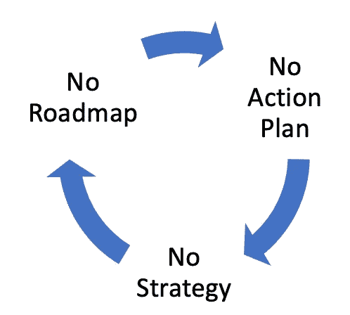

# 以数据为中心的思维:pt2

> 原文：<https://itnext.io/data-centric-thinking-pt2-78f084c36823?source=collection_archive---------3----------------------->

创建战略和构建路线图:第二部分

长期战略=路线图

# 数据、战略和路线图—续

在[第一部分](/data-centric-thinking-1aa1e44cc7ec)中，我们的目标是从架构基础开始，从这些基础开始，我认为收集以下要点很重要:

*   尽早采用以数据为中心的思维模式是关键
*   数据架构不是数据策略
*   任何数据策略都应该考虑整体系统思维
*   现代数据架构应该充分利用云的潜力

> 如果你还没有这样做，我建议在继续之前通读一下[第一部分](/data-centric-thinking-1aa1e44cc7ec)，因为它提供了相关的背景

在第二部分中，我们的目标是详细阐述战略定义以及在制定战略路线图时必须考虑的事项:

*   数据策略解决方案
*   匹配组织的交付能力
*   评估数据成熟度在制定策略中的作用
*   思维不同=采用不同

商标和版权 20 世纪福克斯电影公司

# 它以数据开始和结束

想想你生命中的一天:

*   走哪条路最好？
*   会有坏天气吗？
*   如何投资我的钱？
*   我的健康状况如何？

想想你能做得更好的所有日常决策，只要你能访问正确的数据并从中理解正确的信息。

目前，数据代表了我们生活的各个方面，我们所做的许多事情已经以纯数字格式存在:

*   我们给朋友和家人拍照并贴标签
*   社交电子互动
*   饮食习惯:例如:通过应用程序将食物送到我们家
*   知道你购物时间表的 IOT 冰箱
*   智能电表知道你有多喜欢你的家

有趣的是，**你的浴室秤**与你的智能手环配对，**比你的医生更了解你的健康习惯。但是令人震惊的是，你的银行或信用卡公司比你意识到的更了解健康，因为他们已经正确地收集和处理了顾客的信息。撇开防止滥用的隐私法不谈，事实是数据一直在产生，并以令人难以置信的速度增长，是一种非常宝贵的资产。**

# (数据)策略解决方案

正如在[第一部分](/data-centric-thinking-1aa1e44cc7ec)中所看到的，商业战略是关于你如何**计划和执行在**早期设定的目标。它们会以同样的方式流动:从需求到要求，通过讨论和计划形成一致同意的计划，最后向下流动到采取的行动。

这些都很好，但是必须考虑的这些需求是什么呢？这些**需求是**当前状态**和**未来状态**(设定的目标)之间的差距**。也就是说，需求将包括以下任何或多个因素:

*   组织使命
*   (非数据)战略和目标
*   组织结构
*   绩效指标
*   业务流程
*   其他业务需求

在哪里，上述需求与数据架构或解决方案架构相一致？

对于一个架构师来说，**业务需求与架构愿景不一致，**偏离了目标，尤其是当它们没有被正确理解的时候:**从需求中，我们需要提取有效的需求**(稍后将详细介绍)。

这个需求收集阶段是战略规划**可以开始**起草的阶段:

在 [TOGAF](https://www.opengroup.org/togaf) 中，这被称为初步阶段，在此阶段，理解业务战略及其驱动因素和有效功能，并且它将融入架构愿景，该愿景将确定需要构建什么来支持该愿景。在流程的早期，数据应在业务战略定义中发挥重要作用，因为它将决定重要性并关注**ITC 结构应支持数据需求**的内容和方式。

# 战略制胜

如前所述，这些文章反映了我自己对广泛话题的看法、理解和观点，这些话题也涵盖了我无法提供广泛专业知识的商业领域。尽管如此，我通过每天在他们中间工作，并与受他们驱使和负责的人一起工作，积累了大量的“现场经验”。

我主要指的是对所有者和利益相关者如何看待战略、他们对价值创造的思考以及他们如何衡量价值的理解。考虑到这一点，我们可以从解决方案架构领域推断出一些策略要点。

在没有任何背景的情况下，尝试并承担完整的“业务数据需求分析”过程总是很困难的(例如:清楚了解组织对数据的主要目的是什么？是提供**分析**还是**报告**？主要是为了**合规**还是**客户洞察**？)

我们需要认识到数据的组织竞争优势，并在计划时牢记这一点:

*   将所有价值流与人员、流程、数据和技术结合在一起，解决方案体系结构将这一愿景塑造成自己的体系结构路线图
*   在路线图中概述可实现的实施计划，包括时间表、里程碑和工作量估计(例如:甘特图)
*   培养思维方式的转变:成为事实上的数据驱动型组织
*   将数据视为产品(数据集=产品)

数据战略必须以业务为中心，技术(IT)路线图(基础架构、技术堆栈、API 等)需要支持企业的数据战略愿景。

数据战略还必须符合组织的业务战略和运营模式。随着市场越来越受数据驱动，以数据为中心的业务战略势在必行。

# 数据架构

架构在成功的数据战略中发挥着巨大的作用，但它主要归结于**业务领域找出他们查看和使用数据的方式的长期目标**。

> 规划可靠的数据架构对于帮助企业定义可实现的目标至关重要

你如何精心设计一个数据架构来推动数据战略议程，以响应**的业务需求**，实现价值并实现目标？

# 数据架构不是一种策略，而是推动它

让我稍微转换一下思路，看看我们如何利用最前沿的数据创建解决方案，举一个常见的实际例子:

我们认为，对于任何数据策略，您都应该从了解业务需求开始，并与业务部门一起列出未来解决方案的要求。

让我们从一个**直接业务需求**的例子开始:整个技术领域的“更快地向分析师交付数据和格式标准化”:

公平地说，建立完整的需求列表将非常耗时，并且很难分解为更小的可实现的目标，这些目标从长远来看仍然有意义。

从以数据为中心的角度来看，如果需要“提高性能**和**标准化”，您可能希望将其理解为“减少手动数据干预”的单一需求，因此，如果您同时满足这两种需求，**自动化绝对应该是您的数据架构的重点部分。**

如果你把这个**进一步**并得到**所涉及的业务流程**(人员、用户采用、变更管理、新工具培训等)，自动化**从数据的技术流程**发展而来，**成为你的数据策略**的一部分。如何？一旦“数据管道自动化”不仅仅被纳入技术流程，它将成为数据目标和愿景的一部分，也将成为向用户交付数据的整体业务战略的一部分。

回到手头的例子，我们如何假设从这里开始？

与任何其他解决方案思维一样，实现流程自动化的一个好方法是总是尝试并正确地识别我们试图首先解决的任何问题，并定义明确的结果(总是注意:**如果它不能被度量，它就不能被管理**)。

*   识别手动流程(手动数据操作、手动数据传输)
*   确定不可持续的流程(在所使用的技术堆栈中过时，不符合整体愿景，或者已经报废
*   确定数据中有缺口或数据不准确的流程
*   收集业务分析师关于哪些流程更痛苦的意见(在时间、资源、成本、人员配备等方面)。)这样就可以准确地量化和限定需求

之后，我们将能够形成可以实施来修复上述问题的解决方案，作为“修复计划”的一部分(还不是战略，甚至不是架构解决方案，但正在向它发展)，其中:

*   完全理解所有需要的**业务流程改进**(例如:避免手动干预或审计与数据交互的流程)
*   数据架构开发被定义为提高**数据质量** y 和**系统集成**(参见整体方法)
*   从以应用为中心转变为以数据为中心的**文化的战略解决方案**(让人们关注数据作为一种资产，作为数据战略的一部分)
*   全面的解决方案，因为它反映了对所有系统和流程(包括业务流程)的整体方法
*   **人员直接参与**:组织结构必须是任何技术实现、变更和采用的不可分割的一部分
*   **考虑了数据管理实践**(基础和技术)
*   **数据是确定性的**:只有有用和准确的数据才应该被保留并驱动决策
*   技术(工程和架构)是基于现实的，并且能够**匹配组织的交付能力**
*   一个**治理层**，业务、IT 和数据团队都在其中(架构师、数据建模师、开发人员、分析师、管理者等)

我的总体意图是使用上面陈述的仅仅作为一个例子，但是如果你已经记住了所有这些要点(当考虑你的数据架构的解决方案时)，你将意识到它广泛地覆盖了许多必须要做的事情。

> 最困难的部分实际上是让所有的齿轮同步运转，因为这是一个高度复杂的过程，不仅仅是关于数据

然后，所有这一切开始整合为一个计划(在早期阶段主要是一个愿望清单)，并且可以成为数据战略的一部分，同时也符合:

*   商业策略
*   信息技术战略

> 数据策略涉及整个业务:数据架构不是策略，而是支持策略，并由策略支持

# 从战略到行动的规划

我已经确定，如果不了解需求和当前情况，我们无法从业务需求直接进入路线图(或任何需要行动计划来执行路线图的解决方案)，例如:

*   组织准备就绪
*   业务流程
*   数据管理实践
*   数据资产
*   技术资产
*   促成因素

例如:你可以使用最好的云原生技术栈，但仍然会失败，因为你不仅不知道你在做什么，不知道你想要构建什么，而且你还会在错误的时间(技术成熟阶段)构建错误的东西。

在初始阶段，由于**企业没有一个真正的计划来满足他们的需求**，数据战略讨论没有很好地展开。因此，如果你没有一个组织的其他成员能够理解和瞄准的战略，你就无法计划如何实现它。这可能是一个恶性循环:

一个错误的循环

# 路线图到底是什么？奇怪的例子

为了帮助理解这些定义，让我举一个非技术性的日常例子:

你觉得饿了，想做点什么。饥饿造就了**需要**吃一些食物。你也早些时候定义了你的食物**策略**，总是吃得健康，总是按时吃饭。你开始想到**计划**去养活。一个可能的**解决方案**是在附近一家**可能适合**你**需求**的餐厅吃午饭。你对食物的**需求**还没有完全确定，但是你的**策略**与你的健康饮食营养学家达成一致，已经预先**确定了**你将不得不去一家太远走不动的餐馆。那么这里的路线图是什么呢？

行动计划(**路线图** ) **不是**去餐馆吃饭，而是**你如何去那里，以及你如何准时到达那里**来制定你的用餐策略**。**

只做一次是不可持续的，你必须每次都做，以达到你的目标，达到你的战略设定的标准。然后你需要一个可持续的架构解决方案(汽车、出租车、公交车)来支持你的**战略目标和愿景**(健康饮食)，所以你的**路线图**必须包括执行的方法，以及何时执行战略的时间表。

# 剖析以数据为中心的计划:产品思维

那么，架构师应该如何帮助企业实现以数据为中心的愿景，并根据战略制定行动计划呢？

在我看来，任何旨在成功塑造成有意义的路线图的**战略**(计划)**，都应该是:**

*   简单(分成足够小的目标)
*   易于解释(沟通不能成为障碍)
*   易于在多个项目中采用(足够灵活，可重用)
*   清晰可辨(在更广泛的组织战略中可见)

对于一个仍然停留在纸面上的“零里程”的商业想法，上述内容更容易概念化。事实是，在现实中，大多数需要计划的组织已经增长(很可能是以一种非结构化和有机的方式)超过了他们的能力:这就是为什么他们**需要一个清晰的数据策略。**

只有拥有数据战略路线图，企业才能真正实现与他们正在制造的产品一致的目标(如盈利能力和增长)。

> 数据不再仅仅是一种资产，而是一种产品，这不应该是一个惊喜；所以把它当成一个。

商标和版权 20 世纪福克斯电影公司

# 产品、业务战略和数据成熟度

在以数据为中心的思想中，数据必须被视为产品:这意味着**数据需求应该在计划定义过程的早期被清楚地理解**，因为产品愿景很大程度上设定了你的用例的边界。

为什么这个产品愿景很重要？我们需要理解数据的直接价值，以便以与业务部门相同的方式看待数据需求。

合乎逻辑的下一步是**评估企业中其他人如何看待数据**。

创建基线:良好的第一步是确定组织的数据成熟度级别。从以数据为中心的角度来看，我们总是需要围绕企业的数据目标向其询问其他成熟度状态问题:

> “我们是以数据为中心，还是仍然以应用为中心？”
> 
> “我们离数据目标还有多远？”
> 
> "数据文化:我们有数据文化吗？"

然后，我们应该将答案转化为**当前架构状态**,在同一路线图下汇集一个清晰的起点计划，用于:

*   数据
*   技术
*   处理
*   采用
*   管理
*   执行能力
*   技术债务
*   知识差距

答案是调整更广泛的**数据架构基础**和框架，既适应当前的成熟度状态，又将业务推向未来(前面解释的目标和愿景概念)。

在数据战略概念中，**数据架构应包括更广泛的框架和解决方案**，例如:MDM(主数据管理)允许将所有数据链接到单个参考点，或将更智能的元数据管理(数据标识符和描述符)纳入治理模型，甚至采用 DataMesh 或 DataFabric 域模型。

**架构师将负责决定每个场景的最佳解决方案**，只要每个决定将数据环境带到数据战略需要的**。**

**数据架构**必须反映*当前*数据成熟度状态，并将我们带到*期望的*状态**。只有这样，它才能支持数据策略实施，这也应该是您的路线图的起点。**

**随着时间的推移，您将尝试实施的任何策略都应该旨在对初始状态进行改进，并且在基于 cadence 的过程改进框架(例如:敏捷)的每次迭代中循环重复。**

****

**起跑线应该是你当前的状态**

# **定义一个可实现的计划**

**定义可实现的数据计划定义(战略)和行动计划(路线图)需要时间和知识，不仅从治理方面，而且从知识和技术能力角度来看:**

**只有可实现的计划才是好的。否则，它就是一颗滴答作响的定时炸弹，直到它严重阻碍了企业向其目标发展的能力，甚至是对当前需求做出良好响应的能力。**

**它还将反映知识能力:随着技术领域的不断发展，交付商定的行动计划的能力高度依赖于内部技能库和当前的就业市场。**

**当定义架构里程碑和任务时，请始终**记住您在数据成熟度评估期间评估的执行能力**和知识，并与业务一起计划以填补任何缺口，并将数据的业务需求与架构解决方案需求融合。**

****

**构建您自己的地图，但每个人都可以使用**

# **从战略到路线图**

**那么到目前为止我们学到了什么？实际上，概念性的“数据战略路线图”将有助于建立:**

*   **领导和规划(以可预测和可实现的方式将业务目标与产品思维结合起来)**
*   **项目开发和执行(向企业交付价值并改进流程和技术)**
*   **文化准备(转向以数据为中心或至少面向数据的文化)**

**为了从战略走向实施，我们需要设想一个前进的路线图:**

*   **从可实现的和现实的计划开始**
*   **定义坚实的长期愿景和实施**里程碑****
*   **用具体、短期的成功项目(唾手可得的成果)来建立势头**
*   **成长为更加雄心勃勃的目标，使业务愿景和架构愿景保持一致**

**实现上述目标的最佳方式之一是采用一种方法或框架，该方法或框架允许:**

> **先爬，再走，再跑。**

*   ****爬行:**识别那些容易摘到的果实，这些果实允许早期学习，同时仍然交付可衡量的价值**
*   ****行走:**通过创建可重复(和可重用)的流程，建立基础数据管理实践和标准化方法**
*   ****运行:**实现持续改进和成熟的数据管理实践**

**实际上，这应该转化为类似于:**

*   **推动类似试点的项目(技术高峰、原型),从而产生可以不断改进的 MVP(最小可行产品)**
*   **构建对数据管理流程的支持(例如:变更管理活动，这也是业务流程的一部分)**
*   **使企业能够开始理解并使用**数据作为资产**(致力于沟通数据战略并促进采用)**

**您还可以开展其他计划，将数据战略付诸实施并纳入行动计划(路线图),从而在完善基础组件的同时实现产品创新发展。这种思想已经是软件开发中大多数策略的核心，不仅仅是在数据工程中。**

****

**提前规划您的数据策略**

# **业务需求和数据需求:一个爱情故事**

**总结“数据第一”思维模式下的数据战略，回顾所有架构参与者的关键要点，这些参与者参与制定符合以数据为中心概念的数据战略:**

*   **首先确定业务需求(使愿景和意图与架构基础保持一致)**
*   **尽早定义完成和成功标准，以指导学习和改进过程:通过定义明确的结果来衡量进展(**如果无法衡量，就无法管理**)。**
*   **制定解决方案，使**能够弥合基础差距**和**能够解决具体需求****
*   **在业务战略/企业战略中为数据制定路线图和计划:**

**始终考虑故事的两个方面:流程导向和技术导向，平衡创新和运营改进；**

*   **创新:发现新产品和创造机会**
*   **运营改进:从仅仅“维持运营”到提高效率**

**现在，一个**产品不可能是“每个人的一切”，**这意味着在平衡创新与运营的同时，首先映射高影响力、低努力。**

# **结束语**

**最后，我将总结几个关键要点，虽然没有总结上述所有概念，但在我看来，这些要点代表了在迈向更加关注数据的战略过程中必须遵循的经验法则。**

*   **对企业而言:数据第一**
*   **对于数据:商业第一**
*   **以数据为中心的业务战略，而不仅仅是数据**
*   **数据治理至关重要**
*   **经常审查战略一致性**
*   **确保你的策略是切实可行的**