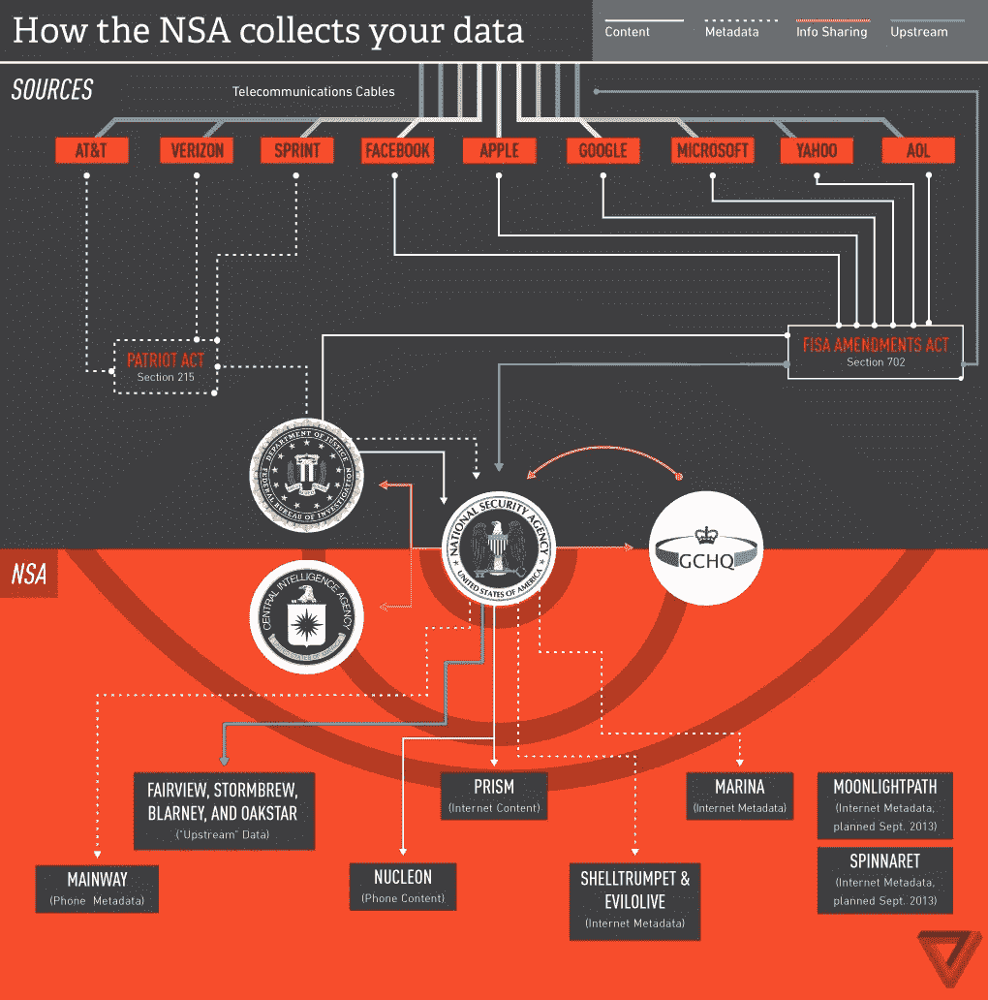
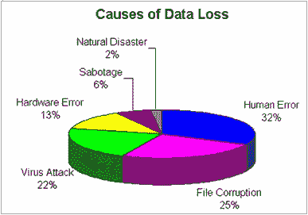
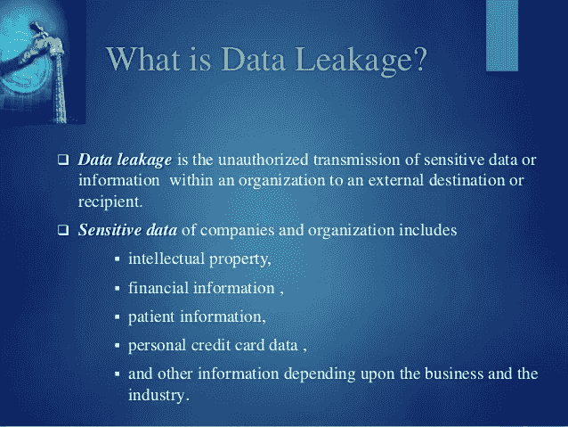

# 通用和免费机器翻译的数据安全风险

> 原文：<https://itnext.io/data-security-risks-with-generic-and-free-machine-translation-d0ce53596815?source=collection_archive---------0----------------------->

除了最近我们被轰炸的美国灾难性飓风活动的所有新闻，我们还看到了特权信息的[严重数据安全漏洞](https://www.wired.com/story/the-equifax-breach-exposes-americas-identity-crisis/?utm_source=nextdraft&utm_medium=email)的故事，甚至在商业翻译领域也是如此。与往常一样，数据的安全性和隐私性只能与数据安全实践和技术实现的复杂性一样好，因此指出“坏”的机器翻译(MT)技术本身并归咎于 MT 使用实践的膝跳反应是不太公平的。**如果你知道自己在做什么并且小心谨慎，确实有可能让 MT 服务对公众和/或企业社区使用** [**安全可靠**](https://kv-emptypages.blogspot.com/2017/07/a-closer-look-at-sdls-new-mt.html) **。对一些人来说，这似乎是显而易见的，但是任何技术的有效使用都需要能力和技能，我们看到了太多导致次优结果的不恰当实施的案例。**

一般来说，即使完全由人工完成的专业翻译工作也需要将源内容通过网络分发给翻译人员和编辑，以使他们能够执行特定的任务。需要翻译的敏感数据或机密信息泄漏的方式有两种。首先，通过不安全的公共 Wi-fi 热点传输或访问信息，或者将信息存储在不安全的云服务器上，信息可能会在“传输中”被窃取。这种风险已经被广泛宣传，很明显，薄弱的流程和松懈的监督是这些数据泄露案件的主要原因。

然而，较少考虑的是在线机器翻译提供商如何处理用户输入的数据。上周，当挪威国有石油巨头挪威国家石油公司的员工“发现在[translate.com]上输入的文本可以被任何进行[谷歌]搜索的人找到”时，斯莱特公布了这一风险

斯莱特报告说:“任何人做同样简单的两步谷歌搜索都会同意。Slator 的一些搜索发现了大量可以自由访问的敏感信息，从一名医生与一家全球制药公司就税务问题进行的电子邮件交流，到延迟支付通知，再到一家全球投资银行的员工绩效报告和解雇信。在所有情况下，全名、电子邮件、电话号码和其他高度敏感的数据都被泄露了。”在这种情况下，受害方显然很少或根本没有追索权，因为 MT 供应商的“使用条款”政策明确规定不保证隐私:“不能也不保证您向我们提供的任何信息在任何情况下都不会公开。您应该意识到，在网站上提交的所有信息都有可能被公开。”

翻译行业的其他几个人指出了风险的其他例子，并指出了翻译数据涉及的其他有风险的机器翻译和共享数据参与者。

翻译技术博主 Joseph Wojowski 在几年前的本帖中，曾就谷歌和微软的使用条款协议[写了一些细节。他提供的信息仍然是最新的。在我看来，这两种机器翻译服务是当今网络上最安全、最可靠的“免费”翻译服务，比 translation 和其他许多服务都高出一大步。然而，正如下面的分析所指出的，如果你真的**关心隐私，这些也会有一些风险。**](http://www.josephwojowski.com/transtech-blog/machine-translation-technology-and-internet-security)

他的开场白颇具煽动性，至少在某种程度上是真实的:

> *“微软、谷歌、雅虎使用的数据收集方法似乎在业内被提出过一次，但再也没有被提及。感谢爱德华·斯诺登，微软、Skype、苹果以及***披露的棱镜数据收集来自这些公司。[翻译]行业似乎越来越接近全面的机器翻译集成和使用，并且当集成到翻译环境中时，机器翻译的使用情况有了有趣但令人担忧的发现，* ***事实仍然是，Google Translate、Microsoft Bing Translator 和其他公开可用的机器翻译接口和 API 会存储发送给它们的每个单词、短语、片段和句子。”****

**

*谷歌和微软都非常明确地表示，他们的翻译服务器上使用的任何(或至少一些)数据都可以进一步处理和重用，通常是通过机器学习技术。*(如果有任何人真的坐下来观看这种 MT 用户数据流，我会感到惊讶，尽管这在技术上是可能的。他们的使用条款比 translate.com 公司的要好得多，他们可能已经把它简化为:“用户注意:使用风险自负，我们对任何可能以任何方式出错的事情概不负责。”世界各地的许多人每天都在使用谷歌翻译，但很少有人知道谷歌服务条款。这里是我在这里包括的谷歌翻译使用协议条款的具体法律术语，因为尽可能具体地看到它以正确理解潜在的风险是很好的。**

> *"*当您向我们的服务或通过我们的服务上传、提交、存储、发送或接收内容时，您向 Google(以及我们的合作伙伴)* ***授予全球许可，允许其使用、托管、存储、复制、修改、创作衍生作品(例如由翻译、*** *改编或我们为使您的内容更好地与我们的服务配合而做出的其他更改)、交流、发布、公开表演、公开展示和分发此类内容。您在本许可证中授予的权利仅限于运营、推广和改进我们的服务，以及开发新的服务。即使您停止使用我们的服务，本许可证仍然有效。**(*[*)谷歌服务条款*](https://www.google.com/intl/en/policies/terms/)*—2014 年 4 月 14 日 2017 年 9 月 11 日访问。**

*谷歌服务条款中的其他一些亮点在我看来基本上意味着，如果出了问题，很糟糕，如果你能以某种方式证明这是我们的错，我们只欠你你付给我们的钱，除非你能以某种方式证明这是合理可预见的。如果您将 MT 服务用于“业务用途”，这些条款甚至更不优惠:*

> **谷歌以及谷歌的供应商和分销商对利润、收入或数据损失、财务损失或间接、特殊、后果性、惩戒性或惩罚性损害不承担责任。**
> 
> **GOOGLE 及其供应商和经销商对这些条款下的任何索赔(包括任何默示担保)的全部责任，仅限于您向我们支付的使用服务的金额(或者，如果我们选择再次向您提供服务)。**
> 
> *在任何情况下，谷歌及其供应商和经销商不对无法合理预见的任何损失或损害**承担责任。***

**微软稍微好一点儿，他们在使用你的数据方面更加公开，但是你可以自己判断。重度用户甚至有办法通过付费的批量订阅绕过他们的数据被使用或分析的可能性。大量使用被定义为每月 2.5 亿个字符或更多，根据我的计算，这是每月 3000 万到 5000 万个单词。以下是来自微软翻译器[使用条款声明](https://www.microsoft.com/EN-US/privacystatement/Translator/Default.aspx)的一些关键选择。**

> ***“除了提供和提高 Microsoft 翻译和语音识别服务的质量之外，Microsoft Translator 不会将您提交的文本或语音音频用于任何其他目的。例如，我们不会使用您提交进行翻译的文本或语音音频来识别特定个人或进行广告宣传。* ***我们用于改进 Translator 的文本仅限于从您提交的文本中随机选择的不超过 10%的非连续句子，我们会屏蔽或删除文本样本中可能出现的数字字符串和电子邮件地址。我们不用于改进 Translator 的文本部分将在不再需要它们为您提供翻译后的 48 小时内删除。*** *如果 Translator 嵌入在另一个服务或产品中，我们可能会将来自该服务或产品的所有文本样本组合在一起，但我们不会将它们与任何与特定用户相关联的标识符一起存储。出于产品改进的目的，我们可能会无限期保留所有语音音频。未经您的同意，我们不会与第三方共享文本或语音音频样本，或者按照下面的说明进行共享。***
> 
> ***我们可能会与 Microsoft 控制的其他子公司和附属公司以及代表我们工作的供应商或代理共享或披露个人信息，以帮助管理和改进翻译服务。***
> 
> ***此外，当我们有充分理由相信有必要访问、披露和保存信息时，我们可以这样做:***

1.  ****遵守适用法律或响应主管部门的有效法律程序，包括执法部门或其他政府机构；*(如同棱镜对于国安局)*****
2.  **保护我们的客户，例如防止垃圾邮件或欺诈用户服务的企图，或帮助防止任何人的生命损失或严重伤害；"**

**对于那些使用自己的 TM 数据定制(训练)MSFT 翻译器基线引擎的 LSP 和企业，以下条款也适用:**

> ***“Microsoft Translator Hub(以下简称“Hub”)是一项可选功能，通过提交您自己的培训文档或使用社区翻译，您可以使用自己喜欢的术语和风格创建个性化的翻译系统。* ***中心保留并完整使用提交的文件，以便为您提供个性化的翻译系统，提高翻译服务*** *。在您从 Hub 帐户中删除文档后，我们可能会继续使用它来改进翻译服务。”***

**同样，如果你是一个每月 5000 万字的用户，你可以选择不将你的数据用于任何其他用途。**

**博客作者 Joseph Wojowski 在回顾了这些默认协议后总结道，尽管他提到，在某些情况下，使用机器翻译对翻译人员来说有真实而有意义的生产力好处，但翻译人员还是需要小心。**

*****“在最后的*** ***中，我仍然得出相同的结论，我们需要更好地认识到我们通过免费、公开和半公开的机器翻译引擎发送的内容，并让自己了解与使用这些引擎相关的风险，以及在处理机密或受限访问信息时更安全、更可靠的解决方案。”*****

**如果您的源数据已经存在于 web 上，有些人可能会说这有什么大不了的？据我所知，一些专注于翻译技术支持知识库或电子商务产品列表的机器翻译用例可能并不关心这些重用术语。**但更大的风险是，一旦翻译基础设施通过 API 连接到机器翻译，用户可能会在不了解风险和潜在数据泄露的情况下，不经意地发送不太适合机器翻译的文档。对于翻译管理系统(TMS)中一个随机的非专业用户来说，很有可能无意中向受这些使用条款约束的 MT 服务器发送和翻译即将发布的收入公告、给员工的关于新兴产品设计的内部备忘录或其他受限数据。在全球企业中，翻译多种真正机密的信息是一种持续的需求。****

**Memsource [最近提交了一份研究报告](https://www.memsource.com/blog/2017/06/14/analysis-machine-translation-usage-in-memsource-cloud/),内容是关于跨整个用户群的 TMS 环境中机器翻译的使用情况，报告显示，每月大约有 4000 万个片段通过微软翻译器和谷歌的 API 进行翻译。鉴于该卷勉强满足退出限制，我们必须假设所有数据都被重用和分析。Jost Zetzsche 在 ATA Chronicle 上发表的一篇[文章(2014 年 12 月刊第 26 页)显示，近 14，000 名翻译在 Memsource 上使用相同的“免费”机器翻译服务。如果您将 Trados 和其他集成了 API 访问的 TM 和 TMS 系统添加到这些公共 MT 系统中，我敢肯定 MT 的使用量是巨大的。因此，如果您关心隐私和安全，您可能需要做的第一件事就是解决这些隐藏在广泛使用的 TM 和 TMS 产品中的 MT API 集成。虽然在许多情况下这可能无关紧要，但当它发生时，让用户了解风险是有好处的。](http://www.atanet.org/chronicle-online/wp-content/uploads/2014-November-December.pdf)**

****

**人为错误，通常是无意的，是数据泄露的主要原因。常识咨询公司的唐·德帕尔马写道 “员工和你的供应商无意识地合谋向全世界传播你的机密信息、商业秘密和知识产权。”CSA 还报告说，在最近对企业本地化经理的调查中，64%的人说他们的同事经常或非常频繁地使用免费的 MT。62%的人还告诉常识咨询公司，他们担心或非常担心“敏感内容”(电子邮件、短信、项目建议书、法律合同、并购文件)被翻译。CSA 指出了两个风险:**

1.  **黑客或极客通过不安全的网络连接看到的信息**
2.  **查看上面描述的 Google TOS 部分，了解即使您不再使用这些服务，Google 也能做些什么和如何做。**

**这个问题之所以复杂，是因为虽然有可能在防火墙内强制执行使用策略，但供应商和合作伙伴可能缺乏这样做的经验。在不断扩大的全球市场中尤其如此。许多 LSP 和他们的翻译者现在通过上面提到的 API 集成接口使用 MT。CSA 列出了以下这些问题:**

*   **服务提供商可能不会告诉客户他们使用 MT。**
*   **大多数买家还没有赶上数据泄露。**
*   **分包商可能不会遵守约定的规则。**
*   **不管任何人说什么，语言学家可以并且将会在方便的时候使用机器翻译，而不考虑既定的政策。**

**在本地化团队中，可能有一些控制这种情况的方法。正如加空局再次指出的:**

*   **锁定内容工作流(例如，关闭 TMS 系统内的 MT 访问)**
*   **寻找符合您的数据安全规定的 MT 提供商**

**然而，真正的风险是在大型企业中，在本地化部门之外，缩写 TMS 是未知的。在某种程度上，有可能通过专门的软件匿名化所有的翻译请求，或者阻止所有免费的翻译请求，或者迫使它们通过特殊的网关，在数据越过防火墙之前冲洗数据。虽然这些匿名化工具可能很有用，但它们仍然很原始，通过建立一个公司控制的 MT 功能，向所有员工提供通用访问并保持在防火墙之后，可以减轻很多风险。**

**除了上面描述的安全的企业机器翻译服务，我认为我们还将看到机器翻译在电子发现应用中的更多使用。在与诉讼相关的应用程序和广泛的公司治理和合规性应用程序中。这里是关于在公司诉讼场景中使用通用机器翻译服务的风险的另一个观点。**

****

**许多全球组织现在开始意识到自由 MT 的无限制使用和访问所带来的信息泄漏风险。虽然解决这种泄漏风险的一种方法是构建自己的 MT 系统，但许多人也清楚地认识到，大多数 DIY(自己动手)系统在输出质量方面往往不如这些免费的通用系统。当用户意识到免费 MT 的质量优势时，他们往往会仔细检查这些“更好”的系统，从而破坏了 DIY 系统上私人和受控访问的目的。对我来说，由具有认证能力的供应商提供的受控、优化(针对企业主题领域)和安全的机器翻译解决方案是解决数据泄露问题的最合理和最具成本效益的方式。**“内部部署”系统对于那些拥有 IT 人员进行持续管理，并且能够保护和管理客户和供应商终端的 MT 服务器的企业来说很有意义。**许多大型企业都具备这种内部 IT 能力，但很少有物流服务提供商具备。**

**我认为，允许建立内部和可扩展私有云的供应商是当今市场上的最佳选择。有人说私有云选项既能提供专业的 IT 管理，又能提供可验证的数据安全性，更适合那些缺乏合格 IT 人员的企业。如今，大多数机器翻译厂商倾向于提供基于云的解决方案，对于自适应机器翻译来说，这可能是唯一的选择。很少有 MT 供应商能够同时进行基于云的和内部部署，能够胜任这两项工作的就更少了。**倾向于偶尔提供非云解决方案的 MT 厂商不太可能提供可靠和稳定的产品**。建立一个可能有成百上千用户的公司 MT 服务器不是一件小事。像生活中的大多数事情一样，要做好内部部署和云解决方案，需要在多个不同的用户场景中反复实践并积累丰富的经验。因此，人们会认为那些拥有大量内部和私有云安装的供应商(例如，超过 10 个不同类型的客户)比那些作为例外拥有至少 10 个客户站点的供应商更受欢迎**。**我认为有两家公司的名字以 S 开头，在广泛的经验和广泛展示的技术能力方面最符合这些要求。随着我们进入一个 Neural MT 更加普及的世界，我认为私有云在未来可能会变得更加重要，并成为让您自己的 it 人员管理现场 GPU 或 TPU 或 FPGA 阵列和服务器的首选。然而，明智的做法仍然是要求您的 MT 供应商在其云产品中提供有关数据 [ata 安全条款](https://www.microsoft.com/en-us/trustcenter/security/default.aspx#How-Microsoft-protects-your-data)的完整细节。**

**似乎越来越确定的是，机器翻译在保持全球企业积极共享和交流方面无疑提供了巨大的价值，对更好、更安全的机器翻译解决方案的需求有着光明的前景。像最近这次 translate.com 惨败这样的事件表明，广泛可用的机器翻译服务对任何专注于全球的企业来说都是有价值的，值得更认真和仔细地探索，而不是让天真的用户自己想办法使用有风险的“免费”解决方案，这些解决方案破坏了企业隐私，并将高价值的机密数据暴露给任何知道如何使用搜索引擎或具有基本黑客技能的人。**

***原载于 2017 年 9 月 17 日*[*kv-emptypages.blogspot.com*](https://kv-emptypages.blogspot.com/2017/09/data-security-risks-with-generic-and.html)*。***