# dbt 和 Amazon Redshift 无服务器:无服务器 Lakehouse 数据建模

> 原文：<https://itnext.io/dbt-and-amazon-redshift-serverless-serverless-lakehouse-data-modeling-ef9106888137?source=collection_archive---------2----------------------->

## 使用 dbt 对现在普遍可用的 Amazon Redshift 无服务器云数据仓库中的数据进行转换和建模

*【帖子更新于 2022 年 12 月 30 日，以反映 dbt 的最新版本】*

AWS 最近[宣布](https://aws.amazon.com/about-aws/whats-new/2022/07/amazon-redshift-serverless-generally-available/)2022 年 7 月 12 日**亚马逊红移无服务器**全面上市(GA)。 [Amazon Redshift 无服务器](https://docs.aws.amazon.com/redshift/latest/mgmt/working-with-serverless.html)允许数据分析师、开发人员和数据科学家运行和扩展分析，而无需供应和管理数据仓库集群。您可能会发现一些特定的使用案例，在这些案例中，Amazon Redshift Serverless 是一款比预配 Amazon Redshift 更合适的分析工具。好消息是， [dbt](https://www.getdbt.com/product/what-is-dbt) (数据构建工具)与提供的 Amazon Redshift 和 Redshift Serverless 兼容。

在下面的帖子中，我们将探索使用 dbt 实验室开发的 dbt(数据构建工具)来转换基于 AWS 的数据湖库的数据，该数据湖库由 Amazon Redshift Serverless、Amazon Redshift Spectrum、AWS Glue Data Catalog 和 Amazon S3 构建。

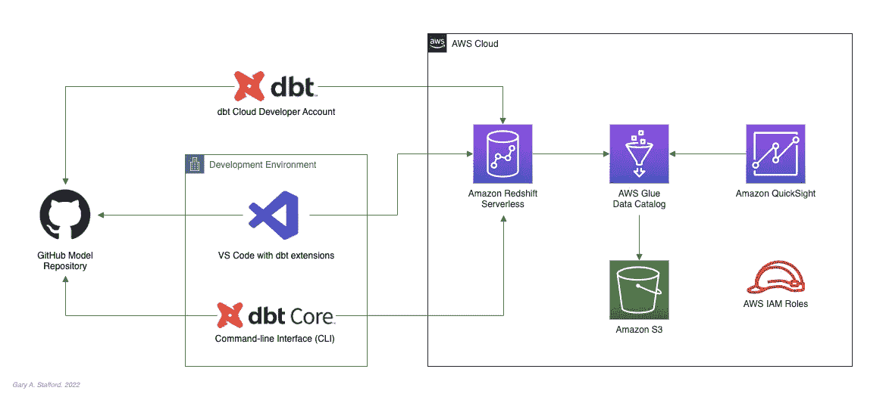

这篇博文演示了高级架构

# 命名空间和工作组

正如在 [AWS 文档](https://docs.aws.amazon.com/redshift/latest/mgmt/serverless-console-comparison.html)中所概述的那样，配置红移和无服务器红移之间存在许多差异。一个更重要的区别是具有红移无服务器的**名称空间**和**工作组**的概念，而不是具有预配红移的集群。据 AWS 报道，“*亚马逊红移无服务器没有集群的概念。相反，您有一个工作组，其中包含可用于处理工作负载的计算资源，还有一个命名空间，其中包含相关的数据库资源、快照、加密密钥和用户。*

就我个人而言，我觉得数据服务中不同的层次关系让许多用户感到困惑——数据库实例中的数据库(例如，Amazon RDS)、数据库集群中的数据库(例如，Amazon Aurora 和 provisioned Redshift)、集群中实例中的数据库(例如，Amazon DocumentDB)以及现在使用 Amazon Redshift Serverless 的工作组中名称空间中的数据库。

# 定价

另一个显著的区别是亚马逊红移无服务器如何对 T2 收费。与按每小时/节点计费的调配红移不同，Amazon Redshift 无服务器以**红移处理单元(RPUs)** 来衡量数据仓库容量。您需要为在 RPU 运行的工作负载支付费用，这些工作负载以每秒小时为单位(最低收费为 60 秒)，包括在亚马逊 S3 以开放文件格式访问数据的查询。此外，主存储容量以 GB/月为单位计费为**红移托管存储(RMS)** 。

# dbt 和亚马逊红移无服务器

本文使用的 [GitHub 项目](https://github.com/garystafford/dbt-redshift-demo)与上一篇文章使用的项目相同，[使用 dbt、Amazon Redshift、Redshift Spectrum 和 AWS Glue 的 Lakehouse 数据建模](/lakehouse-data-modeling-using-dbt-amazon-redshift-redshift-spectrum-and-aws-glue-fdc5629c3df8)。我将尽量不重复那篇文章中已经涉及的 dbt 细节。本文将重点讨论如何用 Amazon Redshift 无服务器集群替换 Amazon Redshift 提供的集群，以便与 dbt 一起使用。

 [## 使用 dbt、Amazon 红移、红移光谱和 AWS Glue 的 Lakehouse 数据建模

### 了解 dbt 如何在基于 AWS 构建的现代云数据湖中简化数据转换和模型具体化

itnext.io](/lakehouse-data-modeling-using-dbt-amazon-redshift-redshift-spectrum-and-aws-glue-fdc5629c3df8) 

# 入门指南

如果你是亚马逊红移无服务器的新手，第一次从 AWS 管理控制台尝试该服务时，你会看到“开始使用亚马逊红移无服务器”屏幕(正下方的*)，然后是初始设置屏幕(*下方的*)。*

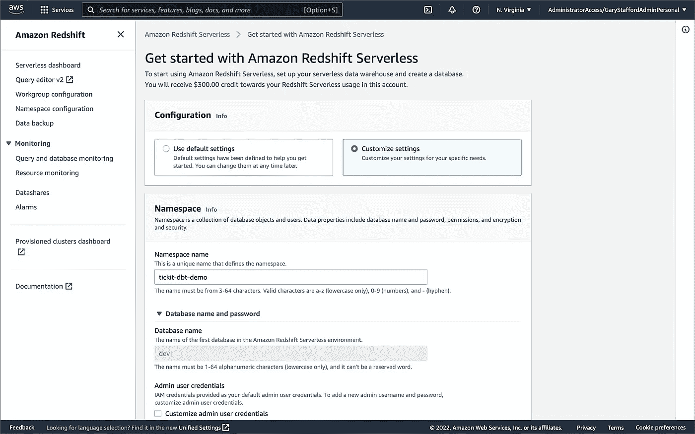

初始“Amazon Redshift 无服务器入门”屏幕

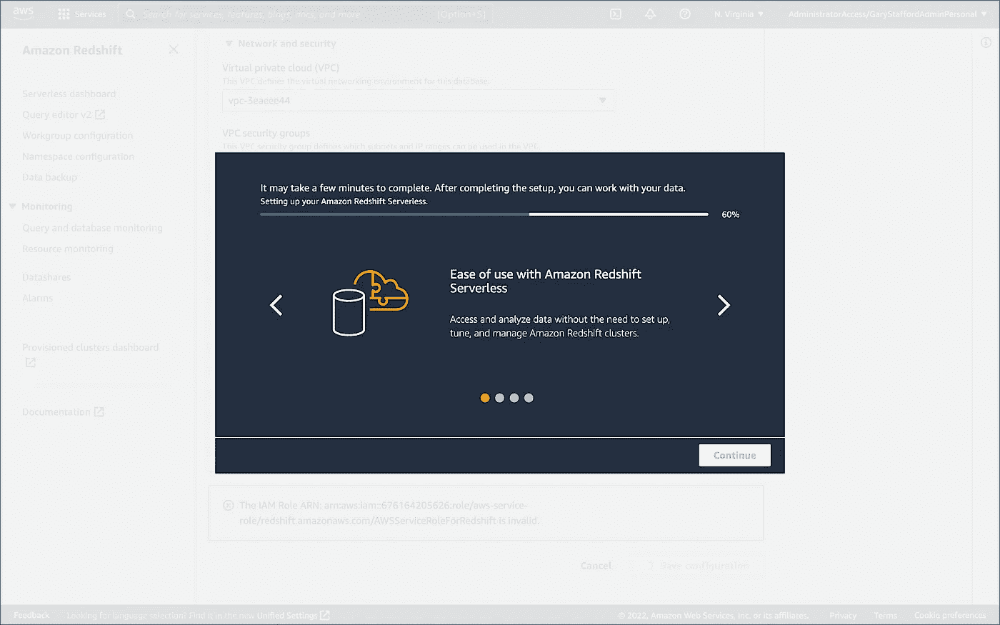

初始设置屏幕

如果您已经在使用 Amazon Redshift Serverless，那么在创建新资源时，您将会体验到稍微不同的屏幕。在这两种情况下，Amazon Redshift 无服务器资源的设置是相同的。

## 新工作组

首先，创建一个新的[工作组](https://docs.aws.amazon.com/redshift/latest/mgmt/serverless-workgroup-describe.html)，比如`tickit-dbt-demo-ns`。选择要与 Amazon Redshift 无服务器关联的 VPC。然后，选择相应的 VPC 安全组。最后，在 VPC 中选择要与 Amazon Redshift 无服务器关联的子网。您必须选择至少三个子网。我们将使用三个子网进行演示，每个子网位于不同的可用性区域(AZs)中。

此外，对于这个演示，如前一篇文章所述，Amazon Redshift Serverless 需要访问 AWS Glue 和 Amazon S3。已配置适当的网络来访问这两项服务。为了进行演示，我使用了 [VPC 端点](https://docs.aws.amazon.com/vpc/latest/privatelink/concepts.html)，它可以在不使用互联网网关、NAT 设备、VPN 或 AWS Direct Connect 的情况下，在红移无服务器 VPC 和这两种服务之间建立连接。

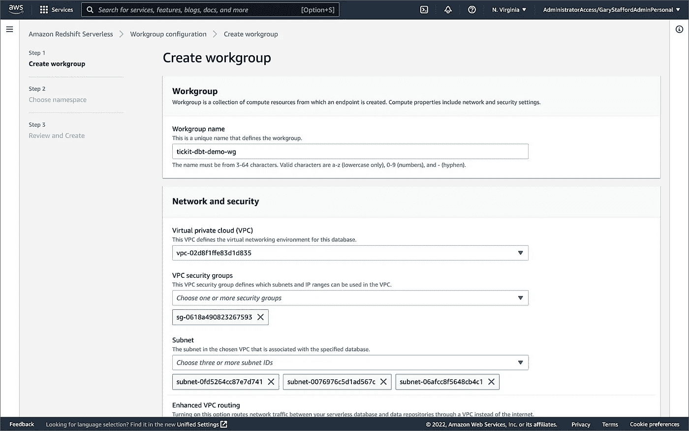

创建新的工作组

## 基本 RPU 容量

设置工作组的[基本 RPU 产能](https://docs.aws.amazon.com/redshift/latest/mgmt/serverless-capacity.html)。默认情况下，基本 RPU 容量设置为 128 个 rpu，但范围可以从 32 个 rpu 到 512 个 rpu，增量为 8 个 rpu。设置较高的基本容量可以提高计算密集型数据处理作业的查询性能。

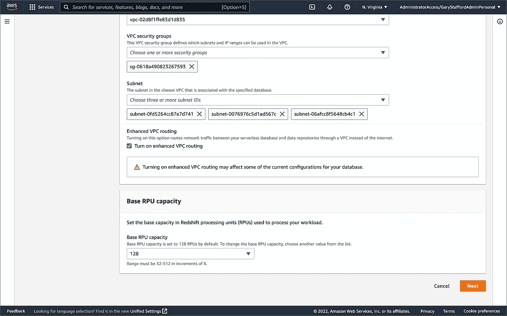

设置工作组的基本 RPU 容量

## 新命名空间

接下来，创建一个新的[名称空间](https://docs.aws.amazon.com/redshift/latest/mgmt/serverless-console-namespace-config.html)，比如`tickit-dbt-demo-ns`。我建议定制管理员用户的数据库凭证——创建一个具有安全密码的唯一数据库用户。稍后，我们将创建一个专门供 dbt 使用的用户和组。

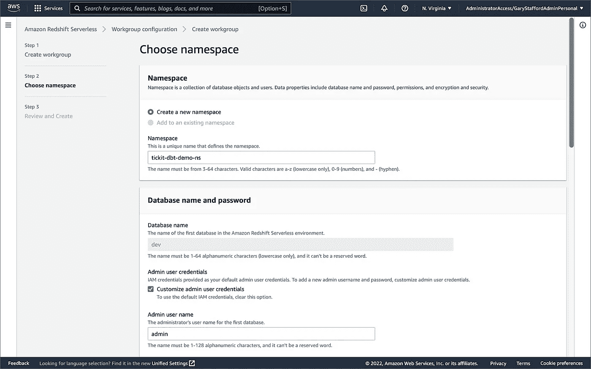

创建新的命名空间

创建新的工作组和命名空间应该只需要几分钟的时间。

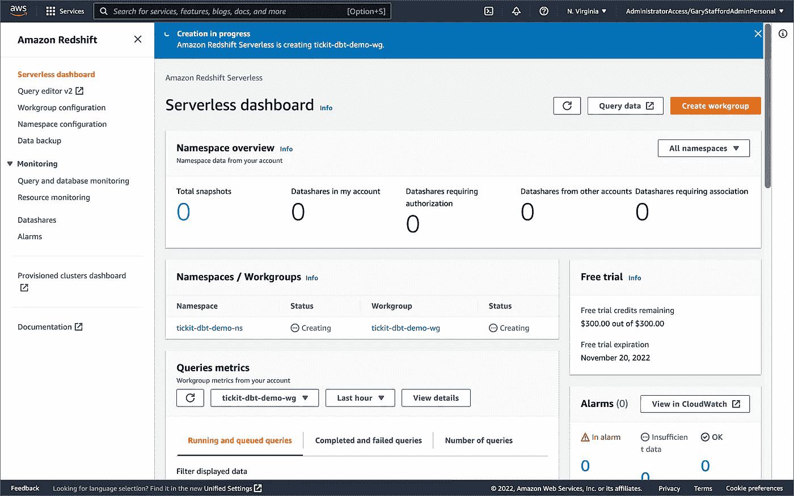

无服务器仪表板

一旦该过程完成，我们应该会在 Amazon Redshift 无服务器仪表板上看到一条消息。新的名称空间和工作组现在应该可用了。

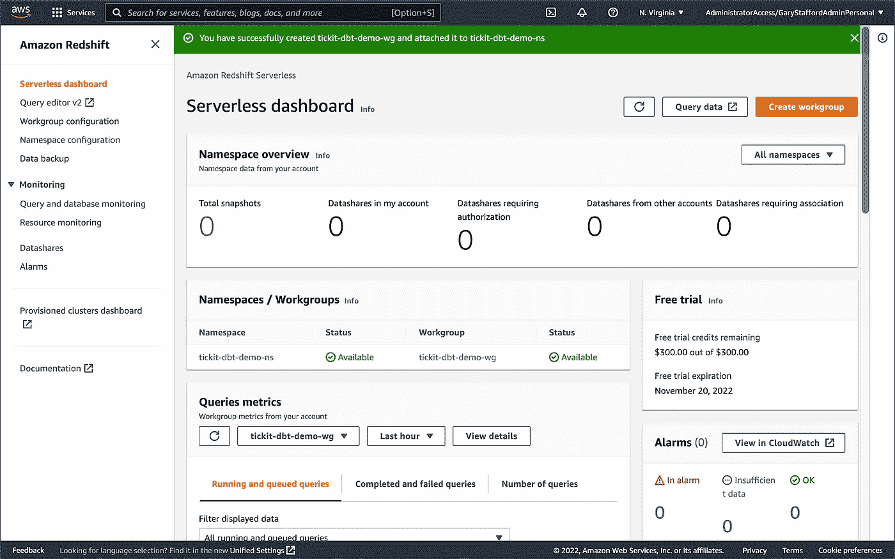

无服务器仪表板

## 公众可访问性

我们需要让公众能够从 VPC 以外的地方访问 Amazon Redshift Serverless，从本地 ide 或 dbt 云访问它。编辑新工作组并启用“打开公共访问”当我们第一次创建工作组时，此选项不可用。

确保正确配置指定的 VPC 安全组，仅允许来自您的 IP 地址或其他指定用户的 IP 地址的流量到达端口`5439`至关重要。对于来自 dbt Cloud 的访问，dbt 将提供一个[IP 地址列表](https://docs.getdbt.com/docs/deploy/regions-ip-addresses)，您需要使用`/32` CIDR 后缀将其添加到您的安全组。

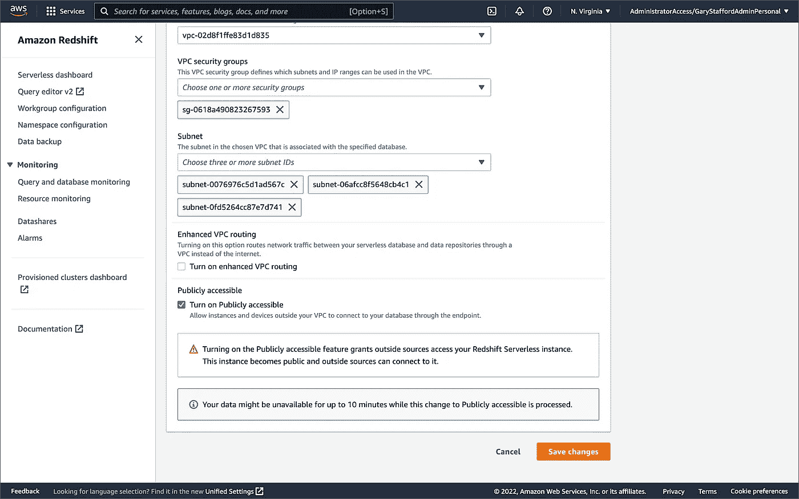

更新“可公开访问”设置

## 新数据库、模式、用户、组和授权

与前一篇文章中的[相同，创建两个所需的模式，即`dbt`用户和组，应用适当的授权，并分配模式所有权。](/lakehouse-data-modeling-using-dbt-amazon-redshift-redshift-spectrum-and-aws-glue-fdc5629c3df8)

完成这些任务最简单的方法是从 [Amazon Redshift 查询编辑器 v2.0](https://aws.amazon.com/redshift/query-editor-v2/) 。

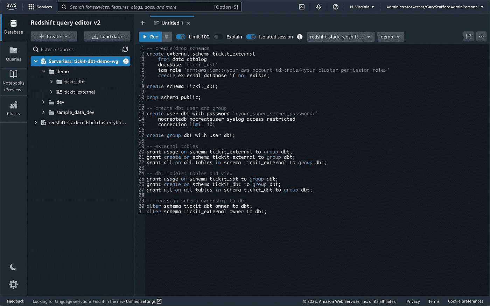

亚马逊红移查询编辑器 2.0 版

## 端点配置

要配置 dbt 核心(dbt CLI)、IDE 或 dbt 云，您需要新的 Amazon Redshift 无服务器工作组的端点主机名、端口和数据库。这些信息以及可选的 JDBC 和 ODBC 连接字符串可从工作组的配置页面获得。

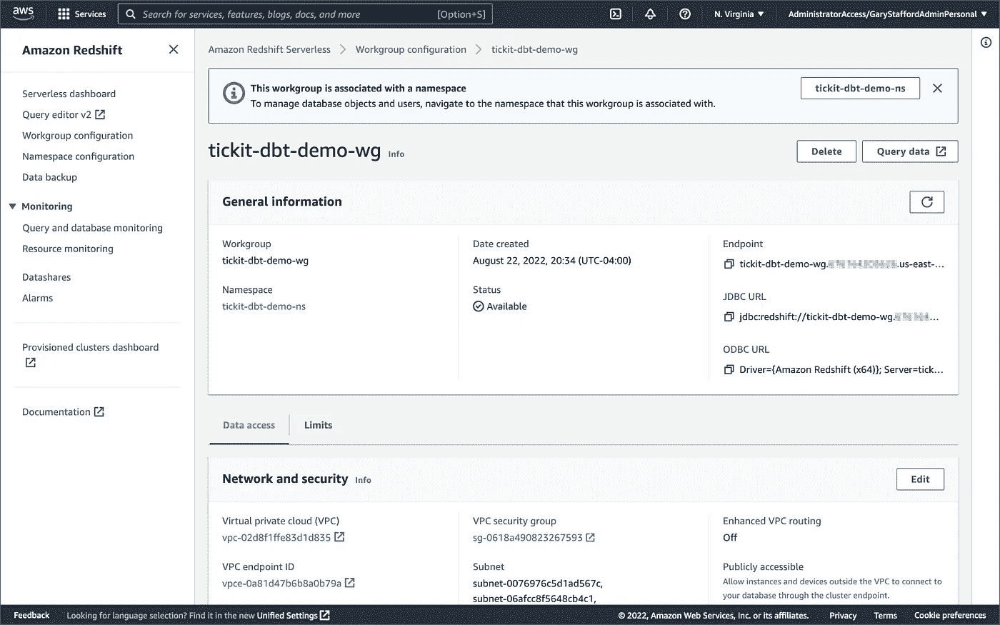

带有连接信息的工作组配置页面

正如[上一篇文章](/lakehouse-data-modeling-using-dbt-amazon-redshift-redshift-spectrum-and-aws-glue-fdc5629c3df8)所示，使用 Amazon Redshift 无服务器端点信息配置您的本地 dbt 核心环境或 dbt 云。要在本地测试连接，使用`dbt debug`命令。

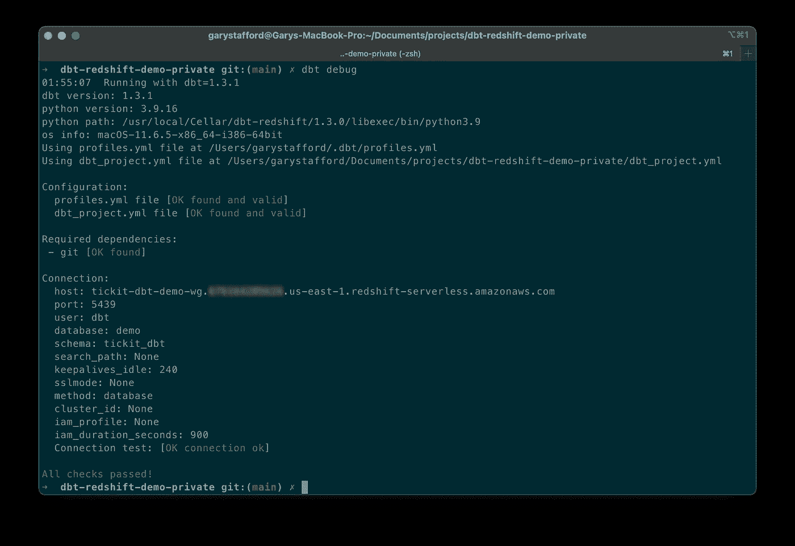

使用 dbt 调试命令确认配置

就是这样！从调配的 Amazon Redshift 集群切换到 Amazon Redshift 无服务器集群非常容易。

# 使用 dbt

将 dbt 与 Amazon Redshift Serverless 一起使用与在[上一篇文章](/lakehouse-data-modeling-using-dbt-amazon-redshift-redshift-spectrum-and-aws-glue-fdc5629c3df8)中使用的预配置 Amazon Redshift 集群相同。从 dbt CLI 或使用 dbt Cloud，我们可以重新编译我们的模型，并将它们重新具体化为新的亚马逊红移无服务器工作组的`demo`数据库中的表和视图。

创建临时层的模型

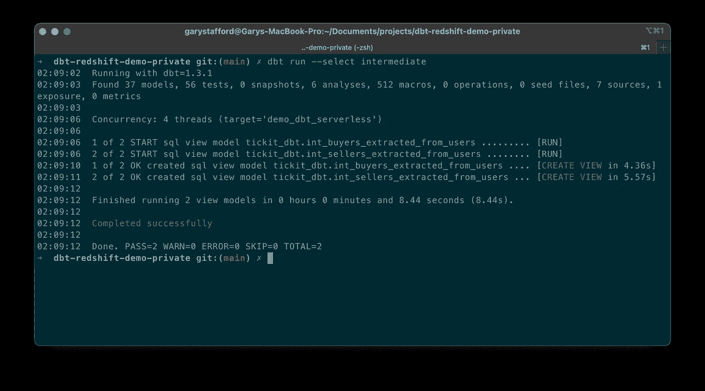

创建中间层的模型

创建集市层的模型

回到 Amazon Redshift 查询编辑器 v2.0，我们现在应该观察新的`demo`数据库中的模式。在`tickit_demo`模式中，我们应该观察总共四个表和九个视图。下面可以看到另外四个视图，它们来自一个不相关的 dbt 包。

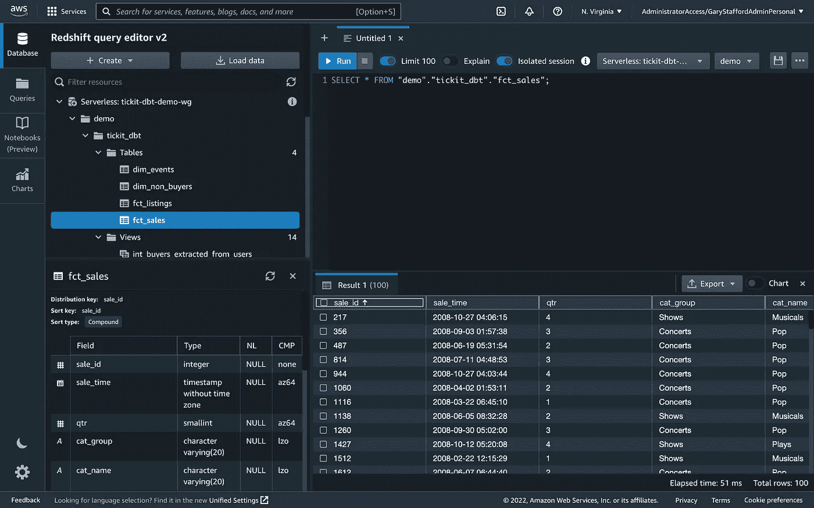

亚马逊红移查询编辑器 2.0 版

# dbt 云

在 dbt 云中使用 Amazon Redshift Serverless 的体验等同于预配 Redshift。

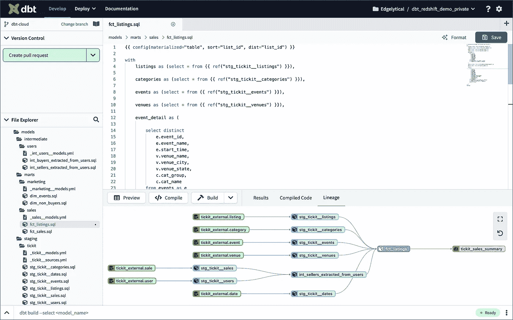

dbt 云开发选项卡

所有命令的工作方式相同。

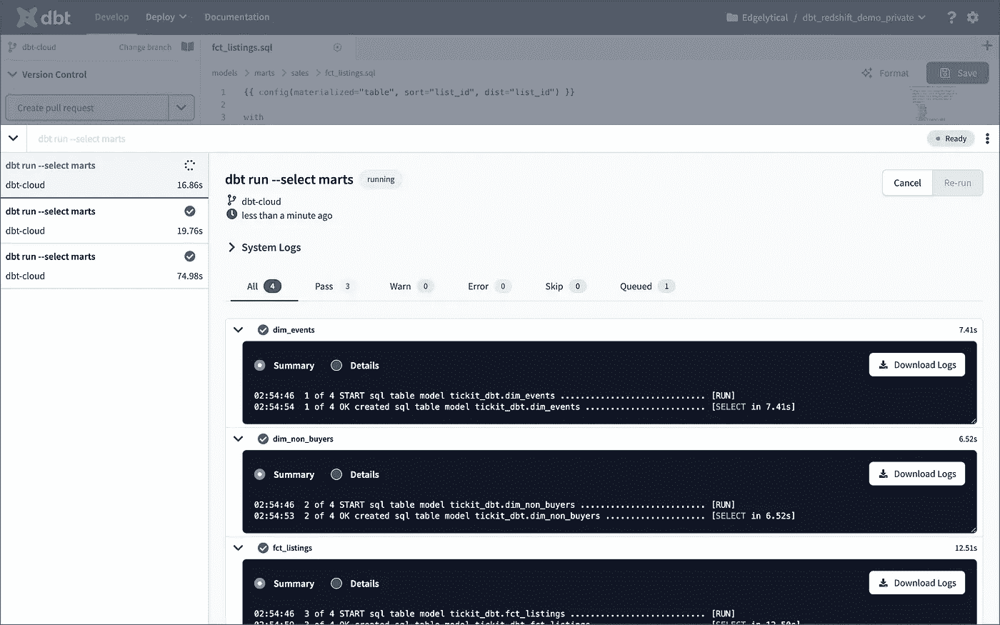

dbt 云运行

# 无服务器监控亚马逊红移

AWS 通过 Amazon Redshift Serverless 提供了各种日志记录和监控功能。我们可以应用各种细粒度过滤器来细化我们的数据库视图和查询指标。

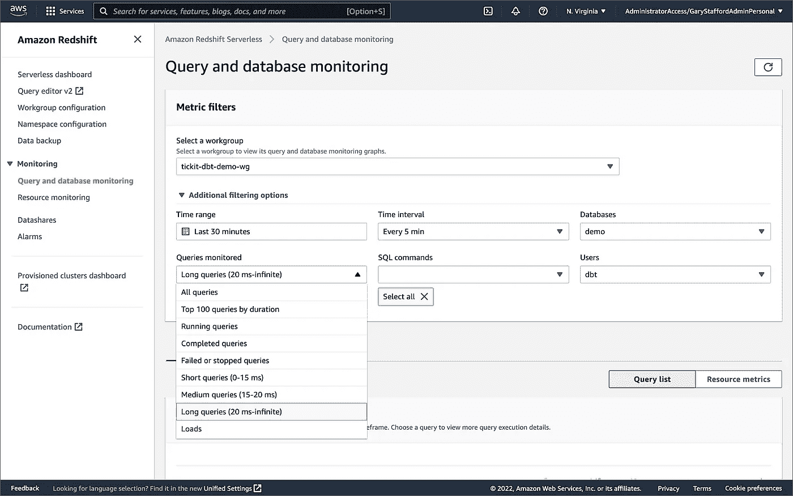

Amazon Redshift 无服务器查询和数据库监控

我们还可以轻松地监控我们对红移处理单元(rpu)的使用。

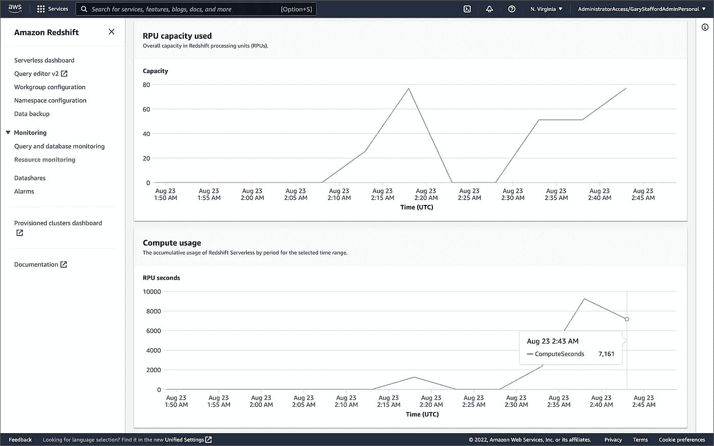

监控红移处理单元(rpu)

最后，AWS 提供了对针对 Amazon Redshift Serverless 执行的每个查询的查询统计数据和细节的轻松访问。

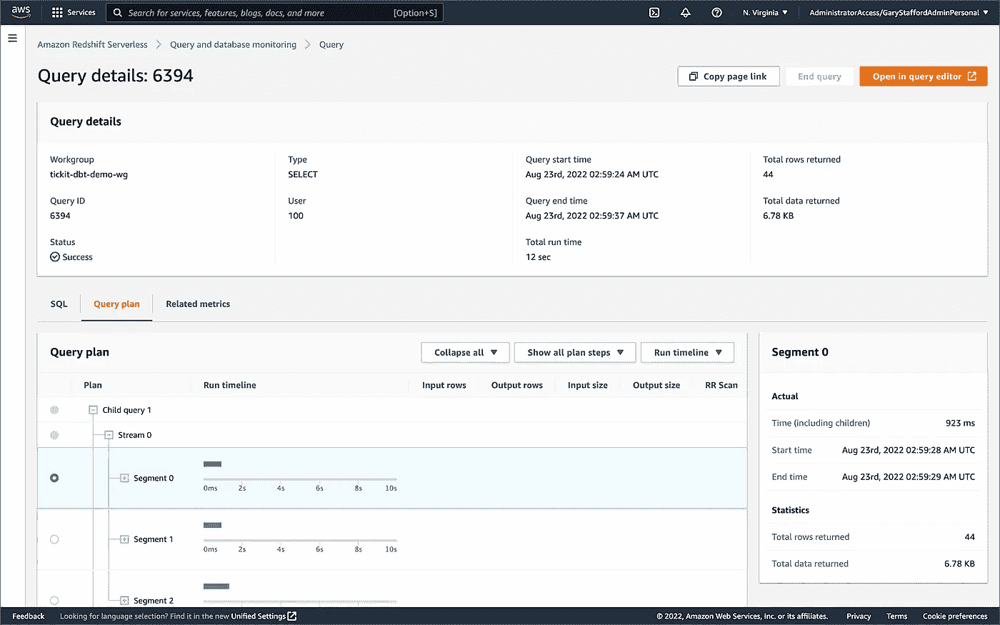

单个查询详细信息

# 结论

在这篇简短的后续文章中，我们探索了 dbt 与亚马逊红移无服务器系统的集成。您可能会发现一些特定的使用案例，在这些案例中，Amazon Redshift Serverless 是一款比预配 Amazon Redshift 更合适的分析工具。无论哪种方式，您都可以通过简单地编写 SQL `SELECT`语句来使用 dbt 转换数据。

*这篇博客代表我的观点，而不是我的雇主亚马逊网络服务公司(AWS)的观点。所有产品名称、徽标和品牌都是其各自所有者的财产。除非另有说明，所有图表和插图都是作者的财产。*