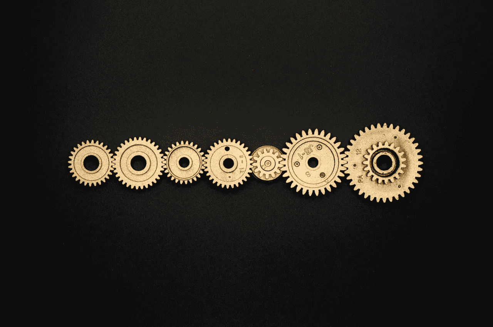

# 默认是困难的:Kubernetes 部署版

> 原文：<https://itnext.io/defaults-are-hard-kubernetes-deployment-edition-3b11095792f2?source=collection_archive---------3----------------------->

我在谷歌 GKE 团队的一个同事刚刚遇到了一个非常奇怪的问题。她正在用正在开发的新映像更新现有的部署，所以她在映像上使用了`:latest`标记，而没有设置`imagePullPolicy`。毕竟, [Kubernetes 文档指出,](https://kubernetes.io/docs/concepts/containers/images/#updating-images):

> 如果你想总是强制拉，你可以…省略`imagePullPolicy`，使用`:latest`作为图像的标签。

没问题吧？然而，她节点上的图像顽固地拒绝更新。这是为什么？

***更新(2021 年 3 月):*** *文档* [*现在提供了答案*](https://github.com/kubernetes/website/pull/26661) *，但当时没有。*

经过几个小时的困惑，她[找到了自己的答案](https://github.com/kubernetes-sigs/multi-tenancy/issues/1025#issuecomment-675738933)。记得我说过她是在*更新*她的部署，而不是*创建*它吗？事实证明，她的部署的最初版本没有*而不是*使用`:latest`标签——它使用了一个真实的、真实的、不应该被删除的图片。因此，当她创建没有`imagePullPolicy`的部署时，Kubernetes 很有帮助地将策略设置为`IfNotPresent`——然后保持这个新的默认值。

在这一点上，我应该提一下，我成为 GKE 团队的一员已经将近两年了，她在团队中的时间大约是一半。虽然我们不是专业的 GKE *操作员*，但我们在开发[相当复杂的功能](https://kubernetes.io/blog/2020/08/14/introducing-hierarchical-namespaces/)的同时，已经持续开发和部署了大约一年的工作负载。我们绝不是新手。而我们*还是*被绊倒了。

这个问题的根源是*持久的、依赖的默认值*的概念。也就是说，当一个字段(`imagePullPolicy`)未置位时，其值根据另一个字段(`image`字段上的标签)的*来确定。但是当第二个字段改变时，第一个字段没有改变。哎呀。*

这个问题的一个可能的直接解决方案是简单地将`imagePullPolicy`改为`Always`。正如[完全不同的 doc](https://kubernetes.io/docs/concepts/configuration/overview/#container-images) 有益地指出的:

> **注意:**底层图像提供者的缓存语义使得`imagePullPolicy: Always`也很高效。例如，使用 Docker，如果图像已经存在，则拉取尝试会很快，因为所有图像层都被缓存，并且不需要下载图像。

虽然这是真的，但它确保了当您启动一个 pod 时，您的容器注册表*保证*在关键路径上。在开发过程中，这几乎肯定没问题，但是如果您的 pod 频繁重启，就要小心了。

添加一个警告([在 1.19](https://github.com/kubernetes/enhancements/tree/master/keps/sig-api-machinery/1693-warnings) 中新增)来捕捉这种情况也不错，但是这说起来容易做起来难。正如一位[资深撰稿人](https://twitter.com/liggitt)向我解释的那样(在我抱怨了一下我们的不幸之后):

> 这实际上是客户端应用程序和来自其他字段的默认值之间的一种不幸的交互。这两者结合在一起，很难也不可能检测到您所描述的级别的问题。
> 
> `kubectl apply`(更新现有对象时)提交**补丁，**不完整对象，基于您正在应用的清单和您上次应用的内容(存储为对象上的注释)之间的差异。如果您添加了`--v=8`,那么您只能看到在补丁请求正文中发送的图像字段。
> 
> 在 REST 处理程序或准入看到新对象之前，补丁被应用于现有对象以计算通用补丁处理层中的“新对象”,因此当 REST 处理程序或验证或准入看到旧/新对象时，不可能辨别出`imagePullPolicy`是用户设置的还是默认的，以及新对象中的`imagePullPolicy`是由传入补丁设置的还是从现有对象继承的。
> 
> 顺便说一句，正是因为这个原因，像这样的派生默认值是非常有问题的。如果用户在更新时更改输入字段，他们可以保留基于旧值的默认值。这就是为什么在 apps/v1 部署中，选择器和标签不再默认为 pod 模板标签。

因此，如果你是一个 API 设计者，请非常仔细地考虑这些相关的默认设置。与此同时，我要去写一篇[文档公关](https://github.com/kubernetes/website/pull/26661)。

*感谢* [*高*](https://www.linkedin.com/in/yiqigao) *调试问题，感谢*[*Jordan Liggitt*](https://twitter.com/liggitt)*提供大量有趣的背景资料。照片由米格尔·Á拍摄。佩克斯的帕德里安。*