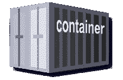
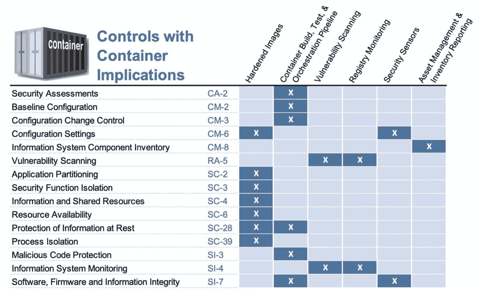
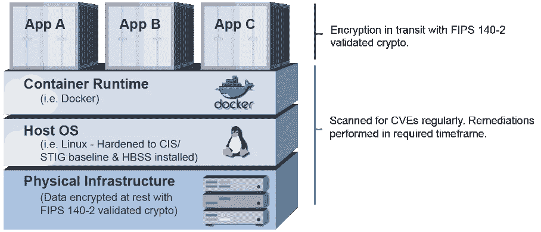
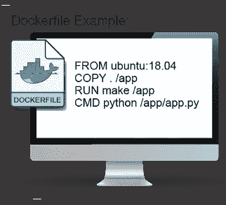
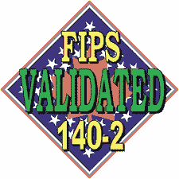
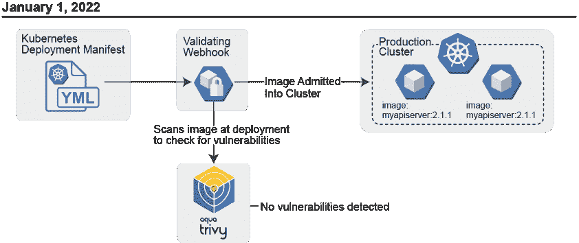
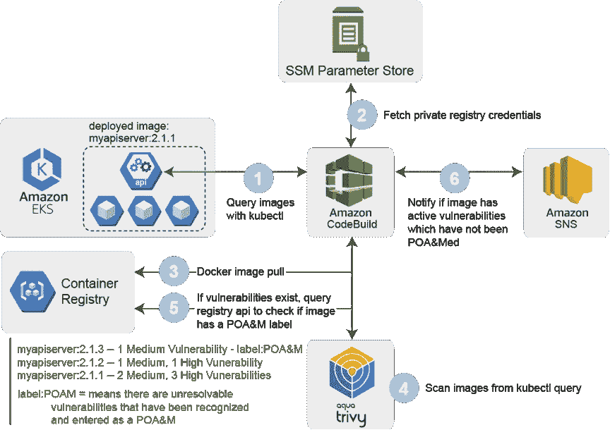
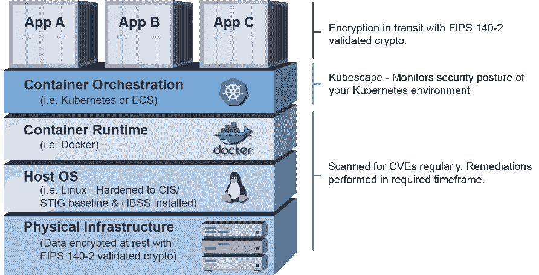
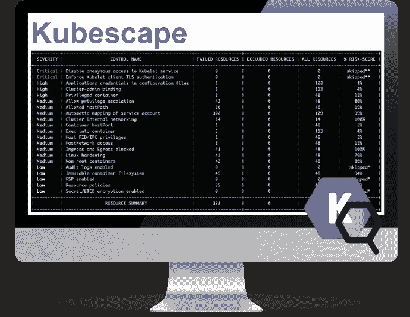

# 揭秘 FedRAMP、DoD SRG 和 CMMC 的集装箱扫描要求

> 原文：<https://itnext.io/demystifying-container-scanning-requirements-for-fedramp-dod-srg-and-cmmc-d066bee50d2d?source=collection_archive---------2----------------------->

容器是一个标准化的、离散的软件单元，它封装了代码及其所有依赖项，因此应用程序可以在几乎任何平台或操作系统上可靠地运行。

众所周知，容器在生产工作负载中所占的比例越来越大。将应用程序打包成独立组件的能力当然不是什么新鲜事。像 RPM 这样的包管理工具已经做了一段时间了。然而，协调这些组件的生命周期并在任何地方运行它们的能力彻底改变了全球软件开发生命周期(SDLC ),同时也给监管市场中的审计师和风险评估带来了挑战。

**在容器中运行大多数应用程序的公司:**

鸣谢:Portworx 和 Aqua Security 的 2019 年集装箱采用调查

为了让审计人员更加清晰，FedRAMP PMO 在 2021 年 3 月发布了他们最初的[集装箱安全指南](https://www.fedramp.gov/assets/resources/documents/Vulnerability_Scanning_Requirements_for_Containers.pdf)。

**对 FedRAMP 合规性有容器影响的控制**

根据 FedRAMP PMO 发布的[指南](https://www.fedramp.gov/assets/resources/documents/Vulnerability_Scanning_Requirements_for_Containers.pdf)，下表总结了利用容器的计算环境必须考虑的控制措施。

请注意，PMO 并未引入集装箱化工作负载的新要求，但他们的新指南仅提供了现有 FedRAMP 要求的推断，以及它们如何应用于集装箱化工作负载。这篇博客将专门关注这些控件如何应用于容器。

**使用集装箱的系统的扫描要求**

使用容器时，云服务提供商(CSP)不会被排除遵守基于主机的安全准则(即主机必须经过强化、适当监控、定期修补，并具有基于主机的防病毒、IDS/IPS)和 FIPS 140–2(即将推出 140–3)加密要求。毕竟，容器只是运行应用程序的一种机制。严格来说，CSP 负责将最佳安全实践应用到主机(即工作节点)和在其上运行的容器。如果您在 AWS 等公共云上托管您的工作负载，您将继承物理基础架构的安全性和维护，因为这些都包含在共享责任模型中。

## **硬化图像**

**适用控制:** CM-6、SC-2、SC-3、SC-4、SC-6、SC-28、SC-39

正如需要 CSP 强化虚拟机的操作系统一样，CSP 也必须强化容器映像本身。如果对容器使用基于操作系统的映像，则容器映像必须按照特定操作系统的 CIS 基准(或国防部的 STIG)进行强化。这里的挑战是，许多用于监控虚拟机的 CIS 和 STIG 强化合规性的工具，如 Tenable SC，不具备在容器映像上执行此操作的能力。它需要能够查看容器映像内部并导入自定义安全检查(基于 CIS/STIG 基准)的特殊工具，以便安全工具可以确定映像是否合规。OSCAP 就是这样一个对容器图像执行符合性检查的工具。

如果使用“无发行版”映像，即仅包含您的应用程序及其依赖项的映像，或者完全从头开始构建的映像，CSP 有责任与其第三方评估组织(3PAO)合作开发一个自定义基准，并证明他们的映像足够坚固。常见的强化做法是删除不必要的二进制文件，如 shell、curl 等，确保容器作为自定义非根用户运行，强化文件系统权限，确保使用 FIPS 140–2 加密* *等等。

此外，对容器可以访问哪些内核系统调用进行限制是一个好主意——尽管这通常是通过容器编排平台使用 Apparmor 和 seccomp 等工具来完成的。像 Docker 和 containerd 这样最常见的容器运行时会自动应用默认的 seccomp 配置文件。

清楚点:为什么有些容器有一个像 Ubuntu 或 Debian 这样的基础映像？

> 容器最常见的混淆点之一是理解基础映像的含义。一个常见的问题是:“我可以在 RHEL 工作节点上运行 Ubuntu 容器映像吗？”。(答案是肯定的。)为了有助于澄清，让我们退一步重新构建理解。

> 如果在 Ubuntu(或其他)虚拟机上运行一个应用程序并安装依赖项，最快的方法之一是用 apt-get 安装依赖项，因为构建脚本已经编写好了，任何依赖项的版本都很容易翻译。通常，开发者会使用一个容器镜像来镜像他们的非容器化应用的主机 VM，比如 [Ubuntu](https://hub.docker.com/_/ubuntu) ，提供一个熟悉的文件系统结构和包管理工具。

> 这消除了容器化的痛点，并解释了为什么容器映像操作系统和主机操作系统中经常存在差异。然而，这些基于“操作系统”的映像通常会引入不必要的组件来使实际的应用程序工作——例如，您的应用程序实际上可能不需要 bash 或 curl 来运行，但是这些组件将包含在操作系统映像中。因此，当在 FedRAMP 中使用基于操作系统的容器映像时，它们必须符合特定的 CIS 或 STIG 基准。

* *所有联邦工作负载都要求在所有级别使用 FIPS 140–2 加密，容器也不例外。大多数通信服务提供商在使用联邦 ATO 时遇到的主要问题是，他们没有使用 FIPS 140–2 验证的加密模块来构建应用，这是传输中加密最常见的问题。最常用的方法是实现满足这些需求的服务网格——它们通常无缝集成，并添加其他功能，如更细粒度的服务到服务路由控制和改进的可观察性。然而，服务网格确实引入了额外的开销，因为它们需要在每个正在运行的容器上使用 sidecar 代理。另一个选择是从头开始重建他们的容器，以使用正确的加密。这通常是避免的，因为劳动强度太大和/或最初使用的加密模块可能没有有效的 FIPS 兼容选项。如果 CSP 选择将 FIPS 加密嵌入到实际的容器中，那么这个 github 库将是一个很好的起点。与[纤毛有一个有趣的事业，结合一个无边车服务网](https://cilium.io/blog/2021/12/01/cilium-service-mesh-beta)；一旦加入 FIPS 验证加密，这可能是一个有吸引力的选择。

## **容器构建、测试和编排管道**

**适用管制:** CA-2、CM-2、CM-3、SC-28、SI-3、SI-7

这是一个有趣的需求，因为它使得容器的持续集成/持续交付(CI/CD)管道成为 FedRAMP 的一个严格需求。即使管道和测试环境位于系统边界之外，这也是必需的。这是有充分理由的，因为如果不严重依赖自动化构建和测试，管理一个容器映像目录是站不住脚的。在构建管道之前，理解组件的层次结构以及它们在没有彼此的情况下如何交互是很重要的。这里有一个 AWS 的优秀博客的链接，它涵盖了这个层次。

**合规性 CI/CD 管道构建示例:**

CI/CD 管道可能包括以下元素(注意，有多种工具可能适用于每个阶段):

*   *GIT 仓库——使用版本控制系统来存储代码版本，并跟踪和保存对项目所做的所有更改*
*   *林挺码头工人——分析并帮助建立最佳实践码头工人形象*
*   *确保安全构建(例如，确保 Dockerfile 中的最后一个用户不是 root 用户)*
*   *确保基础映像具有 3PAO 批准的基线(或批准的容器注册表)*
*   *机密检测—使用 truffhog*等工具确保机密(密码、API 密钥)不会嵌入映像中
*   *Docker 构建—构建容器映像*
*   *容器扫描—扫描 CVE 的最新版本*
*   *静态容器分析—扫描 Kubernetes 清单*
*   *部署——通过精心构建的 CI/CD 管道部署的代码不应引入与管道本身相关的不必要风险*

最后，FedRAMP PMO 正在寻找一条管道，以建立适当的机制来防止未经授权(即不安全)的映像部署到生产环境中。

[这是 AWS 使用其托管 CI/CD 服务的另一个示例，该服务使用所有 FedRAMP、DoD IL-4 认可的服务来保护 EKS 集装箱的构建和部署。](https://aws.amazon.com/blogs/devops/building-an-end-to-end-kubernetes-based-devsecops-software-factory-on-aws/)

## **针对容器映像和注册表监控的漏洞扫描**

**适用控件:** RA-5

漏洞扫描和注册表监控都是必需的，而且密切相关。正如所有虚拟机必须每 30 天扫描一次漏洞一样，所有容器映像也必须如此。在这些容器中发现的任何漏洞都必须根据其严重性进行补救，或者给出一个行动计划和里程碑(POA&M)，就像处理任何其他漏洞一样。

有许多工具能够扫描 CVE 的容器映像，例如 Anchore、Trivy、Clair、Snyk、Sysdig 和 Tenable IO。这些工具通常直接集成到注册表中，或者通过 CI/CD 管道完成。像 AWS ECR 这样的注册中心本身就支持扫描所有推送给它的图像；而像 Harbor 这样的其他注册中心允许发布与容器扫描仪集成的 hooks 自动扫描注册中心中的所有图像。然而，容器注册表中的内容和生产中部署的内容之间经常存在差异。

这就是注册表监控发挥作用的地方。FedRAMP PMO 正在寻找一种机制的证据，以便在生产中部署具有未修复或 un-POA&Med 漏洞的容器映像时进行监控并发出警报。

如果使用 Kubernetes，准入控制器会立即浮现在脑海中，即 ImagePolicyWebhooks**(需要访问 API 服务器，因此 EKS 等受管 Kubernetes 服务不支持)、 [ValidatingWebhooks](https://aws.amazon.com/blogs/containers/building-serverless-admission-webhooks-for-kubernetes-with-aws-sam/) 或 OPA Gatekeeper。它们是很好的选择，但是可能还不够，因为它们只能防止易受攻击的容器进入集群；他们没有能力处理运行后发现的漏洞。

* * AWS[是否提供了一个解决方案](https://aws.amazon.com/blogs/containers/automating-image-compliance-for-amazon-eks-using-amazon-elastic-container-registry-and-aws-security-hub/)，通过使用 ECR 的本机漏洞扫描和自动化锁定您的 ECR 注册表，来模拟 EKS 的 ImagePolicyWebhook。这有助于缩小在防止部署易受攻击的映像方面的差距。然而，就像真正的 ImagePolicyWebhooks 一样，仍然存在一些差距。

1.  它只保护 ECR 中的图像
2.  它只能防止图像拉扯。如果已经部署了 pod，您将需要强制执行拒绝策略的映像拉取:
    1 .缩减和备份部署。
    —所有窗格都需要有一个始终的 ImagePullPolicy。
    2。刷新所有工作节点。
3.  如果您阻止群集提取某些映像，您的应用程序可能会中断。如果该映像被阻止，则对于应用程序的功能至关重要。虽然不一定是交易的破坏者，但它确实需要就所有相关利益方可以接受的风险进行健康的讨论。

下图提供了 CSP 解决注册管理机构监控需求的不同方法的高级示例。该解决方案不会阻止容器运行，但会在 CI/CD 管道之外独立运行**，作为标准持续监控的一部分，每月至少运行一次。

**注册管理机构监控场景示例:**

*   在 Kubernetes 集群中查询所有已部署的映像。
*   这些图像被下载，然后传递给 Trivy 进行扫描，确保在必要时传递私有注册凭证。
*   如果在已部署的映像中检测到漏洞，它会查询注册表以检查是否应用了“POA&M”标签，这意味着此映像中的漏洞已被记录，并且补救计划已到位。对于无法按照要求的时间框架补救的问题，需要 POA&M。
*   如果映像存在 POA&M 中未记录的漏洞，您会立即收到通知。

* *在生产中实施之前，请确保与 3PAO 或赞助机构讨论解决方案和要求，以确保解决方案满足他们基于风险的要求。

像 Palo Alto PrismaCloud、SysDig、Qualys 这样的 SaaS 产品也提供类似的功能，但是任何外部系统都必须满足其自身的 FedRAMP 要求，或者以 3PAO 和代理商用户都能接受的方式实施。在撰写本文时，PrismaCloud 和 Qualys 都获得了 FedRAMP 中等级别的授权。

## **安全传感器**

**适用控件:** SI-7，CM-6

安全传感器是一个通用术语，用于描述与容器工作负载一起部署以提高安全性的任何技术。有人可能会说，注册表监控中的上述示例也可以视为安全传感器。

也许最常用的安全传感器是 SysDig 的 [Falco，它利用内核模块或 eBPF 来监控主机上的所有活动。它是完全可扩展的，允许用户识别容器环境中何时发生异常活动，例如打开容器中的外壳，或者容器何时读取/写入主机上的敏感文件夹，如/etc 或/proc。](https://falco.org/)[为了集中监控，AWS 提供了一个将 Falco](https://aws.amazon.com/blogs/security/continuous-runtime-security-monitoring-with-aws-security-hub-and-falco/) 与 AWS Security Hub 集成的解决方案。

1.  通过 FluentBit DaemonSet 将 Falco 日志转发到 CloudWatch 日志
2.  将这些日志事件的订阅过滤器触发到 Lambda 函数
3.  它将事件发布到安全中心进行集中监控。

另一项有趣的安全传感器技术出现在 ArmoSec 开发的 Kubescape 等工具中，这些工具查询 Kubernetes API 来监控系统的整个集群配置。这种工具可以与 AWS Config 相比较，但是是针对 Kubernetes 环境的。

【Kubescape 输出示例:

虽然这些示例并不详尽，但它们反映了为基于集装箱的系统提供安全传感器的各种可用工具。应咨询 3PAO 或 AO，以确保选择作为监控堆栈一部分的任何工具符合 FedRAMP 要求，并且在解决系统特定风险方面是可接受的。

## **已部署集装箱的资产管理和库存报告**

**适用控件:** CM-8

扫描、架构图和清单构成了 FedRAMP 评估的三位一体。他们一定都在讲同一个故事。因此，清点和跟踪实际部署的容器是至关重要的。

由于一些容器编排解决方案在运行时给容器/pod 分配随机的名称，所以确保库存直接跟踪这些资源类型是很重要的。例如，如果使用 Kubernetes，请确保清单跟踪部署、状态集、作业和 DaemonSets，而不是单个 pod。

**结论**

FedRAMP 当然不适合心脏虚弱的人。对于任何系统来说，这都是一项艰巨的任务，而容器的新奇会使遵从的过程更加复杂。幸运的是，stackArmor 一直站在最前沿，利用他们的 ThreatAlert 安全平台和 ATOM 来消化这些需求，并将其转化为客户的真正解决方案。

**关于斯塔克莫尔**

stackArmor 通过提供专用授权边界、NIST 合规安全服务、政策、程序和计划的包开发以及 ATO 后持续监控服务，帮助商业、公共部门和政府组织快速符合 FedRAMP、FISMA/RMF、DFARS 和 CMMC 合规要求。