# 将带有光盘的 Ionic 应用程序部署到 Azure 上基于 Linux 的应用程序服务

> 原文：<https://itnext.io/deploy-ionic-app-with-cd-to-linux-based-app-service-on-azure-9ba7523348a?source=collection_archive---------5----------------------->

我与 Azure DevOps 完全集成工作了 2 年多，但我从未参与 CD 部分的构建序列。感谢我的队友，他们已经创建了一个微调的构建和发布管道，所以我不觉得缺少它。有时我会遇到一些小问题。然后我谷歌了一下(😏)并修复了原因。然而，对它没有一个基本的了解，让我感到不舒服。

我的学习方法是跳进海里，努力求生。最近我也在探索离子。但是，在取得一些进展后，我需要在移动设备上测试它。在**之前，我使用 **Visual Studio 扩展**直接将更改推送到 **Azure 应用服务**。**

每次我将一些东西合并到' **develop** '分支时，我都使用 Azure DevOps pipelines 作为快捷方式，在 Azure 上基于 Linux 的应用服务上部署我的 Ionic 应用。

Azure DevOps 主要包含三大项:

*   源代码控制
*   积压和问题跟踪
*   构建和管道

这篇文章讲的都是**最后一个**。我们将创建两个不同的管道来将代码部署到 web 服务器。

## 准备

导航到 [Azure](https://dev.azure.com/) 并登录。如果你有一个项目，打开它；如果没有，请创建一个新的。此时，您可以克隆回购并推送您的代码。我从一个模板创建了一个 Ionic 应用程序，并将在这个演示中使用它。第一步是建立分支机构。

## 1-建立管道

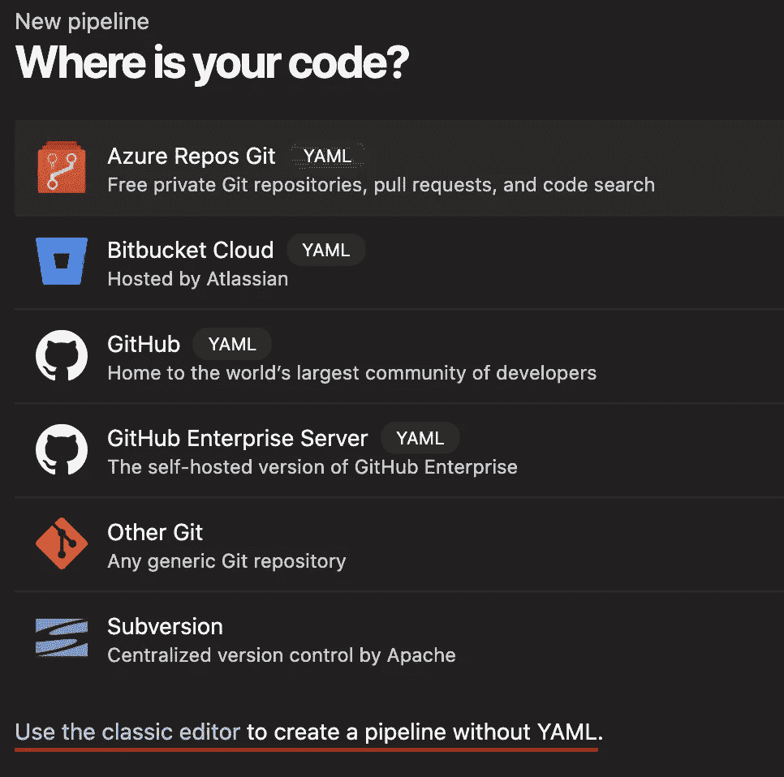

说真的，你的代码呢？

转到左边的管道选项卡，然后创建一个新的。当源列表显示时，点击底部的链接切换到**经典编辑器。**

我现在将远离 YAML 文件，因为向导使事情变得很容易。

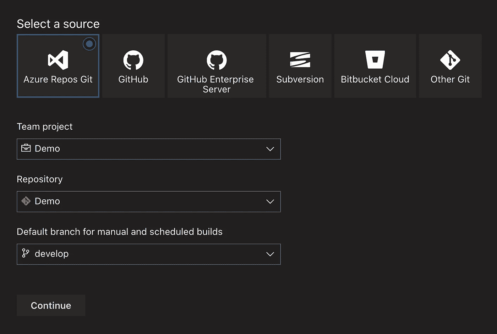

当您看到经典管道向导时，首先选择您的存储库。

在下一页，使用一个**空模板**，这样我们就可以随心所欲地装饰它。

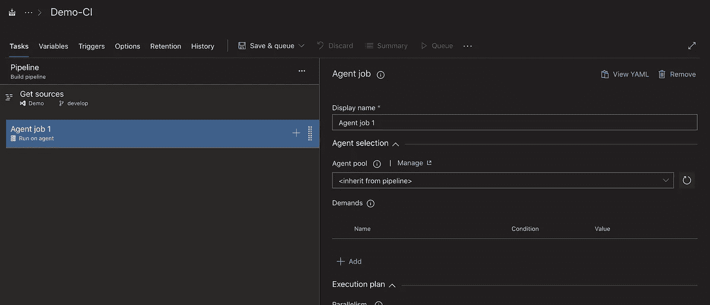

在左侧窗格中，' *Get Sources'* 部分显示了我们的代码库和将用于该管道的分支。下面的部分向我们展示了任务的占位符。我只会重新命名工作的名称。其余的设置在我看来都不错。

点击该行右侧的加号按钮。这将提示另一个屏幕，让我们为我们的管道选择任务。

**I) NodeJs 工具安装程序**

为了能够构建分支，我们需要在代理上运行构建命令。我们需要 NodeJs 来使用 npm 执行我们的构建命令。向下滚动并添加 **NodeJs 工具安装程序**。

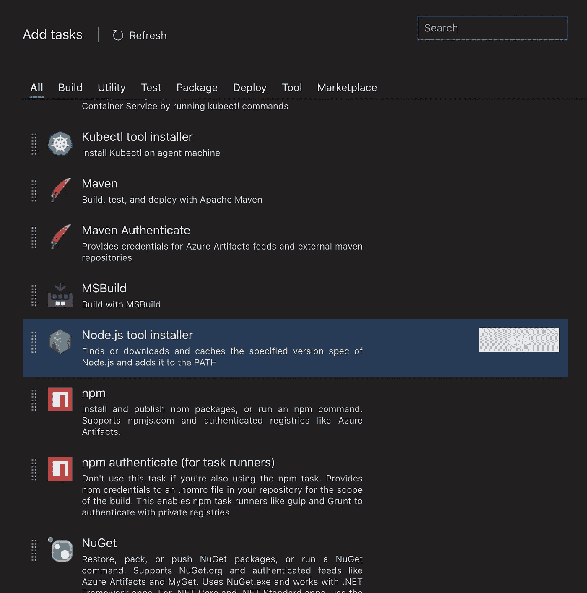

选择以下版本:

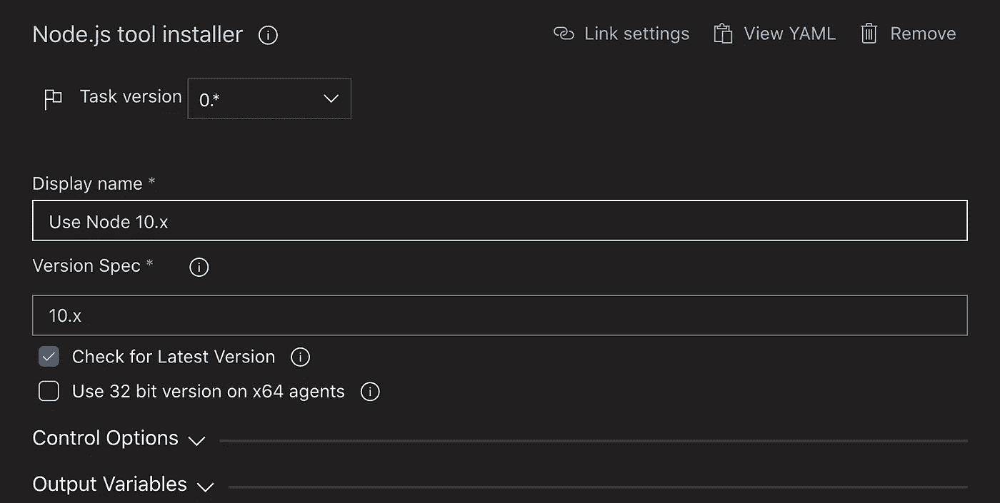

在我的例子中，node v10.x 为我的项目工作，如果你需要一个特定的版本，把它放在那里。

**II)安装依赖关系**

在构建之前，就像我们在本地上做的一样，安装所有 npm 依赖项:

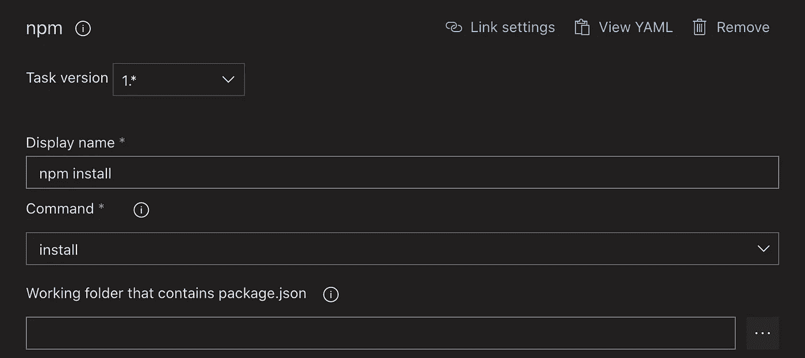

**如果您的 package.json 在另一个文件夹中，请选择该文件夹。如果它在根目录中，请将其留空。*

**三)建设项目**

我们需要运行另一个 npm 任务来构建。添加相同类型的任务来运行 Ionic 的构建脚本。

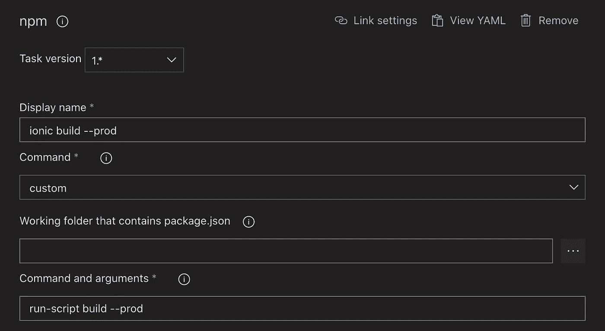

这时，如果你保存配置然后运行；您将看到构建将会成功。现在我们要把那些神器打包，提取到目标。

*发布管道需要最后两个步骤。我们需要 build & publish 工件来发布应用程序。*

**IV)归档构建工件**

默认情况下，构建工件位于项目根目录下的“www”文件夹中。(您可以通过查看 **angular.json** 文件来检查位置信息)。我们将打包构建输出，这样我们就可以为发布管道发布工件包(我们也可以轻松地下载它进行故障排除)。添加另一个任务，搜索“存档文件”。配置如下所示:

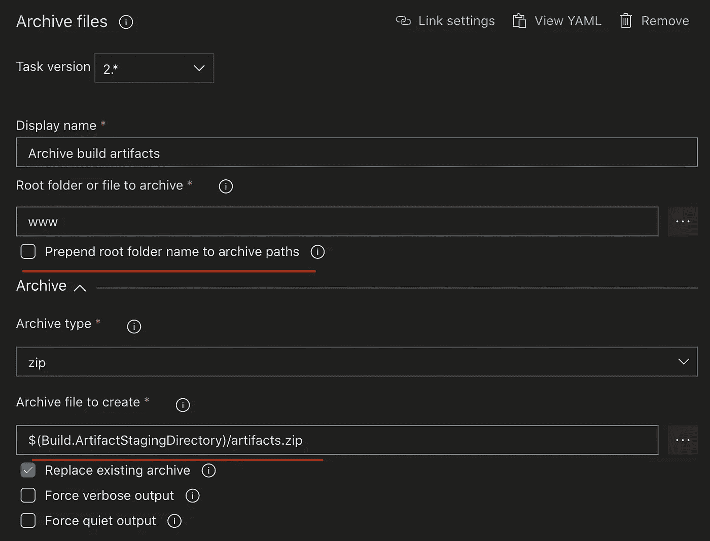

**要存档的根文件夹或文件**:在设置要存档的文件夹时，取消选中上图中我标记的文本框。如果选中，您的文件夹将与该文件夹一起存档，如果不选中，该文件夹的内容将被存档。

**创建**路径的归档文件应该是`$(Build.ArtifactStagingDirectory)/<filename>.zip` ，这样下一个任务才能工作。

现在我们有了一个包含我们的应用程序的 zip 文件。

**V)发布构建工件**

我们将发布上一步中创建的 zip 文件。向管道添加另一个任务，并搜索 **Publish Build 工件。**

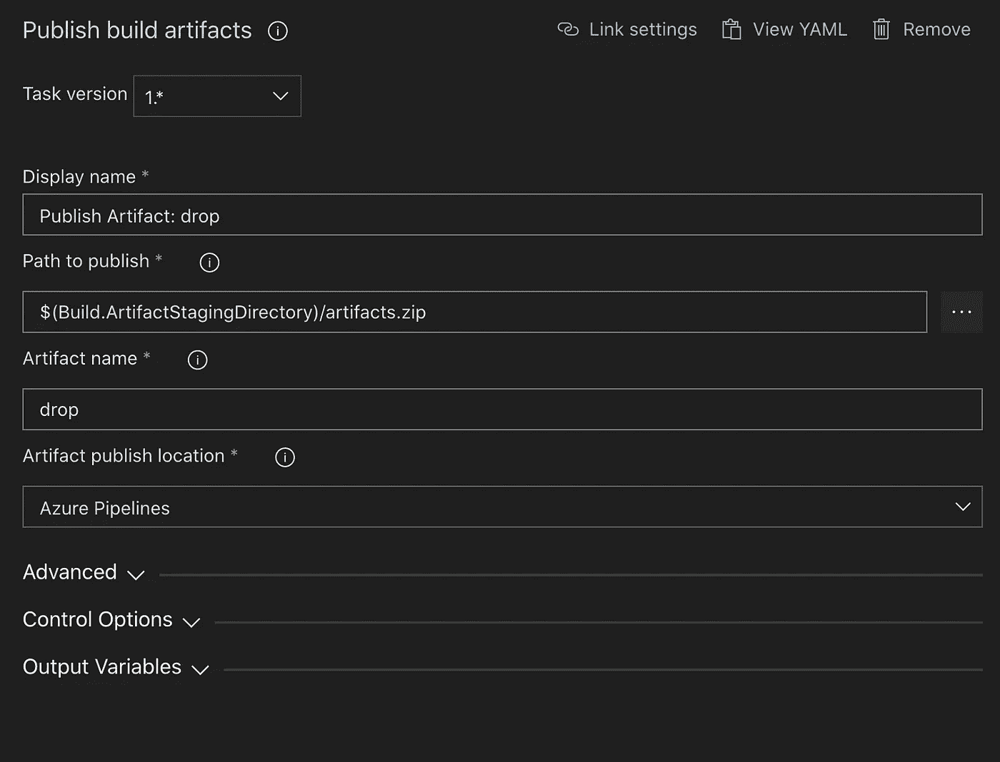

**发布路径**应该与归档任务目的地相同。

现在我们已经成功地创建了一个**构建管道。在创建发布管道之前，让我们准备 Azure 上的应用服务。**

## **2- Azure 应用服务**

跳转到 [Azure 门户](http://portal.azure.com)并创建一个资源组，以便能够创建一个应用服务。


然后，创建一个应用服务。


应用程序服务的配置如下图所示:

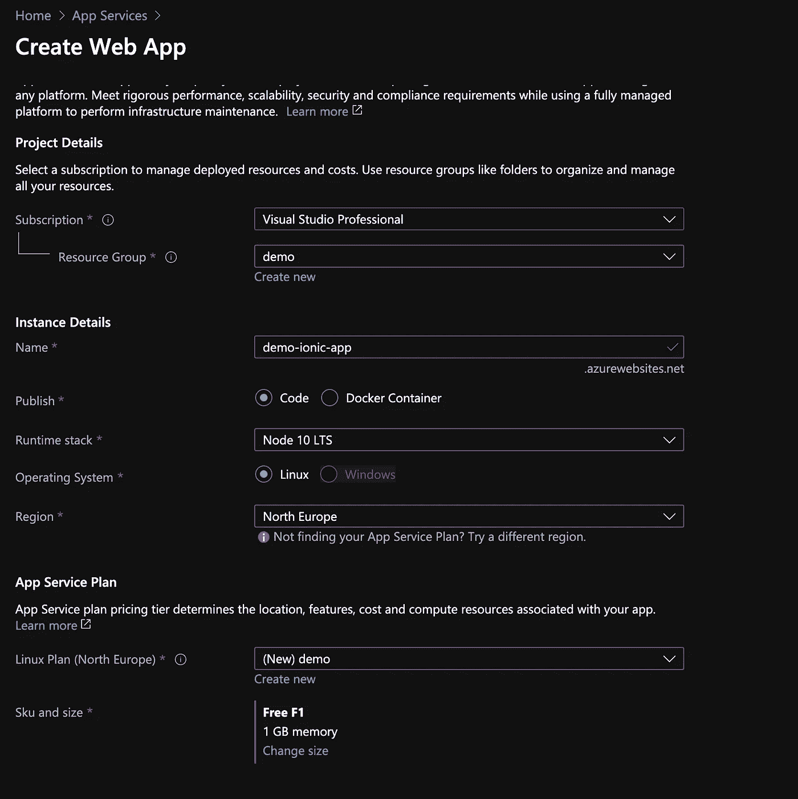

```
**Subscription     :** I already have a Visual Studio Professional Subscription provided by my company. But for new users, [Azure gives free credit for 12 months](http://azure.microsoft.com/en-us/free) or ask your company for a subscription.
**Resource Group   :** Select the resource group that we created in the previous step.
**Name             :** Give your app service a name.
**Publish          :** We are going to publish our build artifacts instead of a docker image. So select **Code.
Runtime Stack** : In the build pipeline, we create a task to install Node 10.x. So select the same version here.
**Operating System** : Linux 
**Linux Plan       :** Create a new plan
```

***—为什么是 Linux？*** *因为用 Linux 托管一个 app 相对便宜。同样配置的 Windows 服务，价格几乎翻倍。*

点击**查看和创建**按钮创建应用服务。

现在，您可以导航到您的应用程序服务详细信息并进行浏览。默认情况下，您会看到一个欢迎页面。

## 3-释放管道

您可以在构建管道中直接将您的构建推送到应用服务中，对此没有限制。但是，您可能需要将不同的构建部署到不同的阶段。这就是为什么我们需要一个不同的管道来发布。

现在，在**管道>发布**之后，从左侧菜单转到发布页面，并创建一个新的。

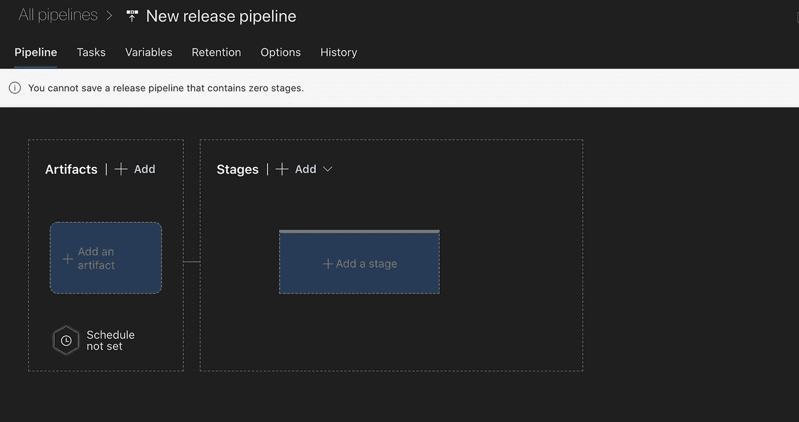

在左侧的窗格中，我们需要设置要部署的包。在右边的窗格中，我们将添加一个新的 stage，它将代表我们在上一步中创建的 Azure 应用服务。

单击“添加工件”框，选择您的构建管道作为源，然后保存它。现在 pipeline 知道发布什么但是不知道在哪里发布。单击“添加阶段”。

选择“Azure 应用服务”作为模板，为其命名，然后关闭它。现在，您将看到一个未配置的阶段。单击“查看阶段任务”进行修改。


在修改任务之前，最好提一下我们需要一个工具来服务 ionic app。在我的例子中，我选择带有 NodeJs 的 **ExpressJs** 来提供我们应用程序的静态文件。

所以我们需要一个小型的 ExpressJs app。在发布管道上，我将准备一个小型 NodeJs 应用程序，并将其与 Ionic build 合并。

**I)提取工件到一个文件夹**

使用“提取文件”任务将工件的内容提取到以下路径。

```
$(System.DefaultWorkingDirectory)/_pipelines-demo-CI/drop/node-app
```


**II)添加 package.json**

为了能够在 NodeJs 上提供我们的应用程序，我们需要两个包:

*   表达
*   压缩

在运行`npm install`之前，使用**命令行**任务添加一个 package.json 文件:

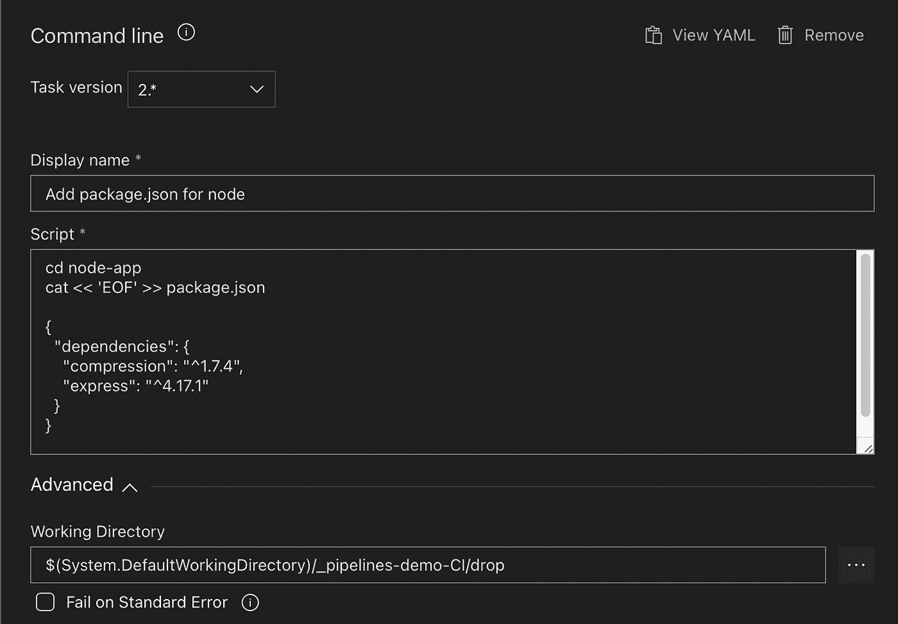

跳转到 node-app 文件夹，然后添加文件内容。整个剧本如下:

```
cd node-app
cat << 'EOF' >> package.json{
  "dependencies": {
    "compression": "^1.7.4",
    "express": "^4.17.1"
  }
}EOF
```

**III)添加 node-start.js**

我们需要一个合适的 js 文件来启动节点服务器。添加另一个**命令行**任务，并添加一个插入以下内容的文件:

```
cd node-app
cat << 'EOF' >> node-start.jsvar express = require("express"),
  path = require("path"),
  fs = require("fs");
var compression = require("compression");
var app = express();
var staticRoot = __dirname + "/";
var env = process.env.NODE_ENV || "development";app.set("port", process.env.PORT || 5000);app.use(compression());app.use(express.static(staticRoot));app.get('*', (req, res) => 
{
    var pattern = new RegExp('(.css|.html|.js|.ico|.jpg|.jpeg|.png)+$', 'gi');
    if (pattern.test(req.url)) {
      res.sendFile(path.resolve(__dirname, req.url));
    } else {
      res.sendFile(path.resolve(__dirname, '../../public/index.html'));
    }
 });app.listen(app.get("port"), function () {
  console.log("app running on port", app.get("port"));
});EOF
```

**IV)安装 NodeJs 应用程序的依赖关系**

像我们在创建构建管道时所做的那样，添加一个 **npm** 任务。

> 不要忘记设置 package.json 文件路径。

**V)部署到 Azure Web 应用**

为最后一步添加新任务。搜索“Azure Web App”。

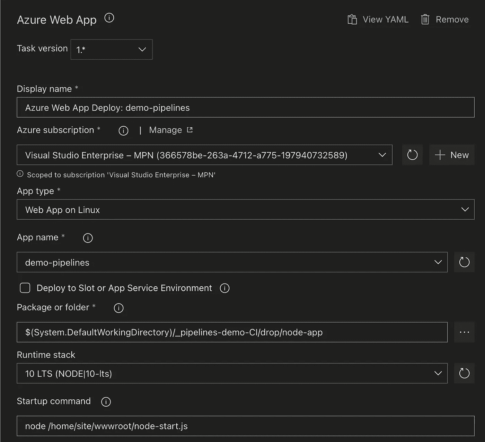

如果团队项目中没有活动的 Azure 连接，它会提示您添加一个新的。设置连接后，您会看到一个类似上面的屏幕。

```
**Azure subscription :** Your subscription will appear after creating the connection.
**App type           :** Web App on Linux (because we created an app service selecting Linux).
**App name           :** Select your app service name.
**Package or folder** : Select the folder that contains our NodeJs app.
**Runtime stack      :** 10 LTS
**Startup command **   : node home/site/wwwroot/node-start.js
```

保存它并创建一个新的版本来检查管道。它应该能够成功发布该版本。


成功发布

现在，让我们将构建和发布管道连接起来，这样当您将变更推送到您的主分支时，它将自动构建和部署。

## 四触发器

**I)将变更推送到分支后触发构建**

导航到构建管道，单击编辑，并从顶部选择“触发器”选项卡。


勾选*启用持续集成*，选择想要的分支，然后保存。现在，您的构建管道将在变更被推送到目标分支后立即排队。

**II)构建后触发释放管道**

打开你的发布管道。在工件窗格中，单击右上角的按钮。

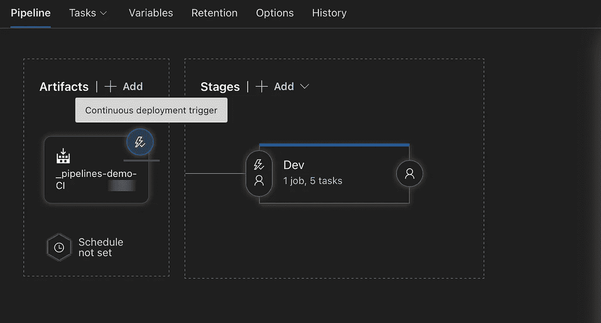

启用连续部署触发器:

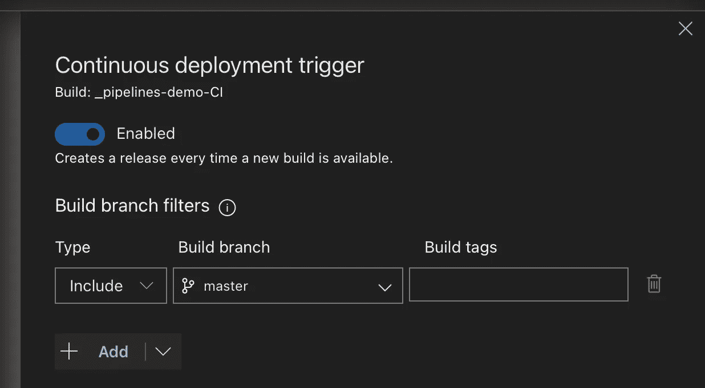

# 解决纷争

在创建成功的管道时，我失败了太多。这里有两个对我帮助很大的提示:

## I)检查您在哪个文件夹中

使用“终端”任务，您可以将当前文件夹打印到日志中。

运行终端任务时，您可以使用`ls -l` for Linux terminal 列出您当前所在的所有内容，这样您就可以检查是否有文件丢失。使用`pwd`命令将向您显示完整的路径，这样您可以跳转到目标文件夹来运行实际的命令。否则，很难发现管道的问题

## II)更改启动命令以检查应用服务有什么问题

即使您的发布管道成功地将内容推送到服务器，您的应用程序也可能在冷启动时崩溃。如果删除该命令，应用程序将显示默认页面。

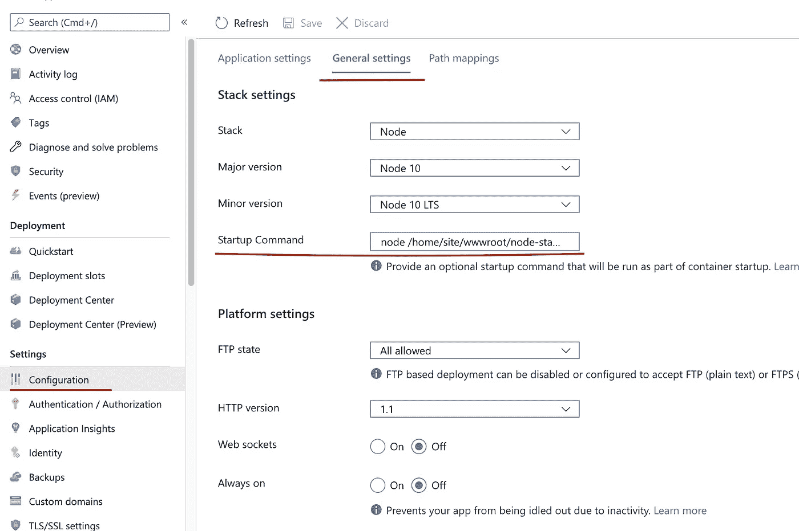

然后，您可以浏览在线 SSH 工具来检查问题。就我而言，我在设置 NodeJs 应用程序时经常使用它。

我希望这篇教程能帮助你探索 Azure 上的管道。如果你认为这篇文章中有误导信息，请与我分享，以便我可以修复它。

祝你好运！