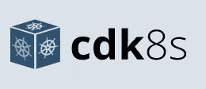

# 使用 CDK8s 部署 Kubernetes 资源

> 原文：<https://itnext.io/deploying-kubernetes-resources-with-cdk8s-2c8b07bc45b1?source=collection_archive---------1----------------------->



在之前的帖子中，我讨论了:

*   [使用 AWS CDK 构建亚马逊 EKS 集群](https://jimmy-ray.medium.com/aws-cdk-where-imperative-meets-declarative-3d23fd4a4dbd)
*   [使用 Kubernetes 清单通过 AWS CDK 部署 Kubernetes 应用](/aws-cdk-for-eks-kubernetes-manifest-handling-ebdec52e7f01)
*   [使用舵轮图通过 AWS CDK 部署 Kubernetes 应用](/aws-cdk-for-eks-handling-helm-charts-aa002afedde4)

在这篇文章中，我将展示如何使用 Java 的[Kubernetes 云开发工具包(CDK8s)](https://cdk8s.io/) 来生成 Kubernetes 资源(YAML)。

# CDK8s

根据项目文件:

> CDK8s 是一个软件开发框架，使用熟悉的编程语言和丰富的面向对象 API 来定义 Kubernetes 应用程序和可重用的抽象。CDK8s 生成纯 Kubernetes YAML —您可以使用 CDK8s 为任何地方运行的任何 Kubernetes 集群定义应用程序。

CDK8s 类似于 AWS CDK。它使用代表 Kubernetes 资源及其特性的结构。

> CDK8s 应用程序是用受支持的编程语言之一编写的程序。它们被构造成一个构造树。

在本文撰写之时，CDK8s 支持 *TypeScript、Python、*和 *Java* 。像以前使用 AWS CDK 一样，我使用 Java 和 CDK8s。

# 使用 jsii 的多语言

像 AWS CDK 一样，CDK8s 构建在 TypeScript 和 [jsii](https://github.com/aws/jsii) 之上。使用 jsii，开发人员可以从 typescript 模块中创建带类型注释的包，这些包可以用来自动生成各种目标语言的惯用包。生成的类型代理对嵌入式 javascript VM 的调用，有效地允许 jsii 模块“一次编写，随处运行”。

# 装置

为了使用 CDK8s，我用以下命令安装了它:

```
$ npm install -g cdk8s-cli
```

> 该命令也可用于升级 CDK8s CLI。

安装完成后，我用下面的 CDK8s CLI 命令在一个空的目录中创建了一个新的 CDK8s 项目:

```
$ cdk8s init java-app
```

以下输出表明该项目是为 Java 初始化的:

```
cdk8s --version
1.0.0-beta.26Initializing a project from the java-app template
====================================================================Your cdk8s Java project is ready!cat help      Prints this message
   cdk8s synth   Synthesize k8s manifests to dist/
   cdk8s import  Imports k8s API objects to "src/main/java/imports/"
   mvn compile   Compiles your java packagesDeploy:
   kubectl apply -f dist/*.k8s.yaml====================================================================
```

# CDK8s 代码

我的 CDK8s Java 代码是一个单独的 Java 类，它扩展了 *org.cdk8s.Chart* 类。

```
package io.jimmyray.app;import imports.k8s.*;
import software.constructs.Construct;import org.cdk8s.App;
import org.cdk8s.Chart;
import org.cdk8s.ChartProps;import java.util.ArrayList;
import java.util.HashMap;
import java.util.List;
import java.util.Map;public class Main extends Chart {public Main(final Construct scope, final String id) {
        this(scope, id, null);
    }public Main(final Construct scope, final String id, final ChartProps options) {
        super(scope, id, options);Map<String,String> labelsMap = Map.of("app","cdk8s-read-only","env","dev", "owner", "jimmy");ObjectMeta nsMeta = ObjectMeta.builder()
                .name("cdk8s-read-only")
                .labels(labelsMap)
                .build();KubeNamespace.Builder.create(this,"cdk8s-ns")
                .metadata(nsMeta)
                .build();// LoadBalancer Service
        final String serviceType = "LoadBalancer";
        final Map<String, String> selector = new HashMap<>();
        selector.put("app", "cdk8s-read-only");
        final List<ServicePort> servicePorts = new ArrayList<>();
        final ServicePort servicePort = new ServicePort.Builder()
                .port(80)
                .targetPort(IntOrString.fromNumber(8080))
                .build();
        servicePorts.add(servicePort);
        final ServiceSpec serviceSpec = new ServiceSpec.Builder()
                .type(serviceType)
                .selector(selector)
                .ports(servicePorts)
                .build();
        final KubeServiceProps serviceProps = new KubeServiceProps.Builder()
                .metadata(
                        ObjectMeta.builder().name("cdk8s-read-only")
                        .namespace("cdk8s-read-only")
                        .labels(labelsMap)
                        .build()
                )
                .spec(serviceSpec)
                .build();new KubeService(this, "service", serviceProps);// Deployment
        final LabelSelector labelSelector = new LabelSelector.Builder().matchLabels(selector).build();
        final ObjectMeta templateMeta = new ObjectMeta.Builder()
                .labels(labelsMap).build();
        final ObjectMeta deployMeta = new ObjectMeta.Builder().namespace("cdk8s-read-only")
                .labels(labelsMap).name("cdk8s-read-only").build();
        final List<ContainerPort> containerPorts = new ArrayList<>();
        final ContainerPort containerPort = new ContainerPort.Builder()
                .containerPort(8080)
                .build();
        containerPorts.add(containerPort);
        final List<Container> containers = new ArrayList<>();
        final Container container = new Container.Builder()
                .name("cdk8s-read-only")
                .image("public.ecr.aws/r2l1x4g2/go-http-server:v0.1.0-23ffe0a715")
                .ports(containerPorts)
                .build();
        containers.add(container);
        final PodSpec podSpec = new PodSpec.Builder()
                .containers(containers)
                .build();
        final PodTemplateSpec podTemplateSpec = new PodTemplateSpec.Builder()
                .metadata(templateMeta)
                .spec(podSpec)
                .build();
        final DeploymentSpec deploymentSpec = new DeploymentSpec.Builder()
                .replicas(1)
                .selector(labelSelector)
                .template(podTemplateSpec)
                .revisionHistoryLimit(3)
                .build();
        final KubeDeploymentProps deploymentProps = new KubeDeploymentProps.Builder()
                .metadata(deployMeta)
                .spec(deploymentSpec)
                .build();new KubeDeployment(this, "deployment", deploymentProps);
    }public static void main(String[] args) {
        final App app = new App();
        new Main(app, "tmp");
        app.synth();
    }
}
```

在前面的代码中，我使用来自 [CDK8s API](https://cdk8s.io/docs/latest/reference/index.html) 的[构造](https://cdk8s.io/docs/latest/concepts/constructs.html)创建了三个 Kubernetes 资源(*名称空间、服务、部署*)。

## 命名空间

名称空间是最简单的。首先，我为想要包含在所有资源中的公共标签创建了一个 map 对象。然后，我创建了一个元数据对象( *ObjectMeta* )来存放标签映射。最后，我使用了 *KubeNamespace 的流畅界面。构建器*通过[组合](https://www.geeksforgeeks.org/composition-in-java/)构建 Kubernetes 名称空间，类似于 AWS CDK。

## 服务

服务资源 type [LoadBalancer](https://kubernetes.io/docs/concepts/services-networking/service/#loadbalancer) 稍微复杂一些，但是我也使用了规定的组合方法来构建一个对象图，该图表示服务规范和相关属性。在这个过程中，我创建了包含在 *KubeServiceProps* 中的 *ServiceSpec* ，它被添加到 *KubeService* 顶级对象中。

需要指出的是，我指定了一个可重用的地图对象(*选择器*)，用于定义服务如何选择窗格。接下来，这个映射将在部署规范中重用。

## 部署

部署资源构建过程与服务非常相似，尽管更复杂。我首先使用 fluent 接口和组合构建了部署的各个部分，例如 *ObjectMeta* 、 *Container* 、 *PodSpec* 、 *PodTemplateSpec* 、 *DeploymentSpec* 和 *KubeDeploymentProps* 对象。我用这些来组成 KubeDeployment 对象。

# 生成 YAML

代码编写完成后，我使用 CDK8s CLI *synth* 命令生成了 YAML 文件。为了让 *cdk8s synth* 命令工作，生成的 Java 类必须存在于*目标*文件夹树中。我选择运行 Maven 命令来清理和编译 Java 类，然后运行 CDK8s CLI 命令:

```
mvn clean compile && cdk8s synth
```

这种方法也确保了我总是使用最新版本的 Java 源代码。

生成的 YAML 文件位于以下路径:

```
dist/tmp.k8s.yaml
```

YAML 文件中定义了以下资源:

```
apiVersion: v1
kind: Namespace
metadata:
  labels:
    app: cdk8s-read-only
    env: dev
    owner: jimmy
  name: cdk8s-read-only
---
apiVersion: v1
kind: Service
metadata:
  labels:
    app: cdk8s-read-only
    env: dev
    owner: jimmy
  name: cdk8s-read-only
  namespace: cdk8s-read-only
spec:
  ports:
    - port: 80
      targetPort: 8080
  selector:
    app: cdk8s-read-only
  type: LoadBalancer
---
apiVersion: apps/v1
kind: Deployment
metadata:
  labels:
    app: cdk8s-read-only
    env: dev
    owner: jimmy
  name: cdk8s-read-only
  namespace: cdk8s-read-only
spec:
  replicas: 1
  revisionHistoryLimit: 3
  selector:
    matchLabels:
      app: cdk8s-read-only
  template:
    metadata:
      labels:
        app: cdk8s-read-only
        env: dev
        owner: jimmy
    spec:
      containers:
        - image: public.ecr.aws/r2l1x4g2/go-http-server:v0.1.0-23ffe0a715
          name: cdk8s-read-only
          ports:
            - containerPort: 8080
```

# 适用于 Kubernetes

现在生成了之前的 YAML，我可以使用下面的 *kubectl* 命令来应用 YAML 中定义的集群更改:

```
kubectl apply -f dist/tmp.k8s.yaml
```

结果是目标 Kubernetes 集群中的名称空间、部署和服务。

# 摘要

像 [AWS CDK](https://aws.amazon.com/cdk/) 一样，CDK8s 使开发人员能够使用编程语言生成声明性配置。在 CDK8s 的情况下，包含资源清单的 YAML 文件被创建，以在对 *kubectl* 的单独调用中应用于 Kubernetes。

**支持 GitHub 库:**【https://github.com/jimmyraywv/cdk8s-java 