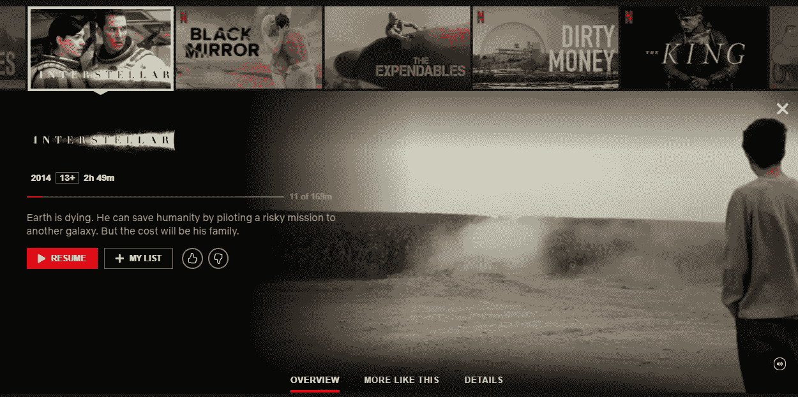
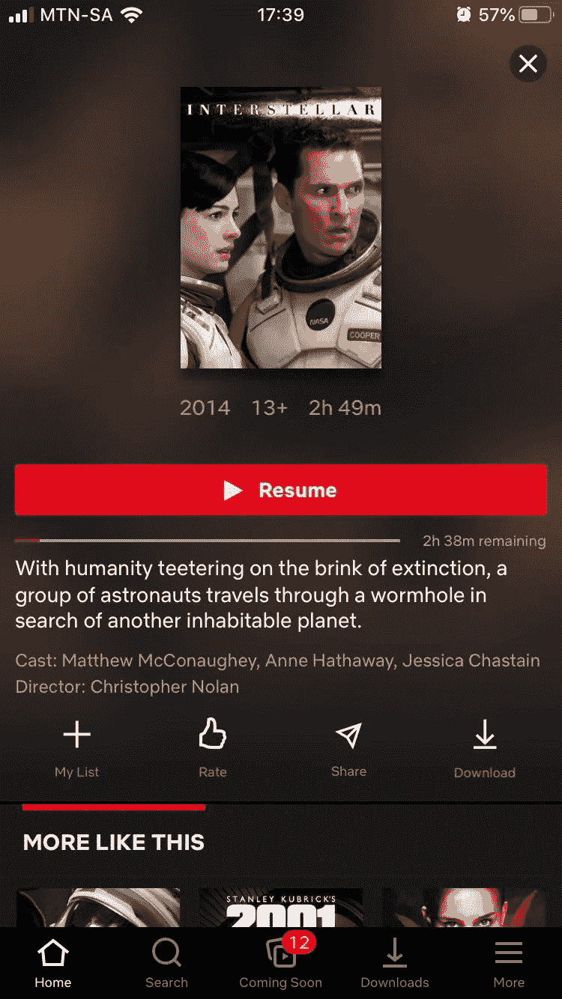
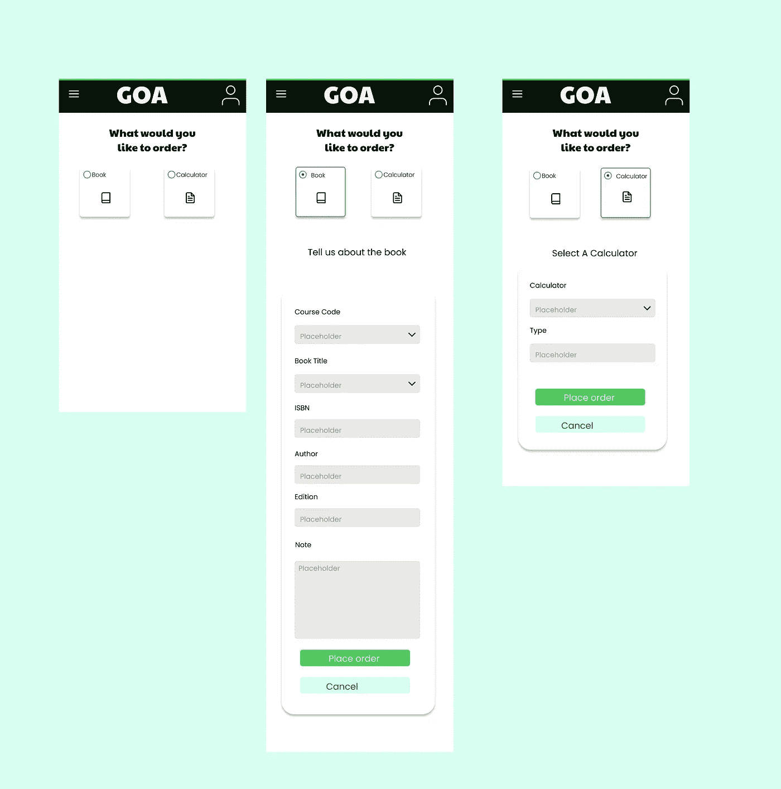
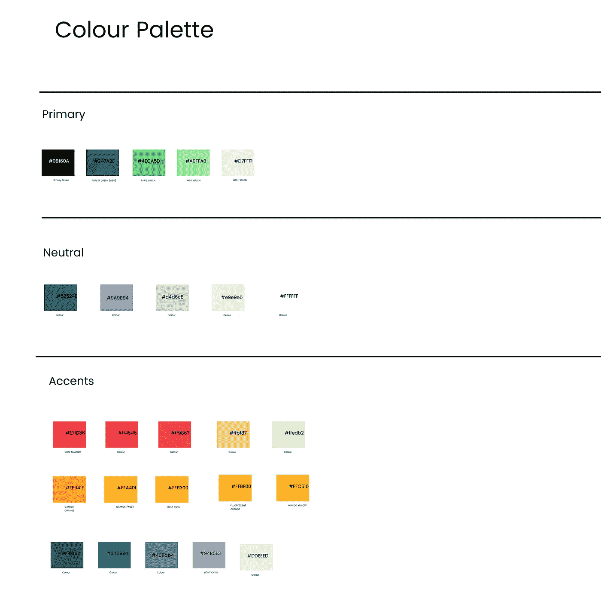
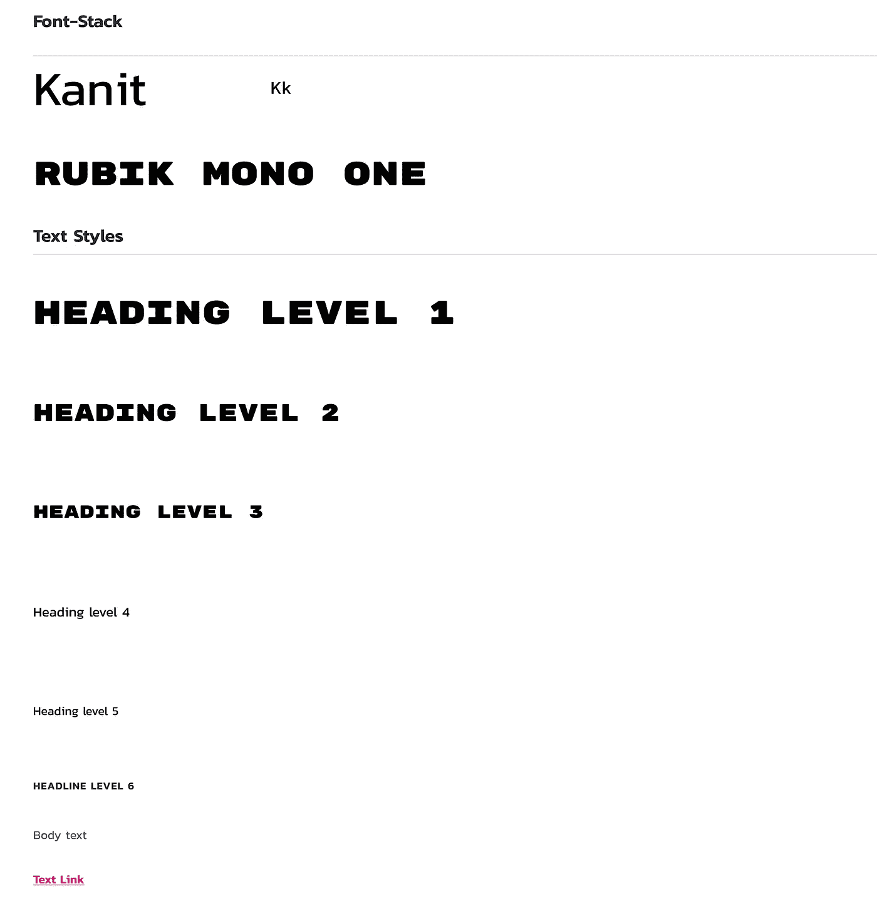
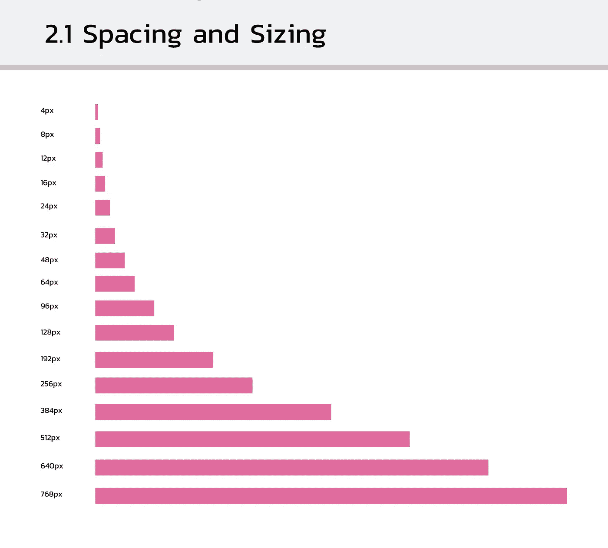
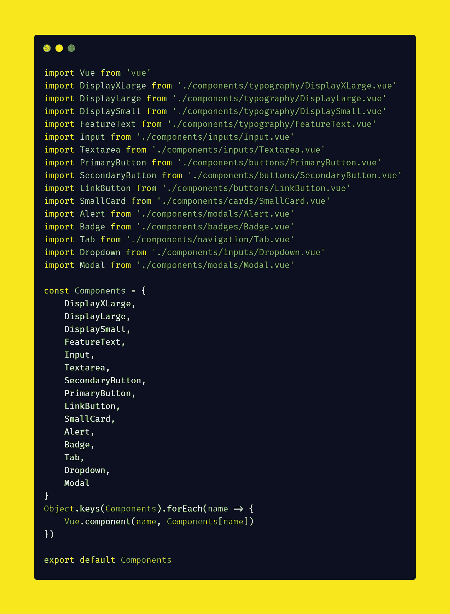
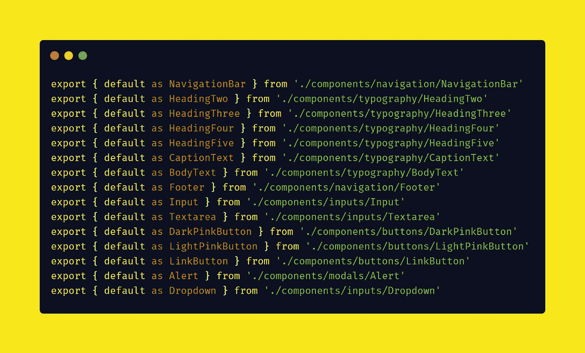
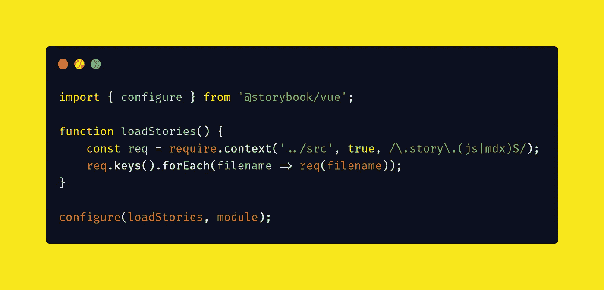

# 设计系统从零到英雄🎉

> 原文：<https://itnext.io/design-systems-zero-to-hero-5eacf6dde999?source=collection_archive---------3----------------------->

我如何升级我的设计系统游戏，并在 React 和 Vue 中制作了两个组件库。

我在这个 Whatsapp 小组，那里肯定只有大约 100 名开发人员在研究区块链、机器学习和网络开发，我一直认为让人们以解决问题为生是一种浪费，我们没有分享或展示我们制作的酷东西。所以我组织了一次聚会，5 个人参加了，我做了一个关于设计系统的怪物般的演讲，这就把我们带到了你正在欣赏的这个非常中等的帖子。这个演讲的链接可以在[这里](https://www.figma.com/proto/KedEPuWZk0CXWWNAEf806cOZ/GOA?node-id=1692%3A35&scaling=scale-down)找到。

在这篇文章中，我将带你了解我是如何构建两个设计系统，并在 Vue 中制作组件库，分别名为 [Narshik](https://github.com/pimp-my-book/narshik) 和 React 中名为 [Umqombothi](https://github.com/pimp-my-book/umqombothi-component-library/blob/master/src/index.js) 。希望通过跟随，你也可以很快建立自己的网站。然而，输出是真正的骨架，目标是让你的设计系统在野外被用于你的应用和营销活动。

# **设计系统为什么存在？**

设计系统的存在纯粹是因为它们帮助团队为他们的产品或服务提供一致的品牌和用户体验。

你的品牌在哪里，你的用户就在哪里。网络、手机、印刷品、电影和服装只是你的客户/用户与你的品牌互动的几个地方。

设计系统有助于弥合这些不同平台之间的差距，并为您的团队提供如何执行设计和品牌的指导方针。

**让我们看看一家在大规模设计方面做得非常出色的公司的实际表现**:

> 网络上的网飞
> 
> iOS 上的网飞

网飞品牌始终如一，因为无论我在哪里观看，它的外观和感觉都是一样的。其他很酷的例子无处不在，查看[牛逼的设计系统](https://github.com/alexpate/awesome-design-systems)回购获得更多例子。

# **它如何提高你作为设计师/工程师的能力？**

感谢泰勒·麦金尼斯，在我确定了它存在的原因后，我总是问自己一个工具、思想流派或工作流程如何提高我的工作能力。我对设计系统的推理如下:

**您可以更快地制作原型**

当构建东西时，你要确保你能够确保你的业务需求是合理的。因此，当制作高保真原型时，管理应用程序的样式并确保用例有效的认知负荷真的会让我吃不消。此外，如果模型看起来不够真实，你将很难从你的团队和决策者那里得到重要的认同。

学生可以在三个屏幕上选择订购书籍或计算器。

这花了我大约 15 分钟的时间，同时查看了一个有两个不同可选步骤的用例。由于我能够随意地轻松拖放组件，所以我能够专注于业务需求并获得利益相关者的批准，然后才担心从 UX 的角度来看可能会影响设计的小细节。

**启用组件间的代码共享**

[给我的书拉皮条](http://pmbnewsroom.netlify.com)推出了一款名为 [GOA](https://gogoa.co.za/) 的助学金应用，帮助获得大学助学金的学生订购教育材料，并帮助助学金减少浪费。因此，我最初在 Vue 中制作了一个登录页面，然后一个月后，我需要一个工具来帮助我编写应用程序的文档。因此，在用 [VuePress](https://vuepress.vuejs.org/) 浪费了一段时间之后，我使用了 [Gridsome](https://gridsome.org/) ，当我在 [docs 站点](https://help.gogoa.co.za/)上开始在项目之间复制和粘贴代码时。这真的很难看也很痛苦，但是我没有时间浪费在制作 docs 网站上，所以没有理由需要从 Narshik 开始。然而，创建 docs 站点是一个有趣的风险，因为团队中没有人能看到我们需要它，并且不相信它能及时发布。

# **建立⚡️设计体系的阶段**

所以我经历了两个阶段:设计和工程。

在设计阶段，您需要在您选择的设计工具中推出 UI 套件，而在工程阶段，您需要为您的目标平台(Web、iOS/Andriod、watchOS、tvOS 等)打包的组件库。

## **设计阶段概述**

我有时有点像一个人的团队。因此，在项目的这个阶段做过多的设计是不明智的，而是要保持简单。如果你在一个更大的团队中，我仍然建议你尽量保持这个阶段简单，并确保工程师参与你的组件外观计划。因为你可能会想出一个你的工程团队可能不知道如何实现的设计(尽管这是我们的工作😝)而且组件的运输时间会更长，因为他们现在必须想办法让你的过度设计的组件发挥作用。

***设计工具:选择一个***

说到设计工具，很容易不知所措。所以我会为你做决定！

> [FIGMA](http://figma.com) 就是这条路！ [FIGMA](http://figma.com) 就是这条路！ [FIGMA](http://figma.com) 就是这条路！ [FIGMA](http://figma.com) 就是这条路！

***为什么是 Figma？***

除了一个非常慷慨的免费层之外，你还拥有所有重要的功能来提高工作效率，而不需要花钱。

它主要基于网络，因此它无需特定的操作系统或设备就能解决可访问性问题。

随之而来的是简洁的高级特性，比如本地风格和在其他页面访问组件的能力。这个视频很好地解释了本地风格的概念:

Figma 教程:创建样式

最重要的是，你可以在上面演示、设计各种应用程序和托管原型。最近，插件刚刚推出，这意味着其他制造商正在向 Figma 引入扩展功能以及原型动画的能力。现在它基本上是设计师工作流程中所有事情的一站式商店。我还认为 Figma 在 Web Assembly 的帮助下使用了 C++。这只是进一步证实了 Figma 带来的热量有多大！！！👀

***开始上颜色&排版***

一旦你设置好了颜色和字体，你就走上了成功之路。只需进入 [Dribbble](https://dribbble.com/) 或 [Pinterest](http://pinterest.com/) ，搜索/滚动所有你喜欢的艺术用户界面，窃取它们的调色板。

Figma 果阿的彩色托盘。

你需要至少有两种基色和颜色。所以如果我们看果阿的 DS，我设置一个基色，然后我从基色中增加两个暗色调和两个亮色调来得到另外四个色调。然后对你的口音做同样的处理，你的口音将永远是黄色、蓝色、红色、白色和灰色。如需调色板，请访问 [coolours](http://coolors.co/) 或 [colourhunt](https://colorhunt.co/) 。我以绿色(#4ECA5D)为主要颜色，但我使用最浅的绿色作为次要颜色(#D7FFF1)。

对于你的排版，只需从[谷歌字体](https://fonts.google.com/)中选择两种字体，一种用于标题，另一种用于正文。然后有五六个主标题，有正文，标题和你想要实现的任何文本样式。

最重要的是，系统化字体大小和间距:

这只是为了间距，但是，你可以有类似的系统化的网格间距。

***使用预制组件***

如果你正坐在你选择的设计工具中，从头开始制作组件，比如制作一个矩形，添加宽度、边框半径等等，来制作一个按钮，那么你需要重新考虑你如何珍惜你的时间。使用预制的[用户界面库](https://www.figmacrush.com/free-figma-ui-kits/)来支付费用，然后根据你设定的颜色和字体来定制一切，以体现你产品的身份。

我一直在使用[产品设计工具包 1.0](http://pdkit.co) ，它非常有用。它带有预制的 web 用户界面组件，一个方便的风格指南，所有设置本地风格和组件的艰苦工作已经为你做好了。这是一个很好的起点，会让你更快地变得富有成效。

*应该不会超过五天*

*在这个设计阶段，不应该花费超过一个工作周的时间来让 UI 库为您构建高保真的模型。*

*我们这样做的目的是确保您能够更快地交付您的项目，因为关键的利益相关者可能无法检测到您项目中的实际进展。*

*如前所述，经过一周的设计，您需要在您选择的设计工具中加入一个 UI 工具包。以下是 Figma 中 GOA 和 PMB +设计系统的链接:*

*💎[果阿](https://www.figma.com/file/KedEPuWZk0CXWWNAEf806cOZ/GOA?node-id=0%3A1)*

*💎 [PMB +](https://www.figma.com/file/MH0ruI8pUrg7s2NXM4jra59W/PMB-%2B?node-id=0%3A1)*

## ***工程阶段概述💅***

*所以现在你完成了设计工作。我们要给事物带来生命！您希望开始计划如何创建一个代码库，该代码库对于其他人来说是可维护的，并且具有令人敬畏的开发人员体验。*

****选择一个框架/语言****

*我已经为分别用 Vue 和 React 编写的不同项目提供了两个组件库。我不能说我有最喜欢的，但背后的原因是我喜欢用 React 做更复杂的应用，用 Vue 做轻量级的应用。*

*所以选择任何一个，你应该是好的。然而，我主要考虑的是我的团队是否更大，以及人们是否知道如何在选择的框架中运送东西。如果您需要有人为您做一些事情，并且他们了解框架，那么事情会变得容易得多，因此您不必对他们的绝地技能进行不必要的测试。*

****为你的 CSS 决定一个策略****

*所以我选择在我的两个项目中使用 [TailwindCSS](https://tailwindcss.com/) 。这是因为它允许我完全控制自定义样式和实用程序类的使用。这意味着我可以完全抛弃 BEM 和样式组件。*

*就我个人而言，我不喜欢覆盖其他 UI 库中的现有样式。这通常让我检查开发工具只是为了改变颜色。然而，对于像 accordion 这样的复杂组件，只需从流行的库中导入特定的组件，并经历定制它的痛苦。🙃*

***您组件的游乐场***

*因此，在构建组件库时，您不能像构建普通的 web 应用程序那样构建它。这意味着没有路由。您需要弄清楚如何导出所有组件。*

**

*用 Vue 写的 Narshik 的 index.js*

*在 Narshik 的例子中，我导入了组件，并把它们放到一个对象中，循环遍历它们，把每个组件实例化为一个新的 Vue 组件。*

**

*用 React 编写的 Umqombothi 中的 index.js*

*而对于 Umqombothi，我所要做的就是将每个导出为一个命名的默认导出。*

*然后，一旦完成，你需要一个游乐场，允许你刷新和查看你正在构建的所有组件。在我的例子中，我第一次开始使用 [Styleguidist](https://github.com/styleguidist/react-styleguidist) ，但是我不喜欢它给我的使用更大组件的自由，所以我选择了[故事书](https://storybook.js.org/docs/basics/introduction/)并且再也没有回头。就像使用 Styleguidest 一样，您可以将视图组件部署为静态站点，我对 [Umqombothi](https://umqombothi.netlify.com/) 和 [Narshik](https://umqombothi.netlify.com/) 都是这样做的。*

*我在 Storybook 中发现的唯一一件事是，为了使用 PostCSS，我需要使用 Webpack，因为它是 TailwindCSS 的一个依赖项。除此之外，你只需要一个`storybook.config.js`文件，告诉 Storybook 在哪里可以找到你的故事:*

**

*storybook.config.js*

***CI/CD &出版***

*最初，当我开始构建这个库时，我试图将最简单的组件安装到 NPM，并通过将它安装在 CodeSandbox 应用程序中来验证它的工作。*

*要发布到 NPM，您只需:*

*1.注册一个账户*

*2.为您的应用程序生成令牌*

*所以我首先使用`npm publish`从我的机器进行本地部署。首先确保你已经使用`npm login` 命令登录到你的账户。然后 NPM 会处理剩下的事情。*

***在我介绍 CI/CD 之前，让我们简单介绍一下我的工作流程。***

*⚡️为组件创建一个分支，例如:功能/下拉菜单*

*⚡️Write 是我的组件的测试用例。在这里，我基本上陈述了它的功能需要是什么。*

*⚡️创建组件文件，例如:`Dropdown.vue`，我会添加一个普通的本地 HTML <选择>标签。*

*然后，⚡️创建一个“Dropdown.story.js”文件，以确保故事书服务器可以拾取它。*

*⚡️:然后我会出去构建组件，直到它与我在 Figma 的设计系统中的设计相匹配，并具有所需的功能。*

*⚡️Once:我很高兴我开始完成我的单元测试，并确保它在本地通过。*

*⚡️Then:我开始合并 PR，因为 Travis 与我的回购协议相关联，它将运行我所有的其他测试，以确保我在编辑任何其他组件时没有引入任何错误。*

*⚡️Once，测试已经通过，我将具体的 PR 与 master 和 Travis 合并，然后将代表我发布到 [NPM](https://www.npmjs.com/) 。*

*我使用来自[测试库](http://testing-library.com/)的 [React](https://testing-library.com/docs/react-testing-library/intro) 和 [Vue](https://testing-library.com/docs/vue-testing-library/intro) 实现。真的很容易使用，所有你需要的是 [Jest](https://jestjs.io/) 配置和安装任一库，你就可以走了。这里有一个关于如何思考测试的[链接](https://github.com/goldbergyoni/javascript-testing-best-practices)。*

*因此，持续集成/持续开发是一种实践，能够轻松地向您的代码库添加新代码，而不会破坏或引入新的代码库错误，同时能够频繁地部署新代码。以及自动化部署过程和测试运行。*

*(可能不准确，但这是我理解和实现它的方式)🏊*

*在工作中，我用 Travis 创建 NPM 图书馆，用 [Seed](https://seed.run/) 创建我的 Lambdas。而我使用为我的前端制作的配置项。*

*这些部署工具有助于您不必每次想要发布东西时都在终端中输入构建命令。所以对于 Travis，我只需要创建一个`[travis.yml](https://github.com/pimp-my-book/umqombothi-component-library/blob/master/.travis.yml)`文件，然后给它一个来自 NPM 的加密令牌。创建一个`.yml`文件是 CI/CD 工具中的一种常见做法，以进一步自动化整个过程，并根据您的需要配置您的部署。*

# ***TL；博士**😁*

*让我们总结一下:*

*🔩选择一组颜色，为你的字体设计选择两种字体*

*🔩在您选择的设计工具中使用现有的 UI 工具包*

*🔩根据您的品牌定制套件，并制作您需要的所有组件，以实现您想要的 UX*

*🔩从你选择的网络框架中的排版组件开始*

*🔩部署到 NPM 以验证一切正常*

*🔩设置 CI/CD +单元测试*

*🔩然后用单元测试逐个构建每个组件。基本上每个 PR 都应该是一个新的组件添加到库中供用户使用。*

*🔩重复这个循环，直到所有你需要的组件都完成。*

*好吧，但这一切都很好，然而，人们必须问，当你开始设计系统之旅时，你最有可能遇到什么问题？*

****时间*** ⏰*

*你是决定是否有时间开始一个设计系统的项目的最佳人选。所以，如果你有严格的最后期限，确保你是在承担一个计算好的风险。如果没有时间，最好的方法是至少拥有 Figma 中的设计系统，并在您的应用程序组件中执行指导原则，而不是拥有一个已发布的组件库。这样，您的团队仍然可以执行一个文档化的指导方针。你也在使用一个设计系统，但只是有点半生不熟，这比什么都没有要好。*

****版本化*** 🔧*

*在更新 bug 修复和其他东西的时候很容易出错。有一种叫做[语义版本](https://semver.org/)的东西，用你的库试一试，希望你能避免我犯的同样的错误。*

****SSR 兼容性*** 📡*

*在某些情况下，您的库可能需要用于服务器端渲染的应用程序。Umqombothi 与 SSR 兼容，而 Narshik 不兼容，因为这不是必需的。对于 Umqombothi，我必须包含我的整个`src/`文件夹，该文件夹使用命名的默认导出来导出组件。我试着用 [Rollup.js](https://rollupjs.org/guide/en/) 制作一个带有`es & commonjs`模块的`dist`文件夹，但是它们不起作用。关于如何使一个组件库 SSR 兼容的文献很少，所以你必须不断尝试不同的捆绑策略，直到找到合适的为止。*

****文档*** 📎*

*Narshik & Umqombothi 缺少的一点是清晰的文档，它提供了如何使用设计系统和组件库的说明。然而，这本身又是一项耗时的任务，如果你没有时间，明智的做法是把它放在待办事项中。*

## *使用的资源*

*🚀[重构用户界面](https://refactoringui.com/)*

*🚀[设计系统手册](https://www.designbetter.co/design-systems-handbook)*

*🚀[脉轮 UI](https://github.com/chakra-ui/chakra-ui)*

*🚀[探索 ES6](https://exploringjs.com/es6/)*

*🚀[常青树](https://github.com/segmentio/evergreen)*

*说了这么多，希望你觉得我的设计系统之旅很有见地，并且很想看看你构建了什么组件库，以及你构建它们的个人经历。最重要的是，如果你在我的方法中找到了让我做得更好的方法，请在评论中给我留言！👯‍♀️*

*🎊 🎉*